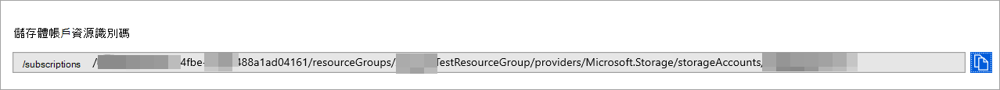
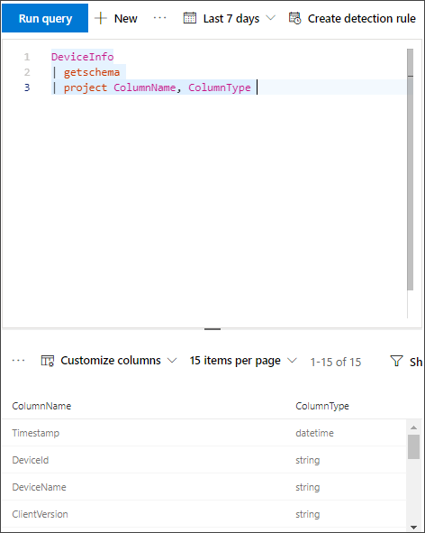

# <a name="configure-microsoft-defender-for-endpoint-to-stream-advanced-hunting-events-to-your-storage-account"></a>設定 Microsoft Defender for Endpoint to stream Advanced 搜尋事件至您的儲存體帳戶

[!INCLUDE [Microsoft 365 Defender rebranding](../../includes/microsoft-defender.md)]


**適用於：**
- [適用於端點的 Microsoft Defender](https://go.microsoft.com/fwlink/?linkid=2154037)

> 想要體驗 Defender for Endpoint？ [注册免費試用版。](https://www.microsoft.com/microsoft-365/windows/microsoft-defender-atp?ocid=docs-wdatp-configuresiem-abovefoldlink) 

## <a name="before-you-begin"></a>在您開始之前

1. 在您的租使用者中建立[儲存體帳戶](/azure/storage/common/storage-account-overview)。

2. 登入您的 [Azure 租](https://ms.portal.azure.com/)使用者，移至訂閱 **> 訂閱 > 資源提供者 > 登錄至 Microsoft。**

## <a name="enable-raw-data-streaming"></a>啟用原始資料資料流程

1. 以 [**全域管理員**] 或 [_安全性管理員_] * * 的身分登入 [Microsoft Defender for 端點入口網站](https://securitycenter.windows.com)。

2. 移至 Microsoft Defender 資訊安全中心上的 [[資料匯出設定] 頁面](https://securitycenter.windows.com/interoperability/dataexport)。

3. 按一下 [ **新增資料匯出設定**]。

4. 選擇新設定的名稱。

5. 選擇 [**轉寄事件] 以 Azure 儲存體**。

6. 輸入您的 **儲存體帳戶資源識別碼**。 若要取得您的 **儲存體帳戶資源識別碼**，請移至 [Azure 入口](https://ms.portal.azure.com/)網站上的儲存體帳戶頁面 > 內容] 索引標籤 > 複製 **儲存體帳戶資源識別碼** 底下的文字：

   

7. 選擇您要傳輸的事件，然後按一下 [ **儲存**]。

## <a name="the-schema-of-the-events-in-the-storage-account"></a>儲存體帳戶中的事件架構

- 將為每個事件種類建立 blob 容器： 

  

- Blob 中每一列的架構皆為下列 JSON： 

  ```
  {
          "time": "<The time WDATP received the event>"
          "tenantId": "<Your tenant ID>"
          "category": "<The Advanced Hunting table name with 'AdvancedHunting-' prefix>"
          "properties": { <WDATP Advanced Hunting event as Json> }
  }               
  ```

- 每個 blob 都包含多個資料列。

- 每一列都包含事件名稱、端點的端點接收事件、其所屬的租使用者 (您只會從租使用者) 中取得事件，並在名為 "properties" 的屬性中取得事件為 JSON 格式的事件。

- 如需 Microsoft Defender for Endpoint 事件架構的相關資訊，請參閱 [Advanced 搜尋一覽](advanced-hunting-overview.md)。

- 在 [高級搜尋] 中， **DeviceInfo** 表格具有一個名為 **MachineGroup** 的欄，其中含有裝置的群組。 在這裡，每個事件會同時使用此資料行來修飾。 如需詳細資訊，請參閱 [裝置群組](machine-groups.md) 。

## <a name="data-types-mapping"></a>資料類型對應

為了取得 events 屬性的資料類型，請執行下列動作：

1. 登入[Microsoft Defender 資訊安全中心](https://securitycenter.windows.com)，然後移至 [[高級搜尋] 頁面](https://securitycenter.windows.com/hunting-package)。

2. 執行下列查詢以取得每個事件的資料類型對應： 

   ```
   {EventType}
   | getschema
   | project ColumnName, ColumnType 
   ```

- 以下是 Device Info 事件的範例： 

  

## <a name="related-topics"></a>相關主題
- [高級搜尋一覽](advanced-hunting-overview.md)
- [Microsoft Defender for Endpoint 流式 API](raw-data-export.md)
- [將 Microsoft Defender for Endpoint 事件的資料流程傳遞給您的 Azure 儲存體帳戶](raw-data-export-storage.md)
- [Azure 儲存體帳戶檔](/azure/storage/common/storage-account-overview)