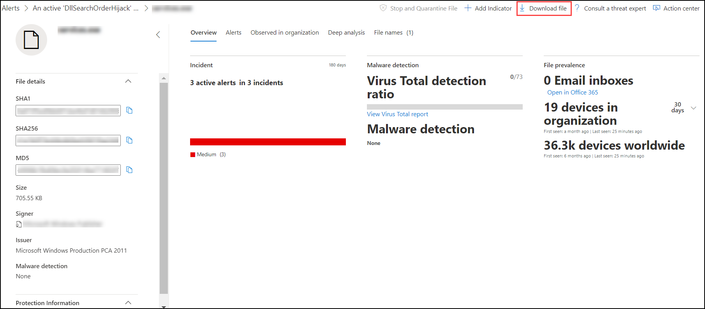
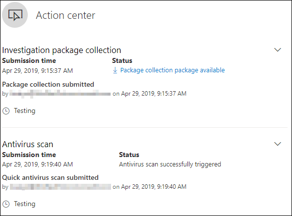

# <a name="take-response-actions-on-a-file"></a><span data-ttu-id="85ef5-104">對檔案採取回應動作</span><span class="sxs-lookup"><span data-stu-id="85ef5-104">Take response actions on a file</span></span>

[!INCLUDE [Microsoft 365 Defender rebranding](../../includes/microsoft-defender.md)]


<span data-ttu-id="85ef5-105">**適用於：**</span><span class="sxs-lookup"><span data-stu-id="85ef5-105">**Applies to:**</span></span>
- [<span data-ttu-id="85ef5-106">適用於端點的 Microsoft Defender</span><span class="sxs-lookup"><span data-stu-id="85ef5-106">Microsoft Defender for Endpoint</span></span>](https://go.microsoft.com/fwlink/?linkid=2154037)

[!include[Prerelease information](../../includes/prerelease.md)]

> <span data-ttu-id="85ef5-107">想要體驗 Defender for Endpoint？</span><span class="sxs-lookup"><span data-stu-id="85ef5-107">Want to experience Defender for Endpoint?</span></span> [<span data-ttu-id="85ef5-108">注册免費試用版。</span><span class="sxs-lookup"><span data-stu-id="85ef5-108">Sign up for a free trial.</span></span>](https://www.microsoft.com/microsoft-365/windows/microsoft-defender-atp?ocid=docs-wdatp-responddile-abovefoldlink)

<span data-ttu-id="85ef5-109">停用或隔離檔案或封鎖檔案，以快速回應偵測到的攻擊。</span><span class="sxs-lookup"><span data-stu-id="85ef5-109">Quickly respond to detected attacks by stopping and quarantining files or blocking a file.</span></span> <span data-ttu-id="85ef5-110">對檔案採取動作後，您可以在「行動中心」中檢查活動詳細資料。</span><span class="sxs-lookup"><span data-stu-id="85ef5-110">After taking action on files, you can check activity details in the Action center.</span></span>

<span data-ttu-id="85ef5-111">回應動作可用於檔案的詳細設定檔頁面面。</span><span class="sxs-lookup"><span data-stu-id="85ef5-111">Response actions are available on a file's detailed profile page.</span></span> <span data-ttu-id="85ef5-112">在此頁面上，您可以透過切換新的檔案 **頁面**，在新的和舊的頁面配置之間切換。</span><span class="sxs-lookup"><span data-stu-id="85ef5-112">Once on this page, you can switch between the new and old page layouts by toggling **new File page**.</span></span> <span data-ttu-id="85ef5-113">本文的其餘部分將說明較新的頁面配置。</span><span class="sxs-lookup"><span data-stu-id="85ef5-113">The rest of this article describes the newer page layout.</span></span>

<span data-ttu-id="85ef5-114">回應動作會沿著檔案頁面頂端執行，並包括：</span><span class="sxs-lookup"><span data-stu-id="85ef5-114">Response actions run along the top of the file page, and include:</span></span>

- <span data-ttu-id="85ef5-115">停止與隔離檔</span><span class="sxs-lookup"><span data-stu-id="85ef5-115">Stop and Quarantine File</span></span>
- <span data-ttu-id="85ef5-116">新增指示器</span><span class="sxs-lookup"><span data-stu-id="85ef5-116">Add Indicator</span></span>
- <span data-ttu-id="85ef5-117">下載檔案</span><span class="sxs-lookup"><span data-stu-id="85ef5-117">Download file</span></span>
- <span data-ttu-id="85ef5-118">諮詢威脅專家</span><span class="sxs-lookup"><span data-stu-id="85ef5-118">Consult a threat expert</span></span>
- <span data-ttu-id="85ef5-119">控制中心</span><span class="sxs-lookup"><span data-stu-id="85ef5-119">Action center</span></span>

<span data-ttu-id="85ef5-120">您也可以提交檔案進行深入分析，以在安全的雲端沙箱中執行檔案。</span><span class="sxs-lookup"><span data-stu-id="85ef5-120">You can also submit files for deep analysis, to run the file in a secure cloud sandbox.</span></span> <span data-ttu-id="85ef5-121">分析完成後，您將會收到提供檔案行為相關資訊的詳細報告。</span><span class="sxs-lookup"><span data-stu-id="85ef5-121">When the analysis is complete, you'll get a detailed report that provides information about the behavior of the file.</span></span> <span data-ttu-id="85ef5-122">您可以透過選取 [ **深入分析** ] 索引標籤，提交檔案以進行深入分析和舊報告讀取。它位於檔資訊卡片底下。</span><span class="sxs-lookup"><span data-stu-id="85ef5-122">You can submit files for deep analysis and read past reports by selecting the **Deep analysis** tab. It's located below the file information cards.</span></span>

<span data-ttu-id="85ef5-123">有些動作需要某些許可權。</span><span class="sxs-lookup"><span data-stu-id="85ef5-123">Some actions require certain permissions.</span></span> <span data-ttu-id="85ef5-124">下表說明某些許可權可對可遷移的可執行檔採取的動作 (PE) 和非 PE 檔案：</span><span class="sxs-lookup"><span data-stu-id="85ef5-124">The following table describes what action certain permissions can take on portable executable (PE) and non-PE files:</span></span>

| <span data-ttu-id="85ef5-125">權限</span><span class="sxs-lookup"><span data-stu-id="85ef5-125">Permission</span></span>             | <span data-ttu-id="85ef5-126">PE 檔案</span><span class="sxs-lookup"><span data-stu-id="85ef5-126">PE files</span></span> | <span data-ttu-id="85ef5-127">非 PE 檔案</span><span class="sxs-lookup"><span data-stu-id="85ef5-127">Non-PE files</span></span> |
| :--------------------- | :------: | :----------: |
| <span data-ttu-id="85ef5-128">查看資料</span><span class="sxs-lookup"><span data-stu-id="85ef5-128">View data</span></span>              |     <span data-ttu-id="85ef5-129">X</span><span class="sxs-lookup"><span data-stu-id="85ef5-129">X</span></span>    |       <span data-ttu-id="85ef5-130">X</span><span class="sxs-lookup"><span data-stu-id="85ef5-130">X</span></span>      |
| <span data-ttu-id="85ef5-131">警示調查</span><span class="sxs-lookup"><span data-stu-id="85ef5-131">Alerts investigation</span></span>   | <span data-ttu-id="85ef5-132">&#x2611;</span><span class="sxs-lookup"><span data-stu-id="85ef5-132">&#x2611;</span></span> |       <span data-ttu-id="85ef5-133">X</span><span class="sxs-lookup"><span data-stu-id="85ef5-133">X</span></span>      |
| <span data-ttu-id="85ef5-134">Live 回應基本</span><span class="sxs-lookup"><span data-stu-id="85ef5-134">Live response basic</span></span>    |     <span data-ttu-id="85ef5-135">X</span><span class="sxs-lookup"><span data-stu-id="85ef5-135">X</span></span>    |       <span data-ttu-id="85ef5-136">X</span><span class="sxs-lookup"><span data-stu-id="85ef5-136">X</span></span>      |
| <span data-ttu-id="85ef5-137">即時回應高級</span><span class="sxs-lookup"><span data-stu-id="85ef5-137">Live response advanced</span></span> | <span data-ttu-id="85ef5-138">&#x2611;</span><span class="sxs-lookup"><span data-stu-id="85ef5-138">&#x2611;</span></span> |   <span data-ttu-id="85ef5-139">&#x2611;</span><span class="sxs-lookup"><span data-stu-id="85ef5-139">&#x2611;</span></span>   |

<span data-ttu-id="85ef5-140">如需角色的詳細資訊，請參閱 [建立與管理角色型存取控制的角色](user-roles.md)。</span><span class="sxs-lookup"><span data-stu-id="85ef5-140">For more information on roles, see [Create and manage roles for role-based access control](user-roles.md).</span></span>

## <a name="stop-and-quarantine-files-in-your-network"></a><span data-ttu-id="85ef5-141">停止並隔離您網路中的檔案</span><span class="sxs-lookup"><span data-stu-id="85ef5-141">Stop and quarantine files in your network</span></span>

<span data-ttu-id="85ef5-142">您可以在您的組織中包含攻擊，方法是停止惡意程式，然後在觀察到的位置隔離該檔。</span><span class="sxs-lookup"><span data-stu-id="85ef5-142">You can contain an attack in your organization by stopping the malicious process and quarantining the file where it was observed.</span></span>

> [!IMPORTANT]
> <span data-ttu-id="85ef5-143">只有在下列情況中才能採取此動作：</span><span class="sxs-lookup"><span data-stu-id="85ef5-143">You can only take this action if:</span></span>
>
> - <span data-ttu-id="85ef5-144">您正在執行動作的裝置執行 Windows 10，版本1703或更新版本</span><span class="sxs-lookup"><span data-stu-id="85ef5-144">The device you're taking the action on is running Windows 10, version 1703 or later</span></span>
> - <span data-ttu-id="85ef5-145">檔案不屬於受信任的協力廠商發行者，或未由 Microsoft 簽署</span><span class="sxs-lookup"><span data-stu-id="85ef5-145">The file does not belong to trusted third-party publishers or not signed by Microsoft</span></span>
> - <span data-ttu-id="85ef5-146">Microsoft Defender 防毒軟體必須至少在被動模式下執行。</span><span class="sxs-lookup"><span data-stu-id="85ef5-146">Microsoft Defender Antivirus must at least be running on Passive mode.</span></span> <span data-ttu-id="85ef5-147">如需詳細資訊，請參閱[Microsoft Defender 防毒軟體相容性](/windows/security/threat-protection/microsoft-defender-antivirus/microsoft-defender-antivirus-compatibility)。</span><span class="sxs-lookup"><span data-stu-id="85ef5-147">For more information, see [Microsoft Defender Antivirus compatibility](/windows/security/threat-protection/microsoft-defender-antivirus/microsoft-defender-antivirus-compatibility).</span></span>

<span data-ttu-id="85ef5-148">**Stop 和隔離** 檔動作包括停止執行中的程式、隔離檔案，以及刪除持久性資料（例如登錄機碼）。</span><span class="sxs-lookup"><span data-stu-id="85ef5-148">The **Stop and Quarantine File** action includes stopping running processes, quarantining the files, and deleting persistent data such as registry keys.</span></span>

<span data-ttu-id="85ef5-149">此巨集指令會在裝置上的 Windows 10，版本1703或更新版本之間生效，在過去30天內觀察到檔案。</span><span class="sxs-lookup"><span data-stu-id="85ef5-149">This action takes effect on devices with Windows 10, version 1703 or later, where the file was observed in the last 30 days.</span></span>

> [!NOTE]
> <span data-ttu-id="85ef5-150">您可以在任何時間從隔離區還原檔案。</span><span class="sxs-lookup"><span data-stu-id="85ef5-150">You’ll be able to restore the file from quarantine at any time.</span></span>

### <a name="stop-and-quarantine-files"></a><span data-ttu-id="85ef5-151">停止和隔離檔</span><span class="sxs-lookup"><span data-stu-id="85ef5-151">Stop and quarantine files</span></span>

1. <span data-ttu-id="85ef5-152">選取您要停止和隔離的檔案。</span><span class="sxs-lookup"><span data-stu-id="85ef5-152">Select the file you want to stop and quarantine.</span></span> <span data-ttu-id="85ef5-153">您可以從下列任何視圖中選取檔案，或使用搜尋方塊：</span><span class="sxs-lookup"><span data-stu-id="85ef5-153">You can select a file from any of the following views or use the Search box:</span></span>

   - <span data-ttu-id="85ef5-154">**警示** -按一下專案時程表中的 [描述] 或 [詳細資料] 中對應的連結。</span><span class="sxs-lookup"><span data-stu-id="85ef5-154">**Alerts** - click the corresponding links from the Description or Details in the Artifact timeline</span></span>
   - <span data-ttu-id="85ef5-155">**搜尋框** **-從下拉式功能表** 中選取檔案，並輸入檔案名</span><span class="sxs-lookup"><span data-stu-id="85ef5-155">**Search box** - select **File** from the drop–down menu and enter the file name</span></span>

   > [!NOTE]
   > <span data-ttu-id="85ef5-156">Stop 和隔離檔動作的最大限制為1000裝置。</span><span class="sxs-lookup"><span data-stu-id="85ef5-156">The stop and quarantine file action is limited to a maximum of 1000 devices.</span></span> <span data-ttu-id="85ef5-157">若要在大量的裝置上停止檔案，請參閱 [Add block to block 或 allow file](#add-indicator-to-block-or-allow-a-file)。</span><span class="sxs-lookup"><span data-stu-id="85ef5-157">To stop a file on a larger number of devices, see [Add indicator to block or allow file](#add-indicator-to-block-or-allow-a-file).</span></span>

2. <span data-ttu-id="85ef5-158">移至頁首，然後選取 [ **停止] 和 [隔離** 檔]。</span><span class="sxs-lookup"><span data-stu-id="85ef5-158">Go to the top bar and select **Stop and Quarantine File**.</span></span>

   

3. <span data-ttu-id="85ef5-160">指定原因，然後選取 [ **確認**]。</span><span class="sxs-lookup"><span data-stu-id="85ef5-160">Specify a reason, then select **Confirm**.</span></span>

   

   <span data-ttu-id="85ef5-162">行動中心會顯示提交資訊：</span><span class="sxs-lookup"><span data-stu-id="85ef5-162">The Action center shows the submission information:</span></span>
   
   

   - <span data-ttu-id="85ef5-164">**提交時間** -顯示何時提交動作。</span><span class="sxs-lookup"><span data-stu-id="85ef5-164">**Submission time** - Shows when the action was submitted.</span></span>
   - <span data-ttu-id="85ef5-165">**成功** -顯示已停止並隔離檔案的裝置數目。</span><span class="sxs-lookup"><span data-stu-id="85ef5-165">**Success** - Shows the number of devices where the file has been stopped and quarantined.</span></span>
   - <span data-ttu-id="85ef5-166">**Failed** -顯示動作失敗的裝置數目，以及失敗的詳細資料。</span><span class="sxs-lookup"><span data-stu-id="85ef5-166">**Failed** - Shows the number of devices where the action failed and details about the failure.</span></span>
   - <span data-ttu-id="85ef5-167">**擱置** -顯示檔案尚未停用並從中隔離的裝置數目。</span><span class="sxs-lookup"><span data-stu-id="85ef5-167">**Pending** - Shows the number of devices where the file is yet to be stopped and quarantined from.</span></span> <span data-ttu-id="85ef5-168">當裝置離線或未連接到網路時，可能需要一些時間。</span><span class="sxs-lookup"><span data-stu-id="85ef5-168">This can take time for cases when the device is offline or not connected to the network.</span></span>

4. <span data-ttu-id="85ef5-169">選取任何狀態指示器，以查看有關動作的詳細資訊。</span><span class="sxs-lookup"><span data-stu-id="85ef5-169">Select any of the status indicators to view more information about the action.</span></span> <span data-ttu-id="85ef5-170">例如，選取 [ **失敗** ] 以查看動作失敗的位置。</span><span class="sxs-lookup"><span data-stu-id="85ef5-170">For example, select **Failed** to see where the action failed.</span></span>

<span data-ttu-id="85ef5-171">**在裝置使用者上的通知**：</span><span class="sxs-lookup"><span data-stu-id="85ef5-171">**Notification on device user**:</span></span></br>
<span data-ttu-id="85ef5-172">從裝置移除檔案時，會顯示下列通知：</span><span class="sxs-lookup"><span data-stu-id="85ef5-172">When the file is being removed from a device, the following notification is shown:</span></span>


<span data-ttu-id="85ef5-174">在裝置時程表中，會為每個停用或隔離檔案的裝置新增一個新的事件。</span><span class="sxs-lookup"><span data-stu-id="85ef5-174">In the device timeline, a new event is added for each device where a file was stopped and quarantined.</span></span>

<span data-ttu-id="85ef5-175">在針對整個組織中廣泛使用的檔案實施動作之前，會顯示一則警告。</span><span class="sxs-lookup"><span data-stu-id="85ef5-175">A warning is shown before the action is implemented for files widely used throughout an organization.</span></span> <span data-ttu-id="85ef5-176">其主要是驗證作業的運作方式。</span><span class="sxs-lookup"><span data-stu-id="85ef5-176">It's to validate that the operation is intended.</span></span>

## <a name="restore-file-from-quarantine"></a><span data-ttu-id="85ef5-177">從隔離區還原檔案</span><span class="sxs-lookup"><span data-stu-id="85ef5-177">Restore file from quarantine</span></span>

<span data-ttu-id="85ef5-178">如果您已決定在調查之後清除檔案，您可以從隔離區復原檔案並將其移除。</span><span class="sxs-lookup"><span data-stu-id="85ef5-178">You can roll back and remove a file from quarantine if you’ve determined that it’s clean after an investigation.</span></span> <span data-ttu-id="85ef5-179">在隔離檔案的每個裝置上執行下列命令。</span><span class="sxs-lookup"><span data-stu-id="85ef5-179">Run the following command on each device where the file was quarantined.</span></span>

1. <span data-ttu-id="85ef5-180">在裝置上開啟已提升許可權的命令列提示：</span><span class="sxs-lookup"><span data-stu-id="85ef5-180">Open an elevated command–line prompt on the device:</span></span>

   1. <span data-ttu-id="85ef5-181">轉至 **[開始]** 並鍵入 _「cmd」_。</span><span class="sxs-lookup"><span data-stu-id="85ef5-181">Go to **Start** and type _cmd_.</span></span>

   1. <span data-ttu-id="85ef5-182">以滑鼠右鍵按一下 [ **命令提示** 字元]，然後選取 [ **以管理員身分執行**]。</span><span class="sxs-lookup"><span data-stu-id="85ef5-182">Right–click **Command prompt** and select **Run as administrator**.</span></span>

2. <span data-ttu-id="85ef5-183">輸入下列命令，然後按 **enter**：</span><span class="sxs-lookup"><span data-stu-id="85ef5-183">Enter the following command, and press **Enter**:</span></span>

   ```powershell
   “%ProgramFiles%\Windows Defender\MpCmdRun.exe” –Restore –Name EUS:Win32/CustomEnterpriseBlock –All
   ```

> [!NOTE]
> <span data-ttu-id="85ef5-184">在某些情況下， **ThreatName** 可能會顯示為： EUS： Win32/CustomEnterpriseBlock！ cl。</span><span class="sxs-lookup"><span data-stu-id="85ef5-184">In some scenarios, the **ThreatName** may appear as: EUS:Win32/CustomEnterpriseBlock!cl.</span></span>
>
> <span data-ttu-id="85ef5-185">在過去30天內，在此裝置上已隔離的所有自訂封鎖檔案都會還原為端點。</span><span class="sxs-lookup"><span data-stu-id="85ef5-185">Defender for Endpoint will restore all custom blocked files that were quarantined on this device in the last 30 days.</span></span>

> [!IMPORTANT]
> <span data-ttu-id="85ef5-186">被隔離成可能網路威脅的檔案可能無法復原。</span><span class="sxs-lookup"><span data-stu-id="85ef5-186">A file that was quarantined as a potential network threat might not be recoverable.</span></span> <span data-ttu-id="85ef5-187">如果使用者嘗試在隔離後還原檔案，該檔案可能無法存取。</span><span class="sxs-lookup"><span data-stu-id="85ef5-187">If a user attempts to restore the file after quarantine, that file might not be accessible.</span></span> <span data-ttu-id="85ef5-188">這可能是因為系統已無法再有存取該檔案的網路認證。</span><span class="sxs-lookup"><span data-stu-id="85ef5-188">This can be due to the system no longer having network credentials to access the file.</span></span> <span data-ttu-id="85ef5-189">一般來說，這是暫時登入系統或共用資料夾，且存取權杖已到期的結果。</span><span class="sxs-lookup"><span data-stu-id="85ef5-189">Typically, this is a result of a temporary log on to a system or shared folder and the access tokens expired.</span></span>

## <a name="download-or-collect-file"></a><span data-ttu-id="85ef5-190">下載或收集檔案</span><span class="sxs-lookup"><span data-stu-id="85ef5-190">Download or collect file</span></span>

<span data-ttu-id="85ef5-191">從回應動作選取 [ **下載** 檔案]，可讓您下載包含檔案的本機密碼保護 .zip 封存。</span><span class="sxs-lookup"><span data-stu-id="85ef5-191">Selecting **Download file** from the response actions allows you to download a local, password-protected .zip archive containing your file.</span></span> <span data-ttu-id="85ef5-192">快顯視窗會出現，您可以在其中記錄下載檔案的原因，並設定密碼。</span><span class="sxs-lookup"><span data-stu-id="85ef5-192">A flyout will appear where you can record a reason for downloading the file, and set a password.</span></span>

<span data-ttu-id="85ef5-193">根據預設，您將無法下載隔離中的檔案。</span><span class="sxs-lookup"><span data-stu-id="85ef5-193">By default, you will not be able to download files that are in quarantine.</span></span>



### <a name="collect-files"></a><span data-ttu-id="85ef5-195">收集檔案</span><span class="sxs-lookup"><span data-stu-id="85ef5-195">Collect files</span></span>

<span data-ttu-id="85ef5-196">如果檔案尚未由 Microsoft Defender for Endpoint 儲存，則無法下載。</span><span class="sxs-lookup"><span data-stu-id="85ef5-196">If a file is not already stored by Microsoft Defender for Endpoint, you can't download it.</span></span> <span data-ttu-id="85ef5-197">相反地，您會在相同位置看到 [ **收集** 檔案] 按鈕。</span><span class="sxs-lookup"><span data-stu-id="85ef5-197">Instead, you'll see a **Collect file** button in the same location.</span></span> <span data-ttu-id="85ef5-198">如果過去30天內沒有看到組織中的檔案，則會停用 **收集** 檔案。</span><span class="sxs-lookup"><span data-stu-id="85ef5-198">If a file hasn't been seen in the organization in the past 30 days, **Collect file** will be disabled.</span></span>
> [!Important]
> <span data-ttu-id="85ef5-199">被隔離成可能網路威脅的檔案可能無法復原。</span><span class="sxs-lookup"><span data-stu-id="85ef5-199">A file that was quarantined as a potential network threat might not be recoverable.</span></span> <span data-ttu-id="85ef5-200">如果使用者嘗試在隔離後還原檔案，該檔案可能無法存取。</span><span class="sxs-lookup"><span data-stu-id="85ef5-200">If a user attempts to restore the file after quarantine, that file might not be accessible.</span></span> <span data-ttu-id="85ef5-201">這可能是因為系統已無法再有存取該檔案的網路認證。</span><span class="sxs-lookup"><span data-stu-id="85ef5-201">This can be due to the system no longer having network credentials to access the file.</span></span> <span data-ttu-id="85ef5-202">一般來說，這是暫時登入系統或共用資料夾，且存取權杖已到期的結果。</span><span class="sxs-lookup"><span data-stu-id="85ef5-202">Typically, this is a result of a temporary log on to a system or shared folder and the access tokens expired.</span></span>

## <a name="add-indicator-to-block-or-allow-a-file"></a><span data-ttu-id="85ef5-203">新增指示器以封鎖或允許檔</span><span class="sxs-lookup"><span data-stu-id="85ef5-203">Add indicator to block or allow a file</span></span>

<span data-ttu-id="85ef5-204">Banning 潛在的惡意檔案或可疑惡意程式碼，以防止進一步傳播您組織中的攻擊。</span><span class="sxs-lookup"><span data-stu-id="85ef5-204">Prevent further propagation of an attack in your organization by banning potentially malicious files or suspected malware.</span></span> <span data-ttu-id="85ef5-205">如果您知道可能是惡意遷移的可執行檔 (PE) file，您可以將它封鎖。</span><span class="sxs-lookup"><span data-stu-id="85ef5-205">If you know a potentially malicious portable executable (PE) file, you can block it.</span></span> <span data-ttu-id="85ef5-206">此作業可防止在組織中的裝置上讀取、寫入或執行此作業。</span><span class="sxs-lookup"><span data-stu-id="85ef5-206">This operation will prevent it from being read, written, or executed on devices in your organization.</span></span>

> [!IMPORTANT]
>
> - <span data-ttu-id="85ef5-207">如果您的組織使用 Microsoft Defender 防毒軟體且已啟用雲端傳遞的保護，則可以使用此功能。</span><span class="sxs-lookup"><span data-stu-id="85ef5-207">This feature is available if your organization uses Microsoft Defender Antivirus and Cloud–delivered protection is enabled.</span></span> <span data-ttu-id="85ef5-208">如需詳細資訊，請參閱 [管理 cloud-已提供的保護](/windows/security/threat-protection/microsoft-defender-antivirus/deploy-manage-report-microsoft-defender-antivirus)。</span><span class="sxs-lookup"><span data-stu-id="85ef5-208">For more information, see [Manage cloud–delivered protection](/windows/security/threat-protection/microsoft-defender-antivirus/deploy-manage-report-microsoft-defender-antivirus).</span></span>
>
> - <span data-ttu-id="85ef5-209">反惡意軟體用戶端版本必須是4.18.1901 或更新版本。</span><span class="sxs-lookup"><span data-stu-id="85ef5-209">The Antimalware client version must be 4.18.1901.x or later.</span></span>
> - <span data-ttu-id="85ef5-210">這項功能的設計是為了防止可疑的惡意程式碼 (或可能的惡意檔案) 從網頁下載。</span><span class="sxs-lookup"><span data-stu-id="85ef5-210">This feature is designed to prevent suspected malware (or potentially malicious files) from being downloaded from the web.</span></span> <span data-ttu-id="85ef5-211">它目前支援可遷移的可執行檔 (PE) 檔案（包括 _.exe_ 和 _.dll_ 檔案）。</span><span class="sxs-lookup"><span data-stu-id="85ef5-211">It currently supports portable executable (PE) files, including _.exe_ and _.dll_ files.</span></span> <span data-ttu-id="85ef5-212">覆蓋範圍會隨著時間擴充。</span><span class="sxs-lookup"><span data-stu-id="85ef5-212">The coverage will be extended over time.</span></span>
> - <span data-ttu-id="85ef5-213">此回應動作適用于 Windows 10，版本1703或更新版本上的裝置。</span><span class="sxs-lookup"><span data-stu-id="85ef5-213">This response action is available for devices on Windows 10, version 1703 or later.</span></span>
> - <span data-ttu-id="85ef5-214">如果檔案的分類存在於 allow 或封鎖動作之前，則無法在檔案上執行 allow 或 block 功能。</span><span class="sxs-lookup"><span data-stu-id="85ef5-214">The allow or block function cannot be done on files if the file's classification exists on the device's cache prior to the allow or block action.</span></span>

> [!NOTE]
> <span data-ttu-id="85ef5-215">PE 檔案必須位於裝置時程表中，讓您能夠採取此動作。</span><span class="sxs-lookup"><span data-stu-id="85ef5-215">The PE file needs to be in the device timeline for you to be able to take this action.</span></span>
>
> <span data-ttu-id="85ef5-216">在採取動作和實際封鎖的檔案之間，可能會有幾分鐘的延遲時間。</span><span class="sxs-lookup"><span data-stu-id="85ef5-216">There may be a couple of minutes of latency between the time the action is taken and the actual file being blocked.</span></span>

### <a name="enable-the-block-file-feature"></a><span data-ttu-id="85ef5-217">啟用封鎖檔功能</span><span class="sxs-lookup"><span data-stu-id="85ef5-217">Enable the block file feature</span></span>

<span data-ttu-id="85ef5-218">若要開始封鎖檔案，您必須先在設定中 [關閉 **封鎖或允許** 功能](advanced-features.md)。</span><span class="sxs-lookup"><span data-stu-id="85ef5-218">To start blocking files, you first need to [turn the **Block or allow** feature on](advanced-features.md) in Settings.</span></span>
### <a name="allow-or-block-file"></a><span data-ttu-id="85ef5-219">允許或封鎖檔</span><span class="sxs-lookup"><span data-stu-id="85ef5-219">Allow or block file</span></span>

<span data-ttu-id="85ef5-220">當您為檔案新增指示器雜湊時，您可以選擇每當組織中的設備嘗試執行時，就會引發警示並封鎖檔案。</span><span class="sxs-lookup"><span data-stu-id="85ef5-220">When you add an indicator hash for a file, you can choose to raise an alert and block the file whenever a device in your organization attempts to run it.</span></span>

<span data-ttu-id="85ef5-221">標記自動封鎖的檔案不會出現在檔案的動作中心，但提醒仍會顯示在 [警示] 佇列中。</span><span class="sxs-lookup"><span data-stu-id="85ef5-221">Files automatically blocked by an indicator won't show up in the file's Action center, but the alerts will still be visible in the Alerts queue.</span></span>

<span data-ttu-id="85ef5-222">請參閱 [管理](manage-indicators.md) 指標以取得封鎖和引發檔警示的詳細資料。</span><span class="sxs-lookup"><span data-stu-id="85ef5-222">See [manage indicators](manage-indicators.md) for more details on blocking and raising alerts on files.</span></span>

<span data-ttu-id="85ef5-223">若要停止封鎖檔，請移除指標。</span><span class="sxs-lookup"><span data-stu-id="85ef5-223">To stop blocking a file, remove the indicator.</span></span> <span data-ttu-id="85ef5-224">您可以透過檔案的 [設定檔] 頁面上的 [ **編輯指示器** ] 動作來執行此動作。</span><span class="sxs-lookup"><span data-stu-id="85ef5-224">You can do so via the **Edit Indicator** action on the file's profile page.</span></span> <span data-ttu-id="85ef5-225">在新增指示器之前，此巨集指令會在 [ **新增指示器** ] 動作相同的位置上顯示。</span><span class="sxs-lookup"><span data-stu-id="85ef5-225">This action will be visible in the same position as the **Add Indicator** action, before you added the indicator.</span></span>

<span data-ttu-id="85ef5-226">您也可以從 **設定**] 頁面的 [**規則** 指標] 底下編輯指示器  >  \*\*\*\*。</span><span class="sxs-lookup"><span data-stu-id="85ef5-226">You can also edit indicators from  the **Settings** page, under **Rules** > **Indicators**.</span></span> <span data-ttu-id="85ef5-227">指示器會以檔案的雜湊列在此區域中。</span><span class="sxs-lookup"><span data-stu-id="85ef5-227">Indicators are listed in this area by their file's hash.</span></span>

## <a name="consult-a-threat-expert"></a><span data-ttu-id="85ef5-228">諮詢威脅專家</span><span class="sxs-lookup"><span data-stu-id="85ef5-228">Consult a threat expert</span></span>

<span data-ttu-id="85ef5-229">請參閱 Microsoft 威脅專家，以取得可能受損裝置或已受損裝置的更深入資訊。</span><span class="sxs-lookup"><span data-stu-id="85ef5-229">Consult a Microsoft threat expert for more insights on a potentially compromised device, or already compromised devices.</span></span> <span data-ttu-id="85ef5-230">Microsoft 威脅專家直接參與 Microsoft Defender 資訊安全中心中，以進行及時且準確的回應。</span><span class="sxs-lookup"><span data-stu-id="85ef5-230">Microsoft Threat Experts are engaged directly from within the Microsoft Defender Security Center for timely and accurate response.</span></span> <span data-ttu-id="85ef5-231">專家對潛在的受損裝置提供深入瞭解，協助您瞭解複雜威脅及目標攻擊通知。</span><span class="sxs-lookup"><span data-stu-id="85ef5-231">Experts provide insights on a potentially compromised device and help you understand complex threats and targeted attack notifications.</span></span> <span data-ttu-id="85ef5-232">他們也可以提供您在入口網站儀表板上看到之警示或威脅情報內容的相關資訊。</span><span class="sxs-lookup"><span data-stu-id="85ef5-232">They can also provide information about the alerts or a threat intelligence context that you see on your portal dashboard.</span></span>

<span data-ttu-id="85ef5-233">如需詳細資訊，請參閱查看 [Microsoft 威脅專家](/microsoft-365/security/defender-endpoint/configure-microsoft-threat-experts#consult-a-microsoft-threat-expert-about-suspicious-cybersecurity-activities-in-your-organization) 。</span><span class="sxs-lookup"><span data-stu-id="85ef5-233">See [Consult a Microsoft Threat Expert](/microsoft-365/security/defender-endpoint/configure-microsoft-threat-experts#consult-a-microsoft-threat-expert-about-suspicious-cybersecurity-activities-in-your-organization) for details.</span></span>

## <a name="check-activity-details-in-action-center"></a><span data-ttu-id="85ef5-234">檢查控制中心的活動詳細資料</span><span class="sxs-lookup"><span data-stu-id="85ef5-234">Check activity details in Action center</span></span>

<span data-ttu-id="85ef5-235">「 **行動中心** 」提供對裝置或檔案所採取動作的資訊。</span><span class="sxs-lookup"><span data-stu-id="85ef5-235">The **Action center** provides information on actions that were taken on a device or file.</span></span> <span data-ttu-id="85ef5-236">您可以查看下列詳細資料：</span><span class="sxs-lookup"><span data-stu-id="85ef5-236">You can view the following details:</span></span>

- <span data-ttu-id="85ef5-237">調查套件集合</span><span class="sxs-lookup"><span data-stu-id="85ef5-237">Investigation package collection</span></span>
- <span data-ttu-id="85ef5-238">防病毒掃描</span><span class="sxs-lookup"><span data-stu-id="85ef5-238">Antivirus scan</span></span>
- <span data-ttu-id="85ef5-239">應用程式限制</span><span class="sxs-lookup"><span data-stu-id="85ef5-239">App restriction</span></span>
- <span data-ttu-id="85ef5-240">裝置隔離</span><span class="sxs-lookup"><span data-stu-id="85ef5-240">Device isolation</span></span>

<span data-ttu-id="85ef5-241">也會顯示所有其他相關詳細資料，例如提交日期/時間、提交使用者，以及動作成功或失敗。</span><span class="sxs-lookup"><span data-stu-id="85ef5-241">All other related details are also shown, such as submission date/time, submitting user, and if the action succeeded or failed.</span></span>



## <a name="deep-analysis"></a><span data-ttu-id="85ef5-243">深入分析</span><span class="sxs-lookup"><span data-stu-id="85ef5-243">Deep analysis</span></span>

<span data-ttu-id="85ef5-244">網路安全性調查通常是由警示所觸發。</span><span class="sxs-lookup"><span data-stu-id="85ef5-244">Cyber security investigations are typically triggered by an alert.</span></span> <span data-ttu-id="85ef5-245">警示與一個或多個觀測到的檔案（通常是新的或未知的）有關。</span><span class="sxs-lookup"><span data-stu-id="85ef5-245">Alerts are related to one or more observed files that are often new or unknown.</span></span> <span data-ttu-id="85ef5-246">選取檔案會帶您前往檔案視圖，您可以在其中看到檔案的中繼資料。</span><span class="sxs-lookup"><span data-stu-id="85ef5-246">Selecting a file takes you to the file view where you can see the file's metadata.</span></span> <span data-ttu-id="85ef5-247">若要濃縮檔相關的資料，您可以提交檔案進行深層分析。</span><span class="sxs-lookup"><span data-stu-id="85ef5-247">To enrich the data related to the file, you can submit the file for deep analysis.</span></span>

<span data-ttu-id="85ef5-248">Deep analysis 功能會在安全且充分受充分規范的雲端環境中執行檔案。</span><span class="sxs-lookup"><span data-stu-id="85ef5-248">The Deep analysis feature executes a file in a secure, fully instrumented cloud environment.</span></span> <span data-ttu-id="85ef5-249">深入分析結果會顯示檔案的活動、觀測的行為和相關聯的專案，例如：刪除的檔案、登錄修改以及與 IPs 的通訊。</span><span class="sxs-lookup"><span data-stu-id="85ef5-249">Deep analysis results show the file's activities, observed behaviors, and associated artifacts, such as dropped files, registry modifications, and communication with IPs.</span></span>
<span data-ttu-id="85ef5-250">深層分析目前支援可遷移的可執行檔 (PE) 檔案的廣泛分析 (包括 _.exe_ 及 _.dll_ 檔) 。</span><span class="sxs-lookup"><span data-stu-id="85ef5-250">Deep analysis currently supports extensive analysis of portable executable (PE) files (including _.exe_ and _.dll_ files).</span></span>

<span data-ttu-id="85ef5-251">檔案的深層分析需要數分鐘的時間。</span><span class="sxs-lookup"><span data-stu-id="85ef5-251">Deep analysis of a file takes several minutes.</span></span> <span data-ttu-id="85ef5-252">檔案分析完成之後，[深入分析] 索引標籤將會更新，以顯示摘要及最新可用結果的日期和時間。</span><span class="sxs-lookup"><span data-stu-id="85ef5-252">Once the file analysis is complete, the Deep Analysis tab will update to display a summary and the date and time of the latest available results.</span></span>

<span data-ttu-id="85ef5-253">深入分析摘要包含觀測 *行為* 的清單，其中一些可能表示惡意活動和 *observables*，包括與磁片上建立的相互聯繫的 IPs 和檔案。</span><span class="sxs-lookup"><span data-stu-id="85ef5-253">The deep analysis summary includes a list of observed *behaviors*, some of which can indicate malicious activity, and *observables*, including contacted IPs and files created on the disk.</span></span> <span data-ttu-id="85ef5-254">如果找不到任何專案，這些區段會顯示簡短訊息。</span><span class="sxs-lookup"><span data-stu-id="85ef5-254">If nothing was found, these sections will display a brief message.</span></span>

<span data-ttu-id="85ef5-255">深入分析的結果會與威脅智慧相符，而且任何相符專案都會產生適當的警示。</span><span class="sxs-lookup"><span data-stu-id="85ef5-255">Results of deep analysis are matched against threat intelligence and any matches will generate appropriate alerts.</span></span>

<span data-ttu-id="85ef5-256">使用「深入分析」功能，調查任何檔案的詳細資料，通常是在調查警示或您懷疑惡意行為的任何其他原因期間進行。</span><span class="sxs-lookup"><span data-stu-id="85ef5-256">Use the deep analysis feature to investigate the details of any file, usually during an investigation of an alert or for any other reason where you suspect malicious behavior.</span></span> <span data-ttu-id="85ef5-257">此功能可在 [ **深入分析** ] 索引標籤中，于檔案的 [設定檔] 頁面上。</span><span class="sxs-lookup"><span data-stu-id="85ef5-257">This feature is available within the **Deep analysis** tab, on the file's profile page.</span></span><br/>
<br/>

> [!VIDEO https://www.microsoft.com/en-us/videoplayer/embed/RE4aAYy?rel=0]

<span data-ttu-id="85ef5-258">當檔案可用於「Defender for Endpoint」範例集合，或是在支援送出深入分析的 Windows 10 裝置上進行深入分析時，就會啟用 [**提交以進行深入分析**]。</span><span class="sxs-lookup"><span data-stu-id="85ef5-258">**Submit for deep analysis** is enabled when the file is available in the Defender for Endpoint backend sample collection, or if it was observed on a Windows 10 device that supports submitting to deep analysis.</span></span>

> [!NOTE]
> <span data-ttu-id="85ef5-259">只會自動收集 Windows 10 中的檔案。</span><span class="sxs-lookup"><span data-stu-id="85ef5-259">Only files from Windows 10 can be automatically collected.</span></span>

<span data-ttu-id="85ef5-260">您也可以透過 Microsoft 的「[安全性中心」入口網站](https://www.microsoft.com/security/portal/submission/submit.aspx)提交範例（如果未在 Windows 10 裝置上看到檔案），然後等候 **提交深入分析** 按鈕成為可用。</span><span class="sxs-lookup"><span data-stu-id="85ef5-260">You can also submit a sample through the [Microsoft Security Center Portal](https://www.microsoft.com/security/portal/submission/submit.aspx) if the file wasn't observed on a Windows 10 device, and wait for **Submit for deep analysis** button to become available.</span></span>

> [!NOTE]
> <span data-ttu-id="85ef5-261">由於 Microsoft Security Center 入口網站中的後端處理流程，在檔提交與更新的 Defender 中的「深入分析」功能之間可能有10分鐘的延遲。</span><span class="sxs-lookup"><span data-stu-id="85ef5-261">Due to backend processing flows in the Microsoft Security Center Portal, there could be up to 10 minutes of latency between file submission and availability of the deep analysis feature in Defender for Endpoint.</span></span>

<span data-ttu-id="85ef5-262">收集樣本時，端點會在安全的環境中執行檔案。</span><span class="sxs-lookup"><span data-stu-id="85ef5-262">When the sample is collected, Defender for Endpoint runs the file in a secure environment.</span></span> <span data-ttu-id="85ef5-263">然後，它會建立觀測行為和相關聯之專案的詳細報告，例如在裝置上丟棄的檔案、IPs 的通訊以及登錄修改。</span><span class="sxs-lookup"><span data-stu-id="85ef5-263">It then creates a detailed report of observed behaviors and associated artifacts, such as files dropped on devices, communication to IPs, and registry modifications.</span></span>

### <a name="submit-files-for-deep-analysis"></a><span data-ttu-id="85ef5-264">提交檔案進行深入分析</span><span class="sxs-lookup"><span data-stu-id="85ef5-264">Submit files for deep analysis</span></span>

1. <span data-ttu-id="85ef5-265">選取您要提交以進行深入分析的檔案。</span><span class="sxs-lookup"><span data-stu-id="85ef5-265">Select the file that you want to submit for deep analysis.</span></span> <span data-ttu-id="85ef5-266">您可以從下列任何一種視圖中選取或搜尋檔案：</span><span class="sxs-lookup"><span data-stu-id="85ef5-266">You can select or search a file from any of the following views:</span></span>

    - <span data-ttu-id="85ef5-267">警示-從專案時程表的 **描述** 或 **詳細資料** 中選取檔連結</span><span class="sxs-lookup"><span data-stu-id="85ef5-267">Alerts - select the file links from the **Description** or **Details** in the Artifact timeline</span></span>
    - <span data-ttu-id="85ef5-268">**裝置清單**-從 [**組織中裝置** 的 **描述** 或 **詳細資料**] 區段中選取檔連結。</span><span class="sxs-lookup"><span data-stu-id="85ef5-268">**Devices list** - select the file links from the **Description** or **Details** in the **Device in organization** section</span></span>
    - <span data-ttu-id="85ef5-269">搜尋框 **-從下拉式功能表** 中選取檔案，並輸入檔案名</span><span class="sxs-lookup"><span data-stu-id="85ef5-269">Search box - select **File** from the drop–down menu and enter the file name</span></span>

2. <span data-ttu-id="85ef5-270">在檔視圖的 [ **深入分析** ] 索引標籤中，選取 [ **提交**]。</span><span class="sxs-lookup"><span data-stu-id="85ef5-270">In the **Deep analysis** tab of the file view, select **Submit**.</span></span>

   ![您只能在 [檔詳細資料] 區段中提交 PE 檔案。](images/submit-file.png)

   > [!NOTE]
   > <span data-ttu-id="85ef5-272">只支援 PE 檔案，包括 _.exe_ 和 _.dll_ 檔案。</span><span class="sxs-lookup"><span data-stu-id="85ef5-272">Only PE files are supported, including _.exe_ and _.dll_ files.</span></span>

<span data-ttu-id="85ef5-273">隨即會顯示進度列，並提供分析的不同階段的資訊。</span><span class="sxs-lookup"><span data-stu-id="85ef5-273">A progress bar is displayed and provides information on the different stages of the analysis.</span></span> <span data-ttu-id="85ef5-274">然後您就可以在分析完成時查看報告。</span><span class="sxs-lookup"><span data-stu-id="85ef5-274">You can then view the report when the analysis is done.</span></span>

> [!NOTE]
> <span data-ttu-id="85ef5-275">根據裝置可用性而定，範例集合時間可能會不同。</span><span class="sxs-lookup"><span data-stu-id="85ef5-275">Depending on device availability, sample collection time can vary.</span></span> <span data-ttu-id="85ef5-276">範例集合的超時為 3-小時。</span><span class="sxs-lookup"><span data-stu-id="85ef5-276">There is a 3–hour timeout for sample collection.</span></span> <span data-ttu-id="85ef5-277">如果目前沒有線上 Windows 10 設備報告，此集合就會失敗，且作業會中斷。</span><span class="sxs-lookup"><span data-stu-id="85ef5-277">The collection will fail and the operation will abort if there is no online Windows 10 device reporting at that time.</span></span> <span data-ttu-id="85ef5-278">您可以重新提交檔案進行深入分析，以取得檔案的新資料。</span><span class="sxs-lookup"><span data-stu-id="85ef5-278">You can re–submit files for deep analysis to get fresh data on the file.</span></span>

### <a name="view-deep-analysis-reports"></a><span data-ttu-id="85ef5-279">查看深入分析報告</span><span class="sxs-lookup"><span data-stu-id="85ef5-279">View deep analysis reports</span></span>

<span data-ttu-id="85ef5-280">查看提供的深入分析報告，以查看您提交之檔案的更深入深入資訊。</span><span class="sxs-lookup"><span data-stu-id="85ef5-280">View the provided deep analysis report to see more in-depth insights on the file you submitted.</span></span> <span data-ttu-id="85ef5-281">您可以在檔案查看內容中使用此功能。</span><span class="sxs-lookup"><span data-stu-id="85ef5-281">This feature is available in the file view context.</span></span>

<span data-ttu-id="85ef5-282">您可以在下列各節中查看提供詳細資料的綜合報告：</span><span class="sxs-lookup"><span data-stu-id="85ef5-282">You can view the comprehensive report that provides details on the following sections:</span></span>

- <span data-ttu-id="85ef5-283">Behaviors</span><span class="sxs-lookup"><span data-stu-id="85ef5-283">Behaviors</span></span>
- <span data-ttu-id="85ef5-284">Observables</span><span class="sxs-lookup"><span data-stu-id="85ef5-284">Observables</span></span>

<span data-ttu-id="85ef5-285">提供的詳細資料可協助您調查是否有潛在攻擊的跡象。</span><span class="sxs-lookup"><span data-stu-id="85ef5-285">The details provided can help you investigate if there are indications of a potential attack.</span></span>

1. <span data-ttu-id="85ef5-286">選取您提交進行深層分析的檔案。</span><span class="sxs-lookup"><span data-stu-id="85ef5-286">Select the file you submitted for deep analysis.</span></span>
2. <span data-ttu-id="85ef5-287">選取 [ **深入分析** ] 索引標籤。如果有任何先前的報告，報表摘要將會出現在此索引標籤中。</span><span class="sxs-lookup"><span data-stu-id="85ef5-287">Select the **Deep analysis** tab. If there are any previous reports, the report summary will appear in this tab.</span></span>

    

#### <a name="troubleshoot-deep-analysis"></a><span data-ttu-id="85ef5-289">深入分析疑難排解</span><span class="sxs-lookup"><span data-stu-id="85ef5-289">Troubleshoot deep analysis</span></span>

<span data-ttu-id="85ef5-290">如果您在嘗試提交檔案時遇到問題，請嘗試下列每個疑難排解步驟。</span><span class="sxs-lookup"><span data-stu-id="85ef5-290">If you come across a problem when trying to submit a file, try each of the following troubleshooting steps.</span></span>

1. <span data-ttu-id="85ef5-291">確定有問題的檔案是 PE 檔案。</span><span class="sxs-lookup"><span data-stu-id="85ef5-291">Ensure that the file in question is a PE file.</span></span> <span data-ttu-id="85ef5-292">PE 檔案一般會有 _.exe_ 或 _.dll_ 副檔名 (可執行程式或應用程式) 。</span><span class="sxs-lookup"><span data-stu-id="85ef5-292">PE files typically have _.exe_ or _.dll_ extensions (executable programs or applications).</span></span>
2. <span data-ttu-id="85ef5-293">請確定服務具有存取權，但仍然存在且未損毀或修改的檔案。</span><span class="sxs-lookup"><span data-stu-id="85ef5-293">Ensure the service has access to the file, that it still exists, and hasn't been corrupted or modified.</span></span>
3. <span data-ttu-id="85ef5-294">請稍等片刻，然後再次嘗試提交檔案。</span><span class="sxs-lookup"><span data-stu-id="85ef5-294">Wait a short while and try to submit the file again.</span></span> <span data-ttu-id="85ef5-295">佇列可能已滿，或發生暫時連線或通訊錯誤。</span><span class="sxs-lookup"><span data-stu-id="85ef5-295">The queue may be full, or there was a temporary connection or communication error.</span></span>
4. <span data-ttu-id="85ef5-296">若未設定範例集合原則，則預設行為為允許範例集合。</span><span class="sxs-lookup"><span data-stu-id="85ef5-296">If the sample collection policy isn't configured, then the default behavior is to allow sample collection.</span></span> <span data-ttu-id="85ef5-297">如果已設定，請確認原則設定允許範例集合，再提交檔案。</span><span class="sxs-lookup"><span data-stu-id="85ef5-297">If it's configured, then verify the policy setting allows sample collection before submitting the file again.</span></span> <span data-ttu-id="85ef5-298">設定範例集合後，請檢查下列登錄值：</span><span class="sxs-lookup"><span data-stu-id="85ef5-298">When sample collection is configured, then check the following registry value:</span></span>

    ```powershell
    Path: HKLM\SOFTWARE\Policies\Microsoft\Windows Advanced Threat Protection
    Name: AllowSampleCollection
    Type: DWORD
    Hexadecimal value :
      Value = 0 – block sample collection
      Value = 1 – allow sample collection
    ```

1. <span data-ttu-id="85ef5-299">透過「群組原則」變更組織單位。</span><span class="sxs-lookup"><span data-stu-id="85ef5-299">Change the organizational unit through the Group Policy.</span></span> <span data-ttu-id="85ef5-300">如需詳細資訊，請參閱 [Configure With Group Policy](configure-endpoints-gp.md)。</span><span class="sxs-lookup"><span data-stu-id="85ef5-300">For more information, see [Configure with Group Policy](configure-endpoints-gp.md).</span></span>
1. <span data-ttu-id="85ef5-301">如果這些步驟無法解決問題，請與 [winatp@microsoft.com](mailto:winatp@microsoft.com)聯繫。</span><span class="sxs-lookup"><span data-stu-id="85ef5-301">If these steps do not resolve the issue, contact [winatp@microsoft.com](mailto:winatp@microsoft.com).</span></span>

## <a name="related-topics"></a><span data-ttu-id="85ef5-302">相關主題</span><span class="sxs-lookup"><span data-stu-id="85ef5-302">Related topics</span></span>

- [<span data-ttu-id="85ef5-303">在裝置上採取回應動作</span><span class="sxs-lookup"><span data-stu-id="85ef5-303">Take response actions on a device</span></span>](respond-machine-alerts.md)
- [<span data-ttu-id="85ef5-304">調查檔案</span><span class="sxs-lookup"><span data-stu-id="85ef5-304">Investigate files</span></span>](investigate-files.md)
