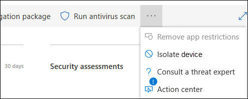
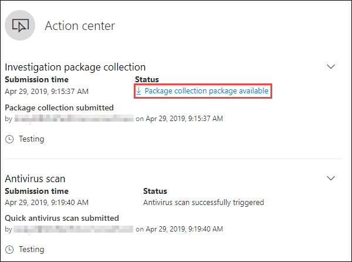
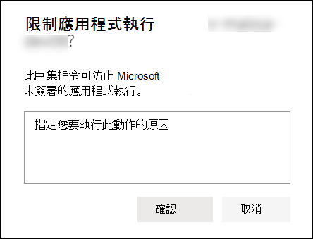
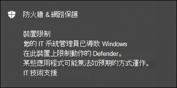
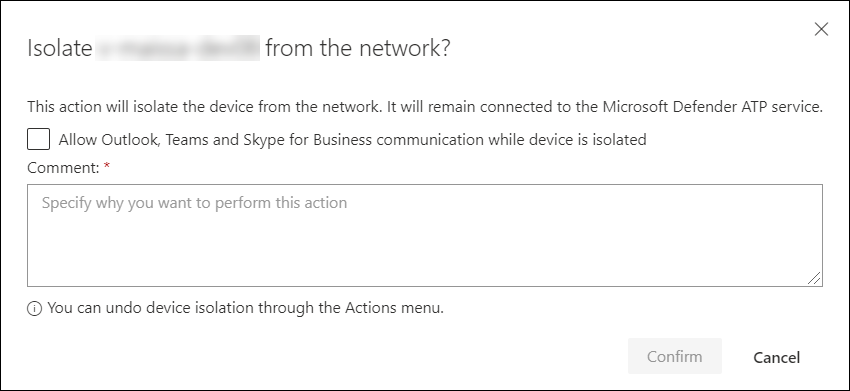
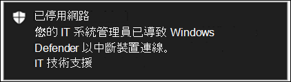
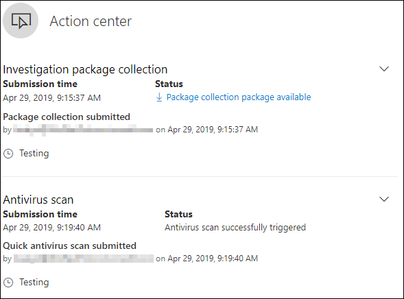

# 在裝置上採取回應動作Take response actions on a device

[!INCLUDE [Microsoft 365 Defender rebranding](../../includes/microsoft-defender.md)]

**適用於：****Applies to:**
- [適用於端點的 Microsoft DefenderMicrosoft Defender for Endpoint](https://go.microsoft.com/fwlink/?linkid=2154037)

>想要體驗 Defender for Endpoint？Want to experience Defender for Endpoint? [注册免費試用版。Sign up for a free trial.](https://www.microsoft.com/microsoft-365/windows/microsoft-defender-atp?ocid=docs-wdatp-respondmachine-abovefoldlink) 

透過隔離裝置或收集調查套件，快速回應偵測到的攻擊。Quickly respond to detected attacks by isolating devices or collecting an investigation package. 對裝置採取動作後，您可以在「行動中心」查看活動詳細資料。After taking action on devices, you can check activity details on the Action center.

回應動作會沿著特定裝置頁面的頂端執行，並包含：Response actions run along the top of a specific device page and include:

- 管理標籤Manage tags
- 啟動自動調查Initiate Automated Investigation
- 啟動 Live Response SessionInitiate Live Response Session
- 收集調查套件Collect investigation package
- 執行防毒掃描Run antivirus scan
- 限制應用程式執行Restrict app execution
- 隔離裝置Isolate device
- 諮詢威脅專家Consult a threat expert
- 控制中心Action center

[ 的影像](images/response-actions.png#lightbox)

 您可以從下列任何一種視圖中尋找裝置頁面：You can find device pages from any of the following views:

- **安全性作業儀表板** -從危險卡的裝置中選取裝置名稱。**Security operations dashboard** - Select a device name from the Devices at risk card.
- **警示佇列** - 從警示佇列中選取裝置圖示旁邊的裝置名稱。**Alerts queue** - Select the device name beside the device icon from the alerts queue.
- **裝置清單** -從 [裝置] 清單中選取裝置名稱的標題。**Devices list** - Select the heading of the device name from the devices list.
- **搜尋方塊** - 從下拉式功能表中選取裝置並輸入裝置名稱。**Search box** - Select Device from the drop-down menu and enter the device name.

>[!IMPORTANT]
> - 這些回應動作只適用于 Windows 10 版本1703或更新版本上的裝置。These response actions are only available for devices on Windows 10, version  1703 or later. 
> - 針對非 Windows 的平臺，回應功能 (如裝置隔離) 取決於協力廠商功能。For non-Windows platforms, response capabilities (such as Device isolation) are dependent on the third-party capabilities.

## 管理標籤Manage tags

新增或管理標記以建立邏輯群組從屬關係。Add or manage tags to create a logical group affiliation. 裝置標籤支援網路的正確對應，使您能够附加不同的標籤以擷取内容，並作為事件的一部分啟用動態清單建立。Device tags support proper mapping of the network, enabling you to attach different tags to capture context and to enable dynamic list creation as part of an incident.

如需裝置標記的詳細資訊，請參閱 [Create and manage device tags](machine-tags.md)。For more information on device tagging, see [Create and manage device tags](machine-tags.md).

## 啟動自動調查Initiate Automated Investigation

您可以視需要在裝置上啟動新的一般用途自動調查。You can start a new general purpose automated investigation on the device if needed. 在執行調查時，系統會將從裝置產生的任何其他警示新增至進行中的自動調查，直到完成調查為止。While an investigation is running, any other alert generated from the device will be added to an ongoing Automated investigation until that investigation is completed. 此外，如果在其他裝置上看到相同威脅，就會將這些裝置新增至調查。In addition, if the same threat is seen on other devices, those devices are added to the investigation.

如需自動調查的詳細資訊，請參閱 [自動化調查的概述](automated-investigations.md)。For more information on automated investigations, see [Overview of Automated investigations](automated-investigations.md).

## 啟動 Live Response SessionInitiate Live Response Session

Live response 是一種可讓您透過遠端命令介面連線對裝置進行暫態存取的功能。Live response is a capability that gives you instantaneous access to a device by using a remote shell connection. 這可讓您在深入調查工作中進行工作，並立即採取回應動作，及時包含已識別的威脅（即時）。This gives you the power to do in-depth investigative work and take immediate response actions to promptly contain identified threats — real time.

Live response 的設計目的是讓您可以收集法律調查資料、執行腳本、傳送可疑實體以進行分析、修正威脅，以及主動搜尋新興威脅。Live response is designed to enhance investigations by enabling you to collect forensic data, run scripts, send suspicious entities for analysis, remediate threats, and proactively hunt for emerging threats.

如需即時回應的詳細資訊，請參閱 [使用即時回應調查裝置上的實體](live-response.md)。For more information on live response, see [Investigate entities on devices using live response](live-response.md).

## 從裝置收集調查套件Collect investigation package from devices

作為調查或回應程式的一部分，您可以從裝置收集調查套件。As part of the investigation or response process, you can collect an investigation package from a device. 透過收集調查套件，您可以識別目前的裝置狀態，並進一步瞭解攻擊者所使用的工具和技術。By collecting the investigation package, you can identify the current state of the device and further understand the tools and techniques used by the attacker.

若要下載封裝 (Zip 檔案) 並調查裝置上發生的事件To download the package (Zip file) and investigate the events that occurred on a device

1. 從 [裝置] 頁面頂端的 [回應] 動作列中，選取 [ **收集調查套件** ]。Select **Collect investigation package** from the row of response actions at the top of the device page.
2. 在文字方塊中指定您要執行此動作的原因。Specify in the text box why you want to perform this action. 選取 [確認 **]**。Select **Confirm**.
3. 將下載 zip 檔案The zip file will download

另一種方法：Alternate way:

1. 從 [裝置] 頁面的 [回應動作] 區段中，選取 [ **操作中心** ]。Select **Action center** from the response actions section of the device page.

    

3. 在 [動作中心] 飛出中，選取 [ **套件集合套件可供** 下載 zip 檔案]。In the Action center fly-out, select **Package collection package available** to download the zip file.
  
    

套件包含下列資料夾：The package contains the following folders:

| 資料夾Folder | 描述Description |
|:---|:---------|
|AutorunsAutoruns | 包含一組檔案，每一組檔案都代表已知自動啟動進入點之登錄的內容， (ASEP) 協助識別攻擊者在裝置上的 persistency。Contains a set of files that each represent the content of the registry of a known auto start entry point (ASEP) to help identify attacker’s persistency on the device.    
<b>附注：</b> 如果找不到登錄機碼，該檔案會包含下列訊息：「錯誤：系統找不到指定的登錄機碼或值」。<b>NOTE:</b> If the registry key is not found, the file will contain the following message: “ERROR: The system was unable to find the specified registry key or value.”
                                                                                                                                |
|已安裝程式Installed programs | 此 .CSV 檔案包含已安裝程式的清單，可協助識別裝置上目前已安裝的元件。This .CSV file contains the list of installed programs that can help identify what is currently installed on the device. 如需詳細資訊，請參閱 [Win32_Product 類別](https://go.microsoft.com/fwlink/?linkid=841509)。For more information, see [Win32_Product class](https://go.microsoft.com/fwlink/?linkid=841509).                                                                                  |
|網路連線Network connections | 此資料夾包含一組與連線資訊相關的資料點，可協助識別可疑 URLs 的連線、攻擊者的命令和控制 (C&C) 基礎結構、任何橫向移動或遠端連線。This folder contains a set of data points related to the connectivity information which can help in identifying connectivity to suspicious URLs, attacker’s command and control (C&C) infrastructure, any lateral movement, or remote connections.   -ActiveNetConnections.txt –顯示通訊協定統計資料和目前 TCP/IP 網路連線。- ActiveNetConnections.txt – Displays protocol statistics and current TCP/IP network connections. 可讓您尋找處理常式所進行的可疑連線能力。Provides the ability to look for suspicious connectivity made by a process.    -Arp.txt –顯示所有介面 (ARP) 快取表的目前位址解析通訊協定。- Arp.txt – Displays the current address resolution protocol (ARP) cache tables for all interfaces.    ARP 快取可以在網路上顯示已遭破壞或可疑系統可能已被用來執行內部攻擊的其他主機。ARP cache can reveal additional hosts on a network that have been compromised or suspicious systems on the network that might have been used to run an internal attack.   -DnsCache.txt-顯示 DNS 用戶端解析程式快取的內容，該快取包括從本機主機檔案預先載入的專案，以及電腦所解析之名稱查詢的任何最近取得的資源記錄。- DnsCache.txt - Displays the contents of the DNS client resolver cache, which includes both entries preloaded from the local Hosts file and any recently obtained resource records for name queries resolved by the computer. 這可協助識別可疑的連線。This can help in identifying suspicious connections.    -IpConfig.txt –顯示所有配接器的完整 TCP/IP 設定。- IpConfig.txt – Displays the full TCP/IP configuration for all adapters. 配接器可以代表實體介面（如已安裝的網路介面卡）或邏輯介面，例如撥號連線。Adapters can represent physical interfaces, such as installed network adapters, or logical interfaces, such as dial-up connections.    -FirewallExecutionLog.txt 和 pfirewall .log- FirewallExecutionLog.txt and pfirewall.log                                                                                  |
| 預回遷檔Prefetch files| Windows預回遷檔案的設計目的是要加速應用程式啟動程式。Windows Prefetch files are designed to speed up the application startup process. 可用於追蹤系統最近使用過的所有檔案，並尋找可能已遭刪除但仍可在 [回遷檔] 清單中找到之應用程式的追蹤。It can be used to track all the files recently used in the system and find traces for applications that might have been deleted but can still be found in the prefetch file list.    -預回遷資料夾–包含預先回遷檔案的複本 `%SystemRoot%\Prefetch` 。- Prefetch folder –  Contains a copy of the prefetch files from `%SystemRoot%\Prefetch`. 附注：建議下載預回遷檔案檢視器以查看預回遷檔。NOTE: It is suggested to download a prefetch file viewer to view the prefetch files.    -PrefetchFilesList.txt –包含所有已複製檔案的清單，這些檔案可用於追蹤回遷資料夾是否有任何複製失敗。- PrefetchFilesList.txt – Contains the list of all the copied files which can be used to track if there were any copy failures to the prefetch folder.                                                                                                      |
| 過程Processes| 包含列出執行中進程的 .CSV 檔案，該檔案可用於識別裝置上所執行的當前進程。Contains a .CSV file listing the running processes, which provides the ability to identify current processes running on the device. 這在識別可疑程式及其狀態時非常有用。This can be useful when identifying a suspicious process and its state.                                                                                                                                                                                                       |
| 排程任務Scheduled tasks| 包含的 .CSV 檔案會列出排程的任務，可用來識別在選取的裝置上自動執行的常式，以尋找設定為自動執行的可疑代碼。Contains a .CSV file listing the scheduled tasks, which can be used to identify routines performed automatically on a chosen device to look for suspicious code which was set to run automatically.                                                                                                                                                                                                      |
| 安全性事件記錄檔Security event log| 包含安全性事件記錄檔，其中包含登入或登出活動的記錄，或系統的「審核」原則所指定的其他安全相關事件。Contains the security event log, which contains records of login or logout activity, or other security-related events specified by the system's audit policy.   
<b>附注：</b> 使用 [事件檢視器] 開啟事件記錄檔。<b>NOTE:</b> Open the event log file using Event viewer.
                                                                                    |
| 服務Services| 包含列出服務及其狀態的 .CSV 檔案。Contains a .CSV file that lists services and their states.                                                                                      |
| Windows伺服器消息區塊 (SMB) 會話Windows Server Message Block (SMB) sessions | 列出網路上的各節點之間的檔案、印表機、序列埠及其他通訊的共用存取。Lists shared access to files, printers, and serial ports and miscellaneous communications between nodes on a network. 這可協助識別資料 exfiltration 或側向移動。This can help identify data exfiltration or lateral movement.    包含 SMBInboundSessions 和 SMBOutboundSession 的檔案。Contains files for SMBInboundSessions and SMBOutboundSession.    
<b>附注：</b> 如果沒有會話 (輸入或外寄) ，您會收到文字檔，告訴您找不到任何 SMB 會話。<b>NOTE:</b> If there are no sessions (inbound or outbound), you'll get a text file which tell you that there are no SMB sessions found.
                                                                                                                          |
| 系統資訊System Information| 包含 SystemInformation.txt 檔，其中會列出作業系統版本和網卡等系統資訊。Contains a SystemInformation.txt file which lists system information such as OS version and network cards.                                                                                     |
| 臨時目錄Temp Directories| 包含一組文字檔，其中列出系統中每位使用者的% Temp% 檔案。Contains a set of text files that lists the files located in %Temp% for every user in the system.    這可協助追蹤攻擊者可能已在系統上丟棄的可疑檔案。This can help to track suspicious files that an attacker may have dropped on the system.    
<b>附注：</b> 如果檔案包含下列郵件：「系統找不到指定的路徑」，表示此使用者沒有任何 temp 目錄，可能是因為使用者未登入系統。<b>NOTE:</b> If the file contains the following message: “The system cannot find the path specified”, it means that there is no temp directory for this user, and might be because the user didn’t log in to the system.
                                                                                                                                         |
| 使用者和群組Users and Groups| 提供每個檔案的清單，每個檔案都代表一個群組及其成員。Provides a list of files that each represent a group and its members.                                                                                                                   |
|WdSupportLogsWdSupportLogs| 提供 MpCmdRunLog.txt 和 MPSupportFiles.cabProvides the MpCmdRunLog.txt and MPSupportFiles.cab     
<b>附注：</b>此資料夾只會在2月2020更新彙總套件或更新所安裝的 Windows 10 版本1709或更新版本上建立：<b>NOTE:</b> This folder will only be created on Windows 10, version 1709 or later with February 2020 update rollup or more recent installed:  Win10 1709 (RS3) 組建16299.1717： [KB4537816](https://support.microsoft.com/en-us/help/4537816/windows-10-update-kb4537816)Win10 1709 (RS3) Build 16299.1717 : [KB4537816](https://support.microsoft.com/en-us/help/4537816/windows-10-update-kb4537816)   Win10 1803 (RS4) 組建17134.1345： [KB4537795](https://support.microsoft.com/en-us/help/4537795/windows-10-update-kb4537795)Win10 1803 (RS4) Build 17134.1345 : [KB4537795](https://support.microsoft.com/en-us/help/4537795/windows-10-update-kb4537795)   Win10 1809 (RS5) 組建17763.1075： [KB4537818](https://support.microsoft.com/en-us/help/4537818/windows-10-update-kb4537818)Win10 1809 (RS5) Build 17763.1075 : [KB4537818](https://support.microsoft.com/en-us/help/4537818/windows-10-update-kb4537818)   Win10 1903/1909 (19h1/19h2) 組建18362.693 及18363.693： [KB4535996](https://support.microsoft.com/en-us/help/4535996/windows-10-update-kb4535996)Win10 1903/1909 (19h1/19h2) Builds 18362.693 and 18363.693 : [KB4535996](https://support.microsoft.com/en-us/help/4535996/windows-10-update-kb4535996) 
                                                                                                                    |
| CollectionSummaryReport.xlsCollectionSummaryReport.xls| 此檔案是調查套件集合的摘要，它包含資料點清單、用於提取資料的命令、執行狀態，以及失敗時的錯誤代碼。This file is a summary of the investigation package collection, it contains the list of data points, the command used to extract the data, the execution status, and the error code in case of failure. 您可以使用此報告來追蹤套件是否包含所有預期的資料，並識別是否有任何錯誤。You can use this report to track if the package includes all the expected data and identify if there were any errors. |

## 在裝置上執行 Microsoft Defender 防毒軟體掃描Run Microsoft Defender Antivirus scan on devices

在調查或回應程式中，您可以從遠端啟動防病毒掃描，以協助識別和修正受損裝置上可能會出現的惡意程式碼。As part of the investigation or response process, you can remotely initiate an antivirus scan to help identify and remediate malware that might be present on a compromised device.

>[!IMPORTANT]
>- 此動作可用於 Windows 10 版本1709或更新版本的裝置。This action is available for devices on Windows 10, version  1709 or later.
>- Microsoft Defender 防毒軟體 (microsoft defender av) 掃描可與其他防病毒方案一起執行，不論 microsoft defender AV 是否使用中防病毒解決方案。A Microsoft Defender Antivirus (Microsoft Defender AV) scan can run alongside other antivirus solutions, whether Microsoft Defender AV is the active antivirus solution or not. Microsoft Defender AV 可以是被動模式。Microsoft Defender AV can be in Passive mode. 如需詳細資訊，請參閱[Microsoft Defender 防毒軟體相容性](https://docs.microsoft.com/windows/security/threat-protection/microsoft-defender-antivirus/microsoft-defender-antivirus-compatibility.md)。For more information, see [Microsoft Defender Antivirus compatibility](https://docs.microsoft.com/windows/security/threat-protection/microsoft-defender-antivirus/microsoft-defender-antivirus-compatibility.md).

您已選取 [ **執行防病毒掃描**]，請選取您想要執行的掃描類型 (快速或完整) 並在確認掃描之前新增批註。One you have selected **Run antivirus scan**, select the scan type that you'd like to run (quick or full) and add a comment before confirming the scan.

![選取 [快速掃描] 或 [完全掃描] 及 [新增批註] 的通知圖像](images/run-antivirus.png)

動作中心會顯示掃描資訊，裝置時程表會包含新的事件，反映已在裝置上提交掃描動作。The Action center will show the scan information and the device timeline will include a new event, reflecting that a scan action was submitted on the device. Microsoft Defender AV 警示會反映在掃描期間所呈現的任何偵測。Microsoft Defender AV alerts will reflect any detections that surfaced during the scan.

>[!NOTE]
>使用 Defender for Endpoint response 動作觸發掃描時，Microsoft Defender 防毒程式 ' ScanAvgCPULoadFactor ' 值仍會套用，並限制掃描的 CPU 影響。When triggering a scan using Defender for Endpoint response action, Microsoft Defender antivirus 'ScanAvgCPULoadFactor' value still applies and limits the CPU impact of the scan.  如果未設定 ScanAvgCPULoadFactor，則預設值為在掃描期間最多50% 的 CPU 負載限制。If ScanAvgCPULoadFactor is not configured, the default value is a limit of 50% maximum CPU load during a scan. 
>如需詳細資訊，請參閱 [configure-advanced-掃描類型-microsoft-defender-防病毒](https://docs.microsoft.com/windows/security/threat-protection/microsoft-defender-antivirus/configure-advanced-scan-types-microsoft-defender-antivirus)。For more information, see [configure-advanced-scan-types-microsoft-defender-antivirus](https://docs.microsoft.com/windows/security/threat-protection/microsoft-defender-antivirus/configure-advanced-scan-types-microsoft-defender-antivirus).

## 限制應用程式執行Restrict app execution

除了透過停止惡意程式以外，您也可以鎖定裝置，並防止後續惡意程式的後續嘗試執行。In addition to containing an attack by stopping malicious processes, you can also lock down a device and prevent subsequent attempts of potentially malicious programs from running.

>[!IMPORTANT]
> - 此動作可用於 Windows 10 版本1709或更新版本的裝置。This action is available for devices on Windows 10, version  1709 or later.
> - 如果您的組織使用 Microsoft Defender 防毒軟體，便可使用此功能。This feature is available if your organization uses Microsoft Defender Antivirus.
> - 此巨集指令需要符合 Windows Defender 的應用程式控制代碼完整性原則格式及簽署需求。This action needs to meet the Windows Defender Application Control code integrity policy formats and signing requirements. 如需詳細資訊，請參閱程式 [代碼完整性原則格式及簽署](https://docs.microsoft.com/windows/device-security/device-guard/requirements-and-deployment-planning-guidelines-for-device-guard#code-integrity-policy-formats-and-signing)。For more information, see [Code integrity policy formats and signing](https://docs.microsoft.com/windows/device-security/device-guard/requirements-and-deployment-planning-guidelines-for-device-guard#code-integrity-policy-formats-and-signing).

若要限制應用程式的執行，則會套用程式碼完整性原則，只允許檔案以 Microsoft 簽發的憑證簽署。To restrict an application from running, a code integrity policy is applied that only allows files to run if they are signed by a Microsoft issued certificate. 這種限制方式可協助防止攻擊者控制已受損的裝置，並進一步執行惡意活動。This method of restriction can help prevent an attacker from controlling compromised devices and performing further malicious activities.

>[!NOTE]
>您可以在任何時間，撤銷應用程式的限制，使其無法執行。You’ll be able to reverse the restriction of applications from running at any time. [裝置] 頁面上的按鈕將變更為 [ **移除應用程式限制**]，然後您可以採取與限制應用程式執行相同的步驟。The button on the device page will change to say **Remove app restrictions**, and then you take the same steps as restricting app execution.

當您選取 [限制裝置上的 **應用程式執行** ] 頁面時，輸入注釋並選取 [ **確認**]。Once you have selected **Restrict app execution** on the device page, type a comment and select **Confirm**. 動作中心會顯示掃描資訊，裝置時程表會包含新的事件。The Action center will show the scan information and the device timeline will include a new event.

**在裝置使用者上的通知**：**Notification on device user**: 
當應用程式受到限制時，會顯示下列通知，以告知使用者已限制應用程式執行：When an app is restricted, the following notification is displayed to inform the user that an app is being restricted from running:

## 將裝置與網路隔離Isolate devices from the network

根據攻擊的嚴重性和裝置的靈敏度，您可能想要將裝置與網路隔離。Depending on the severity of the attack and the sensitivity of the device, you might want to isolate the device from the network. 此巨集指令可協助防止攻擊者控制已遭破壞的裝置，以及執行其他活動，例如資料 exfiltration 及橫向移動。This action can help prevent the attacker from controlling the compromised device and performing further activities such as data exfiltration and lateral movement.

>[!IMPORTANT]
>- Windows 10 版本1703上的裝置均可使用完整隔離。Full isolation is available for devices on Windows 10, version 1703.
>- 在 Windows 10，版本1709或更新版本上，裝置可以使用選擇性隔離。Selective isolation is available for devices on Windows 10, version 1709 or later.
>- 當隔離裝置時，只允許某些程式和目的地。When isolating a device, only certain processes and destinations are allowed. 因此，在隔離裝置之前，已完全 VPN 隧道後的裝置將無法到達 Microsoft Defender for Endpoint cloud service。Therefore, devices that are behind a full VPN tunnel won't be able to reach the Microsoft Defender for Endpoint cloud service after the device is isolated. 我們建議您針對 Microsoft Defender for Endpoint 使用分割隧道 VPN，並 Microsoft Defender 防毒軟體雲端型保護相關流量。We recommend using a split-tunneling VPN for Microsoft Defender for Endpoint and Microsoft Defender Antivirus cloud-based protection-related traffic.

此裝置隔離功能會中斷已受損的裝置與網路的連線，並保留與 Defender for Endpoint service 的連線，進而繼續監視裝置。This device isolation feature disconnects the compromised device from the network while retaining connectivity to the Defender for Endpoint service, which continues to monitor the device.

在 Windows 10，版本1709或更新版本中，您將可以進一步控制網路隔離層級。On Windows 10, version 1709 or later, you'll have additional control over the network isolation level. 您也可以選擇啟用 Outlook、Microsoft Teams 及商務用 Skype 連線 (a ' 選擇性隔離」 ) 。You can also choose to enable Outlook, Microsoft Teams, and Skype for Business connectivity (a.k.a 'Selective Isolation').

>[!NOTE]
>您可以隨時將裝置重新連線到網路。You’ll be able to reconnect the device back to the network at any time. 裝置頁面上的按鈕將變更為 [ **從隔離釋放**]，然後您可以採取與隔離裝置相同的步驟。The button on the device page will change to say **Release from isolation**, and then you take the same steps as isolating the device.

在 [裝置] 頁面上選取 [ **隔離裝置** ] 之後，輸入注釋並選取 [ **確認**]。Once you have selected **Isolate device** on the device page, type a comment and select **Confirm**. 動作中心會顯示掃描資訊，裝置時程表會包含新的事件。The Action center will show the scan information and the device timeline will include a new event.

>[!NOTE]
>即使它是與網路隔離的，裝置仍會保持連線至的 Defender for Endpoint service。The device will remain connected to the Defender for Endpoint service even if it is isolated from the network. 如果您已選擇啟用 Outlook 和商務用 Skype 通訊，則在隔離裝置時，您就可以與使用者通訊。If you've chosen to enable Outlook and Skype for Business communication, then you'll be able to communicate to the user while the device is isolated.

**在裝置使用者上的通知**：**Notification on device user**: 
在隔離裝置時，會顯示下列通知，以告知使用者已從網路隔離裝置：When a device is being isolated, the following notification is displayed to inform the user that the device is being isolated from the network:

## 諮詢威脅專家Consult a threat expert

您可以參閱 Microsoft 威脅專家，以取得有關可能已遭破壞裝置或已受損裝置的更深入資訊。You can consult a Microsoft threat expert for more insights regarding a potentially compromised device or already compromised ones. Microsoft 威脅專家可以直接從 Microsoft Defender 資訊安全中心內直接參與，以進行及時且準確的回應。Microsoft Threat Experts can be engaged directly from within the Microsoft Defender Security Center for timely and accurate response. 專家不僅針對可能受到損害的裝置提供深入資訊，也能更好地瞭解複雜的威脅、您取得的目標攻擊通知，或者您需要有關提醒的詳細資訊，或是您在入口網站儀表板上看到的威脅情報內容。Experts provide insights not just regarding a potentially compromised device, but also to better understand complex threats, targeted attack notifications that you get, or if you need more information about the alerts, or a threat intelligence context that you see on your portal dashboard.

如需詳細資訊，請參閱查看 [Microsoft 威脅專家](https://docs.microsoft.com/microsoft-365/security/defender-endpoint/configure-microsoft-threat-experts#consult-a-microsoft-threat-expert-about-suspicious-cybersecurity-activities-in-your-organization) 。See [Consult a Microsoft Threat Expert](https://docs.microsoft.com/microsoft-365/security/defender-endpoint/configure-microsoft-threat-experts#consult-a-microsoft-threat-expert-about-suspicious-cybersecurity-activities-in-your-organization) for details.

## 檢查控制中心的活動詳細資料Check activity details in Action center

「 **行動中心** 」提供對裝置或檔案所採取動作的資訊。The **Action center** provides information on actions that were taken on a device or file. 您將可以查看下列詳細資料：You’ll be able to view the following details:

- 調查套件集合Investigation package collection
- 防病毒掃描Antivirus scan
- 應用程式限制App restriction
- 裝置隔離Device isolation

也會顯示所有其他相關詳細資料，例如提交日期/時間、提交使用者，以及動作成功或失敗。All other related details are also shown, for example, submission date/time, submitting user, and if the action succeeded or failed.

## 相關主題Related topic
- [對檔案採取回應動作Take response actions on a file](respond-file-alerts.md)
- [報表 inaccuracyReport inaccuracy](https://docs.microsoft.com/microsoft-365/security/defender-endpoint/tvm-security-recommendation#report-inaccuracy)
