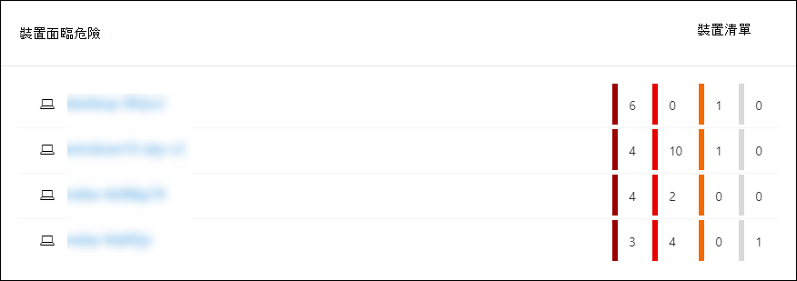
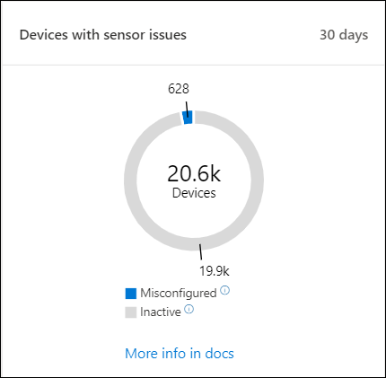
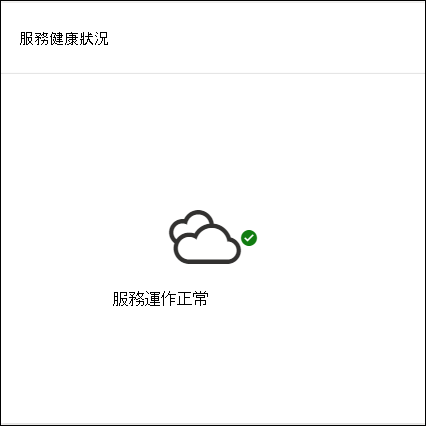
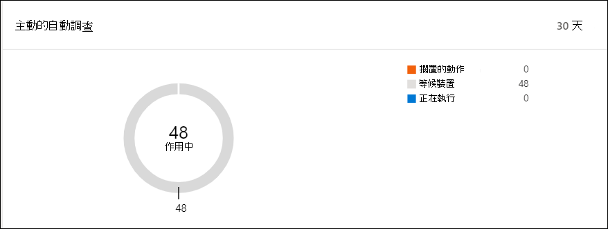
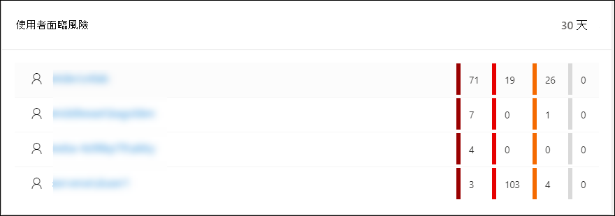

# Microsoft Defender 資訊安全中心安全性作業儀表板

[!INCLUDE [Microsoft 365 Defender rebranding](../../includes/microsoft-defender.md)]

**適用於：**
- [適用於端點的 Microsoft Defender](https://go.microsoft.com/fwlink/?linkid=2154037)

>想要體驗適用於端點的 Microsoft Defender 嗎？ [注册免費試用版。](https://www.microsoft.com/microsoft-365/windows/microsoft-defender-atp?ocid=docs-wdatp-secopsdashboard-abovefoldlink) 

**安全性作業儀表板** 是指端點偵測和回應功能的所在位置。 這可讓您在需要回應動作的情況下，以高層次的方式概括顯示偵測和高光的位置。 

儀表板會顯示下列專案的快照：

- 主動警示
- 裝置面臨危險
- 感應器狀況
- 服務健康狀況
- 每日裝置報告
- 主動的自動調查
- 自動調查統計資料
- 使用者面臨風險
- 可疑活動

您可以探索並調查警示和裝置，以快速判斷您的網路中是否發生可疑活動，以協助您瞭解所出現的內容。

在 [ **安全性作業] 儀表板** 中，您會看到匯總的事件，以協助識別裝置上的重要事件或行為。 您也可以深入查看細微的事件和低層指示器。

它也具有可在組織整體健康狀態上提供視覺提示的可供按一下的麻將牌。 每個麻將牌都會開啟對應之概要的詳細視圖。

## 主動警示
您可以從麻將牌的網路中過去30天內，查看使用中警示的總數。 警示會分組成 **新** 的和 **進行中**。

每個群組會進一步歸入其對應的警示嚴重性層級。 按一下每個提醒環內的提醒數目，以查看該類別佇列的已排序視圖 () **新增** 或 **進行中** 。

如需詳細資訊，請參閱 [警示總覽](alerts-queue.md)。

每一列都包含警示嚴重性類別及警示的簡短描述。 您可以按一下警示，以查看其詳細的觀點。 如需詳細資訊，請參閱  [Microsoft Defender For Endpoint 警示](investigate-alerts.md) 和 [警示概述](alerts-queue.md)。

## 裝置面臨危險
此麻將牌會顯示具有最高作用中警示數目的裝置清單。 每個裝置的警示總數會顯示在裝置名稱旁邊的圓形中，然後再依嚴重性層級分類在磚的最低端 (將游標移至每個嚴重性列，以查看其標籤) 。

按一下裝置的名稱，以查看該裝置的詳細資料。 如需詳細資訊，請參閱 [調查 Microsoft Defender For Endpoint devices 中的裝置清單](investigate-machines.md)。

您也可以按一下磚頂端的 [ **裝置] 清單** ，以直接移至 [ **裝置] 清單**，依作用中的警示數目排序。 如需詳細資訊，請參閱 [調查 Microsoft Defender For Endpoint devices 中的裝置清單](investigate-machines.md)。

## 具有感應器問題的裝置
**具有感應器問題的裝置** 會提供個別裝置提供感應器資料至 Microsoft Defender for Endpoint service 的功能資訊。 它會報告需要注意的裝置數量，並協助您識別有問題的裝置。

有兩個狀態指示器可提供無法正確報告至服務之裝置的數目資訊：
- 設定 **錯誤**-這些裝置可能會部分向 Microsoft Defender for Endpoint service 報告感應器資料，而且可能會發生需要修正的設定錯誤。
- **非** 使用中-過去一個月已停止向 Microsoft Defender for Endpoint service 報告的裝置超過7天。

當您按一下任一群組時，系統會將您導向至 [裝置] 清單，並根據您的選擇加以篩選。 如需詳細資訊，請參閱 [檢查感應器狀態](check-sensor-status.md) 和 [調查裝置](investigate-machines.md)。

## 服務健康狀況
**服務健康** 情況磚會通知您服務是否在使用中或發生問題。

如需服務健康情況的詳細資訊，請參閱 [檢查 Microsoft Defender For Endpoint service health](service-status.md)。

## 每日裝置報告
[ **每日裝置報告** ] 磚會顯示一個柱狀圖圖，表示在過去30天內，每日報告的裝置數目。 將游標移到圖形上的個別條形上，查看每天報告的實際裝置數目。

## 主動的自動調查
您可以從您網路中的最近30天開始，透過「作用中的 **自動調查** ] 磚來查看總的自動調查數目。 調查會分組成 **擱置** 中的動作， **等候裝置**， **並執行**。

## 自動調查統計資料
此麻將牌顯示過去7天內自動調查相關的統計資料。 它會顯示已完成調查的數目、成功修正調查的數目、可啟動調查的平均擱置時間、修正警示所需的平均時間、調查的警示數量，以及從一般手動調查中儲存的自動化時數。 

您可以按一下「 **自動調查**」、「 **修正調查**」及「 **調查** 」，以流覽至「 **調查** 」頁面，並依適當的類別篩選。 這可讓您在內容中看到調查的詳細細分。

## 使用者面臨風險
此磚會顯示具有最活躍警示的使用者帳戶清單，以及在高、中或低警示上看到的警示數目。 

按一下使用者帳戶以查看使用者帳戶的詳細資料。 如需詳細資訊，請參閱 [調查使用者帳戶](investigate-user.md)。

>想要體驗適用於端點的 Microsoft Defender 嗎？ [注册免費試用版。](https://www.microsoft.com/microsoft-365/windows/microsoft-defender-atp?ocid=docs-wdatp-secopsdashboard-belowfoldlink)

## 相關主題
- [瞭解 Microsoft Defender for Endpoint 入口網站](use.md)
- [入口網站概觀](portal-overview.md)
- [查看威脅 & 漏洞管理儀表板](tvm-dashboard-insights.md)
- [查看威脅分析儀表板並採取建議的緩解動作](threat-analytics.md)
