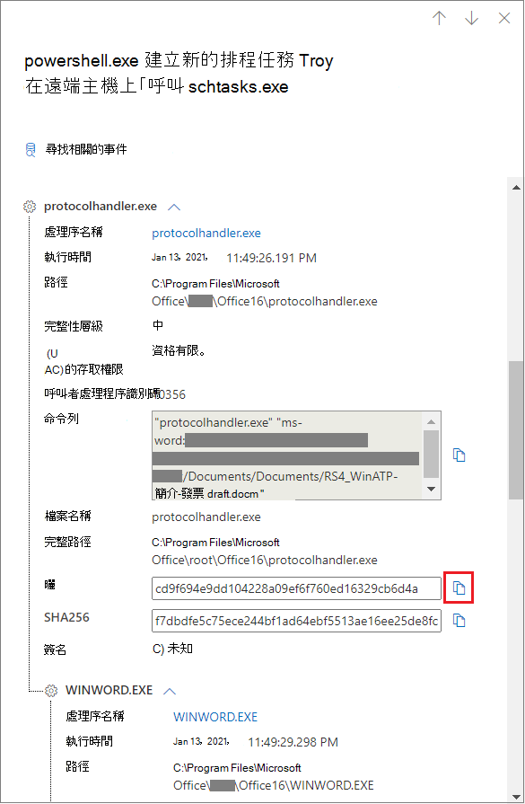
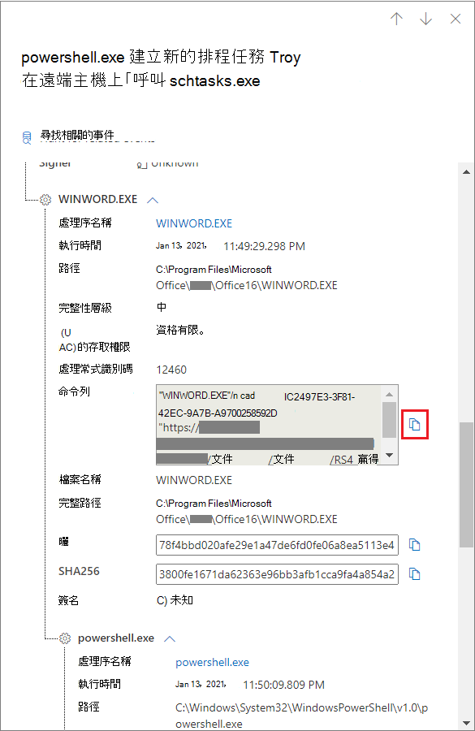
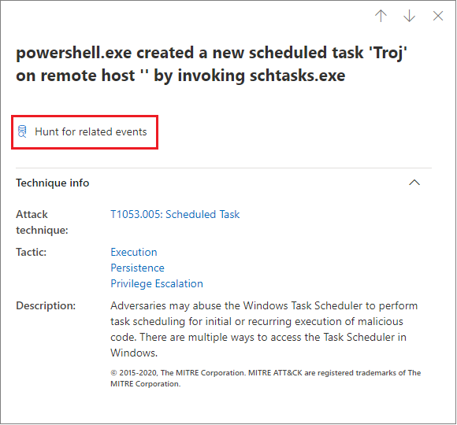

# 裝置時程表中的技術Techniques in the device timeline

**適用於：****Applies to:**
- [適用於端點的 Microsoft DefenderMicrosoft Defender for Endpoint](https://go.microsoft.com/fwlink/p/?linkid=2154037)

您可以透過分析特定裝置上發生的事件，在調查中取得更深入的洞察力。You can gain more insight in an investigation by analyzing the events that happened on a specific device. 首先，從 [ [裝置] 清單](machines-view-overview.md)中選取感興趣的裝置。First, select the device of interest from the [Devices list](machines-view-overview.md). 在 [裝置] 頁面上，您可以選取 [ **時程表** ] 索引標籤，以查看裝置上發生的所有事件。On the device page, you can select the **Timeline** tab to view all the events that occurred on the device.

## 瞭解時程表中的技巧Understand techniques in the timeline

>[!IMPORTANT]
>有些資訊與公開預覽中的 prereleased 產品功能有關，在正式發行之前，可能會大幅修改。Some information relates to a prereleased product feature in public preview which may be substantially modified before it's commercially released. Microsoft 對此處提供的資訊，不提供任何明確或隱含的瑕疵擔保。Microsoft makes no warranties, express or implied, with respect to the information provided here.

在 Microsoft Defender for Endpoint 中， **技術** 是在事件時程表中的其他資料類型。In Microsoft Defender for Endpoint, **Techniques** are an additional data type in the event timeline. 技術可深入瞭解與 [MITRE ATT&CK](https://attack.mitre.org/) 技術或子技巧相關聯的活動。Techniques provide more insight on activities associated with [MITRE ATT&CK](https://attack.mitre.org/) techniques or sub-techniques. 

這項功能可協助分析員瞭解裝置上所觀察到的活動，以簡化調查體驗。This feature simplifies the investigation experience by helping analysts understand the activities that were observed on a device. 分析師可以決定進一步調查。Analysts can then decide to investigate further.

針對公開預覽，在查看裝置的時程表時，預設會提供技術，並與事件一起顯示。For public preview, Techniques are available by default and shown together with events when a device's timeline is viewed. 

技術會以粗體文字反白顯示，左側會顯示藍色圖示。Techniques are highlighted in bold text and appear with a blue icon on the left. 對應的 MITRE ATT&CK 識別碼和技術名稱也會顯示為 [其他資訊] 底下的標記。The corresponding MITRE ATT&CK ID and technique name also appear as tags under Additional information. 

搜尋和匯出選項也可用於技術。Search and Export options are also available for Techniques.

## 使用側邊窗格調查Investigate using the side pane

選取技術以開啟其對應的側邊窗格。Select a Technique to open its corresponding side pane. 您可以在這裡看到其他資訊和洞察力，如相關的 ATT&CK 技術、戰術及描述。Here you can see additional information and insights like related ATT&CK techniques, tactics, and descriptions. 

選取「相關的 ATT&CK 技術」頁面 *，可在* 此找到相關的詳細資訊。Select the specific *Attack technique* to open the related ATT&CK technique page where you can find more information about it.

當您在右側看到藍色圖示時，您可以複製實體的詳細資料。You can copy an entity's details when you see a blue icon on the right. 例如，若要複製相關檔案的 SHA1，請選取 [藍色] 頁面圖示。For instance, to copy a related file's SHA1, select the blue page icon.

您可以對命令列執行相同的動作。You can do the same for command lines.

## 調查相關事件Investigate related events

若要使用 [高級搜尋](advanced-hunting-overview.md) 來尋找與所選技術相關的事件，請選取 [ **尋找相關的事件**]。To use [advanced hunting](advanced-hunting-overview.md) to find events related to the selected Technique, select **Hunt for related events**. 這會導致「高級搜尋」頁面具有查詢，以尋找與技術相關的事件。This leads to the advanced hunting page with a query to find events related to the Technique.

>[!NOTE]
>使用 [技術] 側窗格中的 [ **尋找相關事件** ] 按鈕進行查詢，會顯示與所識別之技術相關的所有事件，但不會在查詢結果中包含此技術本身。Querying using the **Hunt for related events** button from a Technique side pane displays all the events related to the identified technique but does not include the Technique itself in the query results.

## 自訂裝置時程表Customize your device timeline

在裝置時程表的右上方，您可以選擇日期範圍來限制時程表中的事件及技術數目。On the upper right-hand side of the device timeline, you can choose a date range to limit the number of events and techniques in the timeline. 

您可以自訂要公開的資料行。You can customize which columns to expose. 您也可以依資料類型或事件群組，篩選已標記的事件。You can also filter for flagged events by data type or by event group.

### 選擇要公開的資料行Choose columns to expose
您可以選取 [ **選擇欄** ] 按鈕，以選擇要在時程表中公開的欄。You can choose which columns to expose in the timeline by selecting the **Choose columns** button.

您可以從這裡選擇要包含的資訊集。From there you can select which information set to include.

### 篩選只查看技術或事件Filter to view techniques or events only

若只要查看事件或技術，請從裝置時程表選取 [ **篩選器** ]，然後選擇要查看的慣用資料類型。To view only either events or techniques, select **Filters** from the device timeline and choose your preferred Data type to view.

## 另請參閱See also
- [查看及組織裝置清單View and organize the Devices list](machines-view-overview.md)
- [Microsoft Defender for Endpoint 裝置的時間表事件旗標Microsoft Defender for Endpoint device timeline event flags](device-timeline-event-flag.md) 

 
