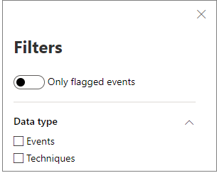

# 裝置時程表中的技術

**適用於：**
- [適用於端點的 Microsoft Defender](https://go.microsoft.com/fwlink/p/?linkid=2154037)

您可以透過分析特定裝置上發生的事件，在調查中取得更深入的洞察力。 首先，從 [ [裝置] 清單](machines-view-overview.md)中選取感興趣的裝置。 在 [裝置] 頁面上，您可以選取 [ **時程表** ] 索引標籤，以查看裝置上發生的所有事件。

## 瞭解時程表中的技巧

>[!IMPORTANT]
>有些資訊與公開預覽中的 prereleased 產品功能有關，在正式發行之前，可能會大幅修改。 Microsoft 對此處提供的資訊，不提供任何明確或隱含的瑕疵擔保。

在 Microsoft Defender for Endpoint 中， **技術** 是在事件時程表中的其他資料類型。 技術可深入瞭解與 [MITRE ATT&CK](https://attack.mitre.org/) 技術或子技巧相關聯的活動。 

這項功能可協助分析員瞭解裝置上所觀察到的活動，以簡化調查體驗。 分析師可以決定進一步調查。

針對公開預覽，在查看裝置的時程表時，預設會提供技術，並與事件一起顯示。 

技術會以粗體文字反白顯示，左側會顯示藍色圖示。 對應的 MITRE ATT&CK 識別碼和技術名稱也會顯示為 [其他資訊] 底下的標記。 

搜尋和匯出選項也可用於技術。

## 使用側邊窗格調查

選取技術以開啟其對應的側邊窗格。 您可以在這裡看到其他資訊和洞察力，如相關的 ATT&CK 技術、戰術及描述。 

選取「相關的 ATT&CK 技術」頁面 *，可在* 此找到相關的詳細資訊。

當您在右側看到藍色圖示時，您可以複製實體的詳細資料。 例如，若要複製相關檔案的 SHA1，請選取 [藍色] 頁面圖示。

您可以對命令列執行相同的動作。

## 調查相關事件

若要使用 [高級搜尋](advanced-hunting-overview.md) 來尋找與所選技術相關的事件，請選取 [ **尋找相關的事件**]。 這會導致「高級搜尋」頁面具有查詢，以尋找與技術相關的事件。

>[!NOTE]
>使用 [技術] 側窗格中的 [ **尋找相關事件** ] 按鈕進行查詢，會顯示與所識別之技術相關的所有事件，但不會在查詢結果中包含此技術本身。

## 自訂裝置時程表

在裝置時程表的右上方，您可以選擇日期範圍來限制時程表中的事件及技術數目。 

您可以自訂要公開的資料行。 您也可以依資料類型或事件群組，篩選已標記的事件。

### 選擇要公開的資料行
您可以選取 [ **選擇欄** ] 按鈕，以選擇要在時程表中公開的欄。

您可以從這裡選擇要包含的資訊集。

### 篩選只查看技術或事件

若只要查看事件或技術，請從裝置時程表選取 [ **篩選器** ]，然後選擇要查看的慣用資料類型。

## 另請參閱
- [查看及組織裝置清單](machines-view-overview.md)
- [Microsoft Defender for Endpoint 裝置的時間表事件旗標](device-timeline-event-flag.md) 

 
