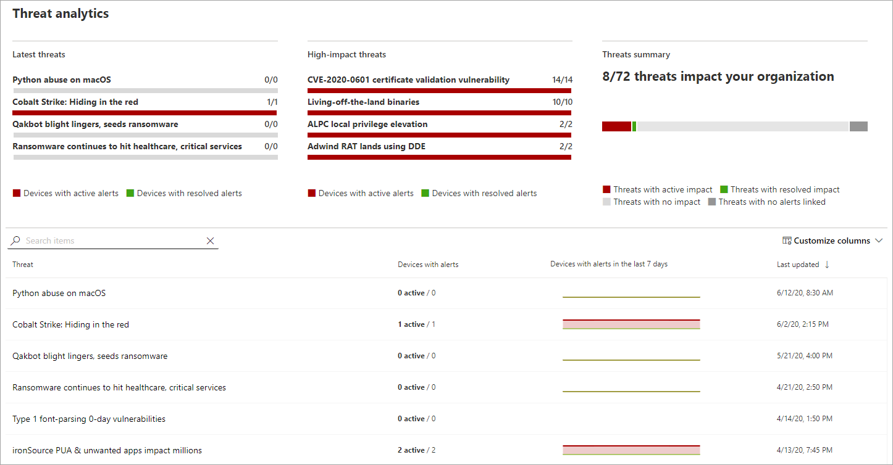

# 使用威脅分析追蹤並回應新興威脅 

[!INCLUDE [Microsoft 365 Defender rebranding](../../includes/microsoft-defender.md)]

**適用於：**
- [適用於端點的 Microsoft Defender](https://go.microsoft.com/fwlink/?linkid=2154037)
- [Microsoft 365 Defender](https://go.microsoft.com/fwlink/?linkid=2118804)

> 想要體驗適用於端點的 Microsoft Defender 嗎？ [注册免費試用版。](https://www.microsoft.com/microsoft-365/windows/microsoft-defender-atp?ocid=docs-wdatp-exposedapis-abovefoldlink)

透過經常和 prevalently 的複雜敵人和新威脅，您可以快速：

- 評估新威脅的影響
- 檢查威脅的復原能力或洩密
- 識別您可以採取以停止或包含威脅的動作

威脅分析是一組來自專家 Microsoft security 研究員的報表，涵蓋最相關的威脅，包括：

- 作用中的威脅演員及其活動
- 常見和新的攻擊技術
- 嚴重弱點
- 常見的攻擊面
- 流行惡意程式碼

每個報告都提供有關如何防範該威脅的詳細分析威脅和大量指導方針。 它也會整合您網路的資料，指出威脅是否作用中，以及您是否有適當的保護。

請觀看這段簡短的影片，深入瞭解威脅分析如何協助您追蹤最新的威脅並加以停止。

> [!VIDEO https://www.microsoft.com/en-us/videoplayer/embed/RE4bw1f]

## 查看威脅分析儀表板

「威脅分析」儀表板是一種非常棒的跳離點，可取得與貴組織最相關的報告。 它會摘要說明下列各節中的威脅：

- **最新威脅**-列出最近發佈的威脅報告，以及具有作用中及已解決之警示的裝置數目。
- **高影響威脅**-列出對組織具有最高影響的威脅。 本節依照具有作用中警示的裝置數目來排名威脅。
- **威脅摘要**-顯示追蹤威脅的整體影響，方法是顯示具有作用中及已解決之警示的威脅數目。

從儀表板選取威脅，以查看該威脅的報告。

## 查看威脅分析報告

每個威脅分析報告都提供三個區段中的資訊： **綜述**、 **分析員報告** 及 **緩解**。

### 概覽：快速瞭解威脅、評估其影響，以及複查防護

[ **一覽表** ] 區段提供詳細分析報告的預覽。 它還提供圖表，以強調您的組織面臨的威脅影響，以及透過誤設定及未修補的裝置來公開。

![威脅分析報告的 [威脅分析報告] 區段中的 [一覽] 區段的影像 ](images/ta-overview.png)
 

#### 評估組織的影響
每個報告都包含設計用來提供威脅之組織影響的資訊的圖表：
- **含警示的裝置**—顯示受到威脅影響之不同裝置的目前數目。 如果有至少一個警示與該威脅相關聯 **，且已** 解決與裝置上的威脅相關的 *所有* 警示，則此裝置會 **分類為作用** 中。
- **隨時間變化的裝置**—顯示一段時間內具有作用中和 **已解決** 之 **警示的不同** 裝置數目。 已解決的警示數目會指出組織對與威脅相關聯的提醒回應的快慢程度。 理想狀況下，圖表應該會顯示幾天內所解決的警示。

#### 檢查安全性恢復能力與狀況
每個報告都包含的圖表，可提供您的組織對特定威脅的彈性程度。
- **安全性設定狀態**-顯示已套用建議安全性設定，以協助緩解威脅的裝置數目。 如果裝置已套用 _所有_ 追蹤的設定，則會被視為 **安全** 裝置。
- **弱點修補狀態**-顯示已套用安全性更新的裝置數目，或修復威脅所利用之弱點的修補程式。

### 分析報告：從 Microsoft security 研究員取得專家洞察力
請移至 [ **分析報告** ] 區段，以閱讀詳細的專家級寫功能。 大多數報告提供攻擊鏈的詳細描述，包含對應至 MITRE ATT 的戰術和技術&CK 架構、詳盡的建議清單，以及強大的 [威脅搜尋](advanced-hunting-overview.md) 指導方針。

[深入瞭解分析報告](threat-analytics-analyst-reports.md)

### 緩解：查看緩解清單和裝置狀態
在 [ **緩解** ] 區段中，複查可協助您增加組織對威脅抵禦能力的特定可行動建議清單。 追蹤的緩解措施清單包括：

- **安全性更新**—部署弱點的安全性更新或修補程式
- **Microsoft Defender 防毒軟體設定**
  - 安全性智慧版本
  - 雲端提供的保護  
  - 可能有害的應用程式 (PUA) 保護
  - 即時保護
 
本節中的緩解資訊包含來自[威脅與弱點管理](next-gen-threat-and-vuln-mgt.md)的資料，也就是從報告中各種連結提供的詳細深入資訊。

 _緩解」區段_ 之 [緩解] 區段的影像

## 其他報告詳細資料與限制
使用報表時，請記住下列事項： 

- 資料的範圍取決於您以角色為基礎的存取控制 (RBAC) 範圍。 您將會看到 [您可以存取之群組](machine-groups.md)中的裝置狀態。
- 圖表只會反映所追蹤的緩解。 請查看報告中未顯示圖表的其他緩解。
- 緩解不會保證完全恢復。 提供的緩解反映改進恢復所需的最佳動作。
- 如果裝置未將資料傳輸至服務，則會將裝置計為「無法使用」。
- 防病毒相關的統計資料是以 Microsoft Defender 防毒軟體設定為基礎。 使用協力廠商防病毒解決方案的裝置可能會顯示為「已公開」。

## 相關主題
- [使用高級搜尋主動尋找威脅](advanced-hunting-overview.md) 
- [瞭解分析報告區段](threat-analytics-analyst-reports.md)
- [評估並解決安全弱點與洩密問題](next-gen-threat-and-vuln-mgt.md)