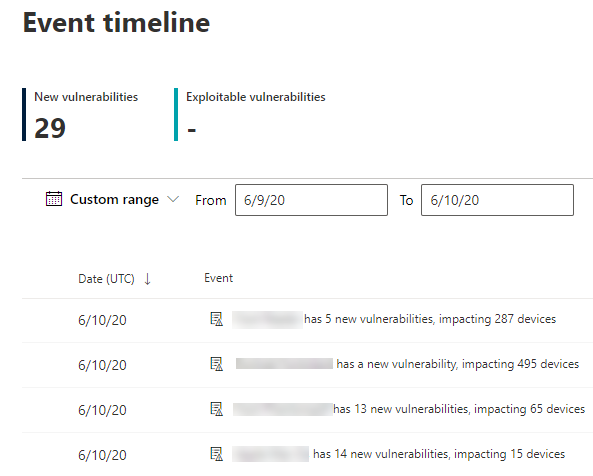

# 事件時程表-威脅和弱點管理Event timeline - threat and vulnerability management

[!INCLUDE [Microsoft 365 Defender rebranding](../../includes/microsoft-defender.md)]

**適用於：****Applies to:**
- [適用於端點的 Microsoft DefenderMicrosoft Defender for Endpoint](https://go.microsoft.com/fwlink/?linkid=2154037)
- [Microsoft 365 DefenderMicrosoft 365 Defender](https://go.microsoft.com/fwlink/?linkid=2118804)

>想要體驗適用於端點的 Microsoft Defender 嗎？Want to experience Microsoft Defender for Endpoint? [注册免費試用版。Sign up for a free trial.](https://www.microsoft.com/microsoft-365/windows/microsoft-defender-atp?ocid=docs-wdatp-portaloverview-abovefoldlink)

事件時程表是一種危險資訊摘要，可協助您透過新的漏洞或利用手段，協助您解釋風險在組織中的引進方式。Event timeline is a risk news feed that helps you interpret how risk is introduced into the organization through new vulnerabilities or exploits. 您可以查看可能影響組織風險的事件。You can view events that may impact your organization's risk. 例如，您可以找出已引進的新漏洞、可被攻擊者利用的漏洞、新增至利用方式套件的漏洞，等等。For example, you can find new vulnerabilities that were introduced, vulnerabilities that became exploitable, exploit that was added to an exploit kit, and more.

事件時程表也會告訴您 [暴露分數](tvm-exposure-score.md) 和 [Microsoft 安全評分](tvm-microsoft-secure-score-devices.md) 的情景，以判斷大型變更的原因。Event timeline also tells the story of your [exposure score](tvm-exposure-score.md) and [Microsoft Secure Score for Devices](tvm-microsoft-secure-score-devices.md) so you can determine the cause of large changes. 事件可能會影響裝置或您的裝置得分。Events can impact your devices or your score for devices. 根據已設定優先順序的 [安全性建議](tvm-security-recommendation.md)，以降低您的危險性。Reduce you exposure by addressing what needs to be remediated based on the prioritized [security recommendations](tvm-security-recommendation.md).

>[!TIP]
>若要取得有關新弱點事件的電子郵件，請參閱 [在 Microsoft Defender For Endpoint 中設定弱點電子郵件通知](configure-vulnerability-email-notifications.md)To get emails about new vulnerability events, see [Configure vulnerability email notifications in Microsoft Defender for Endpoint](configure-vulnerability-email-notifications.md)

## 流覽至 [事件時程表] 頁面Navigate to the Event timeline page

[威脅和弱點管理儀表板](tvm-dashboard-insights.md)也有三個入門點：There are also three entry points from the [threat and vulnerability management dashboard](tvm-dashboard-insights.md):

- **組織公開評分**：將滑鼠游標移至 [一段時間的披露分數] 圖表中的事件點上方，然後選取 [查看此天的所有事件]。**Organization exposure score card**: Hover over the event dots in the "Exposure Score over time" graph and select "See all events from this day." 事件代表軟體弱點。The events represent software vulnerabilities.
- **適用于裝置的 Microsoft 安全計分**：將游標移到 [您的裝置一段時間的分數] 圖表中的事件點上方，然後選取 [查看此天的所有事件]。**Microsoft Secure Score for Devices**: Hover over the event dots in the "Your score for devices over time" graph and select "See all events from this day." 事件代表新的設定評估。The events represent new configuration assessments.
- **最上層的事件卡片**：選取上方事件表底部的 [顯示更多]。**Top events card**: Select "Show more" at the bottom of the top events table. 這張卡片會顯示過去7天的三個最 impactful 事件。The card displays the three most impactful events in the last 7 days. Impactful 事件可以包含如果事件會影響大量的裝置，或是嚴重缺陷。Impactful events can include if the event affects a large number of devices, or if it is a critical vulnerability.

### 裝置圖形的披露分數和 Microsoft 安全評分Exposure score and Microsoft Secure Score for Devices graphs

在 [威脅與弱點管理] 儀表板中，將游標移到 [曝光分數] 圖上方，以查看該天中影響裝置的主要軟體弱點事件。In the threat and vulnerability management dashboard, hover over the Exposure score graph to view top software vulnerability events from that day that impacted your devices. 將游標移至 [裝置的 Microsoft 安全評分] 圖表，以查看會影響得分的新安全性設定評估。Hover over the Microsoft Secure Score for Devices graph to view new security configuration assessments that affect your score.

如果沒有會影響裝置或您的裝置得分的事件，則不會顯示任何事件。If there are no events that affect your devices or your score for devices, then none will be shown.

 
  

### 深入查看該天的事件Drill down to events from that day

選取 [ **顯示此天的所有事件** ] 會帶您前往該天之自訂日期範圍的 [事件時程表] 頁面。Selecting **Show all events from this day** takes you to the Event timeline page with a custom date range for that day.

選取 [ **自訂範圍** ]，將日期範圍變更為另一個自訂的範圍，或是預先設定的時間範圍。Select **Custom range** to change the date range to another custom one, or a pre-set time range.

## 事件時程表概述Event timeline overview

在 [事件時程表] 頁面上，您可以查看與事件相關的所有必要資訊。On the Event timeline page, you can view the all the necessary info related to an event. 

功能：Features:

- 自訂欄Customize columns
- 依事件種類或受影響裝置的百分比篩選Filter by event type or percent of impacted devices
- 每頁 View 30、50或100專案View 30, 50, or 100 items per page

頁面頂端的兩個大數位會顯示新的漏洞及可攻擊的漏洞數目，而不是事件。The two large numbers at the top of the page show the number of new vulnerabilities and exploitable vulnerabilities, not events. 有些事件可能會有多個漏洞，有些漏洞可能會有多個事件。Some events can have multiple vulnerabilities, and some vulnerabilities can have multiple events.

### ColumnsColumns

- **Date**： month、day、year**Date**: month, day, year
- **事件**： impactful 事件，包含受影響裝置的元件、類型和數目**Event**: impactful event, including component, type, and number of impacted devices
- **相關元件**：軟體**Related component**: software
- 「**原始影響裝置**」：此事件原來發生時，受影響裝置的數目和百分比。**Originally impacted devices**: the number, and percentage, of impacted devices when this event originally occurred. 您也可以依原始影響裝置的百分比進行篩選，而不是裝置的總數目。You can also filter by the percent of originally impacted devices, out of your total number of devices.
- **目前受影響的裝置**：此事件目前影響之裝置的目前數量和百分比。**Currently impacted devices**: the current number, and percentage, of devices that this event currently impacts. 您可以選取 [ **自訂** 欄位] 來找到此欄位。You can find this field by selecting **Customize columns**.
- **類型**：會反映影響分數的時間戳記事件。**Types**: reflect time-stamped events that impact the score. 可以篩選它們。They can be filtered.
    - 加入利用套件的 exploitExploit added to an exploit kit
    - 已驗證利用漏洞Exploit was verified
    - 新的公開利用方式New public exploit
    - 新的弱點New vulnerability
    - 新的設定評估New configuration assessment
- **分數趨勢**：披露分數趨勢**Score trend**: exposure score trend

### 圖示Icons

事件旁會顯示下列圖示：The following icons show up next to events:

-  新的公開利用方式New public exploit
-  已發佈新的弱點New vulnerability was published
-  在利用方式套件中找到的漏洞Exploit found in exploit kit
-  已驗證利用漏洞Exploit verified

### 深入查看特定事件Drill down to a specific event

一旦您選取事件後，就會出現一個快顯視窗，列出會影響裝置的詳細資料和目前 Cve。Once you select an event, a flyout will appear with a list of the details and current CVEs that affect your devices. 您可以顯示更多 Cve 或查看相關的建議。You can show more CVEs or view the related recommendation.

「分數趨勢」下方的箭號可協助您判斷該事件是否可能升高或降低組織的暴露分數。The arrow below "score trend" helps you determine whether this event potentially raised or lowered your organizational exposure score. 暴露程度越高表示裝置變得更容易遭到利用。Higher exposure score means devices are more vulnerable to exploitation.

從那裡，選取 [ **移至相關安全性建議** ] [ [安全性建議] 頁面](tvm-security-recommendation.md)中的建議，以解決新的軟體弱點。From there, select **Go to related security recommendation** view the recommendation that addresses the new software vulnerability in the [security recommendations page](tvm-security-recommendation.md). 在安全性建議中讀取描述和弱點詳細資料之後，您可以提交修復要求，並在 [ [修正] 頁面](tvm-remediation.md)中追蹤要求。After reading the description and vulnerability details in the security recommendation, you can submit a remediation request, and track the request in the [remediation page](tvm-remediation.md).  

## 在軟體頁面中查看事件時程表View Event timelines in software pages

若要開啟 [軟體] 頁面，請選取事件 > 選取 [超連結軟體名稱] (如 [Visual Studio 2017) ] 中的浮出控制項中名為 "相關元件" 的區段中。To open a software page, select an event > select the hyperlinked software name (like Visual Studio 2017) in the section called "Related component" in the flyout. [深入瞭解軟體頁面Learn more about software pages](tvm-software-inventory.md#software-pages)

完整頁面會顯示特定軟體的所有詳細資料。A full page will appear with all the details of a specific software. 將滑鼠移到圖形上方，以查看該特定軟體的事件時程表。Mouse over the graph to see the timeline of events for that specific software.

流覽至 [事件時程表] 索引標籤，以查看與該軟體相關的所有事件。Navigate to the event timeline tab to view all the events related to that software. 您也可以查看安全性建議、發現的漏洞、已安裝的裝置及版本發行。You can also see security recommendations, discovered vulnerabilities, installed devices, and version distribution.

## 相關主題Related topics

- [威脅和弱點管理概述Threat and vulnerability management overview](next-gen-threat-and-vuln-mgt.md)
- [儀表板Dashboard](tvm-dashboard-insights.md)
- [暴險分數Exposure score](tvm-exposure-score.md)
- [安全性建議Security recommendations](tvm-security-recommendation.md)
- [修正安全性漏洞Remediate vulnerabilities](tvm-remediation.md)
- [軟體庫存Software inventory](tvm-software-inventory.md)

