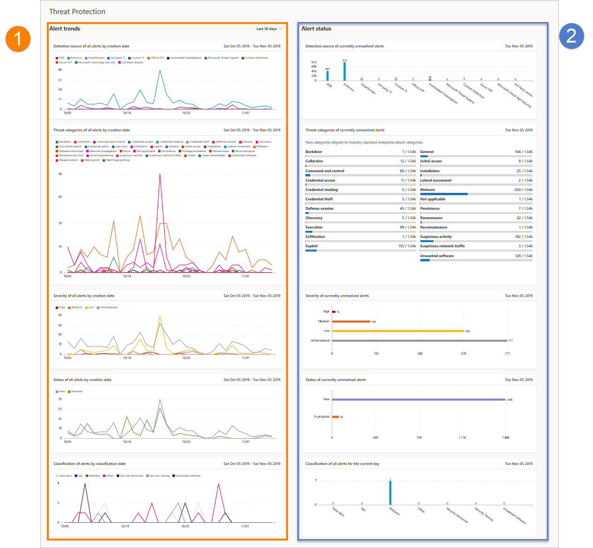

# Microsoft Defender for Endpoint 中的威脅防護報告Threat protection report in Microsoft Defender for Endpoint

[!INCLUDE [Microsoft 365 Defender rebranding](../../includes/microsoft-defender.md)]

**適用於：****Applies to:**
- [適用於端點的 Microsoft DefenderMicrosoft Defender for Endpoint](https://go.microsoft.com/fwlink/p/?linkid=2154037)
- [Microsoft 365 DefenderMicrosoft 365 Defender](https://go.microsoft.com/fwlink/?linkid=2118804)

> 想要體驗 Defender for Endpoint？Want to experience Defender for Endpoint? [註冊免費試用版。Sign up for a free trial.](https://www.microsoft.com/microsoft-365/windows/microsoft-defender-atp?ocid=docs-wdatp-pullalerts-abovefoldlink) 

「威脅防護」報告提供組織中所產生之提醒的高層級資訊。The threat protection report provides high-level information about alerts generated in your organization. 此報告包含趨勢資訊，顯示偵測來源、類別、嚴重性、狀態、分類，以及每次的通知決定。The report includes trending information showing the detection sources, categories, severities, statuses, classifications, and determinations of alerts across time.

儀表板分為兩個區段：The dashboard is structured into two sections:

區段Section | 說明Description 
:---|:---
11 | 警示趨勢Alerts trends
第2 | 警示摘要Alert summary

## 警示趨勢Alert trends
根據預設，警示趨勢會顯示30天期間的警示資訊，最後一整天結束。By default, the alert trends display alert information from the 30-day period ending in the latest full day. 若要深入瞭解組織中發生的趨勢，您可以調整顯示的時段，以微調報告期間。To gain better perspective on trends occurring in your organization, you can fine-tune the reporting period by adjusting the time period shown. 若要調整時段，請從下拉式選項中選取時間範圍：To adjust the time period, select a time range from the drop-down options:

- 30 天30 days
- 3 個月3 months
- 6 個月6 months
- 自訂Custom

>[!NOTE]
>這些篩選器只適用于警示趨勢區段。These filters are only applied on the alert trends section. 它不會影響「警示摘要」區段。It doesn't affect the alert summary section.

## 警示摘要Alert summary
當警示趨勢顯示趨勢警示資訊時，警示摘要會顯示目前日期範圍內的警示資訊。While the alert trends shows trending alert information, the alert summary shows alert information scoped to the current day.

 警示摘要可讓您向下流覽至已套用對應篩選的特定警示佇列。The alert summary allows you to drill down to a particular alert queue with the corresponding filter applied to it. 例如，按一下 [偵測對應卡] 中的 EDR 列時，會透過結果顯示警示佇列，只顯示來自 EDR 偵測產生的警示。For example, clicking on the EDR bar in the Detection sources card will bring you the alerts queue with results showing only alerts generated from EDR detections. 

>[!NOTE]
>在 [摘要] 區段中反映的資料範圍是在目前日期之前的180天。The data reflected in the summary section is scoped to 180 days prior to the current date. 例如，如果今天的日期是2019年11月5日，則 [摘要] 區段中的資料將會反映從5月5日開始，2019到11月5日（2019）的數位。For example if today's date is November 5, 2019, the data on the summary section will reflect numbers starting from May 5, 2019 to November 5, 2019. 
> 在 [趨勢] 區段上套用的篩選不會在 [摘要] 區段上套用。The filter applied on the trends section is not applied on the summary section. 

## 警示屬性Alert attributes
報告是由顯示下列警示屬性的卡片所組成：The report is made up of cards that display the following alert attributes:

- **偵測來源**：顯示感應器及偵測技術的相關資訊，這些技術可提供 Microsoft Defender for Endpoint 以觸發提醒的資料。**Detection sources**: shows information about the sensors and detection technologies that provide the data used by Microsoft Defender for Endpoint to trigger alerts.

- **威脅類別**：顯示觸發警示的威脅或攻擊活動類型，指出安全性作業的可能焦點區域。**Threat categories**: shows the types of threat or attack activity that triggered alerts, indicating possible focus areas for your security operations.

- **嚴重性**：顯示警示的嚴重性層級，指出組織威脅的整體潛在影響，以及解決這些威脅的回應層級。**Severity**: shows the severity level of alerts, indicating the collective potential impact of threats to your organization and the level of response needed to address them.

- **狀態**：顯示警示的解決狀態，指出手動警示回應的效率，以及自動修正 (啟用) 。**Status**: shows the resolution status of alerts, indicating the efficiency of your manual alert responses and of automated remediation (if enabled). 

- **分類 & 判斷**：顯示如何在解決問題時進行分類警示、是否已將郵件分類為實際威脅 (true 警示) 或不正確的偵測 (false 警示) 。**Classification & determination**: shows how you have classified alerts upon resolution, whether you have classified them as actual threats (true alerts) or as incorrect detections (false alerts). 這些卡片也會顯示已解決的警示，可提供更多深入資訊，如找到的實際威脅類型或偵測到的合法活動。These cards also show the determination of resolved alerts, providing additional insight like the types of actual threats found or the legitimate activities that were incorrectly detected.

 

## 篩選資料Filter data

使用提供的篩選，以包含或排除具有特定屬性的警示。Use the provided filters to include or exclude alerts with certain attributes.

>[!NOTE]
>這些篩選器適用于報告中的 **所有** 卡片。These filters apply to **all** the cards in the report.

例如，若要顯示僅限高嚴重性警示的資料：For example, to show data about high-severity alerts only:

1. 在 [**篩選 > 嚴重性**] 底下，選取 [**高**]Under **Filters > Severity**, select **High**
2. 確定已取消選取 [ **嚴重性** ] 底下的其他所有選項。Ensure that all other options under **Severity** are deselected.
3. 選取 **套用**。Select **Apply**. 

## 相關主題Related topic
- [裝置健康情況和符合性報告Device health and compliance report](machine-reports.md)
