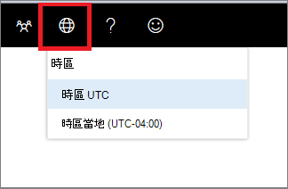

# Microsoft Defender 安全中心時區設定

[!INCLUDE [Microsoft 365 Defender rebranding](../../includes/microsoft-defender.md)]

**適用於：**
- [適用於端點的 Microsoft Defender](https://go.microsoft.com/fwlink/p/?linkid=2146631)
- [Microsoft 365 Defender](https://go.microsoft.com/fwlink/?linkid=2118804)

>想要體驗 Microsoft Defender for Endpoint？ [註冊免費試用版。](https://www.microsoft.com/microsoft-365/windows/microsoft-defender-atp?ocid=docs-wdatp-settings-abovefoldlink)

使用 **時區** 功能表時區  來設定時區及查看授權資訊。

## 時區設定
在感覺和實際 cyberattacks 的評估和分析中，時間方面很重要。

Cyberforensic 調查常常會依靠時間戳記將事件的順序組合在一起。 您的系統必須反映正確的時區設定。

Microsoft Defender for Endpoint 可顯示協調世界時 (UTC) 或本機時間。

您目前的時區設定會顯示在 [Microsoft Defender for Endpoint] 功能表中。 您可以在 [時區] 功能表中變更 **顯示時區。**

.

### UTC 時區
Microsoft Defender for Endpoint 預設會使用 UTC 時間。

將 Microsoft Defender for Endpoint 時區設定為 UTC 時，會顯示所有使用者的所有系統時間戳記 (警示、事件及其他使用者) 。 這可協助在全球各地的不同位置運作的安全性分析師，在調查事件時使用相同的時間戳記。

### 本機時區
您可以選擇讓 Microsoft Defender for Endpoint 使用本機時區設定。 所有警示和事件都會以您的本機時區來顯示。

從您的裝置的區域設定中取得本機時區。 如果您變更區域設定，Microsoft Defender for Endpoint 時區也會變更。 選擇此設定表示顯示在 Microsoft Defender for Endpoint 中的時間戳記將會對齊所有 Microsoft Defender for Endpoint 使用者的本機時間。 位於不同全域位置的分析師現在會根據其區域設定，看到 Microsoft Defender for Endpoint 警示。

若分析員位於單一位置，選擇使用當地時間會非常有用。 在此情況下，使事件與本地時間（例如，當本機使用者按一下可疑的電子郵件連結時）可能會比較容易。

### 設定時區
Microsoft Defender for Endpoint 時區預設會設定為 UTC。
設定時區也會變更所有 Microsoft Defender for Endpoint views 的時間。
若要設定時區：

1. 按一下 [ **時區** ] 功能表的 [時區 ![ 設定 icon3] ](images/atp-time-zone.png) 。
2. 選取 [ **時區 UTC** ] 標記。
3. 選取 [ **時區 UTC** ] 或 [本機時區]，例如-7:00。

### 地區設定
若要對 Microsoft Defender for Endpoint 套用不同的日期格式，請使用 Internet Explorer (IE) 和 Microsoft Edge (Edge) 的區域設定。 如果您使用的是其他瀏覽器（如 Google Chrome），請遵循必要的步驟來變更該瀏覽器的時間和日期設定。 

**Internet Explorer (IE) 和 Microsoft Edge**

IE 和 Microsoft Edge 使用 [控制台] 的 [**時鐘、語言及地區**] 選項中所設定的 **區域** 設定。 

#### 地區格式的已知問題

**日期和時間格式** 
時間和日期格式有一些已知的問題。 如果您將區域設定設定為支援的格式以外的任何值，則入口網站可能無法正確反映您的設定。

支援下列日期和時間格式：
- 日期格式 MM/dd/yyyy
- 日期格式 dd/MM/yyyy
- 時間格式 hh： mm： ss (12 小時格式) 

目前不支援下列日期和時間格式：
- 日期格式 yyyy 月
- 日期格式 dd yy
- 日期格式 dd/MM/yy
- 日期格式 MM/dd/yy
- 日期格式（yy）。 只會顯示 yyyy。
- 時間格式 HH： mm： ss (24 小時格式) 

**數位中使用的十進位符號** 
使用的十進位符號永遠是一個點，即使已選取 [**區域** 設定] 中的 [**數位** 格式] 設定中的逗號也是一樣。 例如，15，「15.5 K」會顯示為 K。

