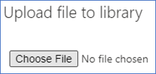

# <a name="collect-support-logs-in-microsoft-defender-for-endpoint-using-live-response"></a>使用 live 回應收集 Microsoft Defender for Endpoint 中的支援記錄 


**適用於：**
- [適用於端點的 Microsoft Defender](https://go.microsoft.com/fwlink/p/?linkid=2154037)
- [Microsoft 365 Defender](https://go.microsoft.com/fwlink/?linkid=2118804)

> 想要體驗 Defender for Endpoint？ [注册免費試用版。](https://www.microsoft.com/microsoft-365/windows/microsoft-defender-atp?ocid=docs-wdatp-pullalerts-abovefoldlink) 


當您聯繫支援時，可能會要求您提供 Microsoft Defender for Endpoint Client Analyzer 工具的輸出套件。

本主題提供如何透過即時回應來執行工具的指示。

1. 下載適當的腳本
    * 僅適用于 Endpoint 用戶端感應器記錄的 Microsoft Defender： [LiveAnalyzer.ps1 script](https://aka.ms/MDELiveAnalyzer)。
      - 結果套件大致大小： ~ 100Kb 
    *  Microsoft Defender for Endpoint 用戶端感應器和防病毒記錄： [LiveAnalyzer +MDAV.ps1 script](https://aka.ms/MDELiveAnalyzerAV)。
       - 結果套件大致大小：大約10Mb 
 
2.  在您需要調查的機器上啟動 [即時回應會話](live-response.md#initiate-a-live-response-session-on-a-device) 。

3.  選取 **[將檔案上傳至文件庫**]。

    

4. 選取 **[選擇檔**]。

    

5. 選取名為 MDELiveAnalyzer.ps1 的下載檔案，然後按一下 [**確認**]。


   


6. 仍在 LiveResponse 會話中，請使用下列命令執行 analyzer，並收集結果檔案：

    ```console
    Run MDELiveAnalyzer.ps1
    GetFile "C:\ProgramData\Microsoft\Windows Defender Advanced Threat Protection\Downloads\MDEClientAnalyzerResult.zip" -auto
    ```

    [ 圖像](images/analyzer-commands.png#lightbox)


>[!NOTE]
> - MDEClientAnalyzer 的最新預覽版本可于以下下載： [https://aka.ms/Betamdeanalyzer](https://aka.ms/Betamdeanalyzer) 。
> 
> - LiveAnalyzer 腳本會從：中下載目的地機器上的疑難排解套件 https://mdatpclientanalyzer.blob.core.windows.net 。
> 
>   如果您無法允許機器到達上述 URL，請在執行 LiveAnalyzer 腳本之前，先將 MDEClientAnalyzerPreview.zip 檔案上傳至文件庫：
>
>   ```console
>   PutFile MDEClientAnalyzerPreview.zip -overwrite
>   Run MDELiveAnalyzer.ps1
>   GetFile "C:\ProgramData\Microsoft\Windows Defender Advanced Threat Protection\Downloads\MDEClientAnalyzerResult.zip" -auto
>   ```
> 
> - 如需在機器本機上收集資料的詳細資訊，以防機器未與 Microsoft Defender for Endpoint 雲端服務通訊，或未如預期顯示在 Microsoft Defender for Endpoint portal，請參閱 [Verify client connectivity to connectivity To Microsoft defender For endpoint service URLs](configure-proxy-internet.md#verify-client-connectivity-to-microsoft-defender-for-endpoint-service-urls)。
