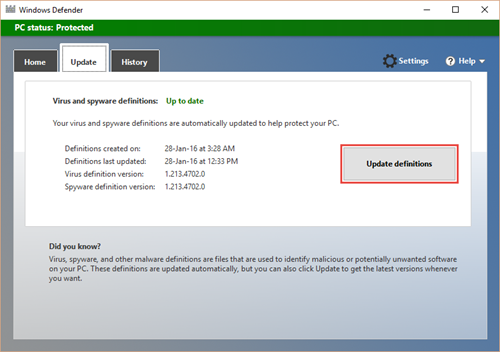

# 檢查事件記錄檔和錯誤碼，以疑難排解 Microsoft Defender 防病毒的問題

[!INCLUDE [Microsoft 365 Defender rebranding](../../includes/microsoft-defender.md)]

**適用於：**

- [適用於端點的 Microsoft Defender](/microsoft-365/security/defender-endpoint/)

如果您遇到 Microsoft Defender 防病毒的問題，您可以搜尋本主題中的表格，以找出相符的問題和可能的解決方案。

[資料表] 清單：

- [Microsoft Defender 防病毒事件 IDs](#windows-defender-av-ids) (這兩種都適用于 windows 10 和 windows Server 2016) 
- [Microsoft Defender 防病毒用戶端錯誤碼](#error-codes)
- [內部 Microsoft Defender 防病毒用戶端錯誤碼 (由 Microsoft 在開發和測試期間使用) ](#internal-error-codes)

> [!TIP]
> 您也可以在 [demo.wd.microsoft.com](https://demo.wd.microsoft.com?ocid=cx-wddocs-testground) 流覽 Microsoft Defender for Endpoint 示範網站，以確認下列功能正在運作：
> 
> - 雲端提供的保護
> - Fast 教學 (包括第一次看到區塊) 
> - 可能有害的應用程式封鎖

## Microsoft Defender 防病毒事件 IDs

Windows 事件記錄檔中 IDs 的 Microsoft Defender 防病毒記錄事件。

您可以直接查看事件記錄檔，或者，如果您有協力廠商的安全性資訊和事件管理 (SIEM) 工具，也可以使用 [Microsoft Defender 防病毒用戶端事件 IDs](troubleshoot-microsoft-defender-antivirus.md#windows-defender-av-ids) 從您的終結點檢查特定的事件及錯誤。

本節中的表格列出主要 Microsoft Defender 防病毒事件 IDs，並在可能的情況下，提供修正或解決錯誤的建議解決方案。 

## 若要查看 Microsoft Defender 防病毒事件

1.  開啟 **事件檢視器**。
2.  在主控台樹中，依次展開 [ **應用程式及服務記錄**]、[ **Microsoft**]、[ **Windows**] 及 [ **windows Defender**]。
3.  按兩下 [ **操作**]。
4.  在詳細資料窗格中，查看個別事件的清單，以尋找您的事件。
5.  按一下該事件，在 [ **一般** ] 和 [ **詳細資料** ] 索引標籤底下的下部窗格中查看事件的特定詳細資料。

<table> 
<tr>
<th colspan="2" >事件 ID: 1000</th>
</tr>
<tr>
<td>
符號名稱：
</td>
<td>
<b>MALWAREPROTECTION_SCAN_STARTED</b>
</td>
</tr>
<tr>
<td>
消息：
</td>
<td >
<b>已開始反惡意軟體掃描。 </b>
</td>
</tr>
<tr>
<td >
描述：
</td>
<td >
<dl>
<dt>掃描 ID: &lt;相關掃描的識別碼 &gt; 號碼。</dt> 
<dt>掃描類型： &lt; 掃描類型 &gt; ，例如：<ul>
<li>防毒</li>
<li>間諜</li>
<li>軟體</li>
</ul>
</dt>
<dt>掃描參數： &lt; 掃描參數 &gt; ，例如：<ul>
<li>完整掃描</li>
<li>快速掃描</li>
<li>客戶掃描</li>
</ul>
</dt>
<dt>掃描資源： &lt;資源 (例如已掃描的 files/directory/BHO) 。 &gt; </dt>
<dt>使用者： &lt;網域 &gt; \& lt;使用者 &gt; </dt>
</dl>
</td>
</tr>
<tr>
<th colspan="2">事件 ID: 1001</th>
</tr>
<tr><td>
符號名稱：
</td>
<td >
<b>MALWAREPROTECTION_SCAN_COMPLETED</b>
</td>
</tr>
<tr>
<td>
消息：
</td>
<td >
<b>反惡意軟體掃描完成。</b>
</td>
</tr>
<tr>
<td>
描述：
</td>
<td >
<dl>
<dt>掃描 ID: &lt;相關掃描的識別碼 &gt; 號碼。</dt> 
<dt>掃描類型： &lt; 掃描類型 &gt; ，例如：<ul>
<li>防毒</li>
<li>間諜</li>
<li>軟體</li>
</ul>
</dt>
<dt>掃描參數： &lt; 掃描參數 &gt; ，例如：<ul>
<li>完整掃描</li>
<li>快速掃描</li>
<li>客戶掃描</li>
</ul>
</dt>
<dt>使用者： &lt;網域 &gt; \& lt;使用者 &gt; </dt>
<dt>掃描時間： &lt; 掃描的持續時間。 &gt; </dt>
</dl>
</td>
</tr>
<tr>
<th colspan="2">事件 ID: 1002</th>
</tr>
<tr><td>
符號名稱：
</td>
<td >
<b>MALWAREPROTECTION_SCAN_CANCELLED </b>
</td>
</tr>
<tr>
<td>
消息：
</td>
<td >
<b>反惡意軟體掃描在完成前已停止。 </b>
</td>
</tr>
<tr>
<td>
描述：
</td>
<td >
<dl>
<dt>掃描 ID: &lt;相關掃描的識別碼 &gt; 號碼。</dt> 
<dt>掃描類型： &lt; 掃描類型 &gt; ，例如：<ul>
<li>防毒</li>
<li>間諜</li>
<li>軟體</li>
</ul>
</dt>
<dt>掃描參數： &lt; 掃描參數 &gt; ，例如：<ul>
<li>完整掃描</li>
<li>快速掃描</li>
<li>客戶掃描</li>
</ul>
</dt>
<dt>使用者： &lt;網域 &gt; &amp; lt;使用者 &gt; </dt>
<dt>掃描時間： &lt; 掃描的持續時間。 &gt; </dt>
</dl>
</td>
</tr>
<tr>
<th colspan="2">事件 ID: 1003</th>
</tr>
<tr><td>
符號名稱：
</td>
<td >
<b>MALWAREPROTECTION_SCAN_PAUSED </b>
</td>
</tr>
<tr>
<td>
消息：
</td>
<td >
<b>已暫停反惡意程式碼掃描。 </b>
</td>
</tr>
<tr>
<td>
描述：
</td>
<td >
<dl>
<dt>掃描 ID: &lt;相關掃描的識別碼 &gt; 號碼。</dt> 
<dt>掃描類型： &lt; 掃描類型 &gt; ，例如：<ul>
<li>防毒</li>
<li>間諜</li>
<li>軟體</li>
</ul>
</dt>
<dt>掃描參數： &lt; 掃描參數 &gt; ，例如：<ul>
<li>完整掃描</li>
<li>快速掃描</li>
<li>客戶掃描</li>
</ul>
</dt>
<dt>使用者： &lt; 網域 &gt; \& lt;使用者&gt;</dt>
</dl>
</td>
</tr>
<tr>
<th colspan="2">事件 ID: 1004</th>
</tr>
<tr><td>
符號名稱：
</td>
<td >
<b>MALWAREPROTECTION_SCAN_RESUMED </b>
</td>
</tr>
<tr>
<td>
消息：
</td>
<td >
<b>已繼續反惡意程式碼掃描。 </b>
</td>
</tr>
<tr>
<td>
描述：
</td>
<td >
<dl>
<dt>掃描 ID: &lt;相關掃描的識別碼 &gt; 號碼。</dt> 
<dt>掃描類型： &lt; 掃描類型 &gt; ，例如：<ul>
<li>防毒</li>
<li>間諜</li>
<li>軟體</li>
</ul>
</dt>
<dt>掃描參數： &lt; 掃描參數 &gt; ，例如：<ul>
<li>完整掃描</li>
<li>快速掃描</li>
<li>客戶掃描</li>
</ul>
</dt>
<dt>使用者： &lt; 網域 &gt; \& lt;使用者&gt;</dt>
</dl>
</td>
</tr>
<tr>
<th colspan="2">事件 ID: 1005</th>
</tr>
<tr><td>
符號名稱：
</td>
<td >
<b>MALWAREPROTECTION_SCAN_FAILED </b>
</td>
</tr>
<tr>
<td>
消息：
</td>
<td >
<b>反惡意軟體掃描失敗。 </b>
</td>
</tr>
<tr>
<td>
描述：
</td>
<td >
<dl>
<dt>掃描 ID: &lt;相關掃描的識別碼 &gt; 號碼。</dt> 
<dt>掃描類型： &lt; 掃描類型 &gt; ，例如：<ul>
<li>防毒</li>
<li>間諜</li>
<li>軟體</li>
</ul>
</dt>
<dt>掃描參數： &lt; 掃描參數 &gt; ，例如：<ul>
<li>完整掃描</li>
<li>快速掃描</li>
<li>客戶掃描</li>
</ul>
</dt>
<dt>使用者： &lt;網域 &gt; \& lt;使用者 &gt; </dt>
<dt>錯誤碼： &lt; &gt; 與威脅狀態相關聯的錯誤代碼結果代碼。標準 HRESULT 值。</dt>
<dt>錯誤描述： &lt;錯誤描述 &gt; 錯誤的描述。</dt>
</dl>
</td>
</tr>
<tr>
<td>
使用者動作：
</td>
<td >
防病毒用戶端發生錯誤，目前的掃描已停止。 掃描可能會因為用戶端問題而失敗。 此事件記錄包含掃描識別碼、掃描類型 (Microsoft Defender 防毒程式、反間諜軟體、反惡意程式碼) 、掃描參數、啟動掃描的使用者、錯誤碼，以及錯誤的描述。
若要疑難排解此事件：
<ol>
<li>再次執行掃描。</li>
<li>若失敗，請移至 [ <a href="https://go.microsoft.com/fwlink/?LinkId=215163">Microsoft 支援網站</a>]，然後在 <b>搜尋</b> 方塊中輸入錯誤號碼，以尋找錯誤碼。</li>
<li>連絡 <a href="https://go.microsoft.com/fwlink/?LinkId=215491">Microsoft 技術支援</a>。
</li>
</ol>
</td>
</tr>
<tr>
<th colspan="2">事件 ID: 1006</th>
</tr>
<tr><td>
符號名稱：
</td>
<td >
<b>MALWAREPROTECTION_MALWARE_DETECTED </b>
</td>
</tr>
<tr>
<td>
消息：
</td>
<td >
<b>反惡意軟體引擎找到惡意程式碼或其他可能不需要的軟體。 </b>
</td>
</tr>
<tr>
<td>
描述：
</td>
<td >
如需詳細資訊，請參閱下列各主題：
<dl>
<dt>名稱： &lt;威脅名稱 &gt; </dt> 
<dt>ID: &lt; 威脅識別碼 &gt; </dt> 
<dt> 嚴重性： &lt; 嚴重性 &gt; ，例如：<ul>
<li>低</li>
<li>中等</li>
<li>高</li>
<li>嚴重</li>
</ul>
</dt>
<dt>類別： &lt;類別描述 &gt; ，例如任何威脅或惡意程式碼類型。</dt>
<dt>路徑： &lt;檔路徑 &gt; </dt> 
<dt> 偵測來源： &lt; 偵測來源 &gt; ，例如：<ul>
<li>Unknown</li>
<li>本機電腦</li>
<li>網路共用</li>
<li>網際網路</li>
<li>傳入流量</li>
<li>外寄流量</li>
</ul>
</dt>
<dt>偵測類型： &lt; 偵測類型 &gt; ，例如：<ul>
<li>啟發式</li>
<li>Generic</li>
<li>混凝土</li>
<li>動態簽名</li>
</ul>
</dt>
<dt>偵測來源： &lt; 偵測來源 &gt; ，例如：<ul>
<li>使用者：使用者已啟動</li>
<li>系統：系統啟動</li>
<li>即時：啟動即時元件</li>
<li>IOAV：已啟動 IE 下載和 Outlook Express 附件</li>
<li>NIS：網路檢查系統</li>
<li>IEPROTECT： IE-IExtensionValidation;這可防止惡意的網頁控制項</li>
<li>ELAM) 上的初期啟動反惡意軟體 (。 這包括由啟動順序偵測到的惡意程式碼</li>
<li>遠端證明</li>
</ul>反惡意軟體掃描介面 (AMSI) 。 主要是用來保護 (PS、VBS) 的腳本，不過也可由協力廠商呼叫。
UAC </dt> 
<dt>狀態： &lt; 狀態 &gt; </dt>
<dt>使用者： &lt; 網域 &gt; \& lt;使用者 &gt; </dt>
<dt>進程名稱： &lt; PID &gt; 簽章版本中的處理</dt>程式版本
<dt>： &lt; 定義版本 &gt; </dt>引擎版本
<dt>： &lt; 反惡意程式碼引擎版本 &gt; </dt>
</dl>
</td>
</tr>
<tr>
<th colspan="2">事件 ID: 1007</th>
</tr>
<tr><td>
符號名稱：
</td>
<td >
<b>MALWAREPROTECTION_MALWARE_ACTION_TAKEN </b>
</td>
</tr>
<tr>
<td>
消息：
</td>
<td >
<b>反惡意軟體平臺會執行動作，以保護您的系統免受惡意軟體或其他可能不需要的軟體的攻擊。 </b>
</td>
</tr>
<tr>
<td>
描述：
</td>
<td >
Microsoft Defender 防病毒已採取動作，以保護此機器免受惡意程式碼或其他可能不需要的軟體的攻擊。 如需詳細資訊，請參閱下列各主題：
<dl>
<dt>使用者： &lt;網域 &gt; \& lt;使用者 &gt; </dt>
<dt>名稱： &lt; 威脅名稱 &gt; </dt> 
<dt>ID: &lt; 威脅識別碼 &gt; </dt> 
<dt> 嚴重性： &lt; 嚴重性 &gt; ，例如：<ul>
<li>低</li>
<li>中等</li>
<li>高</li>
<li>嚴重</li>
</ul>
</dt>
<dt>類別： &lt;類別描述 &gt; ，例如任何威脅或惡意程式碼類型。</dt> 
<dt>動作： &lt; 動作 &gt; ，例如：<ul>
<li>清理：已清除資源</li>
<li>隔離：已隔離資源</li>
<li>移除：已刪除資源</li>
<li>允許：允許執行/存在資源</li>
<li>使用者定義：使用者定義的動作，通常是從使用者已指定之動作清單中的一個專案。</li>
<li>無動作：無動作</li>
<li>封鎖：資源遭到封鎖，無法執行</li>
</ul>
</dt>
<dt>狀態： &lt;狀態 &gt; </dt>
<dt>簽名版本： &lt; 定義版本 &gt; </dt>
<dt>引擎版本： &lt; 反惡意程式碼 &gt; 引擎版本</dt>
</dl>
</td>
</tr>
<tr>
<th colspan="2">事件 ID: 1008</th>
</tr>
<tr><td>
符號名稱：
</td>
<td >
<b>MALWAREPROTECTION_MALWARE_ACTION_FAILED</b>
</td>
</tr>
<tr>
<td>
消息：
</td>
<td >
<b>反惡意程式碼平臺嘗試執行動作，以保護您的系統免受惡意軟體或其他可能不需要的軟體的攻擊，但動作失敗。</b>
</td>
</tr>
<tr>
<td>
描述：
</td>
<td >
Microsoft Defender 防毒程式在對惡意程式碼或其他可能不需要的軟體採取動作時，發生錯誤。 如需詳細資訊，請參閱下列各主題：
<dl>
<dt>使用者： &lt;網域 &gt; \& lt;使用者 &gt; </dt>
<dt>名稱： &lt; 威脅名稱 &gt; </dt> 
<dt>ID: &lt; 威脅識別碼 &gt; </dt> 
<dt> 嚴重性： &lt; 嚴重性 &gt; ，例如：<ul>
<li>低</li>
<li>中等</li>
<li>高</li>
<li>嚴重</li>
</ul>
</dt>
<dt>類別： &lt;類別描述 &gt; ，例如任何威脅或惡意程式碼類型。</dt>
<dt>路徑： &lt;檔路徑 &gt; </dt> 
<dt> 動作： &lt; 動作 &gt; ，例如：<ul>
<li>清理：已清除資源</li>
<li>隔離：已隔離資源</li>
<li>移除：已刪除資源</li>
<li>允許：允許執行/存在資源</li>
<li>使用者定義：使用者定義的動作，通常是從使用者已指定之動作清單中的一個專案。</li>
<li>無動作：無動作</li>
<li>封鎖：資源遭到封鎖，無法執行</li>
</ul>
</dt>
<dt>錯誤碼： &lt;&gt;與威脅狀態相關聯的錯誤代碼結果代碼。標準 HRESULT 值。</dt>
<dt>錯誤描述：錯誤 &lt; 描述 &gt; 錯誤的描述。</dt>
<dt>狀態： &lt;狀態 &gt; </dt>
<dt>簽名版本： &lt; 定義版本 &gt; </dt>
<dt>引擎版本： &lt; 反惡意程式碼 &gt; 引擎版本</dt>
</dl>
</td>
</tr>
<tr>
<th colspan="2">事件 ID: 1009</th>
</tr>
<tr><td>
符號名稱：
</td>
<td >
<b>MALWAREPROTECTION_QUARANTINE_RESTORE </b>
</td>
</tr>
<tr>
<td>
消息：
</td>
<td >
<b>反惡意軟體平臺已從隔離區還原專案。 </b>
</td>
</tr>
<tr>
<td>
描述：
</td>
<td >
Microsoft Defender 防病毒已從隔離區還原專案。 如需詳細資訊，請參閱下列各主題：
<dl>
<dt>名稱： &lt;威脅名稱 &gt; </dt> 
<dt>ID: &lt; 威脅識別碼 &gt; </dt> 
<dt> 嚴重性： &lt; 嚴重性 &gt; ，例如：<ul>
<li>低</li>
<li>中等</li>
<li>高</li>
<li>嚴重</li>
</ul>
</dt>
<dt>類別： &lt;類別描述 &gt; ，例如任何威脅或惡意程式碼類型。</dt>
<dt>路徑： &lt;檔路徑 &gt; </dt>
<dt>使用者： &lt; 網域 &gt; \& lt;使用者 &gt; </dt>
<dt>簽名版本： &lt; 定義版本 &gt; </dt>
<dt>引擎版本： &lt; 反惡意程式碼 &gt; 引擎版本</dt>
</dl>
</td>
</tr>
<tr>
<th colspan="2">事件 ID: 1010</th>
</tr>
<tr><td>
符號名稱：
</td>
<td >
<b>MALWAREPROTECTION_QUARANTINE_RESTORE_FAILED </b>
</td>
</tr>
<tr>
<td>
消息：
</td>
<td >
<b>反惡意軟體平臺無法從隔離區還原專案。 </b>
</td>
</tr>
<tr>
<td>
描述：
</td>
<td >
Microsoft Defender 防毒軟體嘗試從隔離區還原專案時發生錯誤。 如需詳細資訊，請參閱下列各主題：
<dl>
<dt>名稱： &lt;威脅名稱 &gt; </dt> 
<dt>ID: &lt; 威脅識別碼 &gt; </dt> 
<dt> 嚴重性： &lt; 嚴重性 &gt; ，例如：<ul>
<li>低</li>
<li>中等</li>
<li>高</li>
<li>嚴重</li>
</ul>
</dt>
<dt>類別： &lt;類別描述 &gt; ，例如任何威脅或惡意程式碼類型。</dt>
<dt>路徑： &lt;檔路徑 &gt; </dt>
<dt>使用者： &lt; 網域 &gt; \& lt;使用者 &gt; </dt>
<dt>錯誤碼： &lt; &gt; 與威脅狀態相關聯的錯誤代碼結果代碼。標準 HRESULT 值。</dt>
<dt>錯誤描述：錯誤 &lt; 描述 &gt; 錯誤的描述。</dt>簽章
<dt>版本： &lt;定義版本 &gt; </dt>
<dt>引擎版本： &lt; 反惡意引擎 &gt; 版本</dt>
</dl>
</td>
</tr>
<tr>
<th colspan="2">事件 ID: 1011</th>
</tr>
<tr><td>
符號名稱：
</td>
<td >
<b>MALWAREPROTECTION_QUARANTINE_DELETE</b>
</td>
</tr>
<tr>
<td>
消息：
</td>
<td >
<b>反惡意軟體平臺已從隔離區中刪除專案。 </b>
</td>
</tr>
<tr>
<td>
描述：
</td>
<td >
Microsoft Defender 防病毒已從隔離區中刪除專案。 如需詳細資訊，請參閱下列各主題：
<dl>
<dt>名稱： &lt;威脅名稱 &gt; </dt> 
<dt>ID: &lt; 威脅識別碼 &gt; </dt> 
<dt> 嚴重性： &lt; 嚴重性 &gt; ，例如：<ul>
<li>低</li>
<li>中等</li>
<li>高</li>
<li>嚴重</li>
</ul>
</dt>
<dt>類別： &lt;類別描述 &gt; ，例如任何威脅或惡意程式碼類型。</dt>
<dt>路徑： &lt;檔路徑 &gt; </dt>
<dt>使用者： &lt; 網域 &gt; \& lt;使用者 &gt; </dt>
<dt>簽名版本： &lt; 定義版本 &gt; </dt>
<dt>引擎版本： &lt; 反惡意程式碼 &gt; 引擎版本</dt>
</dl>
</td>
</tr>
<tr>
<th colspan="2">事件 ID: 1012</th>
</tr>
<tr><td>
符號名稱：
</td>
<td >
<b>MALWAREPROTECTION_QUARANTINE_DELETE_FAILED </b>
</td>
</tr>
<tr>
<td>
消息：
</td>
<td >
<b>反惡意軟體平臺無法從隔離區刪除專案。</b>
</td>
</tr>
<tr>
<td>
描述：
</td>
<td >
Microsoft Defender 防毒軟體嘗試從隔離區刪除專案時發生錯誤。
如需詳細資訊，請參閱下列各主題：
<dl>
<dt>名稱： &lt;威脅名稱 &gt; </dt> 
<dt>ID: &lt; 威脅識別碼 &gt; </dt> 
<dt> 嚴重性： &lt; 嚴重性 &gt; ，例如：<ul>
<li>低</li>
<li>中等</li>
<li>高</li>
<li>嚴重</li>
</ul>
</dt>
<dt>類別： &lt;類別描述 &gt; ，例如任何威脅或惡意程式碼類型。</dt>
<dt>路徑： &lt;檔路徑 &gt; </dt>
<dt>使用者： &lt; 網域 &gt; \& lt;使用者 &gt; </dt>
<dt>錯誤碼： &lt; &gt; 與威脅狀態相關聯的錯誤代碼結果代碼。標準 HRESULT 值。</dt>
<dt>錯誤描述：錯誤 &lt; 描述 &gt; 錯誤的描述。</dt>簽章
<dt>版本： &lt;定義版本 &gt; </dt>
<dt>引擎版本： &lt; 反惡意引擎 &gt; 版本</dt>
</dl>
</td>
</tr>
<tr>
<th colspan="2">事件 ID: 1013</th>
</tr>
<tr><td>
符號名稱：
</td>
<td >
<b>MALWAREPROTECTION_MALWARE_HISTORY_DELETE </b>
</td>
</tr>
<tr>
<td>
消息：
</td>
<td >
<b>惡意程式碼平臺已刪除惡意程式碼和其他可能不需要的軟體的歷程記錄。</b>
</td>
</tr>
<tr>
<td>
描述：
</td>
<td >
Microsoft Defender 防病毒已移除惡意程式碼和其他可能不需要的軟體的歷程記錄。
<dl>
<dt>時間：事件發生的時間，例如清除的史。此參數不會用於威脅事件，所以不會混淆是否為修正時間或感染時間。在這些情況下，我們特別是以動作時間或偵測時間的方式呼叫它們。</dt>
<dt>使用者： &lt;網域 &gt; \& lt;使用者 &gt; </dt>
</dl>
</td>
</tr>
<tr>
<th colspan="2">事件 ID: 1014</th>
</tr>
<tr><td>
符號名稱：
</td>
<td >
<b>MALWAREPROTECTION_MALWARE_HISTORY_DELETE_FAILED </b>
</td>
</tr>
<tr>
<td>
消息：
</td>
<td >
反惡意軟體平臺無法刪除惡意程式碼和其他可能不需要的軟體的歷程記錄。
</td>
</tr>
<tr>
<td>
描述：
</td>
<td >
Microsoft Defender 防毒程式嘗試移除惡意程式碼與其他可能不需要的軟體的記錄時，發生錯誤。
<dl>
<dt>時間：事件發生的時間，例如清除的史。此參數不會用於威脅事件，所以不會混淆是否為修正時間或感染時間。在這些情況下，我們特別是以動作時間或偵測時間的方式呼叫它們。</dt>
<dt>使用者： &lt;網域 &gt; \& lt;使用者 &gt; </dt>
<dt>錯誤碼： &lt; &gt; 與威脅狀態相關聯的錯誤代碼結果代碼。標準 HRESULT 值。</dt>
<dt>錯誤描述：錯誤 &lt; 描述 &gt; 錯誤的描述。</dt>
</dl>
</td>
</tr>
<tr>
<th colspan="2">事件 ID: 1015</th>
</tr>
<tr><td>
符號名稱：
</td>
<td >
<b>MALWAREPROTECTION_BEHAVIOR_DETECTED </b>
</td>
</tr>
<tr>
<td>
消息：
</td>
<td >
<b>反惡意軟體平臺偵測到可疑行為。</b>
</td>
</tr>
<tr>
<td>
描述：
</td>
<td >
Microsoft Defender 防病毒已偵測到可疑行為。 如需詳細資訊，請參閱下列各主題：
<dl>
<dt>名稱： &lt;威脅名稱 &gt; </dt> 
<dt>ID: &lt; 威脅識別碼 &gt; </dt> 
<dt> 嚴重性： &lt; 嚴重性 &gt; ，例如：<ul>
<li>低</li>
<li>中等</li>
<li>高</li>
<li>嚴重</li>
</ul>
</dt>
<dt>類別： &lt;類別描述 &gt; ，例如任何威脅或惡意程式碼類型。</dt>
<dt>路徑： &lt;檔路徑 &gt; </dt> 
<dt> 偵測來源： &lt; 偵測來源 &gt; ，例如：
<ul>
<li>Unknown</li>
<li>本機電腦</li>
<li>網路共用</li>
<li>網際網路</li>
<li>傳入流量</li>
<li>外寄流量</li>
</ul>
</dt>
<dt>偵測類型： &lt; 偵測類型 &gt; ，例如：<ul>
<li>啟發式</li>
<li>Generic</li>
<li>混凝土</li>
<li>動態簽名</li>
</ul>
</dt>
<dt>偵測來源： &lt; 偵測來源 &gt; ，例如：<ul>
<li>使用者：使用者已啟動</li>
<li>系統：系統啟動</li>
<li>即時：啟動即時元件</li>
<li>IOAV：已啟動 IE 下載和 Outlook Express 附件</li>
<li>NIS：網路檢查系統</li>
<li>IEPROTECT： IE-IExtensionValidation;這可防止惡意的網頁控制項</li>
<li>ELAM) 上的初期啟動反惡意軟體 (。 這包括由啟動順序偵測到的惡意程式碼</li>
<li>遠端證明</li>
</ul>反惡意軟體掃描介面 (AMSI) 。 主要是用來保護 (PS、VBS) 的腳本，不過也可由協力廠商呼叫。
UAC </dt> 
<dt>狀態： &lt; 狀態 &gt; </dt>
<dt>使用者： &lt; 網域 &gt; \& lt;使用者 &gt; </dt>
<dt>進程名稱： &lt; PID &gt; 簽章中的處理</dt>程式
<dt>ID: 列舉比對嚴重性。</dt>簽章
<dt>版本： &lt;定義版本 &gt; </dt>
<dt>引擎版本： &lt; 反惡意程式碼 &gt; 引擎版本</dt>
<dt>逼真度標籤：</dt>
<dt>目的檔案名：檔案名 &lt; 的檔案名 &gt; 。</dt>
</dl>
</td>
</tr>
<tr>
<th colspan="2">事件 ID: 1116</th>
</tr>
<tr><td>
符號名稱：
</td>
<td >
<b>MALWAREPROTECTION_STATE_MALWARE_DETECTED</b>
</td>
</tr>
<tr>
<td>
消息：
</td>
<td >
<b>反惡意軟體平臺偵測到惡意程式碼或其他可能不需要的軟體。 </b>
</td>
</tr>
<tr>
<td>
描述：
</td>
<td >
Microsoft Defender 防毒程式偵測到惡意程式碼或其他可能不需要的軟體。 如需詳細資訊，請參閱下列各主題：
<dl>
<dt>名稱： &lt;威脅名稱 &gt; </dt> 
<dt>ID: &lt; 威脅識別碼 &gt; </dt> 
<dt> 嚴重性： &lt; 嚴重性 &gt; ，例如：<ul>
<li>低</li>
<li>中等</li>
<li>高</li>
<li>嚴重</li>
</ul>
</dt>
<dt>類別： &lt;類別描述 &gt; ，例如任何威脅或惡意程式碼類型。</dt>
<dt>路徑： &lt;檔路徑 &gt; </dt> 
<dt> 偵測來源： &lt; 偵測來源 &gt; ，例如：
<ul>
<li>Unknown</li>
<li>本機電腦</li>
<li>網路共用</li>
<li>網際網路</li>
<li>傳入流量</li>
<li>外寄流量</li>
</ul>
</dt>
<dt>偵測類型： &lt; 偵測類型 &gt; ，例如：<ul>
<li>啟發式</li>
<li>Generic</li>
<li>混凝土</li>
<li>動態簽名</li>
</ul>
</dt>
<dt>偵測來源： &lt; 偵測來源 &gt; ，例如：<ul>
<li>使用者：使用者已啟動</li>
<li>系統：系統啟動</li>
<li>即時：啟動即時元件</li>
<li>IOAV：已啟動 IE 下載和 Outlook Express 附件</li>
<li>NIS：網路檢查系統</li>
<li>IEPROTECT： IE-IExtensionValidation;這可防止惡意的網頁控制項</li>
<li>ELAM) 上的初期啟動反惡意軟體 (。 這包括由啟動順序偵測到的惡意程式碼</li>
<li>遠端證明</li>
</ul>反惡意軟體掃描介面 (AMSI) 。 主要是用來保護 (PS、VBS) 的腳本，不過也可由協力廠商呼叫。
UAC </dt> 
<dt>使用者： &lt; 網域 &gt; \& lt;使用者 &gt; </dt>
<dt>進程名稱： &lt; PID &gt; 簽章版本中的處理</dt>程式版本
<dt>： &lt; 定義版本 &gt; </dt>引擎版本
<dt>： &lt; 反惡意程式碼引擎版本 &gt; </dt>
</dl>
</td>
</tr>
<tr>
<td>
使用者動作：
</td>
<td >
不用執行任何動作。 Microsoft Defender 防毒程式可能會暫停，並對此威脅採取例行動作。 如果您想要手動移除威脅，請在 Microsoft Defender 防病毒介面中，按一下 [ <b>清理電腦</b>]。
</td>
</tr>
<tr>
<th colspan="2">事件 ID: 1117</th>
</tr>
<tr><td>
符號名稱：
</td>
<td >
<b>MALWAREPROTECTION_STATE_MALWARE_ACTION_TAKEN </b>
</td>
</tr>
<tr>
<td>
消息：
</td>
<td >
<b>反惡意軟體平臺會執行動作，以保護您的系統免受惡意軟體或其他可能不需要的軟體的攻擊。 </b>
</td>
</tr>
<tr>
<td>
描述：
</td>
<td >
Microsoft Defender 防病毒已採取動作，以保護此機器免受惡意程式碼或其他可能不需要的軟體的攻擊。 如需詳細資訊，請參閱下列各主題：
<dl>
<dt>名稱： &lt;威脅名稱 &gt; </dt> 
<dt>ID: &lt; 威脅識別碼 &gt; </dt> 
<dt> 嚴重性： &lt; 嚴重性 &gt; ，例如：<ul>
<li>低</li>
<li>中等</li>
<li>高</li>
<li>嚴重</li>
</ul>
</dt>
<dt>類別： &lt;類別描述 &gt; ，例如任何威脅或惡意程式碼類型。</dt>
<dt>路徑： &lt;檔路徑 &gt; </dt> 
<dt> 偵測來源： &lt; 偵測來源 &gt; ，例如：
<ul>
<li>Unknown</li>
<li>本機電腦</li>
<li>網路共用</li>
<li>網際網路</li>
<li>傳入流量</li>
<li>外寄流量</li>
</ul>
</dt>
<dt>偵測類型： &lt; 偵測類型 &gt; ，例如：<ul>
<li>啟發式</li>
<li>Generic</li>
<li>混凝土</li>
<li>動態簽名</li>
</ul>
</dt>
<dt>偵測來源： &lt; 偵測來源 &gt; ，例如：<ul>
<li>使用者：使用者已啟動</li>
<li>系統：系統啟動</li>
<li>即時：啟動即時元件</li>
<li>IOAV：已啟動 IE 下載和 Outlook Express 附件</li>
<li>NIS：網路檢查系統</li>
<li>IEPROTECT： IE-IExtensionValidation;這可防止惡意的網頁控制項</li>
<li>ELAM) 上的初期啟動反惡意軟體 (。 這包括由啟動順序偵測到的惡意程式碼</li>
<li>遠端證明</li>
</ul>反惡意軟體掃描介面 (AMSI) 。 主要是用來保護 (PS、VBS) 的腳本，不過也可由協力廠商呼叫。
UAC </dt> 
<dt>使用者： &lt; 網域 &gt; \& lt;使用者 &gt; </dt>
<dt>進程名稱： &lt; PID &gt; 動作中的處理</dt> 
<dt> &lt; 程式：動作 &gt; ，例如：<ul>
<li>清理：已清除資源</li>
<li>隔離：已隔離資源</li>
<li>移除：已刪除資源</li>
<li>允許：允許執行/存在資源</li>
<li>使用者定義：使用者定義的動作，通常是從使用者已指定之動作清單中的一個專案。</li>
<li>無動作：無動作</li>
<li>封鎖：資源遭到封鎖，無法執行</li>
</ul>
</dt>
<dt>動作狀態： &lt;其他動作 &gt; 的描述</dt>
<dt>錯誤碼： &lt; &gt; 與威脅狀態相關聯的錯誤碼的錯誤代碼結果代碼。標準 HRESULT 值。</dt>
<dt>錯誤描述： &lt;錯誤描述 &gt; 錯誤的描述。</dt>簽章
<dt>版本： &lt;定義版本 &gt; </dt>
<dt>引擎版本： &lt; 反惡意引擎 &gt; 版本</dt>請注意：每當 microsoft Defender 防毒程式、microsoft Security Essentials、惡意軟體移除工具或 System Center Endpoint Protection 偵測到惡意程式碼時，會還原下列系統設定和服務，惡意程式碼可能已變更：<ul>
<li>預設 Internet Explorer 或 Microsoft Edge 設定</li>
<li>使用者存取控制設定</li>
<li>Chrome 設定</li>
<li>引導控制資料</li>
<li>Regedit 和工作管理員登錄設定</li>
<li>Windows 更新、背景智慧傳送服務和遠端過程呼叫服務</li>
<li>Windows 作業系統檔</li></ul>
上述內容適用于下列用戶端和伺服器版本：
<table>
<tr>
<th>作業系統</th>
<th>作業系統版本</th>
</tr>
<tr>
<td>
用戶端作業系統
</td>
<td>
Windows Vista (Service Pack 1 或 Service Pack 2) ，Windows 7 和更新版本
</td>
</tr>
<tr>
<td>
伺服器作業系統
</td>
<td>
Windows Server 2008、Windows Server 2008 R2、Windows Server 2012 及 Windows Server 2016
</td>
</tr>
</table>
</dl>
</td>
</tr>
<tr>
<td>
使用者動作：
</td>
<td >
不需要任何動作。 Microsoft Defender 防病毒已移除或隔離威脅。 
</td>
</tr>
<tr>
<th colspan="2">事件 ID: 1118</th>
</tr>
<tr><td>
符號名稱：
</td>
<td >
<b>MALWAREPROTECTION_STATE_MALWARE_ACTION_FAILED</b>
</td>
</tr>
<tr>
<td>
消息：
</td>
<td >
<b>反惡意程式碼平臺嘗試執行動作，以保護您的系統免受惡意軟體或其他可能不需要的軟體的攻擊，但動作失敗。 </b>
</td>
</tr>
<tr>
<td>
描述：
</td>
<td >
當對惡意程式碼或其他可能不需要的軟體採取動作時，Microsoft Defender 防毒軟體會遇到非嚴重的錯誤。 如需詳細資訊，請參閱下列各主題：
<dl>
<dt>名稱： &lt;威脅名稱 &gt; </dt> 
<dt>ID: &lt; 威脅識別碼 &gt; </dt> 
<dt> 嚴重性： &lt; 嚴重性 &gt; ，例如：<ul>
<li>低</li>
<li>中等</li>
<li>高</li>
<li>嚴重</li>
</ul>
</dt>
<dt>類別： &lt;類別描述 &gt; ，例如任何威脅或惡意程式碼類型。</dt>
<dt>路徑： &lt;檔路徑 &gt; </dt> 
<dt> 偵測來源： &lt; 偵測來源 &gt; ，例如：
<ul>
<li>Unknown</li>
<li>本機電腦</li>
<li>網路共用</li>
<li>網際網路</li>
<li>傳入流量</li>
<li>外寄流量</li>
</ul>
</dt>
<dt>偵測類型： &lt; 偵測類型 &gt; ，例如：<ul>
<li>啟發式</li>
<li>Generic</li>
<li>混凝土</li>
<li>動態簽名</li>
</ul>
</dt>
<dt>偵測來源： &lt; 偵測來源 &gt; ，例如：<ul>
<li>使用者：使用者已啟動</li>
<li>系統：系統啟動</li>
<li>即時：啟動即時元件</li>
<li>IOAV：已啟動 IE 下載和 Outlook Express 附件</li>
<li>NIS：網路檢查系統</li>
<li>IEPROTECT： IE-IExtensionValidation;這可防止惡意的網頁控制項</li>
<li>ELAM) 上的初期啟動反惡意軟體 (。 這包括由啟動順序偵測到的惡意程式碼</li>
<li>遠端證明</li>
</ul>反惡意軟體掃描介面 (AMSI) 。 主要是用來保護 (PS、VBS) 的腳本，不過也可由協力廠商呼叫。
UAC </dt> 
<dt>使用者： &lt; 網域 &gt; \& lt;使用者 &gt; </dt>
<dt>進程名稱： &lt; PID &gt; 動作中的處理</dt> 
<dt> &lt; 程式：動作 &gt; ，例如：<ul>
<li>清理：已清除資源</li>
<li>隔離：已隔離資源</li>
<li>移除：已刪除資源</li>
<li>允許：允許執行/存在資源</li>
<li>使用者定義：使用者定義的動作，通常是從使用者已指定之動作清單中的一個專案。</li>
<li>無動作：無動作</li>
<li>封鎖：資源遭到封鎖，無法執行</li>
</ul>
</dt>
<dt>動作狀態： &lt;其他動作 &gt; 的描述</dt>
<dt>錯誤碼： &lt; &gt; 與威脅狀態相關聯的錯誤碼的錯誤代碼結果代碼。標準 HRESULT 值。</dt>
<dt>錯誤描述： &lt;錯誤描述 &gt; 錯誤的描述。</dt>簽章
<dt>版本： &lt;定義版本 &gt; </dt>
<dt>引擎版本： &lt; 反惡意引擎 &gt; 版本</dt>
</dl>
</td>
</tr>
<tr>
<td>
使用者動作：
</td>
<td >
不需要任何動作。 Microsoft Defender 防毒程式無法完成與惡意程式碼修復相關的工作。 這不是嚴重失敗。
</td>
</tr>
<tr>
<th colspan="2">事件 ID: 1119</th>
</tr>
<tr><td>
符號名稱：
</td>
<td >
<b>MALWAREPROTECTION_STATE_MALWARE_ACTION_CRITICALLY_FAILED </b>
</td>
</tr>
<tr>
<td>
消息：
</td>
<td >
<b>反惡意程式碼平臺嘗試對惡意程式碼或其他可能不需要的軟體採取動作時，發生嚴重錯誤。事件訊息中有更多的詳細資料。</b>
</td>
</tr>
<tr>
<td>
描述：
</td>
<td >
Microsoft Defender 防毒程式在對惡意程式碼或其他可能不需要的軟體採取動作時，發生嚴重錯誤。 如需詳細資訊，請參閱下列各主題：
<dl>
<dt>名稱： &lt;威脅名稱 &gt; </dt> 
<dt>ID: &lt; 威脅識別碼 &gt; </dt> 
<dt> 嚴重性： &lt; 嚴重性 &gt; ，例如：<ul>
<li>低</li>
<li>中等</li>
<li>高</li>
<li>嚴重</li>
</ul>
</dt>
<dt>類別： &lt;類別描述 &gt; ，例如任何威脅或惡意程式碼類型。</dt>
<dt>路徑： &lt;檔路徑 &gt; </dt> 
<dt> 偵測來源： &lt; 偵測來源 &gt; ，例如：
<ul>
<li>Unknown</li>
<li>本機電腦</li>
<li>網路共用</li>
<li>網際網路</li>
<li>傳入流量</li>
<li>外寄流量</li>
</ul>
</dt>
<dt>偵測類型： &lt; 偵測類型 &gt; ，例如：<ul>
<li>啟發式</li>
<li>Generic</li>
<li>混凝土</li>
<li>動態簽名</li>
</ul>
</dt>
<dt>偵測來源： &lt; 偵測來源 &gt; ，例如：<ul>
<li>使用者：使用者已啟動</li>
<li>系統：系統啟動</li>
<li>即時：啟動即時元件</li>
<li>IOAV：已啟動 IE 下載和 Outlook Express 附件</li>
<li>NIS：網路檢查系統</li>
<li>IEPROTECT： IE-IExtensionValidation;這可防止惡意的網頁控制項</li>
<li>ELAM) 上的初期啟動反惡意軟體 (。 這包括由啟動順序偵測到的惡意程式碼</li>
<li>遠端證明</li>
</ul>反惡意軟體掃描介面 (AMSI) 。 主要是用來保護 (PS、VBS) 的腳本，不過也可由協力廠商呼叫。
UAC </dt> 
<dt>使用者： &lt; 網域 &gt; \& lt;使用者 &gt; </dt>
<dt>進程名稱： &lt; PID &gt; 動作中的處理</dt> 
<dt> &lt; 程式：動作 &gt; ，例如：<ul>
<li>清理：已清除資源</li>
<li>隔離：已隔離資源</li>
<li>移除：已刪除資源</li>
<li>允許：允許執行/存在資源</li>
<li>使用者定義：使用者定義的動作，通常是從使用者已指定之動作清單中的一個專案。</li>
<li>無動作：無動作</li>
<li>封鎖：資源遭到封鎖，無法執行</li>
</ul>
</dt>
<dt>動作狀態： &lt;其他動作 &gt; 的描述</dt>
<dt>錯誤碼： &lt; &gt; 與威脅狀態相關聯的錯誤碼的錯誤代碼結果代碼。標準 HRESULT 值。</dt>
<dt>錯誤描述： &lt;錯誤描述 &gt; 錯誤的描述。</dt>簽章
<dt>版本： &lt;定義版本 &gt; </dt>
<dt>引擎版本： &lt; 反惡意引擎 &gt; 版本</dt>
</dl>
</td>
</tr>
<tr>
<td>
使用者動作：
</td>
<td >
Microsoft Defender 防病毒用戶端因嚴重問題而遇到此錯誤。 端點可能不受保護。 請複查錯誤描述，然後依照下列相關的 <b>使用者動作</b> 步驟進行。
<table>
<tr>
<th>動作</th>
<th>使用者動作</th>
</tr>
<tr>
<td>
<b>刪除</b>
</td>
<td>
更新定義，然後驗證是否已成功移除。
</td>
</tr>
<tr>
<td>
<b>清潔</b>
</td>
<td>
更新定義，然後確認修復成功。
</td>
</tr>
<tr>
<td>
<b>檢疫</b>
</td>
<td>
更新定義，並確認使用者具有存取必要資源的許可權。
</td>
</tr>
<tr>
<td>
<b>允許</b>
</td>
<td>
確認使用者具有存取必要資源的許可權。
</td>
</tr>
</table>

如果此事件仍然存在：<ol>
<li>再次執行掃描。</li>
<li>若失敗，請移至 [ <a href="https://go.microsoft.com/fwlink/?LinkId=215163">Microsoft 支援網站</a>]，然後在 <b>搜尋</b> 方塊中輸入錯誤號碼，以尋找錯誤碼。</li>
<li>連絡 <a href="https://go.microsoft.com/fwlink/?LinkId=215491">Microsoft 技術支援</a>。
</li>
</ol>
</td>
</tr>
<tr>
<th colspan="2">事件 ID: 1120</th>
</tr>
<tr><td>
符號名稱：
</td>
<td >
<b>MALWAREPROTECTION_THREAT_HASH</b>
</td>
</tr>
<tr>
<td>
消息：
</td>
<td >
<b>Microsoft Defender 防病毒已推匯出威脅資源的雜湊。</b>
</td>
</tr>
<tr>
<td>
描述：
</td>
<td >
Microsoft Defender 防病毒用戶端已啟動並以健全的狀態運作。
<dl>
<dt>目前平臺版本： &lt;目前平臺版本 &gt; </dt>
<dt>威脅資源路徑： &lt; 路徑 &gt; </dt>
<dt>雜湊 &lt; ： &gt; 雜湊</dt>
</dl>
</td>
</tr>
<tr>
<td></td>
<td >

<b>注意：只有在設定下列原則時，才會記錄此事件： <b>ThreatFileHashLogging 未簽署</b>。

 

</td>
</tr>
<tr>
<th colspan="2">事件 ID: 1150</th>
</tr>
<tr><td>
符號名稱：
</td>
<td >
<b>MALWAREPROTECTION_SERVICE_HEALTHY</b>
</td>
</tr>
<tr>
<td>
消息：
</td>
<td >
<b>如果您的反惡意程式碼平臺報告狀態為監控平臺，此事件表示反惡意軟體平臺正在執行中且狀態良好。 </b>
</td>
</tr>
<tr>
<td>
描述：
</td>
<td >
Microsoft Defender 防病毒用戶端已啟動並以健全的狀態運作。
<dl>
<dt>平臺版本： &lt;目前平臺版本 &gt; </dt>
<dt>簽名版本： &lt; 定義版本 &gt; </dt>
<dt>引擎版本： &lt; 反惡意程式碼 &gt; 引擎版本</dt>
</dl>
</td>
</tr>
<tr>
<td>
使用者動作：
</td>
<td >
不需要任何動作。 Microsoft Defender 防病毒用戶端的狀態良好。 此事件每小時報告一次。
</td>
</tr>

<tr>
<th colspan="2">事件 ID: 1151</th>
</tr>
<tr><td>
符號名稱：
</td>
<td >
<b>MALWAREPROTECTION_SERVICE_HEALTH_REPORT</b>
</td>
</tr>
<tr>
<td>
消息：
</td>
<td >
<b>Endpoint Protection 用戶端狀況報告 (以 UTC) 的時間 </b>
</td>
</tr>
<tr>
<td>
描述：
</td>
<td >
防病毒用戶端狀況報告。
<dl>
<dt>平臺版本： &lt;目前平臺版本 &gt; </dt>
<dt>引擎版本： &lt; 反惡意引擎 &gt; 版本</dt>
<dt>網路即時檢查引擎版本： &lt; 網路即時檢查引擎 &gt; 版本</dt>
<dt>防病毒碼碼版本： &lt; 防毒軟體 &gt; </dt>簽章版本反間諜軟體簽章版本：
<dt> &lt; 反間諜軟體 &gt; </dt>簽章版本
<dt>網路即時檢查簽章版本： &lt; 網路即時檢查特徵碼 &gt; </dt>版本
<dt>RTP 狀態 &lt; &gt;)  (：</dt> 
<dt> &lt; 在 Access (狀態上啟用或 &gt; 停用) </dt> 
<dt>IOAV 狀態： &lt; IE 下載和 Outlook Express 附件狀態 &gt; (已啟用或已停用) </dt> 
<dt>BM 狀態： &lt; 行為監控狀態 &gt; (啟用或停用) </dt>防病毒簽名保留時間： 
<dt> &lt; 防病毒 &gt; </dt>軟體簽名保留天數 (
<dt>最近一次 &lt; &gt; 的快速掃描</dt>保留天數：上次的快速掃描保留天數) 
<dt>上次完整掃描保留 &lt; &gt; 天數：上次</dt>完整掃描保留天數 (的
<dt> &lt; &gt; </dt>
<dt>防病毒簽名建立時間) : ?&lt;防病毒簽名建立 &gt; 時間</dt>
<dt>反間諜軟體簽名建立時間：？ &lt;反間諜軟體簽名 &gt; 建立時間</dt>
<dt>上次快速掃描開始時間：？ &lt;上次快速掃描開始時間 &gt; </dt>
<dt>上次快速掃描結束時間：？ &lt;上次快速掃描結束時間 &gt; </dt>
<dt>上次快速掃描來源： &lt; 上次快速掃描來源 &gt; (0&#39;= 未執行、1 = 使用者啟動、2 = 系統起始) </dt>
<dt>上次完整掃描開始時間：？ &lt;上次完整掃描的開始 &gt; 時間</dt>
<dt>上次完整掃描結束時間：？ &lt;上次完整掃描結束時間 &gt; </dt>
<dt>上次完整掃描來源： &lt; 上次完整掃描來源 &gt; (0&#39;= 未執行、1 = 使用者啟動、2 = 系統起始) </dt> 
<dt> 產品狀態：用於內部疑難排解
</dl>
</td>
</tr>

<tr>
<th colspan="2">事件 ID: 2000</th>
</tr>
<tr><td>
符號名稱：
</td>
<td >
<b>MALWAREPROTECTION_SIGNATURE_UPDATED </b>
</td>
</tr>
<tr>
<td>
消息：
</td>
<td >
<b>已成功更新反惡意程式碼定義。 </b>
</td>
</tr>
<tr>
<td>
描述：
</td>
<td >
防病毒碼碼版本已更新。
<dl>
<dt>目前的特徵碼版本： &lt;&gt;目前</dt>的簽章版本先前的簽章
<dt>版本： &lt; 上一個 &gt; </dt>簽章版本簽章 
<dt> 類型： &lt; 簽名類型 &gt; ，例如： <ul>
<li>防毒</li>
<li>間諜</li>
<li>軟體</li>
<li>網路檢查系統</li>
</ul>
</dt>
<dt>更新類型： &lt;更新類型 &gt; （完整或 Delta）。</dt>
<dt>使用者： &lt;網域 &gt; \& lt;使用者 &gt; </dt>
<dt>目前引擎版本： &lt; &gt; 目前引擎</dt>版本
<dt>先前 &lt; &gt; 引擎版本：舊</dt>引擎版本
</dl>
</td>
</tr>
<tr>
<td>
使用者動作：
</td>
<td >
不需要任何動作。 Microsoft Defender 防病毒用戶端的狀態良好。 成功更新特徵碼時會報告此事件。
</td>
</tr>
<tr>
<th colspan="2">事件 ID: 2001</th>
</tr>
<tr><td>
符號名稱：
</td>
<td >
<b>MALWAREPROTECTION_SIGNATURE_UPDATE_FAILED</b>
</td>
</tr>
<tr>
<td>
消息：
</td>
<td >
<b>安全性智慧更新失敗。 </b>
</td>
</tr>
<tr>
<td>
描述：
</td>
<td >
Microsoft Defender 防毒軟體嘗試更新簽名時發生錯誤。
<dl>
<dt>新的安全性情報版本： &lt;新的版本 &gt; 號碼</dt>
<dt>先前的安全性情報版本： &lt; 舊版本 &gt; </dt> 
<dt> 更新來源： &lt; 更新來源 &gt; ，例如：
<ul>
<li>安全性智慧更新資料夾</li>
<li>內部安全性智慧補救伺服器</li>
<li>Microsoft 補救伺服器</li>
<li>檔案共用</li>
<li>Microsoft 惡意程式碼防護中心 (MMPC) </li>
</ul>
</dt>
<dt>更新階段： &lt; 更新階段 &gt; ，例如：
<ul>
<li>搜尋</li>
<li>下載</li>
<li>安裝</li>
</ul>
</dt>
<dt>來源路徑：通用命名慣例的檔案共用名稱稱 (UNC) ，Windows Server Update Services 的伺服器名稱 (WSUS) /Microsoft Update/ADL。</dt> 
<dt>簽章類型： &lt; 簽名類型 &gt; ，例如： <ul>
<li>防毒</li>
<li>間諜</li>
<li>軟體</li>
<li>網路檢查系統</li>
</ul>
</dt>
<dt>更新類型： &lt;更新類型 &gt; （完整或 Delta）。</dt>
<dt>使用者： &lt;網域 &gt; \& lt;使用者 &gt; </dt>
<dt>目前引擎版本： &lt; &gt; 目前引擎</dt>版本
<dt>先前 &lt; &gt; 引擎版本：舊</dt>引擎版本
<dt>錯誤碼： &lt; &gt; 與威脅狀態相關聯的錯誤碼錯誤代碼結果代碼。標準 HRESULT 值。</dt>
<dt>錯誤描述： &lt;錯誤描述 &gt; 錯誤的描述。</dt>
</dl>
</td>
</tr>
<tr>
<td>
使用者動作：
</td>
<td >
當更新定義時發生問題，便會發生此錯誤。
若要疑難排解此事件：
<ol>
<li><a href="manage-updates-baselines-microsoft-defender-antivirus.md" data-raw-source="[Update definitions](manage-updates-baselines-microsoft-defender-antivirus.md)">更新定義</a> ，並直接在端點上強制重新掃描。</li>
<li>如需此錯誤的詳細資訊，請參閱%Windir%\WindowsUpdate.log 檔案中的專案。</li>
<li>連絡 <a href="https://go.microsoft.com/fwlink/?LinkId=215491">Microsoft 技術支援</a>。
</li>
</ol>
</td>
</tr>
<tr>
<th colspan="2">事件 ID: 2002</th>
</tr>
<tr><td>
符號名稱：
</td>
<td >
<b>MALWAREPROTECTION_ENGINE_UPDATED</b>
</td>
</tr>
<tr>
<td>
消息：
</td>
<td >
<b>已成功更新反惡意程式碼引擎。 </b>
</td>
</tr>
<tr>
<td>
描述：
</td>
<td >
Microsoft Defender 防病毒引擎版本已更新。
<dl>
<dt>目前引擎版本： &lt;目前引擎版本 &gt; </dt>舊版引擎版本
<dt>： &lt; 舊引擎版本 &gt; </dt>
<dt>引擎類型： &lt; 引擎類型 &gt; ，反惡意程式碼引擎或網路檢查系統引擎。</dt>
<dt>使用者： &lt;網域 &gt; \& lt;使用者 &gt; </dt>
</dl>
</td>
</tr>
<tr>
<td>
使用者動作：
</td>
<td >
不需要任何動作。 Microsoft Defender 防病毒用戶端的狀態良好。 當反惡意程式碼引擎成功更新時會報告此事件。
</td>
</tr>
<tr>
<th colspan="2">事件 ID: 2003</th>
</tr>
<tr><td>
符號名稱：
</td>
<td >
<b>MALWAREPROTECTION_ENGINE_UPDATE_FAILED</b>
</td>
</tr>
<tr>
<td>
消息：
</td>
<td >
<b>反惡意程式碼引擎更新失敗。 </b>
</td>
</tr>
<tr>
<td>
描述：
</td>
<td >
Microsoft Defender 防毒軟體嘗試更新引擎時發生錯誤。
<dl>
<dt>新引擎版本：</dt>
<dt>舊引擎版本： &lt; &gt; 舊</dt>引擎版本
<dt>引擎類型： &lt; 引擎類型 &gt; ，反惡意軟體引擎或網路檢查系統引擎。</dt>
<dt>使用者： &lt;網域 &gt; \& lt;使用者 &gt; </dt>
<dt>錯誤碼： &lt; &gt; 與威脅狀態相關聯的錯誤代碼結果代碼。標準 HRESULT 值。</dt>
<dt>錯誤描述： &lt;錯誤描述 &gt; 錯誤的描述。</dt>
</dl>
</td>
</tr>
<tr>
<td>
使用者動作：
</td>
<td >
Microsoft Defender 防病毒用戶端更新失敗。 當用戶端無法自行更新時，就會發生此事件。 此事件通常是因為更新期間網路連線中斷所造成。
若要疑難排解此事件：
<ol>
<li><a href="manage-updates-baselines-microsoft-defender-antivirus.md" data-raw-source="[Update definitions](manage-updates-baselines-microsoft-defender-antivirus.md)">更新定義</a> ，並直接在端點上強制重新掃描。</li>
<li>連絡 <a href="https://go.microsoft.com/fwlink/?LinkId=215491">Microsoft 技術支援</a>。
</li>
</ol>
</td>
</tr>
<tr>
<th colspan="2">事件 ID: 2004</th>
</tr>
<tr><td>
符號名稱：
</td>
<td >
<b>MALWAREPROTECTION_SIGNATURE_REVERSION</b>
</td>
</tr>
<tr>
<td>
消息：
</td>
<td >
<b>載入反惡意程式碼定義時發生問題。反惡意程式碼引擎會嘗試載入最後一組已知良好的定義。</b>
</td>
</tr>
<tr>
<td>
描述：
</td>
<td >
Microsoft Defender 防毒程式嘗試載入簽章時發生錯誤，並會嘗試回復回已知良好的簽名集。
<dl>
<dt>嘗試的簽名：</dt>
<dt>錯誤碼： &lt; &gt; 與威脅狀態相關聯的錯誤碼結果代碼。標準 HRESULT 值。</dt>
<dt>錯誤描述： &lt;錯誤描述 &gt; 錯誤的描述。</dt>簽章
<dt>版本： &lt;定義版本 &gt; </dt>
<dt>引擎版本： &lt; 反惡意引擎 &gt; 版本</dt>
</dl>
</td>
</tr>
<tr>
<td>
使用者動作：
</td>
<td >
Microsoft Defender 防病毒用戶端嘗試下載並安裝最新的定義檔，但失敗。 當用戶端嘗試載入定義時遇到錯誤，或檔案損毀時，可能會發生此錯誤。 Microsoft Defender 防毒程式會嘗試回復回已知良好的定義集。
若要疑難排解此事件：
<ol>
<li>重新開機電腦，然後再試一次。</li>
<li>從 <a href="https://aka.ms/wdsi">Microsoft 安全性情報網站</a>下載最新的定義。
附注：從網站下載的定義檔案大小可超過 60 MB，不應做為更新定義的長期方案。
</li>
<li>連絡 <a href="https://go.microsoft.com/fwlink/?LinkId=215491">Microsoft 技術支援</a>。
</li>
</ol>
</td>
</tr>
<tr>
<th colspan="2">事件 ID: 2005</th>
</tr>
<tr><td>
符號名稱：
</td>
<td >
<b>MALWAREPROTECTION_ENGINE_UPDATE_PLATFORMOUTOFDATE</b>
</td>
</tr>
<tr>
<td>
消息：
</td>
<td >
<b>由於反惡意軟體平臺已過時，反惡意程式碼引擎載入失敗。反惡意軟體平臺會載入最後一個已知良好的反惡意程式碼引擎，並嘗試更新。</b>
</td>
</tr>
<tr>
<td>
描述：
</td>
<td >
Microsoft Defender 防毒程式無法載入反惡意程式碼引擎，因為目前的平臺版本不受支援。 Microsoft Defender 防病毒會回復回最後一個已知良好的引擎，並且會嘗試平臺更新。
<dl>
<dt>目前平臺版本： &lt; 目前平臺版本&gt;</dt>
</dl>
</td>
</tr>
<tr>
<th colspan="2">事件 ID: 2006</th>
</tr>
<tr><td>
符號名稱：
</td>
<td >
<b>MALWAREPROTECTION_PLATFORM_UPDATE_FAILED </b>
</td>
</tr>
<tr>
<td>
消息：
</td>
<td >
<b>平臺更新失敗。 </b>
</td>
</tr>
<tr>
<td>
描述：
</td>
<td >
Microsoft Defender 防毒軟體嘗試更新平臺時發生錯誤。
<dl>
<dt>目前平臺版本： &lt;目前的平臺 &gt; 版本</dt>
<dt>錯誤碼： &lt; &gt; 與威脅狀態相關聯的錯誤碼錯誤代碼結果代碼。標準 HRESULT 值。</dt>
<dt>錯誤描述： &lt;錯誤描述 &gt; 錯誤的描述。</dt>
</dl>
</td>
</tr>
<tr>
<th colspan="2">事件 ID: 2007</th>
</tr>
<tr><td>
符號名稱：
</td>
<td >
<b>MALWAREPROTECTION_PLATFORM_ALMOSTOUTOFDATE</b>
</td>
</tr>
<tr>
<td>
消息：
</td>
<td >
<b>此平臺很快就會過期。下載最新的平臺，以維護最新的保護。</b>
</td>
</tr>
<tr>
<td>
描述：
</td>
<td >
Microsoft Defender 防毒軟體會很快需要更新平臺版本，以支援未來版本的反惡意程式碼引擎。 下載最新的 Microsoft Defender 防病毒平臺，以維持最佳的保護層級。
<dl>
<dt>目前平臺版本： &lt; 目前平臺版本&gt;</dt>
</dl>
</td>
</tr>
<tr>
<th colspan="2">事件 ID: 2010</th>
</tr>
<tr><td>
符號名稱：
</td>
<td >
<b>MALWAREPROTECTION_SIGNATURE_FASTPATH_UPDATED </b>
</td>
</tr>
<tr>
<td>
消息：
</td>
<td >
<b>反惡意程式碼引擎使用動態特徵碼服務來取得其他定義。 </b>
</td>
</tr>
<tr>
<td>
描述：
</td>
<td >
Microsoft Defender 防毒程式使用動態簽章 <i>服務</i> 來取得其他簽名，以協助保護您的電腦。
<dl>
<dt>目前的特徵碼版本： &lt;目前 &gt; </dt>的簽章版本 
<dt> 簽名類型： &lt; 簽名類型 &gt; ，例如： <ul>
<li>防毒</li>
<li>間諜</li>
<li>軟體</li>
<li>網路檢查系統</li>
</ul>
</dt>
<dt>目前引擎版本： &lt;目前引擎版本 &gt; </dt>動態簽章 
<dt> 類型： &lt; 動態簽名類型 &gt; ，例如：
<ul>
<li>版本</li>
<li>時間 戳</li>
<li>無限制</li>
<li>持續時間</li>
</ul>
</dt>
<dt>持久性路徑： &lt;路徑 &gt; </dt>動態簽章
<dt>版本： &lt; 版本 &gt; 號碼</dt>動態簽章
<dt>編譯時間戳： &lt; timestamp &gt; </dt> 
<dt> 持續性限制類型：持續性 &lt; 限制類型 &gt; ，例如：
<ul>
<li>VDM 版本</li>
<li>時間 戳</li>
<li>無限制</li>
</ul>
</dt>
<dt>持續性限制： fastpath 簽章的持續限制。</dt>
</dl>
</td>
</tr>
<tr>
<th colspan="2">事件 ID: 2011</th>
</tr>
<tr><td>
符號名稱：
</td>
<td >
<b>MALWAREPROTECTION_SIGNATURE_FASTPATH_DELETED </b>
</td>
</tr>
<tr>
<td>
消息：
</td>
<td >
<b>動態簽章服務刪除了到期動態定義。 </b>
</td>
</tr>
<tr>
<td>
描述：
</td>
<td >
Microsoft Defender 防毒程式使用動態簽章 <i>服務</i> 捨棄過時的簽名。
<dl>
<dt>目前的特徵碼版本： &lt;目前 &gt; </dt>的簽章版本 
<dt> 簽名類型： &lt; 簽名類型 &gt; ，例如： <ul>
<li>防毒</li>
<li>間諜</li>
<li>軟體</li>
<li>網路檢查系統</li>
</ul>
</dt>
<dt>目前引擎版本： &lt;目前引擎版本 &gt; </dt>動態簽章 
<dt> 類型： &lt; 動態簽名類型 &gt; ，例如：
<ul>
<li>版本</li>
<li>時間 戳</li>
<li>無限制</li>
<li>持續時間</li>
</ul>
</dt>
<dt>持久性路徑： &lt;路徑 &gt; </dt>動態簽章
<dt>版本： &lt; 版本 &gt; 號碼</dt>動態簽章
<dt>編譯時間戳： &lt; 時間戳記 &gt; </dt>
<dt>移除原因：</dt> 
<dt> 持續性限制類型：持續性 &lt; 限制類型 &gt; ，例如：
<ul>
<li>VDM 版本</li>
<li>時間 戳</li>
<li>無限制</li>
</ul>
</dt>
<dt>持續性限制： fastpath 簽章的持續限制。</dt>
</dl>
</td>
</tr>
<tr>
<td>
使用者動作：
</td>
<td >
不需要任何動作。 Microsoft Defender 防病毒用戶端的狀態良好。 當動態簽章服務成功刪除過期動態定義時，便會報告此事件。
</td>
</tr>
<tr>
<th colspan="2">事件 ID: 2012</th>
</tr>
<tr><td>
符號名稱：
</td>
<td >
<b>MALWAREPROTECTION_SIGNATURE_FASTPATH_UPDATE_FAILED </b>
</td>
</tr>
<tr>
<td>
消息：
</td>
<td >
<b>反惡意程式碼引擎在嘗試使用動態簽章服務時發生錯誤。 </b>
</td>
</tr>
<tr>
<td>
描述：
</td>
<td >
Microsoft Defender 防毒程式嘗試使用動態簽章 <i>服務</i>時發生錯誤。
<dl>
<dt>目前的特徵碼版本： &lt;目前 &gt; </dt>的簽章版本 
<dt> 簽名類型： &lt; 簽名類型 &gt; ，例如： <ul>
<li>防毒</li>
<li>間諜</li>
<li>軟體</li>
<li>網路檢查系統</li>
</ul>
</dt>
<dt>目前引擎版本： &lt;目前引擎版本 &gt; </dt>
<dt>錯誤碼： &lt; &gt; 與威脅狀態相關聯的錯誤碼錯誤代碼結果代碼。標準 HRESULT 值。</dt>
<dt>錯誤描述： &lt;錯誤描述 &gt; 錯誤的描述。</dt> 
<dt>動態特徵碼類型：動態簽章 &lt; 類型 &gt; ，例如：
<ul>
<li>版本</li>
<li>時間 戳</li>
<li>無限制</li>
<li>持續時間</li>
</ul>
</dt>
<dt>持久性路徑： &lt;路徑 &gt; </dt>動態簽章
<dt>版本： &lt; 版本 &gt; 號碼</dt>動態簽章
<dt>編譯時間戳： &lt; timestamp &gt; </dt> 
<dt> 持續性限制類型：持續性 &lt; 限制類型 &gt; ，例如：
<ul>
<li>VDM 版本</li>
<li>時間 戳</li>
<li>無限制</li>
</ul>
</dt>
<dt>持續性限制： fastpath 簽章的持續限制。</dt>
</dl>
</td>
</tr>
<tr>
<td>
使用者動作：
</td>
<td >
檢查您的網際網路連線設定。
</td>
</tr>
<tr>
<th colspan="2">事件 ID: 2013</th>
</tr>
<tr><td>
符號名稱：
</td>
<td >
<b>MALWAREPROTECTION_SIGNATURE_FASTPATH_DELETED_ALL </b>
</td>
</tr>
<tr>
<td>
消息：
</td>
<td >
<b>動態特徵碼服務刪除所有動態定義。 </b>
</td>
</tr>
<tr>
<td>
描述：
</td>
<td >
Microsoft Defender 防毒程式已捨棄所有動態簽章 <i>服務</i> 的簽名。
<dl>
<dt>目前的特徵碼版本： &lt; 目前的特徵碼版本&gt;</dt>
</dl>
</td>
</tr>
<tr>
<th colspan="2">事件 ID: 2020</th>
</tr>
<tr><td>
符號名稱：
</td>
<td >
<b>MALWAREPROTECTION_CLOUD_CLEAN_RESTORE_FILE_DOWNLOADED </b>
</td>
</tr>
<tr>
<td>
消息：
</td>
<td >
<b>反惡意程式碼引擎下載乾淨的檔案。 </b>
</td>
</tr>
<tr>
<td>
描述：
</td>
<td >
Microsoft Defender 防病毒已下載乾淨的檔案。
<dl>
<dt>檔案名： &lt;檔案名 &gt; 的檔案名。</dt>
<dt>目前的特徵碼版本： &lt;目前的特徵 &gt; 碼版本</dt>
<dt>目前引擎版本： &lt; 目前 &gt; 引擎版本</dt>
</dl>
</td>
</tr>
<tr>
<th colspan="2">事件 ID: 2021</th>
</tr>
<tr><td>
符號名稱：
</td>
<td >
<b>MALWAREPROTECTION_CLOUD_CLEAN_RESTORE_FILE_DOWNLOAD_FAILED</b>
</td>
</tr>
<tr>
<td>
消息：
</td>
<td >
<b>反惡意程式碼引擎無法下載乾淨的檔案。 </b>
</td>
</tr>
<tr>
<td>
描述：
</td>
<td >
Microsoft Defender 防毒程式嘗試下載乾淨檔案時，發生錯誤。
<dl>
<dt>檔案名： &lt;檔案名 &gt; 的檔案名。</dt>
<dt>目前的特徵碼版本： &lt;&gt;目前</dt>的簽章版本
<dt>目前引擎版本： &lt; 目前 &gt; 引擎版本</dt>
<dt>錯誤碼： &lt; &gt; 與威脅狀態相關聯的錯誤碼錯誤代碼結果代碼。標準 HRESULT 值。</dt>
<dt>錯誤描述： &lt;錯誤描述 &gt; 錯誤的描述。</dt>
</dl>
</td>
</tr>
<tr>
<td>
使用者動作：
</td>
<td >
檢查您的網際網路連線設定。
Microsoft Defender 防病毒用戶端在使用動態簽章服務，將最新的定義下載至特定威脅時，發生錯誤。 這種錯誤可能是網路連線問題所造成。 
</td>
</tr>
<tr>
<th colspan="2">事件 ID: 2030</th>
</tr>
<tr><td>
符號名稱：
</td>
<td >
<b>MALWAREPROTECTION_OFFLINE_SCAN_INSTALLED</b>
</td>
</tr>
<tr>
<td>
消息：
</td>
<td >
<b>反惡意程式碼引擎已下載，並設定為在下一個系統重新開機時離線執行。</b>
</td>
</tr>
<tr>
<td>
描述：
</td>
<td >
在下一次重新開機時，Microsoft Defender 防病毒已下載並設定離線防病毒以執行。
</td>
</tr>
<tr>
<th colspan="2">事件 ID: 2031</th>
</tr>
<tr><td>
符號名稱：
</td>
<td >
<b>MALWAREPROTECTION_OFFLINE_SCAN_INSTALL_FAILED </b>
</td>
</tr>
<tr>
<td>
消息：
</td>
<td >
<b>反惡意程式碼引擎無法下載和設定離線掃描。</b>
</td>
</tr>
<tr>
<td>
描述：
</td>
<td >
Microsoft Defender 防毒程式嘗試下載及設定離線防病毒時，發生錯誤。
<dl>
<dt>錯誤碼： &lt;&gt;與威脅狀態相關聯的錯誤代碼結果代碼。標準 HRESULT 值。</dt>
<dt>錯誤描述： &lt;錯誤描述 &gt; 錯誤的描述。</dt>
</dl>
</td>
</tr>
<tr>
<th colspan="2">事件 ID: 2040</th>
</tr>
<tr><td>
符號名稱：
</td>
<td >
<b>MALWAREPROTECTION_OS_EXPIRING </b>
</td>
</tr>
<tr>
<td>
消息：
</td>
<td >
<b>此作業系統版本的反惡意軟體支援很快就會結束。 </b>
</td>
</tr>
<tr>
<td>
描述：
</td>
<td >
您的作業系統支援即將到期。 在不支援的作業系統上執行 Microsoft Defender 防毒程式，不是適當的解決方案來防禦威脅。
</td>
</tr>
<tr>
<th colspan="2">事件 ID: 2041</th>
</tr>
<tr><td>
符號名稱：
</td>
<td >
<b>MALWAREPROTECTION_OS_EOL </b>
</td>
</tr>
<tr>
<td>
消息：
</td>
<td >
<b>此作業系統的反惡意軟體支援已結束。您必須升級作業系統以繼續支援。 </b>
</td>
</tr>
<tr>
<td>
描述：
</td>
<td >
您的作業系統支援已過期。 在不支援的作業系統上執行 Microsoft Defender 防毒程式，不是適當的解決方案來防禦威脅。
</td>
</tr>
<tr>
<th colspan="2">事件 ID: 2042</th>
</tr>
<tr><td>
符號名稱：
</td>
<td >
<b>MALWAREPROTECTION_PROTECTION_EOL </b>
</td>
</tr>
<tr>
<td>
消息：
</td>
<td >
<b>反惡意軟體引擎不再支援此作業系統，而且不再從惡意程式碼保護您的系統。 </b>
</td>
</tr>
<tr>
<td>
描述：
</td>
<td >
您的作業系統支援已過期。 您的作業系統不再支援 Microsoft Defender 防病毒，已停止運作，而且無法防範惡意程式碼威脅。
</td>
</tr>
<tr>
<th colspan="2">事件 ID: 3002</th>
</tr>
<tr><td>
符號名稱：
</td>
<td >
<b>MALWAREPROTECTION_RTP_FEATURE_FAILURE </b>
</td>
</tr>
<tr>
<td>
消息：
</td>
<td >
<b>即時保護發生錯誤，失敗。</b>
</td>
</tr>
<tr>
<td>
描述：
</td>
<td >
Microsoft Defender 防病毒 Real-Time 保護功能發生錯誤，失敗。
<dl>
<dt>Feature： &lt; feature &gt; ，例如：
<ul>
<li>存取</li>
<li>Internet Explorer 下載和 Microsoft Outlook Express 附件</li>
<li>行為監控</li>
<li>網路檢查系統</li>
</ul>
</dt>
<dt>錯誤碼： &lt;&gt;與威脅狀態相關聯的錯誤代碼結果代碼。標準 HRESULT 值。</dt>
<dt>錯誤描述： &lt;錯誤描述 &gt; 錯誤的描述。</dt>
<dt>原因： Microsoft Defender 防病毒即時防護已重新開機某項功能的原因。</dt>
</dl>
</td>
</tr>
<tr>
<td>
使用者動作：
</td>
<td >
您應該重新開機系統，然後執行完整掃描，因為它&#39;可能一段時間沒有保護系統。
Microsoft Defender 防病毒用戶端&#39;即時保護功能發生錯誤，因為其中一個服務無法啟動。 如果後面接著是3007事件識別碼，表示失敗為暫時的，反惡意軟體用戶端已從失敗中復原。 
</td>
</tr>
<tr>
<th colspan="2">事件 ID: 3007</th>
</tr>
<tr><td>
符號名稱：
</td>
<td >
<b>MALWAREPROTECTION_RTP_FEATURE_RECOVERED</b>
</td>
</tr>
<tr>
<td>
消息：
</td>
<td >
<b>即時保護已從失敗中復原。當您看到此錯誤時，建議執行完整系統掃描。 </b>
</td>
</tr>
<tr>
<td>
描述：
</td>
<td >
Microsoft Defender 防病毒即時保護已重新開機功能。 建議您執行完整系統掃描，以偵測此代理程式中斷時可能錯過的任何專案。
<dl>
<dt>Feature： &lt; feature &gt; ，例如：
<ul>
<li>存取</li>
<li>IE 下載和 Outlook Express 附件</li>
<li>行為監控</li>
<li>網路檢查系統</li>
</ul>
</dt>
<dt>原因： Microsoft Defender 防病毒即時防護已重新開機某項功能的原因。</dt>
</dl>
</td>
</tr>
<tr>
<td>
使用者動作：
</td>
<td >
已重新開機即時保護功能。 如果發生此事件，請與 <a href="https://go.microsoft.com/fwlink/?LinkId=215491">Microsoft 技術支援</a>人員聯繫。 
</td>
</tr>
<tr>
<th colspan="2">事件 ID: 5000</th>
</tr>
<tr><td>
符號名稱：
</td>
<td >
<b>MALWAREPROTECTION_RTP_ENABLED </b>
</td>
</tr>
<tr>
<td>
消息：
</td>
<td >
<b>已啟用即時保護。 </b>
</td>
</tr>
<tr>
<td>
描述：
</td>
<td >
已啟用針對惡意程式碼和其他可能有害軟體的 Microsoft Defender 防病毒即時防護掃描。
</td>
</tr>
<tr>
<th colspan="2">事件 ID: 5001</th>
</tr>
<tr><td>
符號名稱：
</td>
<td >
<b>MALWAREPROTECTION_RTP_DISABLED</b>
</td>
</tr>
<tr>
<td>
消息：
</td>
<td >
<b>已停用即時保護。 </b>
</td>
</tr>
<tr>
<td>
描述：
</td>
<td >
已停用 Microsoft Defender 防毒軟體和其他可能有害軟體的即時防護掃描。 
</td>
</tr>
<tr>
<th colspan="2">事件 ID: 5004</th>
</tr>
<tr><td>
符號名稱：
</td>
<td >
<b>MALWAREPROTECTION_RTP_FEATURE_CONFIGURED </b>
</td>
</tr>
<tr>
<td>
消息：
</td>
<td >
<b>已變更即時保護設定。 </b>
</td>
</tr>
<tr>
<td>
描述：
</td>
<td >
Microsoft Defender 防病毒即時保護功能設定已經變更。
<dl>
<dt>Feature： &lt; feature &gt; ，例如：
<ul>
<li>存取</li>
<li>IE 下載和 Outlook Express 附件</li>
<li>行為監控</li>
<li>網路檢查系統</li>
</ul>
</dt>
<dt>配置： </dt>
</dl>
</td>
</tr>
<tr>
<th colspan="2">事件 ID: 5007</th>
</tr>
<tr><td>
符號名稱：
</td>
<td >
<b>MALWAREPROTECTION_CONFIG_CHANGED </b>
</td>
</tr>
<tr>
<td>
消息：
</td>
<td >
<b>已變更反惡意軟體平臺設定。</b>
</td>
</tr>
<tr>
<td>
描述：
</td>
<td >
Microsoft Defender 防病毒設定已經變更。 如果這是未預期的事件，您應該檢查設定，因為這可能是惡意程式碼的結果。
<dl>
<dt>舊值： &lt;舊值號碼 &gt; 舊的防病毒設定值。</dt>
<dt>新值： &lt;新值號碼 &gt; 新的防病毒設定值。</dt>
</dl>
</td>
</tr>
<tr>
<th colspan="2">事件 ID: 5008</th>
</tr>
<tr><td>
符號名稱：
</td>
<td >
<b>MALWAREPROTECTION_ENGINE_FAILURE</b>
</td>
</tr>
<tr>
<td>
消息：
</td>
<td >
<b>反惡意軟體引擎發生錯誤，失敗。</b>
</td>
</tr>
<tr>
<td>
描述：
</td>
<td >
Microsoft Defender 防病毒引擎因未預期的錯誤而終止。
<dl>
<dt>失敗類型： &lt;失敗類型 &gt; ，例如：損毀或懸掛</dt>
<dt>例外狀況碼： &lt; 錯誤碼 &gt; </dt> 
<dt>resource： &lt; resource &gt; </dt>
</dl>
</td>
</tr>
<tr>
<td>
使用者動作：
</td>
<td >
若要疑難排解此事件：<ol>
<li>嘗試重新開機服務。<ul>
<li>若為反惡意軟體、防病毒和間諜軟體，請在提升許可權的命令提示字元處，輸入 <b>net stop msmpsvc</b>，然後輸入 <b>net start msmpsvc</b> 以重新開機反惡意程式碼引擎。</li>
<li>針對 <i>網路檢查系統</i>，在提升許可權的命令提示字元處，輸入 <b>net start nissrv</b>，然後輸入 <b>net start nissrv</b> ，以使用 NiSSRV.exe 檔案重新開機 <i>網路檢查系統</i> 引擎。
</li>
</ul>
</li>
<li>若失敗，請存取 <a href="https://go.microsoft.com/fwlink/?LinkId=215163">Microsoft 支援網站</a>  ，並在 <b>搜尋</b> 方塊中輸入錯誤號碼，以查詢錯誤碼，並與 <a href="https://go.microsoft.com/fwlink/?LinkId=215491">Microsoft 技術支援</a>人員聯繫。</li>
</ol>
</td>
</tr>
<tr>
<td>
使用者動作：
</td>
<td >
Microsoft Defender 防病毒用戶端引擎因未預期的錯誤而停止。
若要疑難排解此事件：
<ol>
<li>再次執行掃描。</li>
<li>若失敗，請移至 [ <a href="https://go.microsoft.com/fwlink/?LinkId=215163">Microsoft 支援網站</a>]，然後在 <b>搜尋</b> 方塊中輸入錯誤號碼，以尋找錯誤碼。</li>
<li>連絡 <a href="https://go.microsoft.com/fwlink/?LinkId=215491">Microsoft 技術支援</a>。
</li>
</ol>
</td>
</tr>
<tr>
<th colspan="2">事件 ID: 5009</th>
</tr>
<tr><td>
符號名稱：
</td>
<td >
<b>MALWAREPROTECTION_ANTISPYWARE_ENABLED </b>
</td>
</tr>
<tr>
<td>
消息：
</td>
<td >
<b>已啟用對惡意程式碼和其他可能有害軟體的掃描。 </b>
</td>
</tr>
<tr>
<td>
描述：
</td>
<td >
已啟用 Microsoft Defender 防毒軟體和其他可能有害軟體的掃描。
</td>
</tr>
<tr>
<th colspan="2">事件 ID: 5010</th>
</tr>
<tr><td>
符號名稱：
</td>
<td >
<b>MALWAREPROTECTION_ANTISPYWARE_DISABLED </b>
</td>
</tr>
<tr>
<td>
消息：
</td>
<td >
<b>已停用針對惡意程式碼和其他可能有害軟體的掃描。</b>
</td>
</tr>
<tr>
<td>
描述：
</td>
<td >
已停用 Microsoft Defender 防毒軟體和其他可能有害軟體的掃描。
</td>
</tr>
<tr>
<th colspan="2">事件 ID: 5011</th>
</tr>
<tr><td>
符號名稱：
</td>
<td >
<b>MALWAREPROTECTION_ANTIVIRUS_ENABLED</b>
</td>
</tr>
<tr>
<td>
消息：
</td>
<td >
<b>已啟用病毒掃描。</b>
</td>
</tr>
<tr>
<td>
描述：
</td>
<td >
已啟用適用于病毒的 Microsoft Defender 防病毒掃描。 
</td>
</tr>
<tr>
<th colspan="2">事件 ID: 5012</th>
</tr>
<tr><td>
符號名稱：
</td>
<td >
<b>MALWAREPROTECTION_ANTIVIRUS_DISABLED </b>
</td>
</tr>
<tr>
<td>
消息：
</td>
<td >
<b>已停用掃描病毒。 </b>
</td>
</tr>
<tr>
<td>
描述：
</td>
<td >
已停用 Microsoft Defender 防病毒掃描防病毒功能。 
</td>
</tr>
<tr>
<th colspan="2">事件 ID: 5100</th>
</tr>
<tr><td>
符號名稱：
</td>
<td >
<b>MALWAREPROTECTION_EXPIRATION_WARNING_STATE </b>
</td>
</tr>
<tr>
<td>
消息：
</td>
<td >
<b>反惡意程式碼平臺即將到期。 </b>
</td>
</tr>
<tr>
<td>
描述：
</td>
<td >
Microsoft Defender 防病毒已輸入寬限期，很快就會到期。 到期後，此程式會停用防護病毒、間諜軟體和其他可能不需要的軟體。
<dl>
<dt>到期原因： Microsoft Defender 防毒程式會到期的原因。</dt>
<dt>到期日： Microsoft Defender 防毒程式會到期的日期。</dt>
</dl>
</td>
</tr>
<tr>
<th colspan="2">事件 ID: 5101</th>
</tr>
<tr><td>
符號名稱：
</td>
<td >
<b>MALWAREPROTECTION_DISABLED_EXPIRED_STATE </b>
</td>
</tr>
<tr>
<td>
消息：
</td>
<td >
<b>反惡意程式碼平臺已過期。 </b>
</td>
</tr>
<tr>
<td>
描述：
</td>
<td >
Microsoft Defender 防病毒寬限時間已到期。 停用防護病毒、間諜軟體和其他可能不需要的軟體。
<dl>
<dt>到期原因：</dt>
<dt>終止日期： </dt>
<dt>錯誤碼： &lt; &gt; 與威脅狀態相關聯的錯誤代碼結果代碼。標準 HRESULT 值。</dt>
<dt>錯誤描述： &lt;錯誤描述 &gt; 錯誤的描述。 </dt>
</dl>
</td>
</tr>
</table>

## Microsoft Defender 防病毒用戶端錯誤碼如果 Microsoft Defender 防毒程式遇到任何問題，它通常會提供錯誤代碼來協助您進行問題的疑難排解。 最常見的錯誤是表示安裝更新時發生問題。
本節提供下列有關 Microsoft Defender 防病毒用戶端錯誤的資訊。
-   錯誤碼的 -   可能原因為錯誤 -   通知的現在原因

使用這些表格中的資訊，協助疑難排解 Microsoft Defender 防毒程式錯誤碼。

<table> 
<tr>
<th colspan="2">錯誤碼：0x80508007</th>
</tr>
<tr>
<td>訊息</td>
<td>
<b>ERR_MP_NO_MEMORY </b>
</td>
</tr>
<tr>
<td>
可能的原因
</td>
<td>
此錯誤表示您的記憶體可能不足。 
</td>
</tr>
<tr>
<td>解決方案</td>
<td>
<ol>
<li>檢查裝置上可用的記憶體。</li>
<li>關閉任何未使用的應用程式，以釋放裝置上的記憶體。</li>
<li>重新開機裝置，然後再次執行掃描。 
</li>
</ol>
</td>
</tr>
<tr>
<th colspan="2">錯誤碼：0x8050800C</th>
</tr><tr><td>訊息</td>
<td><b>ERR_MP_BAD_INPUT_DATA</b>
</td></tr><tr><td>可能的原因</td>
<td>
此錯誤表示您的安全性產品可能有問題。
</td>
</tr><tr><td>解決方案</td><td>
<ol>
<li>更新定義。 可<ol>
<li>在 Microsoft Defender 防毒軟體的 [<b>更新</b>] 索引標籤上，按一下 [<b>更新定義</b>] 按鈕。 或是，
</li>
<li>從 <a href="https://aka.ms/wdsi">Microsoft 安全性情報網站</a>下載最新的定義。
附注：從網站下載的定義檔案大小可超過 60 MB，不應做為更新定義的長期方案。
</li>
</ol>
</li>
<li>執行完整掃描。
</li>
<li>重新開機裝置，然後再試一次。</li>
</ol>
</td>
</tr>
<tr>
<th colspan="2">錯誤碼：0x80508020</th>
</tr><tr><td>訊息</td>
<td><b>ERR_MP_BAD_CONFIGURATION </b>
</td></tr><tr><td>可能的原因</td>
<td>
此錯誤表示可能存在引擎設定錯誤;這通常與不允許引擎正確運作的輸入資料相關。 
</td>
</tr>
<tr>
<th colspan="2">錯誤碼：0x805080211
</th>
</tr><tr><td>訊息</td>
<td><b>ERR_MP_QUARANTINE_FAILED </b>
</td></tr><tr><td>可能的原因</td>
<td>
此錯誤表示 Microsoft Defender 防毒程式無法隔離威脅。 
</td>
</tr>
<tr>
<th colspan="2">錯誤碼：0x80508022
</th>
</tr><tr><td>訊息</td>
<td><b>ERR_MP_REBOOT_REQUIRED </b>
</td></tr><tr><td>可能的原因</td>
<td>
此錯誤指出需要重新開機以完成威脅移除。 
</td>
</tr>
<tr>
<th colspan="2">
0x80508023
</th>
</tr><tr><td>訊息</td>
<td><b>ERR_MP_THREAT_NOT_FOUND </b>
</td></tr><tr><td>可能的原因</td>
<td>
此錯誤表示此威脅可能不再出現在媒體上，或惡意程式碼可能會停止您掃描裝置。 
</tr><tr><td>解決方案
</td>
<td>
請先執行 <a href="https://www.microsoft.com/security/scanner/default.aspx">Microsoft 安全掃描器</a> 更新您的安全性軟體，然後再試一次。 
</td>
</tr>
<tr>
<th colspan="2">錯誤碼：0x80508024 </th></tr>
<tr>
<td>訊息</td>
<td><b>ERR_MP_FULL_SCAN_REQUIRED </b>
</td></tr><tr><td>可能的原因</td>
<td>
此錯誤表示可能需要進行完整系統掃描。 
</td></tr>
<tr>
<td>解決方案</td><td>
執行完整系統掃描。 
</td>
</tr>
<tr>
<th colspan="2">錯誤碼：0x80508025
</th>
</tr><tr><td>訊息</td>
<td><b>ERR_MP_MANUAL_STEPS_REQUIRED </b>
</td></tr><tr><td>可能的原因</td>
<td>
此錯誤指出需要手動步驟以完成威脅移除。 
</td></tr><tr><td>解決方案</td><td>
遵循 <a href="https://www.microsoft.com/security/portal/threat/Threats.aspx">Microsoft 惡意程式碼保護百科全書</a>中所述的手動修正步驟。 您可以在事件歷程記錄中尋找威脅特有的連結。 </td>
</tr>
<tr>
<th colspan="2">錯誤碼：0x80508026
</th>
</tr><tr><td>訊息</td>
<td><b>ERR_MP_REMOVE_NOT_SUPPORTED </b>
</td></tr><tr><td>可能的原因</td>
<td>
此錯誤表示可能不支援在容器類型中移除。 
</td></tr><tr><td>解決方案</td><td>
Microsoft Defender 防病毒無法修正在封存中偵測到的威脅。 請考慮手動移除偵測到的資源。 
</td>
</tr>
<tr>
<th colspan="2">錯誤碼：0x80508027
</th>
</tr><tr><td>訊息</td>
<td><b>ERR_MP_REMOVE_LOW_MEDIUM_DISABLED </b>
</td></tr><tr><td>可能的原因</td>
<td>
此錯誤表示可能停用刪除低和中威脅的移除。 
</td></tr><tr><td>解決方案</td><td>
檢查偵測到的威脅，並視需要加以解決。 
</td>
</tr>
<tr>
<th colspan="2">錯誤碼：0x80508029
</th>
</tr><tr><td>訊息</td>
<td><b>ERROR_MP_RESCAN_REQUIRED </b>
</td></tr><tr><td>可能的原因</td>
<td>
此錯誤表示需要重新掃描威脅。 
</td></tr><tr><td>解決方案</td><td>
執行完整系統掃描。 
</td>
</tr>
<tr>
<th colspan="2">錯誤碼：0x80508030
</th>
</tr><tr><td>訊息</td>
<td><b>ERROR_MP_CALLISTO_REQUIRED </b>
</td></tr><tr><td>可能的原因</td>
<td>
此錯誤表示需要離線掃描。 
</td></tr><tr><td>解決方案</td><td>
執行離線的 Microsoft Defender 防毒軟體。 您可以在 <a href="https://windows.microsoft.com/windows/what-is-windows-defender-offline">離線的 Microsoft Defender 防病毒文章</a>中閱讀如何執行此動作的資訊。
</td>
</tr>
<tr>
<th colspan="2">錯誤碼：0x80508031
</th>
</tr><tr><td>訊息</td>
<td><b>ERROR_MP_PLATFORM_OUTDATED </b>
</td></tr><tr><td>可能的原因</td>
<td>
此錯誤表示 Microsoft Defender 防毒軟體不支援目前版本的平臺，且需要新版本的平臺。 
</td></tr><tr><td>解決方案</td><td>
在 Windows 10 中您只能使用 Microsoft Defender 防病毒。 若為 Windows 8、Windows 7 和 Windows Vista，您可以使用 <a href="https://www.microsoft.com/server-cloud/system-center/endpoint-protection-2012.aspx">System Center Endpoint Protection</a>。 </td>
</tr>
</table>

 在 Microsoft Defender 防病毒的內部測試期間會使用下列錯誤碼。

如果您看到這些錯誤，您可以嘗試 [更新定義](manage-updates-baselines-microsoft-defender-antivirus.md) ，並直接在端點上強制重新掃描。

<table> 
<tr>
<th colspan="3">內部錯誤碼</th>
</tr>
<tr>
<th><b>錯誤碼</b></th>
<th>顯示的訊息</th>
<th>錯誤和解決的可能原因</th>
</tr>
<tr>
<td>
0x80501004
</td>
<td>
<b>ERROR_MP_NO_INTERNET_CONN </b>
</td>
<td>
請檢查您的網際網路連線，然後再次執行掃描。
</td>
</tr>
<tr>
<td>
0x80501000
</td>
<td>
<b>ERROR_MP_UI_CONSOLIDATION_BAS</b>發送
</td>
<td rowspan="34">
這是內部錯誤。 原因並未明確定義。
</td>
<td rowspan="36">

</td>
</tr>
<tr>
<td>
0x80501001
</td>
<td>
<b>ERROR_MP_ACTIONS_FAILED</b>
</td>
</tr>
<tr>
<td>
0x80501002
</td>
<td>
<b>ERROR_MP_NOENGINE</b>
</td>
</tr>
<tr>
<td>
0x80501003
</td>
<td>
<b>ERROR_MP_ACTIVE_THREATS</b>
</td>
</tr>
<tr>
<td>
0x805011011
</td>
<td>
<b>MP_ERROR_CODE_LUA_CANCELLED </b>
</td>
</tr>
<tr>
<td>
0x80501101
</td>
<td>
<b>ERROR_LUA_CANCELLATION </b>
</td>
</tr>
<tr>
<td>
0x80501102
</td>
<td>
<b>MP_ERROR_CODE_ALREADY_SHUTDOWN</b>
</td>
</tr>
<tr>
<td>
0x80501103
</td>
<td>
<b>MP_ERROR_CODE_RDEVICE_S_ASYNC_CALL_PENDING </b>
</td>
</tr>
<tr>
<td>
0x80501104
</td>
<td>
<b>MP_ERROR_CODE_CANCELLED</b>
</td>
</tr>
<tr>
<td>
0x80501105
</td>
<td>
<b>MP_ERROR_CODE_NO_TARGETOS</b>
</td>
</tr>
<tr>
<td>
0x80501106
</td>
<td>
<b>MP_ERROR_CODE_BAD_REGEXP</b>
</td>
</tr>
<tr>
<td>
0x80501107
</td>
<td>
<b>MP_ERROR_TEST_INDUCED_ERROR</b>
</td>
</tr>
<tr>
<td>
0x80501108
</td>
<td>
<b>MP_ERROR_SIG_BACKUP_DISABLED</b>
</td>
</tr>
<tr>
<td>
0x80508001
</td>
<td>
<b>ERR_MP_BAD_INIT_MODULES</b>
</td>
</tr>
<tr>
<td>
0x80508002
</td>
<td>
<b>ERR_MP_BAD_DATABASE</b>
</td>
</tr>
<tr>
<td>
0x80508004
</td>
<td>
<b>ERR_MP_BAD_UFS </b>
</td>
</tr>
<tr>
<td>
0x8050800C
</td>
<td>
<b>ERR_MP_BAD_INPUT_DATA</b>
</td>
</tr>
<tr>
<td>
0x8050800D
</td>
<td>
<b>ERR_MP_BAD_GLOBAL_STORAGE</b>
</td>
</tr>
<tr>
<td>
0x8050800E
</td>
<td>
<b>ERR_MP_OBSOLETE</b>
</td>
</tr>
<tr>
<td>
0x8050800F
</td>
<td>
<b>ERR_MP_NOT_SUPPORTED</b>
</td>
</tr>
<tr>
<td>
0x8050800F 0x80508010
</td>
<td>
<b>ERR_MP_NO_MORE_ITEMS </b>
</td>
</tr>
<tr>
<td>
0x80508011
</td>
<td>
<b>ERR_MP_DUPLICATE_SCANID</b>
</td>
</tr>
<tr>
<td>
0x80508012
</td>
<td>
<b>ERR_MP_BAD_SCANID</b>
</td>
</tr>
<tr>
<td>
0x80508013
</td>
<td>
<b>ERR_MP_BAD_USERDB_VERSION</b>
</td>
</tr>
<tr>
<td>
0x80508014
</td>
<td>
<b>ERR_MP_RESTORE_FAILED</b>
</td>
</tr>
<tr>
<td>
0x80508016
</td>
<td>
<b>ERR_MP_BAD_ACTION</b>
</td>
</tr>
<tr>
<td>
0x80508019
</td>
<td>
<b>ERR_MP_NOT_FOUND</b>
</td>
</tr>
<tr>
<td>
0x80509001
</td>
<td>
<b>ERR_RELO_BAD_EHANDLE</b>
</td>
</tr>
<tr>
<td>
0x80509003
</td>
<td>
<b>ERR_RELO_KERNEL_NOT_LOADED</b>
</td>
</tr>
<tr>
<td>
0x8050A001
</td>
<td>
<b>ERR_MP_BADDB_OPEN</b>
</td>
</tr>
<tr>
<td>
0x8050A002
</td>
<td>
<b>ERR_MP_BADDB_HEADER</b>
</td>
</tr>
<tr>
<td>
0x8050A003
</td>
<td>
<b>ERR_MP_BADDB_OLDENGINE</b>
</td>
</tr>
<tr>
<td>
0x8050A004
</td>
<td>
<b>ERR_MP_BADDB_CONTENT </b>
</td>
</tr>
<tr>
<td>
0x8050A005
</td>
<td>
<b>ERR_MP_BADDB_NOTSIGNED</b>
</td>
</tr>
<tr>
<td>
0x8050801
</td>
<td>
<b>ERR_MP_REMOVE_FAILED</b>
</td>
<td>
這是內部錯誤。 當惡意程式碼移除失敗時，可能會觸發此情況。 
</td>
</tr>
<tr>
<td>
0x80508018
</td>
<td>
<b>ERR_MP_SCAN_ABORTED </b>
</td>
<td>
這是內部錯誤。 它可能會在掃描無法完成時觸發。 
</td>
</tr>
</table>

## 相關主題

- [報告 Microsoft Defender 防防毒保護](report-monitor-microsoft-defender-antivirus.md)
- [Windows 10 中的 Microsoft Defender 防病毒](microsoft-defender-antivirus-in-windows-10.md)