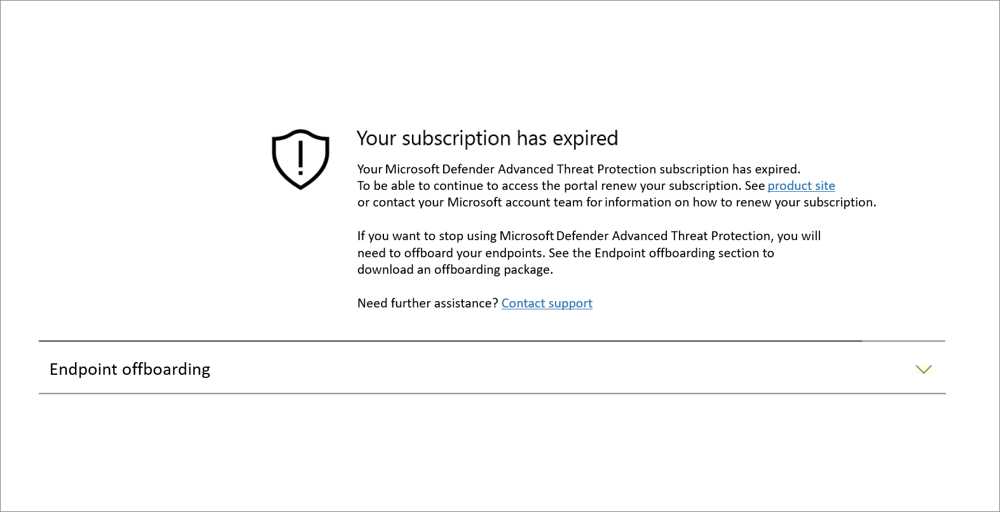
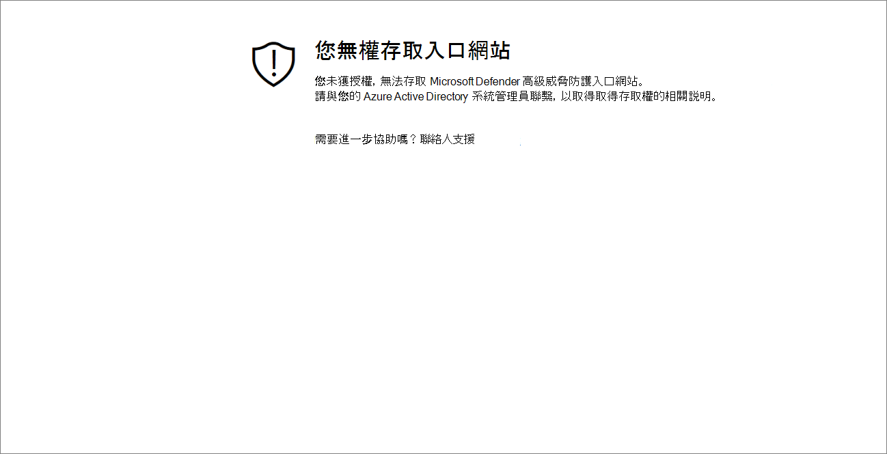
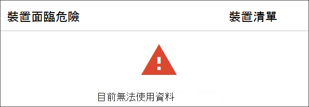

# 疑難排解訂閱及入口網站存取問題

[!INCLUDE [Microsoft 365 Defender rebranding](../../includes/microsoft-defender.md)]

**適用於：**
- [適用於端點的 Microsoft Defender](https://go.microsoft.com/fwlink/p/?linkid=2146631)
- [Microsoft 365 Defender](https://go.microsoft.com/fwlink/?linkid=2118804)

>想要體驗 Microsoft Defender for Endpoint？ [註冊免費試用版。](https://www.microsoft.com/microsoft-365/windows/microsoft-defender-atp?ocid=docs-wdatp-troublshootonboarding-abovefoldlink)

此頁面提供疑難排解設定 Microsoft Defender for Endpoint service 時可能發生之問題的詳細步驟。

如果您收到錯誤訊息，Microsoft Defender 安全中心會提供有關問題的詳細說明，以及提供相關的連結。

## 找不到訂閱

[！提示] 當存取 Microsoft Defender Security Center 時，出現 [ **未找到任何訂閱** ] 訊息，表示用來登入使用者至入口網站的 Azure Active Directory (azure AD) 沒有 Microsoft Defender for Endpoint 授權。

可能的原因：
- Windows E5 和 Office E5 授權是不同的授權。
- 已購買授權，但未布建至此 Azure AD 實例。
    - 這可能是授權布建問題。
    - 這可能是因為您不小心將授權提供給不同的 Microsoft Azure AD，而非用於驗證的服務。

在這兩種情況下，您應與 Microsoft 支援部門聯繫 [一般 Microsoft Defender For Endpoint support](https://support.microsoft.com/getsupport?wf=0&tenant=ClassicCommercial&oaspworkflow=start_1.0.0.0&locale=en-us&supportregion=en-us&pesid=16055&ccsid=636419533611396913) 或 [大量授權支援](https://www.microsoft.com/licensing/servicecenter/Help/Contact.aspx)。

## 您的訂閱已過期

當存取 Microsoft Defender Security Center 時，您會收到 **您的訂閱已過期** 郵件，您的線上服務訂閱已過期。 Microsoft Defender for Endpoint 訂閱，與任何其他線上服務訂閱一樣，都有到期日。 

您可以選擇在任何時間點更新或擴充授權。 當您訂閱已到期日之後存取入口網站時，如果您選擇不要更新授權，您的 **訂閱已到期** 的郵件將會以下載裝置脫離套件的選項呈現。

> [!NOTE]
> 基於安全性的考慮，用來下架裝置的套件會在下載之日期之後的30天后到期。 傳送給裝置的已到期的脫離套件會遭到拒絕。 下載脫離套件時，系統會通知您套件到期日，也會包含在套件名稱中。

## 您無權存取入口網站

如果您收到的 **是沒有存取入口網站的授權**，請注意 Microsoft Defender for Endpoint 是安全性監控、事件調查和回應產品，如此一來，存取它會受到使用者限制和控制。
如需詳細資訊，請參閱 [**指派使用者對入口網站的存取權**](https://docs.microsoft.com/windows/threat-protection/windows-defender-atp/assign-portal-access-windows-defender-advanced-threat-protection)。

## 資料目前在入口網站的某些區段中無法使用
如果入口網站儀表板和其他章節顯示錯誤訊息，例如「資料目前無法使用」：

您必須允許它底下的 `securitycenter.windows.com` 及其所有子域。 例如，`*.securitycenter.windows.com`。

## 入口網站通訊問題
如果您在存取入口網站、遺失資料或限制存取入口網站時遇到問題，您必須確認是否允許使用下列 URLs，並將其開啟以進行通訊。

- `*.blob.core.windows.net`
- `crl.microsoft.com`
- `https://*.microsoftonline-p.com`
- `https://*.securitycenter.windows.com` 
- `https://automatediracs-eus-prd.securitycenter.windows.com`
- `https://login.microsoftonline.com`
- `https://login.windows.net`
- `https://onboardingpackagescusprd.blob.core.windows.net`
- `https://secure.aadcdn.microsoftonline-p.com` 
- `https://securitycenter.windows.com` 
- `https://static2.sharepointonline.com` 

