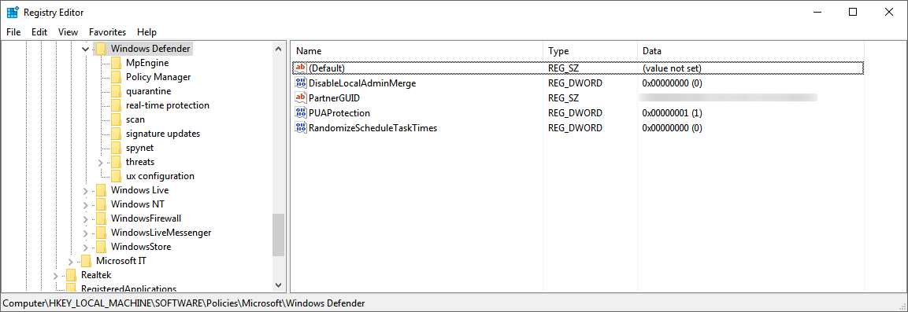
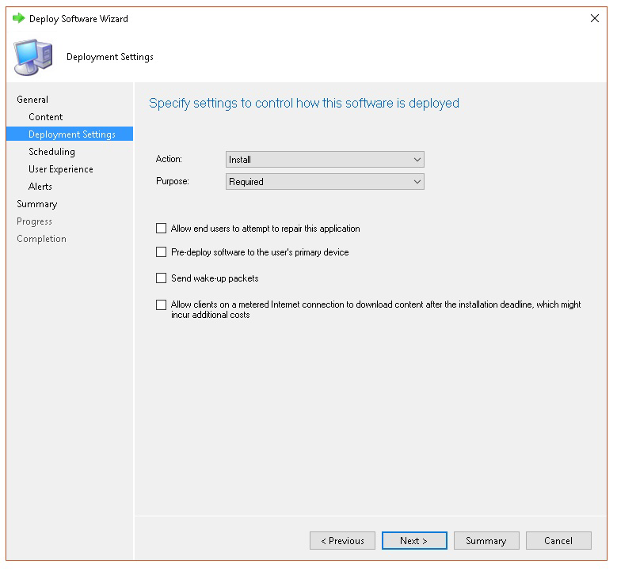

# <a name="troubleshoot-microsoft-defender-for-endpoint-onboarding-issues"></a><span data-ttu-id="fd153-104">疑難排解 Microsoft Defender 的端點上架問題</span><span class="sxs-lookup"><span data-stu-id="fd153-104">Troubleshoot Microsoft Defender for Endpoint onboarding issues</span></span>

[!INCLUDE [Microsoft 365 Defender rebranding](../../includes/microsoft-defender.md)]


<span data-ttu-id="fd153-105">**適用於：**</span><span class="sxs-lookup"><span data-stu-id="fd153-105">**Applies to:**</span></span>

- [<span data-ttu-id="fd153-106">適用於端點的 Microsoft Defender</span><span class="sxs-lookup"><span data-stu-id="fd153-106">Microsoft Defender for Endpoint</span></span>](https://go.microsoft.com/fwlink/?linkid=2154037)
- <span data-ttu-id="fd153-107">Windows Server 2012 R2</span><span class="sxs-lookup"><span data-stu-id="fd153-107">Windows Server 2012 R2</span></span>
- <span data-ttu-id="fd153-108">Windows Server 2016</span><span class="sxs-lookup"><span data-stu-id="fd153-108">Windows Server 2016</span></span>
- [<span data-ttu-id="fd153-109">Microsoft 365 Defender</span><span class="sxs-lookup"><span data-stu-id="fd153-109">Microsoft 365 Defender</span></span>](https://go.microsoft.com/fwlink/?linkid=2118804)

> <span data-ttu-id="fd153-110">想要體驗 Defender for Endpoint？</span><span class="sxs-lookup"><span data-stu-id="fd153-110">Want to experience Defender for Endpoint?</span></span> [<span data-ttu-id="fd153-111">注册免費試用版。</span><span class="sxs-lookup"><span data-stu-id="fd153-111">Sign up for a free trial.</span></span>](https://www.microsoft.com/microsoft-365/windows/microsoft-defender-atp?ocid=docs-wdatp-pullalerts-abovefoldlink) 

<span data-ttu-id="fd153-112">如果您遇到問題，您可能需要對 Microsoft Defender for Endpoint 上架進行疑難排解。</span><span class="sxs-lookup"><span data-stu-id="fd153-112">You might need to troubleshoot the Microsoft Defender for Endpoint onboarding process if you encounter issues.</span></span>
<span data-ttu-id="fd153-113">此頁面提供疑難排解在使用裝置上可能發生的其中一個部署工具和常見錯誤進行部署時，可能會發生之上架問題的詳細步驟。</span><span class="sxs-lookup"><span data-stu-id="fd153-113">This page provides detailed steps to troubleshoot onboarding issues that might occur when deploying with one of the deployment tools and common errors that might occur on the devices.</span></span>

## <a name="troubleshoot-issues-with-onboarding-tools"></a><span data-ttu-id="fd153-114">疑難排解上架工具的問題</span><span class="sxs-lookup"><span data-stu-id="fd153-114">Troubleshoot issues with onboarding tools</span></span>

<span data-ttu-id="fd153-115">如果您已完成上架程式，且在一小時後沒有看到 [裝置清單](investigate-machines.md) 中的裝置，則可能表示上架或連線問題。</span><span class="sxs-lookup"><span data-stu-id="fd153-115">If you have completed the onboarding process and don't see devices in the [Devices list](investigate-machines.md) after an hour, it might indicate an onboarding or connectivity problem.</span></span>

### <a name="troubleshoot-onboarding-when-deploying-with-group-policy"></a><span data-ttu-id="fd153-116">使用群組原則部署時疑難排解上架</span><span class="sxs-lookup"><span data-stu-id="fd153-116">Troubleshoot onboarding when deploying with Group Policy</span></span>

<span data-ttu-id="fd153-117">您可以在裝置上執行上架腳本，以進行「群組原則」的部署。</span><span class="sxs-lookup"><span data-stu-id="fd153-117">Deployment with Group Policy is done by running the onboarding script on the devices.</span></span> <span data-ttu-id="fd153-118">群組原則主控台不會指出部署是否成功。</span><span class="sxs-lookup"><span data-stu-id="fd153-118">The Group Policy console does not indicate if the deployment has succeeded or not.</span></span>

<span data-ttu-id="fd153-119">如果您已完成上架程式，且在一小時後沒有看到 [裝置清單](investigate-machines.md) 中的裝置，您可以在裝置上檢查腳本的輸出。</span><span class="sxs-lookup"><span data-stu-id="fd153-119">If you have completed the onboarding process and don't see devices in the [Devices list](investigate-machines.md) after an hour, you can check the output of the script on the devices.</span></span> <span data-ttu-id="fd153-120">如需詳細資訊，請參閱 [使用腳本進行部署時疑難排解上架](#troubleshoot-onboarding-when-deploying-with-a-script)。</span><span class="sxs-lookup"><span data-stu-id="fd153-120">For more information, see [Troubleshoot onboarding when deploying with a script](#troubleshoot-onboarding-when-deploying-with-a-script).</span></span>

<span data-ttu-id="fd153-121">如果腳本順利完成，請參閱裝置上有關可能發生之其他錯誤的 [上架問題疑難排解](#troubleshoot-onboarding-issues-on-the-device) 。</span><span class="sxs-lookup"><span data-stu-id="fd153-121">If the script completes successfully, see [Troubleshoot onboarding issues on the devices](#troubleshoot-onboarding-issues-on-the-device) for additional errors that might occur.</span></span>

### <a name="troubleshoot-onboarding-issues-when-deploying-with-microsoft-endpoint-configuration-manager"></a><span data-ttu-id="fd153-122">使用 Microsoft Endpoint Configuration Manager 部署時疑難排解上架問題</span><span class="sxs-lookup"><span data-stu-id="fd153-122">Troubleshoot onboarding issues when deploying with Microsoft Endpoint Configuration Manager</span></span>

<span data-ttu-id="fd153-123">使用下列 Configuration Manager 版本上架裝置時：</span><span class="sxs-lookup"><span data-stu-id="fd153-123">When onboarding devices using the following versions of Configuration Manager:</span></span>

- <span data-ttu-id="fd153-124">Microsoft Endpoint Configuration Manager</span><span class="sxs-lookup"><span data-stu-id="fd153-124">Microsoft Endpoint Configuration Manager</span></span>
- <span data-ttu-id="fd153-125">System Center 2012 Configuration Manager</span><span class="sxs-lookup"><span data-stu-id="fd153-125">System Center 2012 Configuration Manager</span></span>
- <span data-ttu-id="fd153-126">System Center 2012 R2 Configuration Manager</span><span class="sxs-lookup"><span data-stu-id="fd153-126">System Center 2012 R2 Configuration Manager</span></span>

<span data-ttu-id="fd153-127">您可以在裝置上執行上架腳本，以上一個所述版本的 Configuration Manager 進行部署。</span><span class="sxs-lookup"><span data-stu-id="fd153-127">Deployment with the above-mentioned versions of Configuration Manager is done by running the onboarding script on the devices.</span></span> <span data-ttu-id="fd153-128">您可以在 Configuration Manager 主控台中追蹤部署。</span><span class="sxs-lookup"><span data-stu-id="fd153-128">You can track the deployment in the Configuration Manager Console.</span></span>

<span data-ttu-id="fd153-129">如果部署失敗，您可以在裝置上檢查腳本的輸出。</span><span class="sxs-lookup"><span data-stu-id="fd153-129">If the deployment fails, you can check the output of the script on the devices.</span></span>

<span data-ttu-id="fd153-130">如果上架成功完成，但是在一小時後裝置 **清單** 中並未顯示裝置，請參閱 [疑難排解裝置上的上架問題](#troubleshoot-onboarding-issues-on-the-device) ，以取得可能發生的其他錯誤。</span><span class="sxs-lookup"><span data-stu-id="fd153-130">If the onboarding completed successfully but the devices are not showing up in the **Devices list** after an hour, see [Troubleshoot onboarding issues on the device](#troubleshoot-onboarding-issues-on-the-device) for additional errors that might occur.</span></span>

### <a name="troubleshoot-onboarding-when-deploying-with-a-script"></a><span data-ttu-id="fd153-131">使用腳本進行部署時疑難排解上架</span><span class="sxs-lookup"><span data-stu-id="fd153-131">Troubleshoot onboarding when deploying with a script</span></span>

<span data-ttu-id="fd153-132">**在裝置上檢查腳本的結果：**</span><span class="sxs-lookup"><span data-stu-id="fd153-132">**Check the result of the script on the device:**</span></span>

1. <span data-ttu-id="fd153-133">按一下 [ **開始**]，輸入 **事件檢視器**，然後按 **enter** 鍵。</span><span class="sxs-lookup"><span data-stu-id="fd153-133">Click **Start**, type **Event Viewer**, and press **Enter**.</span></span>

2. <span data-ttu-id="fd153-134">移至 **Windows 記錄**  >  **應用程式**。</span><span class="sxs-lookup"><span data-stu-id="fd153-134">Go to **Windows Logs** > **Application**.</span></span>

3. <span data-ttu-id="fd153-135">從 **WDATPOnboarding** 事件來源尋找事件。</span><span class="sxs-lookup"><span data-stu-id="fd153-135">Look for an event from **WDATPOnboarding** event source.</span></span>

<span data-ttu-id="fd153-136">如果腳本失敗且事件發生錯誤，您可以檢查下表中的事件識別碼，以協助您進行問題的疑難排解。</span><span class="sxs-lookup"><span data-stu-id="fd153-136">If the script fails and the event is an error, you can check the event ID in the following table to help you troubleshoot the issue.</span></span>

> [!NOTE]
> <span data-ttu-id="fd153-137">下列事件 IDs 只適用于上架腳本。</span><span class="sxs-lookup"><span data-stu-id="fd153-137">The following event IDs are specific to the onboarding script only.</span></span>

<span data-ttu-id="fd153-138">事件識別碼</span><span class="sxs-lookup"><span data-stu-id="fd153-138">Event ID</span></span> | <span data-ttu-id="fd153-139">錯誤類型</span><span class="sxs-lookup"><span data-stu-id="fd153-139">Error Type</span></span> | <span data-ttu-id="fd153-140">解決步驟</span><span class="sxs-lookup"><span data-stu-id="fd153-140">Resolution steps</span></span>
:---:|:---|:---
 `5` | <span data-ttu-id="fd153-141">找不到脫離資料，但無法將其刪除</span><span class="sxs-lookup"><span data-stu-id="fd153-141">Offboarding data was found but couldn't be deleted</span></span> | <span data-ttu-id="fd153-142">檢查登錄的許可權（特別是</span><span class="sxs-lookup"><span data-stu-id="fd153-142">Check the permissions on the registry, specifically</span></span><br> <span data-ttu-id="fd153-143">`HKLM\SOFTWARE\Policies\Microsoft\Windows Advanced Threat Protection`.</span><span class="sxs-lookup"><span data-stu-id="fd153-143">`HKLM\SOFTWARE\Policies\Microsoft\Windows Advanced Threat Protection`.</span></span>
`10` | <span data-ttu-id="fd153-144">無法將上架資料寫入登錄</span><span class="sxs-lookup"><span data-stu-id="fd153-144">Onboarding data couldn't be written to registry</span></span> |  <span data-ttu-id="fd153-145">檢查登錄的許可權（特別是</span><span class="sxs-lookup"><span data-stu-id="fd153-145">Check the permissions on the registry, specifically</span></span><br> <span data-ttu-id="fd153-146">`HKLM\SOFTWARE\Policies\Microsoft\Windows Advanced Threat Protection`.</span><span class="sxs-lookup"><span data-stu-id="fd153-146">`HKLM\SOFTWARE\Policies\Microsoft\Windows Advanced Threat Protection`.</span></span><br><span data-ttu-id="fd153-147">確認腳本已以系統管理員身分執行。</span><span class="sxs-lookup"><span data-stu-id="fd153-147">Verify that the script has been run as an administrator.</span></span>
`15` |  <span data-ttu-id="fd153-148">無法啟動 SENSE 服務</span><span class="sxs-lookup"><span data-stu-id="fd153-148">Failed to start SENSE service</span></span> |<span data-ttu-id="fd153-149">請檢查服務健康情況 (`sc query sense` 命令) 。</span><span class="sxs-lookup"><span data-stu-id="fd153-149">Check the service health (`sc query sense` command).</span></span> <span data-ttu-id="fd153-150">確定它不在中間狀態 (*' Pending_Stopped '*、 *' Pending_Running '*) ，然後嘗試使用系統管理員許可權 (，以重新執行腳本。</span><span class="sxs-lookup"><span data-stu-id="fd153-150">Make sure it's not in an intermediate state (*'Pending_Stopped'*, *'Pending_Running'*) and try to run the script again (with administrator rights).</span></span> <br> <br> <span data-ttu-id="fd153-151">如果裝置執行 Windows 10，版本1607並執行命令會傳回 `sc query sense` `START_PENDING` ，請重新開機裝置。</span><span class="sxs-lookup"><span data-stu-id="fd153-151">If the device is running Windows 10, version 1607 and running the command `sc query sense` returns `START_PENDING`, reboot the device.</span></span> <span data-ttu-id="fd153-152">如果重新開機裝置無法解決問題，請升級至 KB4015217，然後再嘗試上架。</span><span class="sxs-lookup"><span data-stu-id="fd153-152">If rebooting the device doesn't address the issue, upgrade to KB4015217 and try onboarding again.</span></span>
`15` | <span data-ttu-id="fd153-153">無法啟動 SENSE 服務</span><span class="sxs-lookup"><span data-stu-id="fd153-153">Failed to start SENSE service</span></span> | <span data-ttu-id="fd153-154">如果錯誤訊息為：系統錯誤577或發生錯誤1058，您必須啟用 Microsoft Defender 防毒軟體的 ELAM 驅動程式，請參閱[確定原則未停用 Microsoft Defender 防毒軟體](#ensure-that-microsoft-defender-antivirus-is-not-disabled-by-a-policy)的指示。</span><span class="sxs-lookup"><span data-stu-id="fd153-154">If the message of the error is: System error 577  or error 1058 has occurred, you need to enable the Microsoft Defender Antivirus ELAM driver, see [Ensure that Microsoft Defender Antivirus is not disabled by a policy](#ensure-that-microsoft-defender-antivirus-is-not-disabled-by-a-policy) for instructions.</span></span>
`30` |  <span data-ttu-id="fd153-155">腳本無法等候服務開始執行</span><span class="sxs-lookup"><span data-stu-id="fd153-155">The script failed to wait for the service to start running</span></span> | <span data-ttu-id="fd153-156">在嘗試啟動服務時，可能會花費更多時間來開始或發生錯誤。</span><span class="sxs-lookup"><span data-stu-id="fd153-156">The service could have taken more time to start or has encountered errors while trying to start.</span></span> <span data-ttu-id="fd153-157">如需與意義相關之事件及錯誤的詳細資訊，請參閱 [使用事件檢視器審閱事件與錯誤](event-error-codes.md)。</span><span class="sxs-lookup"><span data-stu-id="fd153-157">For more information on events and errors related to SENSE, see [Review events and errors using Event viewer](event-error-codes.md).</span></span>
`35` |  <span data-ttu-id="fd153-158">腳本無法找到所需的上架狀態登錄值</span><span class="sxs-lookup"><span data-stu-id="fd153-158">The script failed to find needed onboarding status registry value</span></span> | <span data-ttu-id="fd153-159">當 SENSE 服務第一次啟動時，它會將上架狀態寫入登錄位置。</span><span class="sxs-lookup"><span data-stu-id="fd153-159">When the SENSE service starts for the first time, it writes onboarding status to the registry location</span></span><br><span data-ttu-id="fd153-160">`HKLM\SOFTWARE\Microsoft\Windows Advanced Threat Protection\Status`.</span><span class="sxs-lookup"><span data-stu-id="fd153-160">`HKLM\SOFTWARE\Microsoft\Windows Advanced Threat Protection\Status`.</span></span><br> <span data-ttu-id="fd153-161">腳本在數秒後未找到它。</span><span class="sxs-lookup"><span data-stu-id="fd153-161">The script failed to find it after several seconds.</span></span> <span data-ttu-id="fd153-162">您可以手動測試它，並檢查是否存在。</span><span class="sxs-lookup"><span data-stu-id="fd153-162">You can manually test it and check if it's there.</span></span> <span data-ttu-id="fd153-163">如需與意義相關之事件及錯誤的詳細資訊，請參閱 [使用事件檢視器審閱事件與錯誤](event-error-codes.md)。</span><span class="sxs-lookup"><span data-stu-id="fd153-163">For more information on events and errors related to SENSE, see [Review events and errors using Event viewer](event-error-codes.md).</span></span>
`40` | <span data-ttu-id="fd153-164">SENSE 服務上架狀態未設為 **1**</span><span class="sxs-lookup"><span data-stu-id="fd153-164">SENSE service onboarding status is not set to **1**</span></span> | <span data-ttu-id="fd153-165">SENSE 服務未能正確板載。</span><span class="sxs-lookup"><span data-stu-id="fd153-165">The SENSE service has failed to onboard properly.</span></span> <span data-ttu-id="fd153-166">如需與意義相關之事件及錯誤的詳細資訊，請參閱 [使用事件檢視器審閱事件與錯誤](event-error-codes.md)。</span><span class="sxs-lookup"><span data-stu-id="fd153-166">For more information on events and errors related to SENSE, see [Review events and errors using Event viewer](event-error-codes.md).</span></span>
`65` | <span data-ttu-id="fd153-167">許可權不足</span><span class="sxs-lookup"><span data-stu-id="fd153-167">Insufficient privileges</span></span>| <span data-ttu-id="fd153-168">請使用管理員許可權重新執行腳本。</span><span class="sxs-lookup"><span data-stu-id="fd153-168">Run the script again with administrator privileges.</span></span>

### <a name="troubleshoot-onboarding-issues-using-microsoft-intune"></a><span data-ttu-id="fd153-169">使用 Microsoft Intune 疑難排解上架問題</span><span class="sxs-lookup"><span data-stu-id="fd153-169">Troubleshoot onboarding issues using Microsoft Intune</span></span>

<span data-ttu-id="fd153-170">您可以使用 Microsoft Intune 檢查錯誤碼，並嘗試疑難排解問題的原因。</span><span class="sxs-lookup"><span data-stu-id="fd153-170">You can use Microsoft Intune to check error codes and attempt to troubleshoot the cause of the issue.</span></span>

<span data-ttu-id="fd153-171">如果您已在 Intune 中設定原則，且不會在裝置上傳播，您可能需要設定自動 MDM 註冊。</span><span class="sxs-lookup"><span data-stu-id="fd153-171">If you have configured policies in Intune and they are not propagated on devices, you might need to configure automatic MDM enrollment.</span></span>

<span data-ttu-id="fd153-172">使用下表來瞭解上架問題的可能原因：</span><span class="sxs-lookup"><span data-stu-id="fd153-172">Use the following tables to understand the possible causes of issues while onboarding:</span></span>

- <span data-ttu-id="fd153-173">Microsoft Intune 錯誤碼及 OMA-URIs 表格</span><span class="sxs-lookup"><span data-stu-id="fd153-173">Microsoft Intune error codes and OMA-URIs table</span></span>
- <span data-ttu-id="fd153-174">非規範表格的已知問題</span><span class="sxs-lookup"><span data-stu-id="fd153-174">Known issues with non-compliance table</span></span>
- <span data-ttu-id="fd153-175">行動裝置管理 (MDM) 事件記錄表格</span><span class="sxs-lookup"><span data-stu-id="fd153-175">Mobile Device Management (MDM) event logs table</span></span>

<span data-ttu-id="fd153-176">若沒有任何事件記錄及疑難排解步驟可運作，請從入口網站的 [ **裝置管理** ] 區段下載本機腳本，然後在提升許可權的命令提示字元中執行。</span><span class="sxs-lookup"><span data-stu-id="fd153-176">If none of the event logs and troubleshooting steps work, download the Local script from the **Device management** section of the portal, and run it in an elevated command prompt.</span></span>

#### <a name="microsoft-intune-error-codes-and-oma-uris"></a><span data-ttu-id="fd153-177">Microsoft Intune 錯誤碼和 OMA-URIs</span><span class="sxs-lookup"><span data-stu-id="fd153-177">Microsoft Intune error codes and OMA-URIs</span></span>

<span data-ttu-id="fd153-178">錯誤碼十六進位</span><span class="sxs-lookup"><span data-stu-id="fd153-178">Error Code Hex</span></span> | <span data-ttu-id="fd153-179">錯誤碼 Dec</span><span class="sxs-lookup"><span data-stu-id="fd153-179">Error Code Dec</span></span> | <span data-ttu-id="fd153-180">Error Description</span><span class="sxs-lookup"><span data-stu-id="fd153-180">Error Description</span></span> | <span data-ttu-id="fd153-181">OMA URI</span><span class="sxs-lookup"><span data-stu-id="fd153-181">OMA-URI</span></span> | <span data-ttu-id="fd153-182">可能的原因及疑難排解步驟</span><span class="sxs-lookup"><span data-stu-id="fd153-182">Possible cause and troubleshooting steps</span></span>
:---:|:---|:---|:---|:---
<span data-ttu-id="fd153-183">0x87D1FDE8</span><span class="sxs-lookup"><span data-stu-id="fd153-183">0x87D1FDE8</span></span> | <span data-ttu-id="fd153-184">-2016281112</span><span class="sxs-lookup"><span data-stu-id="fd153-184">-2016281112</span></span> | <span data-ttu-id="fd153-185">修正失敗</span><span class="sxs-lookup"><span data-stu-id="fd153-185">Remediation failed</span></span> | <span data-ttu-id="fd153-186">上線</span><span class="sxs-lookup"><span data-stu-id="fd153-186">Onboarding</span></span> <br> <span data-ttu-id="fd153-187">Offboarding</span><span class="sxs-lookup"><span data-stu-id="fd153-187">Offboarding</span></span> | <span data-ttu-id="fd153-188">**可能的原因：** 上架或脫離錯誤的 blob 失敗：簽名錯誤或遺失 PreviousOrgIds 欄位。</span><span class="sxs-lookup"><span data-stu-id="fd153-188">**Possible cause:** Onboarding or offboarding failed on a wrong blob: wrong signature or missing PreviousOrgIds fields.</span></span> <br><br> <span data-ttu-id="fd153-189">**疑難排解步驟：**</span><span class="sxs-lookup"><span data-stu-id="fd153-189">**Troubleshooting steps:**</span></span> <br> <span data-ttu-id="fd153-190">在 [裝置事件記錄檔] 區段中，檢查 [ [View agent 內架] 錯誤中](#view-agent-onboarding-errors-in-the-device-event-log) 的事件 IDs。</span><span class="sxs-lookup"><span data-stu-id="fd153-190">Check the event IDs in the [View agent onboarding errors in the device event log](#view-agent-onboarding-errors-in-the-device-event-log) section.</span></span> <br><br> <span data-ttu-id="fd153-191">請檢查下表中的 MDM 事件記錄檔，或遵循[Windows 10 中的診斷 MDM 失敗](/windows/client-management/mdm/diagnose-mdm-failures-in-windows-10)指示。</span><span class="sxs-lookup"><span data-stu-id="fd153-191">Check the MDM event logs in the following table or follow the instructions in [Diagnose MDM failures in Windows 10](/windows/client-management/mdm/diagnose-mdm-failures-in-windows-10).</span></span>
 | | | | <span data-ttu-id="fd153-192">上線</span><span class="sxs-lookup"><span data-stu-id="fd153-192">Onboarding</span></span> <br> <span data-ttu-id="fd153-193">Offboarding</span><span class="sxs-lookup"><span data-stu-id="fd153-193">Offboarding</span></span> <br> <span data-ttu-id="fd153-194">SampleSharing</span><span class="sxs-lookup"><span data-stu-id="fd153-194">SampleSharing</span></span> | <span data-ttu-id="fd153-195">**可能的原因：** Microsoft Defender for Endpoint 原則登錄機碼不存在，或 OMA DM 用戶端沒有寫入權限的許可權。</span><span class="sxs-lookup"><span data-stu-id="fd153-195">**Possible cause:** Microsoft Defender for Endpoint Policy registry key does not exist or the OMA DM client doesn't have permissions to write to it.</span></span> <br><br> <span data-ttu-id="fd153-196">**疑難排解步驟：** 確定下列登錄機碼存在： `HKEY_LOCAL_MACHINE\SOFTWARE\Policies\Microsoft\Windows Advanced Threat Protection`</span><span class="sxs-lookup"><span data-stu-id="fd153-196">**Troubleshooting steps:** Ensure that the following registry key exists: `HKEY_LOCAL_MACHINE\SOFTWARE\Policies\Microsoft\Windows Advanced Threat Protection`</span></span> <br> <br> <span data-ttu-id="fd153-197">如果不存在，請開啟提升許可權的命令並新增金鑰。</span><span class="sxs-lookup"><span data-stu-id="fd153-197">If it doesn't exist, open an elevated command and add the key.</span></span>
 | | | | <span data-ttu-id="fd153-198">SenseIsRunning</span><span class="sxs-lookup"><span data-stu-id="fd153-198">SenseIsRunning</span></span> <br> <span data-ttu-id="fd153-199">OnboardingState</span><span class="sxs-lookup"><span data-stu-id="fd153-199">OnboardingState</span></span> <br> <span data-ttu-id="fd153-200">OrgId</span><span class="sxs-lookup"><span data-stu-id="fd153-200">OrgId</span></span> |  <span data-ttu-id="fd153-201">**可能的原因：** 嘗試以唯讀屬性修正。</span><span class="sxs-lookup"><span data-stu-id="fd153-201">**Possible cause:** An attempt to remediate by read-only property.</span></span> <span data-ttu-id="fd153-202">上架失敗。</span><span class="sxs-lookup"><span data-stu-id="fd153-202">Onboarding has failed.</span></span> <br><br> <span data-ttu-id="fd153-203">**疑難排解步驟：** 檢查疑難排解步驟以 [疑難排解裝置上的上架問題](#troubleshoot-onboarding-issues-on-the-device)。</span><span class="sxs-lookup"><span data-stu-id="fd153-203">**Troubleshooting steps:** Check the troubleshooting steps in [Troubleshoot onboarding issues on the device](#troubleshoot-onboarding-issues-on-the-device).</span></span> <br><br> <span data-ttu-id="fd153-204">請檢查下表中的 MDM 事件記錄檔，或遵循[Windows 10 中的診斷 MDM 失敗](/windows/client-management/mdm/diagnose-mdm-failures-in-windows-10)指示。</span><span class="sxs-lookup"><span data-stu-id="fd153-204">Check the MDM event logs in the following table or follow the instructions in [Diagnose MDM failures in Windows 10](/windows/client-management/mdm/diagnose-mdm-failures-in-windows-10).</span></span>
 | | | | <span data-ttu-id="fd153-205">全部</span><span class="sxs-lookup"><span data-stu-id="fd153-205">All</span></span> | <span data-ttu-id="fd153-206">**可能的原因：** 嘗試在不支援的 SKU/平臺上部署 Microsoft Defender for Endpoint，尤其是全息版 SKU。</span><span class="sxs-lookup"><span data-stu-id="fd153-206">**Possible cause:** Attempt to deploy Microsoft Defender for Endpoint on non-supported SKU/Platform, particularly Holographic SKU.</span></span> <br><br> <span data-ttu-id="fd153-207">目前支援的平臺：</span><span class="sxs-lookup"><span data-stu-id="fd153-207">Currently supported platforms:</span></span><br> <span data-ttu-id="fd153-208">Enterprise、教育和 Professional。</span><span class="sxs-lookup"><span data-stu-id="fd153-208">Enterprise, Education, and Professional.</span></span><br> <span data-ttu-id="fd153-209">不支援 Server。</span><span class="sxs-lookup"><span data-stu-id="fd153-209">Server is not supported.</span></span>
 <span data-ttu-id="fd153-210">0x87D101A9</span><span class="sxs-lookup"><span data-stu-id="fd153-210">0x87D101A9</span></span> | <span data-ttu-id="fd153-211">-2016345687</span><span class="sxs-lookup"><span data-stu-id="fd153-211">-2016345687</span></span> |<span data-ttu-id="fd153-212">SyncML (425) ：要求的命令失敗，因為寄件者在收件者上沒有適當的存取控制許可權 (ACL) 。</span><span class="sxs-lookup"><span data-stu-id="fd153-212">SyncML(425): The requested command failed because the sender does not have adequate access control permissions (ACL) on the recipient.</span></span> | <span data-ttu-id="fd153-213">全部</span><span class="sxs-lookup"><span data-stu-id="fd153-213">All</span></span> |  <span data-ttu-id="fd153-214">**可能的原因：** 嘗試在不支援的 SKU/平臺上部署 Microsoft Defender for Endpoint，尤其是全息版 SKU。</span><span class="sxs-lookup"><span data-stu-id="fd153-214">**Possible cause:** Attempt to deploy Microsoft Defender for Endpoint on non-supported SKU/Platform, particularly Holographic SKU.</span></span><br><br> <span data-ttu-id="fd153-215">目前支援的平臺：</span><span class="sxs-lookup"><span data-stu-id="fd153-215">Currently supported platforms:</span></span><br>  <span data-ttu-id="fd153-216">Enterprise、教育和 Professional。</span><span class="sxs-lookup"><span data-stu-id="fd153-216">Enterprise, Education, and Professional.</span></span>

#### <a name="known-issues-with-non-compliance"></a><span data-ttu-id="fd153-217">非規範的已知問題</span><span class="sxs-lookup"><span data-stu-id="fd153-217">Known issues with non-compliance</span></span>

<span data-ttu-id="fd153-218">下表提供有關非法規遵從性問題的資訊，以及您如何解決問題的方式。</span><span class="sxs-lookup"><span data-stu-id="fd153-218">The following table provides information on issues with non-compliance and how you can address the issues.</span></span>

<span data-ttu-id="fd153-219">案例</span><span class="sxs-lookup"><span data-stu-id="fd153-219">Case</span></span> | <span data-ttu-id="fd153-220">徵狀</span><span class="sxs-lookup"><span data-stu-id="fd153-220">Symptoms</span></span> | <span data-ttu-id="fd153-221">可能的原因及疑難排解步驟</span><span class="sxs-lookup"><span data-stu-id="fd153-221">Possible cause and troubleshooting steps</span></span>
:---:|:---|:---
 `1` | <span data-ttu-id="fd153-222">裝置符合 SenseIsRunning OMA URI。</span><span class="sxs-lookup"><span data-stu-id="fd153-222">Device is compliant by SenseIsRunning OMA-URI.</span></span> <span data-ttu-id="fd153-223">不過，OrgId、上架和 OnboardingState OMA URIs 不相容。</span><span class="sxs-lookup"><span data-stu-id="fd153-223">But is non-compliant by OrgId, Onboarding and OnboardingState OMA-URIs.</span></span> | <span data-ttu-id="fd153-224">**可能的原因：** 檢查使用者 Windows 安裝或升級後是否已傳遞 OOBE。</span><span class="sxs-lookup"><span data-stu-id="fd153-224">**Possible cause:** Check that user passed OOBE after Windows installation or upgrade.</span></span> <span data-ttu-id="fd153-225">在 OOBE 內架未能完成，但有意義已執行。</span><span class="sxs-lookup"><span data-stu-id="fd153-225">During OOBE onboarding couldn't be completed but SENSE is running already.</span></span><br><br> <span data-ttu-id="fd153-226">**疑難排解步驟：** 等候 OOBE 完成。</span><span class="sxs-lookup"><span data-stu-id="fd153-226">**Troubleshooting steps:** Wait for OOBE to complete.</span></span>
 `2` |  <span data-ttu-id="fd153-227">裝置遵循 OrgId、上架和 OnboardingState OMA URIs，但不符合 SenseIsRunning OMA-URI。</span><span class="sxs-lookup"><span data-stu-id="fd153-227">Device is compliant by OrgId, Onboarding, and OnboardingState OMA-URIs, but is non-compliant by SenseIsRunning OMA-URI.</span></span> |  <span data-ttu-id="fd153-228">**可能的原因：** Sense 服務的啟動類型設定為「延遲啟動」。</span><span class="sxs-lookup"><span data-stu-id="fd153-228">**Possible cause:** Sense service's startup type is set as "Delayed Start".</span></span> <span data-ttu-id="fd153-229">當系統啟動時進行 DM 會話時，有時會造成 Microsoft Intune 伺服器報告裝置的 SenseIsRunning 不相容。</span><span class="sxs-lookup"><span data-stu-id="fd153-229">Sometimes this causes the Microsoft Intune server to report the device as non-compliant by SenseIsRunning when DM session occurs on system start.</span></span> <br><br> <span data-ttu-id="fd153-230">**疑難排解步驟：** 問題應該會在24小時內自動修正。</span><span class="sxs-lookup"><span data-stu-id="fd153-230">**Troubleshooting steps:** The issue should automatically be fixed within 24 hours.</span></span>
 `3` | <span data-ttu-id="fd153-231">裝置不相容</span><span class="sxs-lookup"><span data-stu-id="fd153-231">Device is non-compliant</span></span> | <span data-ttu-id="fd153-232">**疑難排解步驟：** 確定上架和脫離原則不會同時部署在相同的裝置上。</span><span class="sxs-lookup"><span data-stu-id="fd153-232">**Troubleshooting steps:** Ensure that Onboarding and Offboarding policies are not deployed on the same device at same time.</span></span>

#### <a name="mobile-device-management-mdm-event-logs"></a><span data-ttu-id="fd153-233">移動裝置管理 (MDM) 事件記錄</span><span class="sxs-lookup"><span data-stu-id="fd153-233">Mobile Device Management (MDM) event logs</span></span>

<span data-ttu-id="fd153-234">查看 MDM 事件記錄檔，以疑難排解上架期間可能發生的問題：</span><span class="sxs-lookup"><span data-stu-id="fd153-234">View the MDM event logs to troubleshoot issues that might arise during onboarding:</span></span>

<span data-ttu-id="fd153-235">記錄檔名稱： Microsoft \ Windows \DeviceManagement-EnterpriseDiagnostics-Provider</span><span class="sxs-lookup"><span data-stu-id="fd153-235">Log name: Microsoft\Windows\DeviceManagement-EnterpriseDiagnostics-Provider</span></span>

<span data-ttu-id="fd153-236">通道名稱：系統管理員</span><span class="sxs-lookup"><span data-stu-id="fd153-236">Channel name: Admin</span></span>

<span data-ttu-id="fd153-237">ID</span><span class="sxs-lookup"><span data-stu-id="fd153-237">ID</span></span> | <span data-ttu-id="fd153-238">嚴重性</span><span class="sxs-lookup"><span data-stu-id="fd153-238">Severity</span></span> | <span data-ttu-id="fd153-239">事件說明</span><span class="sxs-lookup"><span data-stu-id="fd153-239">Event description</span></span> | <span data-ttu-id="fd153-240">疑難排解步驟</span><span class="sxs-lookup"><span data-stu-id="fd153-240">Troubleshooting steps</span></span>
:---|:---|:---|:---
<span data-ttu-id="fd153-241">1819</span><span class="sxs-lookup"><span data-stu-id="fd153-241">1819</span></span> | <span data-ttu-id="fd153-242">錯誤</span><span class="sxs-lookup"><span data-stu-id="fd153-242">Error</span></span> | <span data-ttu-id="fd153-243">Microsoft Defender for Endpoint CSP：無法設定節點的值。</span><span class="sxs-lookup"><span data-stu-id="fd153-243">Microsoft Defender for Endpoint CSP: Failed to Set Node's Value.</span></span> <span data-ttu-id="fd153-244">對等： (% 1) ，TokenName： (% 2) ，結果： (% 3) 。</span><span class="sxs-lookup"><span data-stu-id="fd153-244">NodeId: (%1), TokenName: (%2), Result: (%3).</span></span> | <span data-ttu-id="fd153-245">下載[Windows 10，1607的累計更新](https://go.microsoft.com/fwlink/?linkid=829760)。</span><span class="sxs-lookup"><span data-stu-id="fd153-245">Download the [Cumulative Update for Windows 10, 1607](https://go.microsoft.com/fwlink/?linkid=829760).</span></span>

## <a name="troubleshoot-onboarding-issues-on-the-device"></a><span data-ttu-id="fd153-246">疑難排解裝置上的上架問題</span><span class="sxs-lookup"><span data-stu-id="fd153-246">Troubleshoot onboarding issues on the device</span></span>

<span data-ttu-id="fd153-247">如果使用的部署工具並未指出上架程式中的錯誤，但是裝置在一小時內仍不會出現在 [裝置] 清單中，請流覽下列驗證主題，檢查 Microsoft Defender for Endpoint agent 是否發生錯誤。</span><span class="sxs-lookup"><span data-stu-id="fd153-247">If the deployment tools used does not indicate an error in the onboarding process, but devices are still not appearing in the devices list in an hour, go through the following verification topics to check if an error occurred with the Microsoft Defender for Endpoint agent.</span></span>

- [<span data-ttu-id="fd153-248">在裝置事件記錄檔中查看代理程式上架錯誤</span><span class="sxs-lookup"><span data-stu-id="fd153-248">View agent onboarding errors in the device event log</span></span>](#view-agent-onboarding-errors-in-the-device-event-log)
- [<span data-ttu-id="fd153-249">確定已啟用診斷資料服務</span><span class="sxs-lookup"><span data-stu-id="fd153-249">Ensure the diagnostic data service is enabled</span></span>](#ensure-the-diagnostics-service-is-enabled)
- [<span data-ttu-id="fd153-250">確定已將服務設定為啟動</span><span class="sxs-lookup"><span data-stu-id="fd153-250">Ensure the service is set to start</span></span>](#ensure-the-service-is-set-to-start)
- [<span data-ttu-id="fd153-251">確定裝置具有網際網路連線</span><span class="sxs-lookup"><span data-stu-id="fd153-251">Ensure the device has an Internet connection</span></span>](#ensure-the-device-has-an-internet-connection)
- [<span data-ttu-id="fd153-252">確定原則未停用 Microsoft Defender 防毒軟體</span><span class="sxs-lookup"><span data-stu-id="fd153-252">Ensure that Microsoft Defender Antivirus is not disabled by a policy</span></span>](#ensure-that-microsoft-defender-antivirus-is-not-disabled-by-a-policy)

### <a name="view-agent-onboarding-errors-in-the-device-event-log"></a><span data-ttu-id="fd153-253">在裝置事件記錄檔中查看代理程式上架錯誤</span><span class="sxs-lookup"><span data-stu-id="fd153-253">View agent onboarding errors in the device event log</span></span>

1. <span data-ttu-id="fd153-254">按一下 [ **開始**]，輸入 **事件檢視器**，然後按 **enter** 鍵。</span><span class="sxs-lookup"><span data-stu-id="fd153-254">Click **Start**, type **Event Viewer**, and press **Enter**.</span></span>

2. <span data-ttu-id="fd153-255">在 **事件檢視器中 (Local)** 窗格中，展開 [**應用程式及服務記錄**  >  **Microsoft**  >  **Windows**  >  **感知**]。</span><span class="sxs-lookup"><span data-stu-id="fd153-255">In the **Event Viewer (Local)** pane, expand **Applications and Services Logs** > **Microsoft** > **Windows** > **SENSE**.</span></span>

   > [!NOTE]
   > <span data-ttu-id="fd153-256">判斷是指用來表示為 Microsoft Defender for Endpoint 供電的行為感應器的內部名稱。</span><span class="sxs-lookup"><span data-stu-id="fd153-256">SENSE is the internal name used to refer to the behavioral sensor that powers Microsoft Defender for Endpoint.</span></span>

3. <span data-ttu-id="fd153-257">選取 [可 **運作** ] 以載入記錄檔。</span><span class="sxs-lookup"><span data-stu-id="fd153-257">Select **Operational** to load the log.</span></span>

4. <span data-ttu-id="fd153-258">**在執行窗格中**，按一下 [**篩選目前的記錄** 檔]。</span><span class="sxs-lookup"><span data-stu-id="fd153-258">In the **Action** pane, click **Filter Current log**.</span></span>

5. <span data-ttu-id="fd153-259">在 [ **篩選** ] 索引標籤上的 [ **事件層級：** 選取 **嚴重**、 **警告** 和 **錯誤**]，然後按一下 **[確定]**。</span><span class="sxs-lookup"><span data-stu-id="fd153-259">On the **Filter** tab, under **Event level:** select **Critical**, **Warning**, and **Error**, and click **OK**.</span></span>

   

6. <span data-ttu-id="fd153-261">可指出問題的事件會出現在 **操作** 窗格中。</span><span class="sxs-lookup"><span data-stu-id="fd153-261">Events which can indicate issues will appear in the **Operational** pane.</span></span> <span data-ttu-id="fd153-262">您可以根據下表中的解決方案，嘗試進行疑難排解：</span><span class="sxs-lookup"><span data-stu-id="fd153-262">You can attempt to troubleshoot them based on the solutions in the following table:</span></span>

<span data-ttu-id="fd153-263">事件識別碼</span><span class="sxs-lookup"><span data-stu-id="fd153-263">Event ID</span></span> | <span data-ttu-id="fd153-264">訊息</span><span class="sxs-lookup"><span data-stu-id="fd153-264">Message</span></span> | <span data-ttu-id="fd153-265">解決步驟</span><span class="sxs-lookup"><span data-stu-id="fd153-265">Resolution steps</span></span>
:---:|:---|:---
 `5` | <span data-ttu-id="fd153-266">Microsoft Defender for Endpoint service 無法在 _變數_ 上連接至伺服器</span><span class="sxs-lookup"><span data-stu-id="fd153-266">Microsoft Defender for Endpoint service failed to connect to the server at _variable_</span></span> | <span data-ttu-id="fd153-267">[確定裝置具有網際網路存取權](#ensure-the-device-has-an-internet-connection)。</span><span class="sxs-lookup"><span data-stu-id="fd153-267">[Ensure the device has Internet access](#ensure-the-device-has-an-internet-connection).</span></span>
 `6` | <span data-ttu-id="fd153-268">Microsoft Defender for Endpoint service 未架，且找不到任何上架參數。</span><span class="sxs-lookup"><span data-stu-id="fd153-268">Microsoft Defender for Endpoint service is not onboarded and no onboarding parameters were found.</span></span> <span data-ttu-id="fd153-269">失敗代碼： _variable_</span><span class="sxs-lookup"><span data-stu-id="fd153-269">Failure code: _variable_</span></span> | <span data-ttu-id="fd153-270">[再次執行上架腳本](configure-endpoints-script.md)。</span><span class="sxs-lookup"><span data-stu-id="fd153-270">[Run the onboarding script again](configure-endpoints-script.md).</span></span>
 `7` | <span data-ttu-id="fd153-271">Microsoft Defender for Endpoint service 無法讀取上架參數。</span><span class="sxs-lookup"><span data-stu-id="fd153-271">Microsoft Defender for Endpoint service failed to read the onboarding parameters.</span></span> <span data-ttu-id="fd153-272">失敗代碼： _variable_</span><span class="sxs-lookup"><span data-stu-id="fd153-272">Failure code: _variable_</span></span> | <span data-ttu-id="fd153-273">[確定裝置具有網際網路存取權](#ensure-the-device-has-an-internet-connection)，然後再次執行整個上架程式。</span><span class="sxs-lookup"><span data-stu-id="fd153-273">[Ensure the device has Internet access](#ensure-the-device-has-an-internet-connection), then run the entire onboarding process again.</span></span>
 `9` | <span data-ttu-id="fd153-274">Microsoft Defender for Endpoint service 無法變更其啟動類型。</span><span class="sxs-lookup"><span data-stu-id="fd153-274">Microsoft Defender for Endpoint service failed to change its start type.</span></span> <span data-ttu-id="fd153-275">失敗代碼： variable</span><span class="sxs-lookup"><span data-stu-id="fd153-275">Failure code: variable</span></span> | <span data-ttu-id="fd153-276">如果在上架時發生此事件，請重新開機並重新嘗試執行上架腳本。</span><span class="sxs-lookup"><span data-stu-id="fd153-276">If the event happened during onboarding, reboot and re-attempt running the onboarding script.</span></span> <span data-ttu-id="fd153-277">如需詳細資訊，請參閱 [再次執行上架腳本](configure-endpoints-script.md)。</span><span class="sxs-lookup"><span data-stu-id="fd153-277">For more information, see [Run the onboarding script again](configure-endpoints-script.md).</span></span> <br><br><span data-ttu-id="fd153-278">如果在脫離期間發生事件，請與支援人員聯繫。</span><span class="sxs-lookup"><span data-stu-id="fd153-278">If the event happened during offboarding, contact support.</span></span>
`10` | <span data-ttu-id="fd153-279">Microsoft Defender for Endpoint service 無法保留上架資訊。</span><span class="sxs-lookup"><span data-stu-id="fd153-279">Microsoft Defender for Endpoint service failed to persist the onboarding information.</span></span> <span data-ttu-id="fd153-280">失敗代碼： variable</span><span class="sxs-lookup"><span data-stu-id="fd153-280">Failure code: variable</span></span> | <span data-ttu-id="fd153-281">若在上架時發生此事件，請重新嘗試執行上架腳本。</span><span class="sxs-lookup"><span data-stu-id="fd153-281">If the event happened during onboarding, re-attempt running the onboarding script.</span></span> <span data-ttu-id="fd153-282">如需詳細資訊，請參閱 [再次執行上架腳本](configure-endpoints-script.md)。</span><span class="sxs-lookup"><span data-stu-id="fd153-282">For more information, see [Run the onboarding script again](configure-endpoints-script.md).</span></span> <br><br><span data-ttu-id="fd153-283">如果問題仍然存在，請與支援人員聯繫。</span><span class="sxs-lookup"><span data-stu-id="fd153-283">If the problem persists, contact support.</span></span>
`15` | <span data-ttu-id="fd153-284">Microsoft Defender for Endpoint 無法使用 URL:_變數_ 開始命令通道</span><span class="sxs-lookup"><span data-stu-id="fd153-284">Microsoft Defender for Endpoint cannot start command channel with URL: _variable_</span></span> | <span data-ttu-id="fd153-285">[確定裝置具有網際網路存取權](#ensure-the-device-has-an-internet-connection)。</span><span class="sxs-lookup"><span data-stu-id="fd153-285">[Ensure the device has Internet access](#ensure-the-device-has-an-internet-connection).</span></span>
`17` | <span data-ttu-id="fd153-286">Microsoft Defender for Endpoint service 無法變更連線的使用者經驗和遙測服務位置。</span><span class="sxs-lookup"><span data-stu-id="fd153-286">Microsoft Defender for Endpoint service failed to change the Connected User Experiences and Telemetry service location.</span></span> <span data-ttu-id="fd153-287">失敗代碼： variable</span><span class="sxs-lookup"><span data-stu-id="fd153-287">Failure code: variable</span></span> | <span data-ttu-id="fd153-288">[再次執行上架腳本](configure-endpoints-script.md)。</span><span class="sxs-lookup"><span data-stu-id="fd153-288">[Run the onboarding script again](configure-endpoints-script.md).</span></span> <span data-ttu-id="fd153-289">如果問題仍然存在，請與支援人員聯繫。</span><span class="sxs-lookup"><span data-stu-id="fd153-289">If the problem persists, contact support.</span></span>
`25` | <span data-ttu-id="fd153-290">Microsoft Defender for Endpoint service 無法重設登錄中的健康狀態。</span><span class="sxs-lookup"><span data-stu-id="fd153-290">Microsoft Defender for Endpoint service failed to reset health status in the registry.</span></span> <span data-ttu-id="fd153-291">失敗代碼： _variable_</span><span class="sxs-lookup"><span data-stu-id="fd153-291">Failure code: _variable_</span></span> | <span data-ttu-id="fd153-292">連絡客戶支援。</span><span class="sxs-lookup"><span data-stu-id="fd153-292">Contact support.</span></span>
`27` | <span data-ttu-id="fd153-293">無法在 Windows Defender 中啟用 Microsoft Defender for Endpoint 模式。</span><span class="sxs-lookup"><span data-stu-id="fd153-293">Failed to enable Microsoft Defender for Endpoint mode in Windows Defender.</span></span> <span data-ttu-id="fd153-294">上架過程失敗。</span><span class="sxs-lookup"><span data-stu-id="fd153-294">Onboarding process failed.</span></span> <span data-ttu-id="fd153-295">失敗代碼： variable</span><span class="sxs-lookup"><span data-stu-id="fd153-295">Failure code: variable</span></span> | <span data-ttu-id="fd153-296">連絡客戶支援。</span><span class="sxs-lookup"><span data-stu-id="fd153-296">Contact support.</span></span>
`29` | <span data-ttu-id="fd153-297">無法讀取脫離參數。</span><span class="sxs-lookup"><span data-stu-id="fd153-297">Failed to read the offboarding parameters.</span></span> <span data-ttu-id="fd153-298">錯誤類型： %1，錯誤碼： %2，描述： %3</span><span class="sxs-lookup"><span data-stu-id="fd153-298">Error type: %1, Error code: %2, Description: %3</span></span> | <span data-ttu-id="fd153-299">確定裝置具有網際網路存取權，然後再次執行整個脫離程式。</span><span class="sxs-lookup"><span data-stu-id="fd153-299">Ensure the device has Internet access, then run the entire offboarding process again.</span></span>
`30` | <span data-ttu-id="fd153-300">無法停用 Microsoft Defender for Endpoint 中的 $ (productDisplayName) 模式。</span><span class="sxs-lookup"><span data-stu-id="fd153-300">Failed to disable $(build.sense.productDisplayName) mode in Microsoft Defender for Endpoint.</span></span> <span data-ttu-id="fd153-301">失敗代碼： %1</span><span class="sxs-lookup"><span data-stu-id="fd153-301">Failure code: %1</span></span> | <span data-ttu-id="fd153-302">連絡客戶支援。</span><span class="sxs-lookup"><span data-stu-id="fd153-302">Contact support.</span></span>
`32` | <span data-ttu-id="fd153-303">$ (productDisplayName) 服務無法要求在脫離程式後自行停用。</span><span class="sxs-lookup"><span data-stu-id="fd153-303">$(build.sense.productDisplayName) service failed to request to stop itself after offboarding process.</span></span> <span data-ttu-id="fd153-304">失敗代碼： %1</span><span class="sxs-lookup"><span data-stu-id="fd153-304">Failure code: %1</span></span> | <span data-ttu-id="fd153-305">確認服務啟動類型是手動，然後重新開機裝置。</span><span class="sxs-lookup"><span data-stu-id="fd153-305">Verify that the service start type is manual and reboot the device.</span></span>
`55` | <span data-ttu-id="fd153-306">無法建立安全的 ETW 自動記錄器。</span><span class="sxs-lookup"><span data-stu-id="fd153-306">Failed to create the Secure ETW autologger.</span></span> <span data-ttu-id="fd153-307">失敗代碼： %1</span><span class="sxs-lookup"><span data-stu-id="fd153-307">Failure code: %1</span></span> | <span data-ttu-id="fd153-308">重新開機裝置。</span><span class="sxs-lookup"><span data-stu-id="fd153-308">Reboot the device.</span></span>
`63` | <span data-ttu-id="fd153-309">更新外部服務的啟動類型。</span><span class="sxs-lookup"><span data-stu-id="fd153-309">Updating the start type of external service.</span></span> <span data-ttu-id="fd153-310">名稱： %1，實際啟動類型： %2，預期啟動類型： %3，退出程式碼： %4</span><span class="sxs-lookup"><span data-stu-id="fd153-310">Name: %1, actual start type: %2, expected start type: %3, exit code: %4</span></span> | <span data-ttu-id="fd153-311">識別導致所述服務啟動類型變更的原因。</span><span class="sxs-lookup"><span data-stu-id="fd153-311">Identify what is causing changes in start type of mentioned service.</span></span> <span data-ttu-id="fd153-312">如果結束碼不是0，請手動修正啟動類型為 [預期啟動類型]。</span><span class="sxs-lookup"><span data-stu-id="fd153-312">If the exit code is not 0, fix the start type manually to expected start type.</span></span>
`64` | <span data-ttu-id="fd153-313">開始已停止的外部服務。</span><span class="sxs-lookup"><span data-stu-id="fd153-313">Starting stopped external service.</span></span> <span data-ttu-id="fd153-314">名稱： %1，退出程式碼： %2</span><span class="sxs-lookup"><span data-stu-id="fd153-314">Name: %1, exit code: %2</span></span> | <span data-ttu-id="fd153-315">如果事件持續重新出現，請與支援人員聯繫。</span><span class="sxs-lookup"><span data-stu-id="fd153-315">Contact support if the event keeps re-appearing.</span></span>
`68` | <span data-ttu-id="fd153-316">服務的啟動類型是意外的。</span><span class="sxs-lookup"><span data-stu-id="fd153-316">The start type of the service is unexpected.</span></span> <span data-ttu-id="fd153-317">服務名稱： %1，實際啟動類型： %2，預期啟動類型： %3</span><span class="sxs-lookup"><span data-stu-id="fd153-317">Service name: %1, actual start type: %2, expected start type: %3</span></span> | <span data-ttu-id="fd153-318">識別導致啟動類型變更的原因。</span><span class="sxs-lookup"><span data-stu-id="fd153-318">Identify what is causing changes in start type.</span></span> <span data-ttu-id="fd153-319">修正所述的服務啟動類型。</span><span class="sxs-lookup"><span data-stu-id="fd153-319">Fix mentioned service start type.</span></span>
`69` | <span data-ttu-id="fd153-320">服務已停止。</span><span class="sxs-lookup"><span data-stu-id="fd153-320">The service is stopped.</span></span> <span data-ttu-id="fd153-321">服務名稱： %1</span><span class="sxs-lookup"><span data-stu-id="fd153-321">Service name: %1</span></span> | <span data-ttu-id="fd153-322">啟動提及的服務。</span><span class="sxs-lookup"><span data-stu-id="fd153-322">Start the mentioned service.</span></span> <span data-ttu-id="fd153-323">如果仍然存在，請聯繫支援人員。</span><span class="sxs-lookup"><span data-stu-id="fd153-323">Contact support if persists.</span></span>

<br />

<span data-ttu-id="fd153-324">裝置上有其他元件，Microsoft Defender for Endpoint agent 必須依賴此裝置才能正常運作。</span><span class="sxs-lookup"><span data-stu-id="fd153-324">There are additional components on the device that the Microsoft Defender for Endpoint agent depends on to function properly.</span></span> <span data-ttu-id="fd153-325">如果 Microsoft Defender for Endpoint agent 事件記錄中沒有任何上架相關的錯誤，請繼續執行下列步驟，以確保已正確設定其他元件。</span><span class="sxs-lookup"><span data-stu-id="fd153-325">If there are no onboarding related errors in the Microsoft Defender for Endpoint agent event log, proceed with the following steps to ensure that the additional components are configured correctly.</span></span>

<span id="ensure-the-diagnostics-service-is-enabled" />

### <a name="ensure-the-diagnostic-data-service-is-enabled"></a><span data-ttu-id="fd153-326">確定已啟用診斷資料服務</span><span class="sxs-lookup"><span data-stu-id="fd153-326">Ensure the diagnostic data service is enabled</span></span>

<span data-ttu-id="fd153-327">如果裝置的報告不正確，您可能需要確認 Windows 10 診斷資料服務設定為自動啟動，且正在裝置上執行。</span><span class="sxs-lookup"><span data-stu-id="fd153-327">If the devices aren't reporting correctly, you might need to check that the Windows 10 diagnostic data service is set to automatically start and is running on the device.</span></span> <span data-ttu-id="fd153-328">服務可能已由其他程式或使用者設定變更停用。</span><span class="sxs-lookup"><span data-stu-id="fd153-328">The service might have been disabled by other programs or user configuration changes.</span></span>

<span data-ttu-id="fd153-329">首先，您應該檢查是否已將服務設定為在 Windows 啟動時自動啟動，否則應該檢查服務目前是否正在執行中 (並在未) 時啟動它。</span><span class="sxs-lookup"><span data-stu-id="fd153-329">First, you should check that the service is set to start automatically when Windows starts, then you should check that the service is currently running (and start it if it isn't).</span></span>

### <a name="ensure-the-service-is-set-to-start"></a><span data-ttu-id="fd153-330">確定已將服務設定為啟動</span><span class="sxs-lookup"><span data-stu-id="fd153-330">Ensure the service is set to start</span></span>

<span data-ttu-id="fd153-331">**使用命令列來檢查 Windows 10 診斷資料服務啟動類型**：</span><span class="sxs-lookup"><span data-stu-id="fd153-331">**Use the command line to check the Windows 10 diagnostic data service startup type**:</span></span>

1. <span data-ttu-id="fd153-332">在裝置上開啟已提升許可權的命令列提示：</span><span class="sxs-lookup"><span data-stu-id="fd153-332">Open an elevated command-line prompt on the device:</span></span>

   <span data-ttu-id="fd153-333">a.</span><span class="sxs-lookup"><span data-stu-id="fd153-333">a.</span></span> <span data-ttu-id="fd153-334">按一下 [ **開始**]，輸入 **cmd**，然後按 **enter**。</span><span class="sxs-lookup"><span data-stu-id="fd153-334">Click **Start**, type **cmd**, and press **Enter**.</span></span>

   <span data-ttu-id="fd153-335">b.</span><span class="sxs-lookup"><span data-stu-id="fd153-335">b.</span></span> <span data-ttu-id="fd153-336">以滑鼠右鍵按一下 **[命令提示字元]**，然後選取 **[以系統管理員身分執行]**。</span><span class="sxs-lookup"><span data-stu-id="fd153-336">Right-click **Command prompt** and select **Run as administrator**.</span></span>

2. <span data-ttu-id="fd153-337">輸入下列命令，然後按 **enter**：</span><span class="sxs-lookup"><span data-stu-id="fd153-337">Enter the following command, and press **Enter**:</span></span>

   ```text
   sc qc diagtrack
   ```

   <span data-ttu-id="fd153-338">如果已啟用服務，結果應該如下列螢幕擷取畫面所示：</span><span class="sxs-lookup"><span data-stu-id="fd153-338">If the service is enabled, then the result should look like the following screenshot:</span></span>

   

   <span data-ttu-id="fd153-340">若 `START_TYPE` 未設定為，則 `AUTO_START` 必須將服務設定為自動啟動。</span><span class="sxs-lookup"><span data-stu-id="fd153-340">If the `START_TYPE` is not set to `AUTO_START`, then you'll need to set the service to automatically start.</span></span>

<span data-ttu-id="fd153-341">**使用命令列，將 Windows 10 診斷資料服務設定為自動啟動：**</span><span class="sxs-lookup"><span data-stu-id="fd153-341">**Use the command line to set the Windows 10 diagnostic data service to automatically start:**</span></span>

1. <span data-ttu-id="fd153-342">在裝置上開啟已提升許可權的命令列提示：</span><span class="sxs-lookup"><span data-stu-id="fd153-342">Open an elevated command-line prompt on the device:</span></span>

   <span data-ttu-id="fd153-343">a.</span><span class="sxs-lookup"><span data-stu-id="fd153-343">a.</span></span> <span data-ttu-id="fd153-344">按一下 [ **開始**]，輸入 **cmd**，然後按 **enter**。</span><span class="sxs-lookup"><span data-stu-id="fd153-344">Click **Start**, type **cmd**, and press **Enter**.</span></span>

   <span data-ttu-id="fd153-345">b.</span><span class="sxs-lookup"><span data-stu-id="fd153-345">b.</span></span> <span data-ttu-id="fd153-346">以滑鼠右鍵按一下 **[命令提示字元]**，然後選取 **[以系統管理員身分執行]**。</span><span class="sxs-lookup"><span data-stu-id="fd153-346">Right-click **Command prompt** and select **Run as administrator**.</span></span>

2. <span data-ttu-id="fd153-347">輸入下列命令，然後按 **enter**：</span><span class="sxs-lookup"><span data-stu-id="fd153-347">Enter the following command, and press **Enter**:</span></span>

   ```text
   sc config diagtrack start=auto
   ```

3. <span data-ttu-id="fd153-348">隨即顯示一則成功訊息。</span><span class="sxs-lookup"><span data-stu-id="fd153-348">A success message is displayed.</span></span> <span data-ttu-id="fd153-349">輸入下列命令，然後按 **enter**，以確認變更：</span><span class="sxs-lookup"><span data-stu-id="fd153-349">Verify the change by entering the following command, and press **Enter**:</span></span>

   ```text
   sc qc diagtrack
   ```

4. <span data-ttu-id="fd153-350">啟動服務。</span><span class="sxs-lookup"><span data-stu-id="fd153-350">Start the service.</span></span>

   <span data-ttu-id="fd153-351">a.</span><span class="sxs-lookup"><span data-stu-id="fd153-351">a.</span></span> <span data-ttu-id="fd153-352">在命令提示字元處，輸入下列命令，然後按 **enter**：</span><span class="sxs-lookup"><span data-stu-id="fd153-352">In the command prompt, type the following command and press **Enter**:</span></span>

   ```text
   sc start diagtrack
   ```

### <a name="ensure-the-device-has-an-internet-connection"></a><span data-ttu-id="fd153-353">確定裝置具有網際網路連線</span><span class="sxs-lookup"><span data-stu-id="fd153-353">Ensure the device has an Internet connection</span></span>

<span data-ttu-id="fd153-354">適用於端點的 Microsoft Defender 感應器需要 Microsoft Windows HTTP (WinHTTP) 回報感應器資料，並與適用於端點的 Microsoft Defender 服務通訊。</span><span class="sxs-lookup"><span data-stu-id="fd153-354">The Microsoft Defender for Endpoint sensor requires Microsoft Windows HTTP (WinHTTP) to report sensor data and communicate with the Microsoft Defender for Endpoint service.</span></span>

<span data-ttu-id="fd153-355">WinHTTP 獨立于網際網路流覽 proxy 設定和其他使用者內容應用程式，而且必須能夠偵測出您的特定環境中提供的 proxy 伺服器。</span><span class="sxs-lookup"><span data-stu-id="fd153-355">WinHTTP is independent of the Internet browsing proxy settings and other user context applications and must be able to detect the proxy servers that are available in your particular environment.</span></span>

<span data-ttu-id="fd153-356">若要確定感應器具有服務連線能力，請遵循 [驗證用戶端連線至 Microsoft Defender For Endpoint service URLs](configure-proxy-internet.md#verify-client-connectivity-to-microsoft-defender-for-endpoint-service-urls) 主題中所述的步驟。</span><span class="sxs-lookup"><span data-stu-id="fd153-356">To ensure that sensor has service connectivity, follow the steps described in the [Verify client connectivity to Microsoft Defender for Endpoint service URLs](configure-proxy-internet.md#verify-client-connectivity-to-microsoft-defender-for-endpoint-service-urls) topic.</span></span>

<span data-ttu-id="fd153-357">若驗證失敗，且您的環境使用 proxy 來連線至網際網路，請遵循 [設定 proxy 和網際網路連線設定](configure-proxy-internet.md) 主題中所述的步驟。</span><span class="sxs-lookup"><span data-stu-id="fd153-357">If the verification fails and your environment is using a proxy to connect to the Internet, then follow the steps described in [Configure proxy and Internet connectivity settings](configure-proxy-internet.md) topic.</span></span>

### <a name="ensure-that-microsoft-defender-antivirus-is-not-disabled-by-a-policy"></a><span data-ttu-id="fd153-358">確定原則未停用 Microsoft Defender 防毒軟體</span><span class="sxs-lookup"><span data-stu-id="fd153-358">Ensure that Microsoft Defender Antivirus is not disabled by a policy</span></span>

> [!IMPORTANT]
> <span data-ttu-id="fd153-359">下列僅適用 **于尚未收到** 2020 (版本 4.18.2007.8) update to Microsoft Defender 防毒軟體的裝置。</span><span class="sxs-lookup"><span data-stu-id="fd153-359">The following only applies to devices that have **not** yet received the August 2020 (version 4.18.2007.8) update to Microsoft Defender Antivirus.</span></span>
>
> <span data-ttu-id="fd153-360">更新可確保無法透過系統原則關閉用戶端裝置上的 Microsoft Defender 防毒軟體。</span><span class="sxs-lookup"><span data-stu-id="fd153-360">The update ensures that Microsoft Defender Antivirus cannot be turned off on client devices via system policy.</span></span>

<span data-ttu-id="fd153-361">**問題**：上架服務不會啟動 Microsoft Defender for Endpoint service。</span><span class="sxs-lookup"><span data-stu-id="fd153-361">**Problem**: The Microsoft Defender for Endpoint service does not start after onboarding.</span></span>

<span data-ttu-id="fd153-362">征 **狀：上** 架成功完成，但是當您嘗試啟動服務時，會看到錯誤577或錯誤1058。</span><span class="sxs-lookup"><span data-stu-id="fd153-362">**Symptom**: Onboarding successfully completes, but you see error 577 or error 1058 when trying to start the service.</span></span>

<span data-ttu-id="fd153-363">**解決方案**：如果您的裝置執行的是協力廠商反惡意軟體用戶端，則 Microsoft Defender for Endpoint agent 需要啟用 ELAM) 驅動程式的早期啟動反 (惡意程式碼。</span><span class="sxs-lookup"><span data-stu-id="fd153-363">**Solution**: If your devices are running a third-party antimalware client, the Microsoft Defender for Endpoint agent needs the Early Launch Antimalware (ELAM) driver to be enabled.</span></span> <span data-ttu-id="fd153-364">您必須確定系統原則並未關閉該功能。</span><span class="sxs-lookup"><span data-stu-id="fd153-364">You must ensure that it's not turned off by a system policy.</span></span>

- <span data-ttu-id="fd153-365">根據您用來實施原則的工具，您必須確認已清除下列 Windows Defender 原則：</span><span class="sxs-lookup"><span data-stu-id="fd153-365">Depending on the tool that you use to implement policies, you'll need to verify that the following Windows Defender policies are cleared:</span></span>

  - <span data-ttu-id="fd153-366">DisableAntiSpyware</span><span class="sxs-lookup"><span data-stu-id="fd153-366">DisableAntiSpyware</span></span>
  - <span data-ttu-id="fd153-367">DisableAntiVirus</span><span class="sxs-lookup"><span data-stu-id="fd153-367">DisableAntiVirus</span></span>

  <span data-ttu-id="fd153-368">例如，在 [群組原則] 中，不應該有下列值的專案：</span><span class="sxs-lookup"><span data-stu-id="fd153-368">For example, in Group Policy there should be no entries such as the following values:</span></span>

  - `<Key Path="SOFTWARE\Policies\Microsoft\Windows Defender"><KeyValue Value="0" ValueKind="DWord" Name="DisableAntiSpyware"/></Key>`
  - `<Key Path="SOFTWARE\Policies\Microsoft\Windows Defender"><KeyValue Value="0" ValueKind="DWord" Name="DisableAntiVirus"/></Key>`

> [!IMPORTANT]
> <span data-ttu-id="fd153-369">在 `disableAntiSpyware` 2020 年8月 (版本 4.18.2007.8) update to Microsoft Defender 防毒軟體時，所有用戶端裝置都會忽略此設定。</span><span class="sxs-lookup"><span data-stu-id="fd153-369">The `disableAntiSpyware` setting is discontinued and will be ignored on all client devices, as of the August 2020 (version 4.18.2007.8) update to Microsoft Defender Antivirus.</span></span>

- <span data-ttu-id="fd153-370">清除原則之後，請再次執行上架步驟。</span><span class="sxs-lookup"><span data-stu-id="fd153-370">After clearing the policy, run the onboarding steps again.</span></span>

- <span data-ttu-id="fd153-371">您也可以透過開啟登錄機碼，檢查先前登錄機碼值，以確認原則已停用 `HKEY_LOCAL_MACHINE\SOFTWARE\Policies\Microsoft\Windows Defender` 。</span><span class="sxs-lookup"><span data-stu-id="fd153-371">You can also check the previous registry key values to verify that the policy is disabled, by opening the registry key `HKEY_LOCAL_MACHINE\SOFTWARE\Policies\Microsoft\Windows Defender`.</span></span>

    

   > [!NOTE]
   > <span data-ttu-id="fd153-373">所有 Windows Defender 服務 (wdboot、wdfilter、wdnisdrv、wdnissvc 和 windefend) 應該處於其預設狀態。</span><span class="sxs-lookup"><span data-stu-id="fd153-373">All Windows Defender services (wdboot, wdfilter, wdnisdrv, wdnissvc, and windefend) should be in their default state.</span></span> <span data-ttu-id="fd153-374">不支援變更這些服務的啟動，而且可能會強制您重設系統的映射。</span><span class="sxs-lookup"><span data-stu-id="fd153-374">Changing the startup of these services is unsupported and may force you to reimage your system.</span></span>
   >
   > <span data-ttu-id="fd153-375">WdBoot 與 WdFilter 的預設設定範例：</span><span class="sxs-lookup"><span data-stu-id="fd153-375">Example default configurations for WdBoot and WdFilter:</span></span>
   > - `<Key Path="SYSTEM\CurrentControlSet\Services\WdBoot"><KeyValue Value="0" ValueKind="DWord" Name="Start"/></Key>`
   > - `<Key Path="SYSTEM\CurrentControlSet\Services\WdFilter"><KeyValue Value="0" ValueKind="DWord" Name="Start"/></Key>`

## <a name="troubleshoot-onboarding-issues-on-a-server"></a><span data-ttu-id="fd153-376">疑難排解伺服器上的上架問題</span><span class="sxs-lookup"><span data-stu-id="fd153-376">Troubleshoot onboarding issues on a server</span></span>

<span data-ttu-id="fd153-377">如果您在上架伺服器時遇到問題，請執行下列驗證步驟，以解決可能的問題。</span><span class="sxs-lookup"><span data-stu-id="fd153-377">If you encounter issues while onboarding a server, go through the following verification steps to address possible issues.</span></span>

- [<span data-ttu-id="fd153-378">確定已安裝並設定 Microsoft Monitoring Agent (MMA) ，以將感應器資料包告給服務</span><span class="sxs-lookup"><span data-stu-id="fd153-378">Ensure Microsoft Monitoring Agent (MMA) is installed and configured to report sensor data to the service</span></span>](configure-server-endpoints.md)
- [<span data-ttu-id="fd153-379">確定已正確設定伺服器 proxy 和網際網路連線設定</span><span class="sxs-lookup"><span data-stu-id="fd153-379">Ensure that the server proxy and Internet connectivity settings are configured properly</span></span>](configure-server-endpoints.md)

<span data-ttu-id="fd153-380">您可能還需要檢查下列專案：</span><span class="sxs-lookup"><span data-stu-id="fd153-380">You might also need to check the following:</span></span>

- <span data-ttu-id="fd153-381">檢查 [**工作管理員**] 中的 [**進程**] 索引標籤中，是否有執行的 Microsoft Defender for Endpoint Service。</span><span class="sxs-lookup"><span data-stu-id="fd153-381">Check that there is a Microsoft Defender for Endpoint Service running in the **Processes** tab in **Task Manager**.</span></span> <span data-ttu-id="fd153-382">例如：</span><span class="sxs-lookup"><span data-stu-id="fd153-382">For example:</span></span>

    

- <span data-ttu-id="fd153-384">檢查 **事件檢視器**  >  **應用程式和服務記錄** 作業  >  **管理員**，以查看是否有任何錯誤。</span><span class="sxs-lookup"><span data-stu-id="fd153-384">Check **Event Viewer** > **Applications and Services Logs** > **Operation Manager** to see if there are any errors.</span></span>

- <span data-ttu-id="fd153-385">在 [**服務**] 中，檢查 **Microsoft Monitoring Agent** 是否正在伺服器上執行。</span><span class="sxs-lookup"><span data-stu-id="fd153-385">In **Services**, check if the **Microsoft Monitoring Agent** is running on the server.</span></span> <span data-ttu-id="fd153-386">例如：</span><span class="sxs-lookup"><span data-stu-id="fd153-386">For example,</span></span>

    

- <span data-ttu-id="fd153-388">在 **Microsoft Monitoring Agent**  >  **Azure 記錄分析 (OMS)** 中，檢查工作區並確認狀態為 [正在執行]。</span><span class="sxs-lookup"><span data-stu-id="fd153-388">In **Microsoft Monitoring Agent** > **Azure Log Analytics (OMS)**, check the Workspaces and verify that the status is running.</span></span>

    

- <span data-ttu-id="fd153-390">請檢查裝置是否會反映在入口網站的 [ **裝置] 清單** 中。</span><span class="sxs-lookup"><span data-stu-id="fd153-390">Check to see that devices are reflected in the **Devices list** in the portal.</span></span>

## <a name="confirming-onboarding-of-newly-built-devices"></a><span data-ttu-id="fd153-391">確認新建立裝置的上架</span><span class="sxs-lookup"><span data-stu-id="fd153-391">Confirming onboarding of newly built devices</span></span>

<span data-ttu-id="fd153-392">在新建立的裝置上部署上架時，可能會有實例，但尚未完成。</span><span class="sxs-lookup"><span data-stu-id="fd153-392">There may be instances when onboarding is deployed on a newly built device but not completed.</span></span>

<span data-ttu-id="fd153-393">下列步驟會提供下列案例的指導方針：</span><span class="sxs-lookup"><span data-stu-id="fd153-393">The steps below provide guidance for the following scenario:</span></span>

- <span data-ttu-id="fd153-394">將上架套件部署至新建立的裝置</span><span class="sxs-lookup"><span data-stu-id="fd153-394">Onboarding package is deployed to newly built devices</span></span>
- <span data-ttu-id="fd153-395">感應器未啟動，因為 (OOBE) 或第一次使用者登入尚未完成。</span><span class="sxs-lookup"><span data-stu-id="fd153-395">Sensor does not start because the Out-of-box experience (OOBE) or first user logon has not been completed</span></span>
- <span data-ttu-id="fd153-396">在使用者執行第一次登入時，裝置已關閉或重新開機</span><span class="sxs-lookup"><span data-stu-id="fd153-396">Device is turned off or restarted before the end user performs a first logon</span></span>
- <span data-ttu-id="fd153-397">在此案例中，即使已部署上架套件，也不會自動啟動 SENSE 服務</span><span class="sxs-lookup"><span data-stu-id="fd153-397">In this scenario, the SENSE service will not start automatically even though onboarding package was deployed</span></span>

> [!NOTE]
> <span data-ttu-id="fd153-398">下列步驟僅適用于使用 Microsoft Endpoint Configuration Manager。</span><span class="sxs-lookup"><span data-stu-id="fd153-398">The following steps are only relevant when using Microsoft Endpoint Configuration Manager.</span></span> <span data-ttu-id="fd153-399">如需使用 Microsoft Endpoint Configuration Manager 上架的詳細資訊，請參閱[Microsoft Defender for Endpoint](/mem/configmgr/protect/deploy-use/windows-defender-advanced-threat-protection)。</span><span class="sxs-lookup"><span data-stu-id="fd153-399">For more details about onboarding using Microsoft Endpoint Configuration Manager, see [Microsoft Defender for Endpoint](/mem/configmgr/protect/deploy-use/windows-defender-advanced-threat-protection).</span></span>

1. <span data-ttu-id="fd153-400">在 Microsoft Endpoint Configuration Manager 中建立應用程式。</span><span class="sxs-lookup"><span data-stu-id="fd153-400">Create an application in Microsoft Endpoint Configuration Manager.</span></span>

    

2. <span data-ttu-id="fd153-402">選取 **[手動指定應用程式資訊**]。</span><span class="sxs-lookup"><span data-stu-id="fd153-402">Select **Manually specify the application information**.</span></span>

    

3. <span data-ttu-id="fd153-404">指定應用程式的相關資訊，然後選取 **[下一步]**。</span><span class="sxs-lookup"><span data-stu-id="fd153-404">Specify information about the application, then select **Next**.</span></span>

    

4. <span data-ttu-id="fd153-406">指定軟體中心的相關資訊，然後選取 **[下一步]**。</span><span class="sxs-lookup"><span data-stu-id="fd153-406">Specify information about the software center, then select **Next**.</span></span>

    

5. <span data-ttu-id="fd153-408">在 **部署類型** 中，選取 [ **新增**]。</span><span class="sxs-lookup"><span data-stu-id="fd153-408">In **Deployment types** select **Add**.</span></span>

    

6. <span data-ttu-id="fd153-410">選取 **[手動指定部署類型資訊**]，然後選取 **[下一步]**。</span><span class="sxs-lookup"><span data-stu-id="fd153-410">Select **Manually specify the deployment type information**, then select **Next**.</span></span>

    

7. <span data-ttu-id="fd153-412">指定部署類型的相關資訊，然後選取 **[下一步]**。</span><span class="sxs-lookup"><span data-stu-id="fd153-412">Specify information about the deployment type, then select **Next**.</span></span>

    

8. <span data-ttu-id="fd153-414">在 **內容**  >  **安裝程式** 中指定命令： `net start sense` 。</span><span class="sxs-lookup"><span data-stu-id="fd153-414">In **Content** > **Installation program** specify the command: `net start sense`.</span></span>

    

9. <span data-ttu-id="fd153-416">在 [ **偵測方法**] 中，選取 **[設定規則以偵測此部署類型的存在**]，然後選取 [ **Add 子句**]。</span><span class="sxs-lookup"><span data-stu-id="fd153-416">In **Detection method**, select **Configure rules to detect the presence of this deployment type**, then select **Add Clause**.</span></span>

    

10. <span data-ttu-id="fd153-418">指定下列偵測規則詳細資料，然後選取 **[確定]**：</span><span class="sxs-lookup"><span data-stu-id="fd153-418">Specify the following detection rule details, then select **OK**:</span></span>

    

11. <span data-ttu-id="fd153-420">在 **偵測方法** 中，選取 **[下一步]**。</span><span class="sxs-lookup"><span data-stu-id="fd153-420">In **Detection method** select **Next**.</span></span>

    

12. <span data-ttu-id="fd153-422">在 [ **使用者經驗**] 中，指定下列資訊，然後選取 **[下一步]**：</span><span class="sxs-lookup"><span data-stu-id="fd153-422">In **User Experience**, specify the following information, then select **Next**:</span></span>

    

13. <span data-ttu-id="fd153-424">在 [ **需求**] 中選取 **[下一步]**。</span><span class="sxs-lookup"><span data-stu-id="fd153-424">In **Requirements**, select **Next**.</span></span>

    

14. <span data-ttu-id="fd153-426">在 [ **依賴性**] 中選取 **[下一步]**。</span><span class="sxs-lookup"><span data-stu-id="fd153-426">In **Dependencies**, select **Next**.</span></span>

    

15. <span data-ttu-id="fd153-428">在 [ **摘要**] 中選取 **[下一步]**。</span><span class="sxs-lookup"><span data-stu-id="fd153-428">In **Summary**, select **Next**.</span></span>

    

16. <span data-ttu-id="fd153-430">在 **完成** 中，選取 [ **關閉**]。</span><span class="sxs-lookup"><span data-stu-id="fd153-430">In **Completion**, select **Close**.</span></span>

    

17. <span data-ttu-id="fd153-432">在 [ **部署類型**] 中，選取 **[下一步]**。</span><span class="sxs-lookup"><span data-stu-id="fd153-432">In **Deployment types**, select **Next**.</span></span>

    

18. <span data-ttu-id="fd153-434">在 [ **摘要**] 中選取 **[下一步]**。</span><span class="sxs-lookup"><span data-stu-id="fd153-434">In **Summary**, select **Next**.</span></span>

    

    <span data-ttu-id="fd153-436">然後會顯示狀態： </span><span class="sxs-lookup"><span data-stu-id="fd153-436">The status is then displayed: </span></span>

19. <span data-ttu-id="fd153-437">在 **完成** 中，選取 [ **關閉**]。</span><span class="sxs-lookup"><span data-stu-id="fd153-437">In **Completion**, select **Close**.</span></span>

    

20. <span data-ttu-id="fd153-439">現在您可以使用滑鼠右鍵按一下 app，然後選擇 [ **部署**] 來部署應用程式。</span><span class="sxs-lookup"><span data-stu-id="fd153-439">You can now deploy the application by right-clicking the app and selecting **Deploy**.</span></span>

    

21. <span data-ttu-id="fd153-441">**[一般**] 選取 [**自動散佈** 相依內容 **] 及 [流覽]**。</span><span class="sxs-lookup"><span data-stu-id="fd153-441">In **General** select **Automatically distribute content for dependencies** and **Browse**.</span></span>

    

22. <span data-ttu-id="fd153-443">在 **內容** 中選取 **[下一步]**。</span><span class="sxs-lookup"><span data-stu-id="fd153-443">In **Content** select **Next**.</span></span>

    

23. <span data-ttu-id="fd153-445">在 [ **部署設定**] 中，選取 **[下一步]**。</span><span class="sxs-lookup"><span data-stu-id="fd153-445">In **Deployment settings**, select **Next**.</span></span>

    

24. <span data-ttu-id="fd153-447">在 **排程** 中，請在 **可用時間後儘快** 選取，然後選取 **[下一步]**。</span><span class="sxs-lookup"><span data-stu-id="fd153-447">In **Scheduling** select **As soon as possible after the available time**, then select **Next**.</span></span>

    

25. <span data-ttu-id="fd153-449">在 [ **使用者經驗**] 中，選取 [ **在截止期限或維護時段內認可變更] (需要重新開機)**，然後選取 **[下一步]**。</span><span class="sxs-lookup"><span data-stu-id="fd153-449">In **User experience**, select **Commit changes at deadline or during a maintenance window (requires restarts)**, then select **Next**.</span></span>

    

26. <span data-ttu-id="fd153-451">**警示** 選取 **[下一步]**。</span><span class="sxs-lookup"><span data-stu-id="fd153-451">In **Alerts** select **Next**.</span></span>

    

27. <span data-ttu-id="fd153-453">在 [ **摘要**] 中選取 **[下一步]**。</span><span class="sxs-lookup"><span data-stu-id="fd153-453">In **Summary**, select **Next**.</span></span>

    

    <span data-ttu-id="fd153-455">然後，狀態就會顯示 </span><span class="sxs-lookup"><span data-stu-id="fd153-455">The status is then displayed </span></span>

28. <span data-ttu-id="fd153-456">在 **完成** 中，選取 [ **關閉**]。</span><span class="sxs-lookup"><span data-stu-id="fd153-456">In **Completion**, select **Close**.</span></span>

    


## <a name="related-topics"></a><span data-ttu-id="fd153-458">相關主題</span><span class="sxs-lookup"><span data-stu-id="fd153-458">Related topics</span></span>

- [<span data-ttu-id="fd153-459">為適用於端點的 Microsoft Defender 疑難排解</span><span class="sxs-lookup"><span data-stu-id="fd153-459">Troubleshoot Microsoft Defender for Endpoint</span></span>](troubleshoot-mdatp.md)
- [<span data-ttu-id="fd153-460">將裝置上線</span><span class="sxs-lookup"><span data-stu-id="fd153-460">Onboard devices</span></span>](onboard-configure.md)
- [<span data-ttu-id="fd153-461">設定裝置 Proxy 和網際網路連線能力設定</span><span class="sxs-lookup"><span data-stu-id="fd153-461">Configure device proxy and Internet connectivity settings</span></span>](configure-proxy-internet.md)
