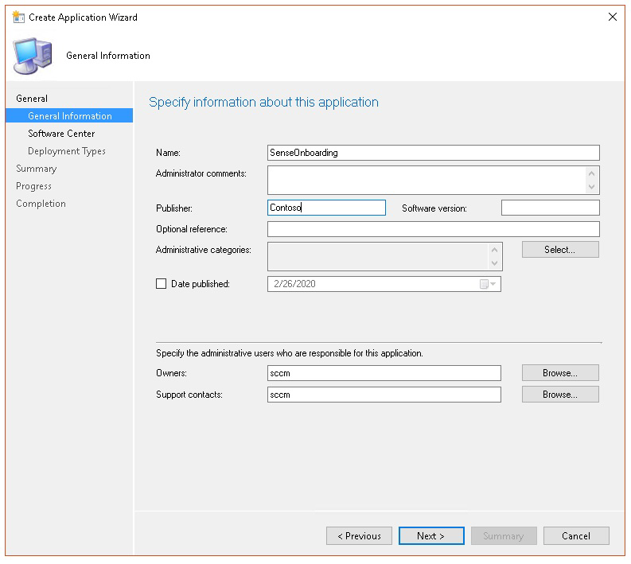

# <a name="troubleshoot-microsoft-defender-for-endpoint-onboarding-issues"></a>疑難排解 Microsoft Defender 的端點上架問題

[!INCLUDE [Microsoft 365 Defender rebranding](../../includes/microsoft-defender.md)]


**適用於：**

- [適用於端點的 Microsoft Defender](https://go.microsoft.com/fwlink/?linkid=2154037)
- Windows Server 2012 R2
- Windows Server 2016
- [Microsoft 365 Defender](https://go.microsoft.com/fwlink/?linkid=2118804)

> 想要體驗 Defender for Endpoint？ [註冊免費試用版。](https://www.microsoft.com/microsoft-365/windows/microsoft-defender-atp?ocid=docs-wdatp-pullalerts-abovefoldlink) 

如果您遇到問題，您可能需要對 Microsoft Defender for Endpoint 上架進行疑難排解。
此頁面提供疑難排解在使用裝置上可能發生的其中一個部署工具和常見錯誤進行部署時，可能會發生之上架問題的詳細步驟。

## <a name="troubleshoot-issues-with-onboarding-tools"></a>疑難排解上架工具的問題

如果您已完成上架程式，且在一小時後沒有看到 [裝置清單](investigate-machines.md) 中的裝置，則可能表示上架或連線問題。

### <a name="troubleshoot-onboarding-when-deploying-with-group-policy"></a>使用群組原則部署時疑難排解上架

您可以在裝置上執行上架腳本，以進行「群組原則」的部署。 群組原則主控台不會指出部署是否成功。

如果您已完成上架程式，且在一小時後沒有看到 [裝置清單](investigate-machines.md) 中的裝置，您可以在裝置上檢查腳本的輸出。 如需詳細資訊，請參閱 [使用腳本進行部署時疑難排解上架](#troubleshoot-onboarding-when-deploying-with-a-script)。

如果腳本順利完成，請參閱裝置上有關可能發生之其他錯誤的 [上架問題疑難排解](#troubleshoot-onboarding-issues-on-the-device) 。

### <a name="troubleshoot-onboarding-issues-when-deploying-with-microsoft-endpoint-configuration-manager"></a>使用 Microsoft 端點 Configuration Manager 部署時疑難排解上架問題

使用下列 Configuration Manager 版本上架裝置時：

- Microsoft Endpoint Configuration Manager
- System Center 2012 Configuration Manager
- System Center 2012 R2 Configuration Manager

您可以在裝置上執行上架腳本，以上一個所述版本的 Configuration Manager 進行部署。 您可以在 Configuration Manager 主控台中追蹤部署。

如果部署失敗，您可以在裝置上檢查腳本的輸出。

如果上架成功完成，但是在一小時後裝置 **清單** 中並未顯示裝置，請參閱 [疑難排解裝置上的上架問題](#troubleshoot-onboarding-issues-on-the-device) ，以取得可能發生的其他錯誤。

### <a name="troubleshoot-onboarding-when-deploying-with-a-script"></a>使用腳本進行部署時疑難排解上架

**在裝置上檢查腳本的結果：**

1. 按一下 [ **開始**]，輸入 **事件檢視器**，然後按 **enter** 鍵。

2. 移至 **Windows 記錄**  >  **應用程式**。

3. 從 **WDATPOnboarding** 事件來源尋找事件。

如果腳本失敗且事件發生錯誤，您可以檢查下表中的事件識別碼，以協助您進行問題的疑難排解。

> [!NOTE]
> 下列事件 IDs 只適用于上架腳本。

事件識別碼 | 錯誤類型 | 解決步驟
:---:|:---|:---
 `5` | 找不到脫離資料，但無法將其刪除 | 檢查登錄的許可權（特別是<br> `HKLM\SOFTWARE\Policies\Microsoft\Windows Advanced Threat Protection`.
`10` | 無法將上架資料寫入登錄 |  檢查登錄的許可權（特別是<br> `HKLM\SOFTWARE\Policies\Microsoft\Windows Advanced Threat Protection`.<br>確認腳本已以系統管理員身分執行。
`15` |  無法啟動 SENSE 服務 |請檢查服務健康情況 (`sc query sense` 命令) 。 確定它不在中間狀態 (*' Pending_Stopped '*、 *' Pending_Running '*) ，然後嘗試使用系統管理員許可權 (，以重新執行腳本。 <br> <br> 如果裝置執行 Windows 10，版本1607，並執行命令傳回 `sc query sense` `START_PENDING` ，請重新開機裝置。 如果重新開機裝置無法解決問題，請升級至 KB4015217，然後再嘗試上架。
`15` | 無法啟動 SENSE 服務 | 如果錯誤訊息為：系統錯誤577或發生錯誤1058，您必須啟用 Microsoft Defender 防病毒 ELAM 驅動程式，請參閱 [確定原則未停用 Microsoft Defender 防毒軟體](#ensure-that-microsoft-defender-antivirus-is-not-disabled-by-a-policy) ，以取得指示。
`30` |  腳本無法等候服務開始執行 | 在嘗試啟動服務時，可能會花費更多時間來開始或發生錯誤。 如需與意義相關之事件及錯誤的詳細資訊，請參閱 [使用事件檢視器審閱事件與錯誤](event-error-codes.md)。
`35` |  腳本無法找到所需的上架狀態登錄值 | 當 SENSE 服務第一次啟動時，它會將上架狀態寫入登錄位置。<br>`HKLM\SOFTWARE\Microsoft\Windows Advanced Threat Protection\Status`.<br> 腳本在數秒後未找到它。 您可以手動測試它，並檢查是否存在。 如需與意義相關之事件及錯誤的詳細資訊，請參閱 [使用事件檢視器審閱事件與錯誤](event-error-codes.md)。
`40` | SENSE 服務上架狀態未設為 **1** | SENSE 服務未能正確板載。 如需與意義相關之事件及錯誤的詳細資訊，請參閱 [使用事件檢視器審閱事件與錯誤](event-error-codes.md)。
`65` | 許可權不足| 請使用管理員許可權重新執行腳本。

### <a name="troubleshoot-onboarding-issues-using-microsoft-intune"></a>使用 Microsoft Intune 疑難排解上架問題

您可以使用 Microsoft Intune 檢查錯誤碼，並嘗試疑難排解問題的原因。

如果您已在 Intune 中設定原則，且不會在裝置上傳播，您可能需要設定自動 MDM 註冊。

使用下表來瞭解上架問題的可能原因：

- Microsoft Intune 錯誤碼和 OMA-URIs 表格
- 非規範表格的已知問題
- 行動裝置管理 (MDM) 事件記錄表格

若沒有任何事件記錄及疑難排解步驟可運作，請從入口網站的 [ **裝置管理** ] 區段下載本機腳本，然後在提升許可權的命令提示字元中執行。

#### <a name="microsoft-intune-error-codes-and-oma-uris"></a>Microsoft Intune 錯誤碼和 OMA-URIs

錯誤碼十六進位 | 錯誤碼 Dec | Error Description | OMA URI | 可能的原因及疑難排解步驟
:---:|:---|:---|:---|:---
0x87D1FDE8 | -2016281112 | 修正失敗 | 上線 <br> Offboarding | **可能的原因：** 上架或脫離錯誤的 blob 失敗：簽名錯誤或遺失 PreviousOrgIds 欄位。 <br><br> **疑難排解步驟：** <br> 在 [裝置事件記錄檔] 區段中，檢查 [ [View agent 內架] 錯誤中](#view-agent-onboarding-errors-in-the-device-event-log) 的事件 IDs。 <br><br> 請檢查下表中的 MDM 事件記錄檔，或遵循在 [Windows 10 中診斷 MDM 失敗](https://docs.microsoft.com/windows/client-management/mdm/diagnose-mdm-failures-in-windows-10)的指示。
 | | | | 上線 <br> Offboarding <br> SampleSharing | **可能的原因：** Microsoft Defender for Endpoint 原則登錄機碼不存在，或 OMA DM 用戶端沒有寫入權限的許可權。 <br><br> **疑難排解步驟：** 確定下列登錄機碼存在： `HKEY_LOCAL_MACHINE\SOFTWARE\Policies\Microsoft\Windows Advanced Threat Protection` <br> <br> 如果不存在，請開啟提升許可權的命令並新增金鑰。
 | | | | SenseIsRunning <br> OnboardingState <br> OrgId |  **可能的原因：** 嘗試以唯讀屬性修正。 上架失敗。 <br><br> **疑難排解步驟：** 檢查疑難排解步驟以 [疑難排解裝置上的上架問題](#troubleshoot-onboarding-issues-on-the-device)。 <br><br> 請檢查下表中的 MDM 事件記錄檔，或遵循在 [Windows 10 中診斷 MDM 失敗](https://docs.microsoft.com/windows/client-management/mdm/diagnose-mdm-failures-in-windows-10)的指示。
 | | | | 全部 | **可能的原因：** 嘗試在不支援的 SKU/平臺上部署 Microsoft Defender for Endpoint，尤其是全息版 SKU。 <br><br> 目前支援的平臺：<br> 企業版、教育版及專業版。<br> 不支援 Server。
 0x87D101A9 | -2016345687 |SyncML (425) ：要求的命令失敗，因為寄件者在收件者上沒有適當的存取控制許可權 (ACL) 。 | 全部 |  **可能的原因：** 嘗試在不支援的 SKU/平臺上部署 Microsoft Defender for Endpoint，尤其是全息版 SKU。<br><br> 目前支援的平臺：<br>  企業版、教育版及專業版。

#### <a name="known-issues-with-non-compliance"></a>非規範的已知問題

下表提供有關非法規遵從性問題的資訊，以及您如何解決問題的方式。

案例 | 徵狀 | 可能的原因及疑難排解步驟
:---:|:---|:---
 `1` | 裝置符合 SenseIsRunning OMA URI。 不過，OrgId、上架和 OnboardingState OMA URIs 不相容。 | **可能的原因：** 檢查使用者在 Windows 安裝或升級後是否已傳遞 OOBE。 在 OOBE 內架未能完成，但有意義已執行。<br><br> **疑難排解步驟：** 等候 OOBE 完成。
 `2` |  裝置遵循 OrgId、上架和 OnboardingState OMA URIs，但不符合 SenseIsRunning OMA-URI。 |  **可能的原因：** Sense 服務的啟動類型設定為「延遲啟動」。 有時候，當系統啟動時出現 DM 會話時，這會導致 Microsoft Intune 伺服器將裝置報告為不相容的 SenseIsRunning。 <br><br> **疑難排解步驟：** 問題應該會在24小時內自動修正。
 `3` | 裝置不相容 | **疑難排解步驟：** 確定上架和脫離原則不會同時部署在相同的裝置上。

#### <a name="mobile-device-management-mdm-event-logs"></a>移動裝置管理 (MDM) 事件記錄

查看 MDM 事件記錄檔，以疑難排解上架期間可能發生的問題：

記錄檔名稱： Microsoft\Windows\DeviceManagement-EnterpriseDiagnostics-Provider

通道名稱：系統管理員

ID | 嚴重性 | 事件說明 | 疑難排解步驟
:---|:---|:---|:---
1819 | 錯誤 | Microsoft Defender for Endpoint CSP：無法設定節點的值。 對等： (% 1) ，TokenName： (% 2) ，結果： (% 3) 。 | 下載 [Windows 10 1607 的累計更新](https://go.microsoft.com/fwlink/?linkid=829760)。

## <a name="troubleshoot-onboarding-issues-on-the-device"></a>疑難排解裝置上的上架問題

如果使用的部署工具並未指出上架程式中的錯誤，但是裝置在一小時內仍不會出現在 [裝置] 清單中，請流覽下列驗證主題，檢查 Microsoft Defender for Endpoint agent 是否發生錯誤。

- [在裝置事件記錄檔中查看代理程式上架錯誤](#view-agent-onboarding-errors-in-the-device-event-log)
- [確定已啟用診斷資料服務](#ensure-the-diagnostics-service-is-enabled)
- [確定已將服務設定為啟動](#ensure-the-service-is-set-to-start)
- [確定裝置具有網際網路連線](#ensure-the-device-has-an-internet-connection)
- [確定原則未停用 Microsoft Defender 防毒程式](#ensure-that-microsoft-defender-antivirus-is-not-disabled-by-a-policy)

### <a name="view-agent-onboarding-errors-in-the-device-event-log"></a>在裝置事件記錄檔中查看代理程式上架錯誤

1. 按一下 [ **開始**]，輸入 **事件檢視器**，然後按 **enter** 鍵。

2. 在 **事件檢視器中 (Local)** 窗格中，展開 [**應用程式及服務記錄**] [  >  **Microsoft**  >  **Windows**  >  **感知**]。

   > [!NOTE]
   > 判斷是指用來表示為 Microsoft Defender for Endpoint 供電的行為感應器的內部名稱。

3. 選取 [可 **運作** ] 以載入記錄檔。

4. **在執行窗格中**，按一下 [**篩選目前的記錄** 檔]。

5. 在 [ **篩選** ] 索引標籤上的 [ **事件層級：** 選取 **嚴重**、 **警告** 和 **錯誤**]，然後按一下 **[確定]**。

   

6. 可指出問題的事件會出現在 **操作** 窗格中。 您可以根據下表中的解決方案，嘗試進行疑難排解：

事件識別碼 | 訊息 | 解決步驟
:---:|:---|:---
 `5` | Microsoft Defender for Endpoint service 無法在 _變數_ 上連接至伺服器 | [確定裝置具有網際網路存取權](#ensure-the-device-has-an-internet-connection)。
 `6` | Microsoft Defender for Endpoint service 未架，且找不到任何上架參數。 失敗代碼： _variable_ | [再次執行上架腳本](configure-endpoints-script.md)。
 `7` | Microsoft Defender for Endpoint service 無法讀取上架參數。 失敗代碼： _variable_ | [確定裝置具有網際網路存取權](#ensure-the-device-has-an-internet-connection)，然後再次執行整個上架程式。
 `9` | Microsoft Defender for Endpoint service 無法變更其啟動類型。 失敗代碼： variable | 如果在上架時發生此事件，請重新開機並重新嘗試執行上架腳本。 如需詳細資訊，請參閱 [再次執行上架腳本](configure-endpoints-script.md)。 <br><br>如果在脫離期間發生事件，請與支援人員聯繫。
`10` | Microsoft Defender for Endpoint service 無法保留上架資訊。 失敗代碼： variable | 若在上架時發生此事件，請重新嘗試執行上架腳本。 如需詳細資訊，請參閱 [再次執行上架腳本](configure-endpoints-script.md)。 <br><br>如果問題仍然存在，請與支援人員聯繫。
`15` | Microsoft Defender for Endpoint 無法使用 URL:_變數_ 開始命令通道 | [確定裝置具有網際網路存取權](#ensure-the-device-has-an-internet-connection)。
`17` | Microsoft Defender for Endpoint service 無法變更連線的使用者經驗和遙測服務位置。 失敗代碼： variable | [再次執行上架腳本](configure-endpoints-script.md)。 如果問題仍然存在，請與支援人員聯繫。
`25` | Microsoft Defender for Endpoint service 無法重設登錄中的健康狀態。 失敗代碼： _variable_ | 連絡客戶支援。
`27` | 無法在 Windows Defender 中啟用 Microsoft Defender for Endpoint 模式。 上架過程失敗。 失敗代碼： variable | 連絡客戶支援。
`29` | 無法讀取脫離參數。 錯誤類型： %1，錯誤碼： %2，描述： %3 | 確定裝置具有網際網路存取權，然後再次執行整個脫離程式。
`30` | 無法停用 Microsoft Defender for Endpoint 中的 $ (productDisplayName) 模式。 失敗代碼： %1 | 連絡客戶支援。
`32` | $ (productDisplayName) 服務無法要求在脫離程式後自行停用。 失敗代碼： %1 | 確認服務啟動類型是手動，然後重新開機裝置。
`55` | 無法建立安全的 ETW 自動記錄器。 失敗代碼： %1 | 重新開機裝置。
`63` | 更新外部服務的啟動類型。 名稱： %1，實際啟動類型： %2，預期啟動類型： %3，退出程式碼： %4 | 識別導致所述服務啟動類型變更的原因。 如果結束碼不是0，請手動修正啟動類型為 [預期啟動類型]。
`64` | 開始已停止的外部服務。 名稱： %1，退出程式碼： %2 | 如果事件持續重新出現，請與支援人員聯繫。
`68` | 服務的啟動類型是意外的。 服務名稱： %1，實際啟動類型： %2，預期啟動類型： %3 | 識別導致啟動類型變更的原因。 修正所述的服務啟動類型。
`69` | 服務已停止。 服務名稱： %1 | 啟動提及的服務。 如果仍然存在，請聯繫支援人員。

<br />

裝置上有其他元件，Microsoft Defender for Endpoint agent 必須依賴此裝置才能正常運作。 如果 Microsoft Defender for Endpoint agent 事件記錄中沒有任何上架相關的錯誤，請繼續執行下列步驟，以確保已正確設定其他元件。

<span id="ensure-the-diagnostics-service-is-enabled" />

### <a name="ensure-the-diagnostic-data-service-is-enabled"></a>確定已啟用診斷資料服務

如果裝置的報告不正確，您可能需要檢查 Windows 10 診斷資料服務是否已設定為自動啟動，且正在裝置上執行。 服務可能已由其他程式或使用者設定變更停用。

首先，您應該檢查是否已將服務設定為自動啟動 Windows 啟動時，您應該檢查服務目前是否正在執行 (，並在未) 時加以啟動。

### <a name="ensure-the-service-is-set-to-start"></a>確定已將服務設定為啟動

**使用命令列來檢查 Windows 10 診斷資料服務啟動類型**：

1. 在裝置上開啟已提升許可權的命令列提示：

   a. 按一下 [ **開始**]，輸入 **cmd**，然後按 **enter**。

   b. 以滑鼠右鍵按一下 **[命令提示字元]**，然後選取 **[以系統管理員身分執行]**。

2. 輸入下列命令，然後按 **enter**：

   ```text
   sc qc diagtrack
   ```

   如果已啟用服務，結果應該如下列螢幕擷取畫面所示：

   

   若 `START_TYPE` 未設定為，則 `AUTO_START` 必須將服務設定為自動啟動。

**使用命令列將 Windows 10 診斷資料服務設定為自動啟動：**

1. 在裝置上開啟已提升許可權的命令列提示：

   a. 按一下 [ **開始**]，輸入 **cmd**，然後按 **enter**。

   b. 以滑鼠右鍵按一下 **[命令提示字元]**，然後選取 **[以系統管理員身分執行]**。

2. 輸入下列命令，然後按 **enter**：

   ```text
   sc config diagtrack start=auto
   ```

3. 隨即顯示一則成功訊息。 輸入下列命令，然後按 **enter**，以確認變更：

   ```text
   sc qc diagtrack
   ```

4. 啟動服務。

   a. 在命令提示字元處，輸入下列命令，然後按 **enter**：

   ```text
   sc start diagtrack
   ```

### <a name="ensure-the-device-has-an-internet-connection"></a>確定裝置具有網際網路連線

Windows Defender ATP 感應器需要 Microsoft Windows HTTP (WinHTTP) 報告感應器資料，並與 Microsoft Defender for Endpoint service 進行通訊。

WinHTTP 獨立于網際網路流覽 proxy 設定和其他使用者內容應用程式，而且必須能夠偵測出您的特定環境中提供的 proxy 伺服器。

若要確定感應器具有服務連線能力，請遵循 [驗證用戶端連線至 Microsoft Defender For Endpoint service URLs](configure-proxy-internet.md#verify-client-connectivity-to-microsoft-defender-atp-service-urls) 主題中所述的步驟。

若驗證失敗，且您的環境使用 proxy 來連線至網際網路，請遵循 [設定 proxy 和網際網路連線設定](configure-proxy-internet.md) 主題中所述的步驟。

### <a name="ensure-that-microsoft-defender-antivirus-is-not-disabled-by-a-policy"></a>確定原則未停用 Microsoft Defender 防毒程式

> [!IMPORTANT]
> 下列僅適用 **于尚未收到** 2020 (版本 4.18.2007.8) 更新至 Microsoft Defender 防病毒的裝置。
>
> 更新可確保透過系統原則停用用戶端裝置上的 Microsoft Defender 防病毒。

**問題**：上架服務不會啟動 Microsoft Defender for Endpoint service。

征 **狀：上** 架成功完成，但是當您嘗試啟動服務時，會看到錯誤577或錯誤1058。

**解決方案**：如果您的裝置執行的是協力廠商反惡意軟體用戶端，則 Microsoft Defender for Endpoint agent 需要啟用 ELAM) 驅動程式的早期啟動反 (惡意程式碼。 您必須確定系統原則並未關閉該功能。

- 根據您用來實施原則的工具，您必須確認已清除下列 Windows Defender 原則：

  - DisableAntiSpyware
  - DisableAntiVirus

  例如，在 [群組原則] 中，不應該有下列值的專案：

  - `<Key Path="SOFTWARE\Policies\Microsoft\Windows Defender"><KeyValue Value="0" ValueKind="DWord" Name="DisableAntiSpyware"/></Key>`
  - `<Key Path="SOFTWARE\Policies\Microsoft\Windows Defender"><KeyValue Value="0" ValueKind="DWord" Name="DisableAntiVirus"/></Key>`

> [!IMPORTANT]
> 在 `disableAntiSpyware` 2020 年8月 (版本 4.18.2007.8) 更新至 Microsoft Defender 防毒程式後，所有用戶端裝置都會忽略此設定。

- 清除原則之後，請再次執行上架步驟。

- 您也可以透過開啟登錄機碼，檢查先前登錄機碼值，以確認原則已停用 `HKEY_LOCAL_MACHINE\SOFTWARE\Policies\Microsoft\Windows Defender` 。

    

   > [!NOTE]
   > 此外，您必須確定 wdfilter.sys 和 wdboot.sys 設定為 "0" 的預設起始值。
   >
   > - `<Key Path="SYSTEM\CurrentControlSet\Services\WdBoot"><KeyValue Value="0" ValueKind="DWord" Name="Start"/></Key>`
   > - `<Key Path="SYSTEM\CurrentControlSet\Services\WdFilter"><KeyValue Value="0" ValueKind="DWord" Name="Start"/></Key>`

## <a name="troubleshoot-onboarding-issues-on-a-server"></a>疑難排解伺服器上的上架問題

如果您在上架伺服器時遇到問題，請執行下列驗證步驟，以解決可能的問題。

- [確定已安裝並設定 Microsoft Monitoring Agent (MMA) ，且設定為將感應器資料包告給服務](configure-server-endpoints.md#server-mma)
- [確定已正確設定伺服器 proxy 和網際網路連線設定](configure-server-endpoints.md#server-proxy)

您可能還需要檢查下列專案：

- 檢查 [**工作管理員**] 中的 [**進程**] 索引標籤中，是否有執行的 Microsoft Defender for Endpoint Service。 例如：

    

- 檢查 **事件檢視器**  >  **應用程式和服務記錄** 作業  >  **管理員**，以查看是否有任何錯誤。

- 在 [ **服務**] 中，檢查伺服器上是否正在執行 **Microsoft Monitoring Agent** 。 例如：

    

- 在 **Microsoft Monitoring Agent**  >  **Azure 記錄分析 (OMS)** 中，檢查工作區並確認狀態為 [正在執行]。

    

- 請檢查裝置是否會反映在入口網站的 [ **裝置] 清單** 中。

## <a name="confirming-onboarding-of-newly-built-devices"></a>確認新建立裝置的上架

在新建立的裝置上部署上架時，可能會有實例，但尚未完成。

下列步驟會提供下列案例的指導方針：

- 將上架套件部署至新建立的裝置
- 感應器未啟動，因為 (OOBE) 或第一次使用者登入尚未完成。
- 在使用者執行第一次登入時，裝置已關閉或重新開機
- 在此案例中，即使已部署上架套件，也不會自動啟動 SENSE 服務

> [!NOTE]
> 下列步驟僅適用于使用 Microsoft 端點 Configuration Manager 時。 如需使用 Microsoft Endpoint Configuration Manager 上架的詳細資訊，請參閱 [Microsoft Defender For Endpoint](https://docs.microsoft.com/mem/configmgr/protect/deploy-use/windows-defender-advanced-threat-protection)。

1. 在 Microsoft 端點 Configuration Manager 中建立應用程式。

    

2. 選取 **[手動指定應用程式資訊**]。

    

3. 指定應用程式的相關資訊，然後選取 **[下一步]**。

    

4. 指定軟體中心的相關資訊，然後選取 **[下一步]**。

    

5. 在 **部署類型** 中，選取 [ **新增**]。

    

6. 選取 **[手動指定部署類型資訊**]，然後選取 **[下一步]**。

    

7. 指定部署類型的相關資訊，然後選取 **[下一步]**。

    

8. 在 **內容**  >  **安裝程式** 中指定命令： `net start sense` 。

    

9. 在 [ **偵測方法**] 中，選取 **[設定規則以偵測此部署類型的存在**]，然後選取 [ **Add 子句**]。

    

10. 指定下列偵測規則詳細資料，然後選取 **[確定]**：

    

11. 在 **偵測方法** 中，選取 **[下一步]**。

    

12. 在 [ **使用者經驗**] 中，指定下列資訊，然後選取 **[下一步]**：

    

13. 在 [ **需求**] 中選取 **[下一步]**。

    

14. 在 [ **依賴性**] 中選取 **[下一步]**。

    

15. 在 [ **摘要**] 中選取 **[下一步]**。

    

16. 在 **完成** 中，選取 [ **關閉**]。

    

17. 在 [ **部署類型**] 中，選取 **[下一步]**。

    

18. 在 [ **摘要**] 中選取 **[下一步]**。

    

    然後會顯示狀態： 

19. 在 **完成** 中，選取 [ **關閉**]。

    

20. 現在您可以使用滑鼠右鍵按一下 app，然後選擇 [ **部署**] 來部署應用程式。

    

21. **[一般**] 選取 [**自動散佈** 相依內容 **] 及 [流覽]**。

    

22. 在 **內容** 中選取 **[下一步]**。

    

23. 在 [ **部署設定**] 中，選取 **[下一步]**。

    

24. 在 **排程** 中，請在 **可用時間後儘快** 選取，然後選取 **[下一步]**。

    

25. 在 [ **使用者經驗**] 中，選取 [ **在截止期限或維護時段內認可變更] (需要重新開機)**，然後選取 **[下一步]**。

    

26. **警示** 選取 **[下一步]**。

    

27. 在 [ **摘要**] 中選取 **[下一步]**。

    

    然後，狀態就會顯示 

28. 在 **完成** 中，選取 [ **關閉**]。

    


## <a name="related-topics"></a>相關主題

- [為適用於端點的 Microsoft Defender 疑難排解](troubleshoot-mdatp.md)
- [板載裝置](onboard-configure.md)
- [設定裝置 proxy 和網際網路連線設定](configure-proxy-internet.md)
