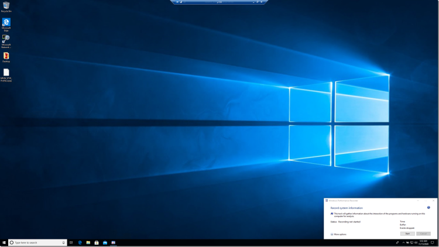
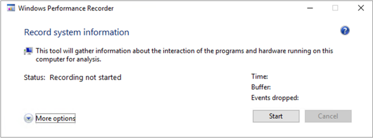

# <a name="troubleshoot-performance-issues-related-to-real-time-protection"></a>疑難排解與即時保護相關的效能問題


[!INCLUDE [Microsoft 365 Defender rebranding](../../includes/microsoft-defender.md)]


**適用於：**

- [適用於端點的 Microsoft Defender](https://go.microsoft.com/fwlink/p/?linkid=2146631)
 
如果您的系統與 Microsoft Defender for Endpoint 中的即時保護服務有高 CPU 使用量或效能問題，您可以將票證提交給 Microsoft 支援人員。 遵循[收集 Microsoft Defender 防毒軟體診斷資料](collect-diagnostic-data.md)中的步驟進行。

身為系統管理員，您也可以自行疑難排解這些問題。 

首先，您可能想要檢查問題是否由其他軟體所導致。 [請與廠商聯繫以取得防病毒排除](#check-with-vendor-for-antivirus-exclusions)。

否則，您可以遵循 [分析 Microsoft Protection 記錄](#analyze-the-microsoft-protection-log)中的步驟，識別哪個軟體與識別的性能問題相關。 

您也可以遵循下列步驟，將您提交的其他記錄提供給 Microsoft 支援：
- [使用進程監視器捕獲處理常式記錄](#capture-process-logs-using-process-monitor)
- [使用 Windows 效能錄製器捕獲效能記錄檔](#capture-performance-logs-using-windows-performance-recorder) 

## <a name="check-with-vendor-for-antivirus-exclusions"></a>向廠商核實防病毒排除

如果您可以輕鬆識別影響系統效能的軟體，請移至軟體廠商的知識文庫或支援中心。 搜尋是否有有關防病毒排除專案的建議。 若廠商的網站沒有，您可以與他們一起開啟支援票證，並要求他們發佈一個。 

我們建議軟體廠商遵循與行業合作的各種指導方針 [，以盡可能減少](https://www.microsoft.com/security/blog/2018/08/16/partnering-with-the-industry-to-minimize-false-positives/)誤報。 廠商可以透過 [Microsoft Defender Security 情報入口網站提交其軟體 (MDSI) ](https://www.microsoft.com/wdsi/filesubmission?persona=SoftwareDeveloper)。


## <a name="analyze-the-microsoft-protection-log"></a>分析 Microsoft 保護記錄

在 **MPLog-xxxxxxxx-xxxxxx** 中，您可以在 *EstimatedImpact* 的情況下，找出執行軟體的預估效能影響資訊：
    
`Per-process counts:ProcessImageName: smsswd.exe, TotalTime: 6597, Count: 1406, MaxTime: 609, MaxTimeFile: \Device\HarddiskVolume3\_SMSTaskSequence\Packages\WQ1008E9\Files\FramePkg.exe, EstimatedImpact: 65%`

| 欄位名稱 | 描述 |
|---|---|
|ProcessImageName | 處理常式影像名稱 |
| TotalTime | 掃描此程式所存取之檔案所花費的累計持續時間（毫秒） |
|計數 | 此處理程式存取的掃描檔數目 |
|MaxTime |  此程式存取之檔案的最長單一掃描的持續時間（毫秒） |
| MaxTimeFile | 此程式所存取之記錄的最長掃描時間的路徑 `MaxTime` |
| EstimatedImpact | 在此程式經歷掃描活動的期間內，掃描此程式所存取之檔案所花費的時間百分比。 |

如果效能影響很高，請遵循[Configure and validate Microsoft Defender 防毒軟體掃描排除](collect-diagnostic-data.md)中的步驟，嘗試將此程式新增至路徑/進程排除。

如果上一個步驟沒有解決問題，您可以在下列各節中透過「程式[監視器](#capture-process-logs-using-process-monitor)」或「 [Windows 效能錄影機](#capture-performance-logs-using-windows-performance-recorder)收集詳細資訊」。
     
## <a name="capture-process-logs-using-process-monitor"></a>使用進程監視器捕獲處理常式記錄

Process Monitor (ProcMon) 是一種可顯示即時處理程式的高級監控工具。 您可以使用此功能，在出現效能問題時進行捕獲。

1. 下載程式將 [3.60](/sysinternals/downloads/procmon) 至資料夾（如所示） `C:\temp` 。

2. 若要移除檔案的網站標記：
    1. 以滑鼠右鍵按一下 [ **ProcessMonitor.zip** ]，然後選取 [ **屬性**]。
    1. 在 [ *一般* ] 索引標籤下，尋找 [ *安全性*]。
    1. 核取方塊旁邊的 [ **解除封鎖**]。
    1. 選取 ****[套用]。
    
     

3. 解壓縮檔， `C:\temp` 以將資料夾路徑 `C:\temp\ProcessMonitor` 。 

4. 將 **ProcMon.exe** 複製到您要進行疑難排解的 Windows 用戶端或 Windows 伺服器。  

5. 在執行 ProcMon 之前，請確定未關閉與高 CPU 使用率問題相關的所有其他應用程式。 這樣做會使要檢查的程式數目降至最低。

6. 您可以透過兩種方式啟動 ProcMon。
    1. 以滑鼠右鍵按一下 **ProcMon.exe** ，然後選取 [以 **系統管理員身分執行**]。 
    

        因為記錄會自動開始，請選取放大鏡圖示以停止目前的捕獲或使用鍵盤快速鍵 **Ctrl + E**。
 
        

        若要確認您已停止捕獲，請檢查放大鏡圖示現在是否出現紅色的 X。

                 

        接下來，若要清除先前的捕獲，請選取橡皮擦圖示。

        

        或使用鍵盤快速鍵 **Ctrl + X**。

    2. 第二種方式是以系統管理員身分執行 **命令列** ，然後從進程監視器路徑執行：

        
 
        ```console
        Procmon.exe /AcceptEula /Noconnect /Profiling
        ```
        
        >[!TIP] 
        >在捕獲資料時，讓 [ProcMon] 視窗盡可能小型，這樣您就能輕鬆地開始及停止追蹤。
        > 
        >
    
7. 遵循步驟6中的其中一個程式之後，您將會看到一個設定篩選的選項。 選取 **[確定]**。 您可以在捕獲完成後，永遠篩選結果。
 
     

8. 若要開始捕獲，請再次選取放大鏡圖示。
     
9. 再現問題。
 
    >[!TIP] 
    >請等候問題完全再現，然後記下追蹤開始時的時間戳記。

10. 當 CPU 使用量高的情況時，有兩到四分鐘的處理常式活動，請選取放大鏡圖示以停止捕獲。

11. 若要以唯一名稱及 pml 格式儲存捕獲，請選取 [檔案] **，然後選取** [ **儲存 ...**]。請務必選取 [ **所有事件** ] 和 [ **原生進程監控] 格式 (PML)** 中的選項按鈕。

    

12. 若要更好地追蹤，請將預設路徑從 `C:\temp\ProcessMonitor\LogFile.PML` 到 `C:\temp\ProcessMonitor\%ComputerName%_LogFile_MMDDYEAR_Repro_of_issue.PML` ：
    - `%ComputerName%` 是裝置名稱
    - `MMDDYEAR` 為月、日、年
    -  `Repro_of_issue` 是您要嘗試再現之問題的名稱

    >[!TIP] 
    > 如果您有正常運作的系統，您可能想要取得範例記錄以進行比較。

13. 請壓縮 pml 檔案，並將它提交給 Microsoft 支援部門。


## <a name="capture-performance-logs-using-windows-performance-recorder"></a>使用 Windows 效能錄製器捕獲效能記錄檔

您可以使用 Windows 效能錄影機 (WPR) ，以在提交給 Microsoft 支援人員時包含其他資訊。 WPR 是一種強大的錄製工具，可為 Windows 錄製建立事件追蹤。 

WPR 是 Windows 評估與部署套件 (Windows ADK) 的一部分，而且可以從下載下載[並安裝 Windows ADK](/windows-hardware/get-started/adk-install)。 您也可以在[Windows 10 SDK](https://developer.microsoft.com/windows/downloads/windows-10-sdk/)的 Windows 10 軟體發展套件中下載它。

您可以使用 WPR 使用者介面，遵循透過 [WPR UI 捕獲效能記錄](#capture-performance-logs-using-the-wpr-ui)中的步驟。 

或者，您也可以使用 [WPR CLI 取得效能記錄](#capture-performance-logs-using-the-wpr-cli)檔中的步驟，使用命令列工具 *wpr.exe*，可在 Windows 8 和更新版本中使用。


### <a name="capture-performance-logs-using-the-wpr-ui"></a>使用 WPR UI 捕獲效能記錄

>[!TIP]
>如果有多個裝置發生問題，請使用具有最多 RAM 的一個裝置。

1. 下載並安裝 WPR。

2. 在 *Windows 工具組*] 底下，以滑鼠右鍵按一下 [ **Windows 效能錄製**]。 

    ![[開始] 功能表](images/wpr-01.png)

    選取 [ **更多**]。 選取 [以 **系統管理員身分執行**]。

3. 出現 [使用者帳戶控制] 對話方塊時，選取 [ **是]**。

    

4. 接下來，下載 [Microsoft Defender For Endpoint 分析](https://github.com/YongRhee-MDE/Scripts/blob/master/MDAV.wprp) 設定檔，並將其另存為 `MDAV.wprp` 資料夾（如） `C:\temp` 。 
     
5. 在 [WPR] 對話方塊中，選取 [ **更多選項**]。

    

6. 選取 [ **新增設定檔** ]，然後流覽至檔案的路徑 `MDAV.wprp` 。

7. 之後，您應該會在它底下的 [ *Microsoft Defender For Endpoint analysis* *] 下看到* 新的設定檔集。

    

    >[!WARNING]
    >如果 Windows 伺服器的 RAM 為 64 GB 或以上，請使用自訂度量， `Microsoft Defender for Endpoint analysis for large servers` 而不要使用 `Microsoft Defender for Endpoint analysis` 。 否則，您的系統可能會耗用大量的非分頁集區記憶體或緩衝區，可能會導致系統不穩定。 您可以透過展開 **資源分析** 來選擇要新增的設定檔。 這個自訂設定檔提供深入效能分析所需的內容。
 
8. 若要在 WPR UI 中使用自訂度量值 Microsoft Defender for Endpoint verbose analysis profile：

    1. 確定在 *第一層會審*、 *資源分析* 和 *案例分析* 群組下沒有選取設定檔。
    2. 選取 [ **自訂測量**]。
    3. 選取 [ **Microsoft Defender For Endpoint analysis**]。
    4. 選取 **詳細***資料* 層級。
    1. 選取 [記錄模式] **底下的 [** 檔案] 或 [ **記憶體** ]。 

    >[!important]
    >當使用者可以直接再現效能問題 *時，應選取 [* 檔案] 以使用檔記錄模式。 大多數問題都屬於這類類別。 不過，如果使用者無法直接再現問題，但是只要發生問題，使用者就應該選取 [ *記憶體* ]，以使用記憶體記錄模式。 這可確保追蹤記錄檔不會因長期的執行時間而過度膨脹。

9. 現在您已經準備好收集資料。 請退出所有與再現效能問題無關的應用程式。 您可以選取 [ **隱藏選項** ]，將 WPR 視窗所佔用的空間變小。

    

    >[!TIP]
    >嘗試以整數秒數秒開始追蹤。 例如，01:30:00。 這可讓您更輕鬆地分析資料。 此外，請嘗試追蹤完全在問題再現時的時間戳記。

10. 選取 [開始]。

    

11. 再現問題。

    >[!TIP]
    >將資料收集保留在五分鐘內。 在收集大量資料後，有兩到三分鐘是很好的範圍。

12. 選取 [儲存]。

    ![選取 [儲存]](images/wpr-10.png)

13. 填寫 **問題的詳細描述中的類型：** 包括有關問題的資訊以及再現問題的方式。

    

    1. 選取檔案名 **：** 以決定儲存追蹤檔案的位置。 根據預設，1.is 會儲存至 `%user%\Documents\WPR Files\` 。
    1. 選取 [儲存]。

14. 正在合併追蹤，請稍候。

    

15. 儲存追蹤後，選取 [ **開啟資料夾**]。

    

    將您提交的檔案和資料夾都包含在 Microsoft 支援檔中。

    

### <a name="capture-performance-logs-using-the-wpr-cli"></a>使用 WPR CLI 捕獲效能記錄

命令列工具 *wpr.exe* 是以 Windows 8 開頭的作業系統的一部分。 若要使用命令列工具 wpr.exe 收集 WPR 追蹤，請執行下列動作：

1. 下載 **[Microsoft Defender For Endpoint 分析](https://github.com/YongRhee-MDE/Scripts/blob/master/MDAV.wprp)** 設定檔，以取得 `MDAV.wprp` 在本機目錄（如）中指定的檔案效能追蹤 `C:\traces` 。

3. 在 [開始]**功能表** 圖示上按一下滑鼠右鍵，然後選取 [ **Windows PowerShell (admin)** 或 **命令提示字元 (admin)** ，以開啟系統管理員命令提示字元視窗。

4. 出現 [使用者帳戶控制] 對話方塊時，選取 [ **是]**。

5. 在 [提升] 提示中執行下列命令，以啟動 Microsoft Defender for Endpoint 效能追蹤：

    ```console
    wpr.exe -start C:\traces\MDAV.wprp!WD.Verbose -filemode
    ```
    
    >[!WARNING]
    >如果您的 Windows 伺服器有 64 GB 或 RAM 以上，請使用設定檔 `WDForLargeServers.Light` ， `WDForLargeServers.Verbose` 而不是設定檔和設定檔 `WD.Light` `WD.Verbose` 。 否則，您的系統可能會耗用大量的非分頁集區記憶體或緩衝區，可能會導致系統不穩定。

6. 再現問題。

    >[!TIP]
    >將資料收集保留5分鐘以上。  視案例而定，在收集大量資料後，兩到三分鐘是一個很好的範圍。

7. 在 [提升] 提示中執行下列命令，以停止效能追蹤，並確定提供有關問題的資訊以及再現問題的方式：

    ```console
    wpr.exe -stop merged.etl "Timestamp when the issue was reproduced, in HH:MM:SS format" "Description of the issue" "Any error that popped up"
    ```

8. 請稍候，直到合併追蹤。 

9. 將您提交的檔案和資料夾都包含在 Microsoft 支援檔中。

## <a name="see-also"></a>請參閱

- [收集 Microsoft Defender 防毒軟體診斷資料](collect-diagnostic-data.md)
- [設定及驗證 Microsoft Defender 防毒軟體掃描的排除專案](configure-exclusions-microsoft-defender-antivirus.md)
