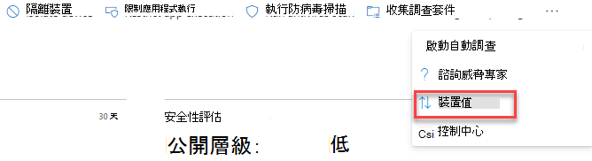
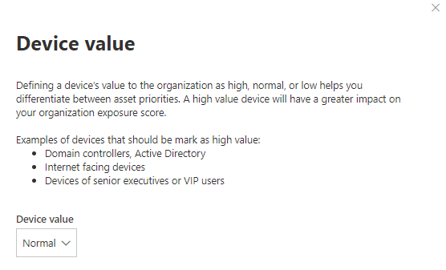

# 指派裝置價值-威脅和弱點管理

[!INCLUDE [Microsoft 365 Defender rebranding](../../includes/microsoft-defender.md)]

**適用於：**

- [適用於端點的 Microsoft Defender](https://go.microsoft.com/fwlink/?linkid=2154037)
- [威脅與弱點管理](next-gen-threat-and-vuln-mgt.md)
- [Microsoft 365 Defender](https://go.microsoft.com/fwlink/?linkid=2118804)

> 想要體驗 Microsoft Defender for Endpoint？ [註冊免費試用版。](https://www.microsoft.com/microsoft-365/windows/microsoft-defender-atp?ocid=docs-wdatp-portaloverview-abovefoldlink)

[!include[Prerelease information](../../includes/prerelease.md)]

定義裝置的值可協助您區分資產優先順序。 裝置值用於將個別資產的風險 appetite 納入威脅和弱點管理洩密評分計算中。 指派為 "高值" 的裝置會獲得更多權重。

您也可以使用 [ [設定裝置值] API](set-device-value.md)。

裝置值選項：

- 低
- 一般 (預設值)
- 高

應指派高值之裝置的範例：

- 網域控制站、Active Directory
- 網際網路對向裝置
- VIP 裝置
- 主控內部/外部生產服務的裝置

## 選擇設備值

1. 流覽至任一裝置頁面，最簡單的地方是來自設備庫存。

2. 從頁面頂端的 [動作] 欄旁邊的三個點選取 [ **裝置值** ]。

    

3. 快顯視窗會顯示目前的裝置值及其意義。 請複查裝置的值，並選擇最適合您的裝置的值。

## 裝置價值如何影響曝光分數

曝光得分是所有裝置的加權平均。 如果您有裝置群組，也可以依設備群組篩選排名。

- 一般裝置的重量為1
- 低價值裝置的重量為0.75
- 高值裝置的重量為 NumberOfAssets/10。
    - 如果您有100裝置，則每個高值裝置的重量為 10 (100/10) 

## 相關主題

- [威脅和弱點管理概述](next-gen-threat-and-vuln-mgt.md)
- [披露分數](tvm-exposure-score.md)
- [API](next-gen-threat-and-vuln-mgt.md#apis)