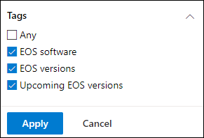
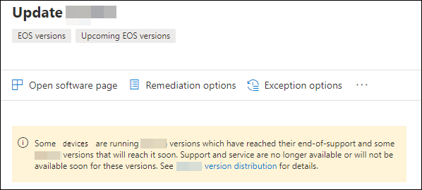
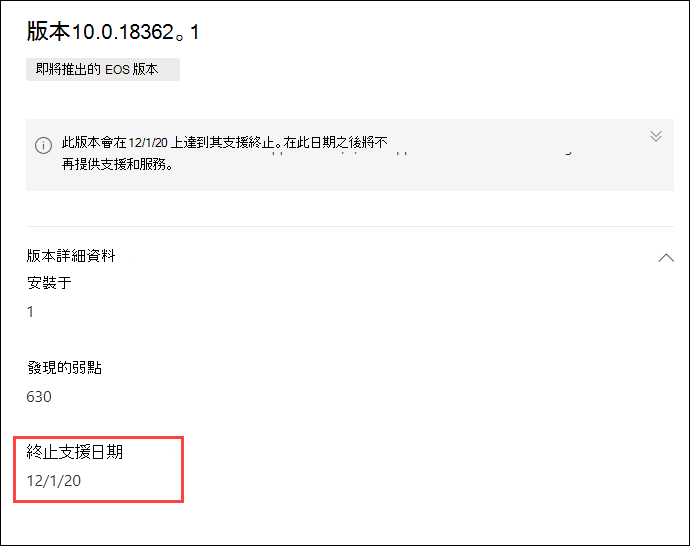

# 使用威脅與弱點管理規劃支援終止的軟體和軟體版本

[!INCLUDE [Microsoft 365 Defender rebranding](../../includes/microsoft-defender.md)]

**適用於：**

- [適用於端點的 Microsoft Defender](https://go.microsoft.com/fwlink/?linkid=2154037)
- [威脅及弱點管理](next-gen-threat-and-vuln-mgt.md)
- [Microsoft 365 Defender](https://go.microsoft.com/fwlink/?linkid=2118804)

>想要體驗適用於端點的 Microsoft Defender 嗎？ [注册免費試用版。](https://www.microsoft.com/microsoft-365/windows/microsoft-defender-atp?ocid=docs-wdatp-portaloverview-abovefoldlink)

支援終止的 (EOS) （也稱為生命週期結束 (EOL) ）軟體或軟體版本表示其不再支援或服務，且不會收到安全性更新。 當您使用已結束支援的軟體或軟體版本時，您會公開組織面臨安全性弱點、法律和財務風險。

重要的是要讓安全性和 IT 系統管理員共同運作，並確定組織的軟體清查已設定為取得最佳結果、規範，以及狀況良好的網路生態系統。 他們應該檢查選項，以移除或取代已到達支援終止的應用程式，以及已不再支援之更新版本的應用程式。 在支援日期結束之前，最好 **先** 建立及實施方案。

>[!NOTE]
> 目前僅適用于 Windows 產品的支援能力。

## 尋找已不再支援的軟體或軟體版本

1. 從 [威脅與弱點管理] 功能表中，流覽至 [[**安全性建議**](tvm-security-recommendation.md)]。
2. 移至 [ **篩選** ] 面板，然後尋找 [標記] 區段。 選取一個或多個 EOS 標記選項。 然後 **套用**。

    

3. 您將會看到軟體的相關建議清單，其中包含結束支援、軟體版本（支援終止），或有即將推出的支援終止版本。 這些標記也會顯示在 [ [軟體清查](tvm-software-inventory.md) ] 頁面中。

    

## 版本清單及日期

若要查看已到達支援終止的版本清單，或不久的 [結束] 或 [支援]，以及這些日期，請遵循下列步驟：

1. 在已到達支援終止版本的軟體的安全性建議浮出性中，會顯示一則訊息，否則即將提供支援終止。

    

2. 選取 [ **版本發行** 連結]，以移至軟體深入查看頁面。 在此，您可以看見篩選過的版本清單，並將標記識別為終止支援或即將推出的支援結束。

    

3. 選取表格中要開啟的其中一個版本。 例如，版本10.0.18362.1。 浮出的浮出狀態會出現在 [支援日期結束]。

    

一旦您識別出受支援終止的軟體和軟體版本，您必須決定是否要從組織更新或移除。 這樣做會降低組織面臨的漏洞和高級持續威脅。

## 相關主題

- [威脅與弱點管理概述](next-gen-threat-and-vuln-mgt.md)
- [安全性建議](tvm-security-recommendation.md)
- [軟體庫存](tvm-software-inventory.md)
