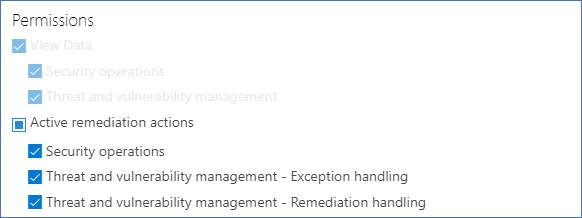
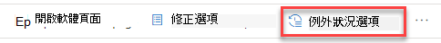
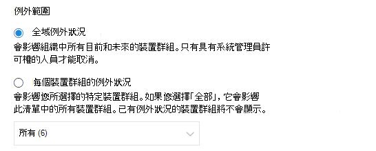

# 建立及查看安全性建議的例外狀況-威脅和弱點管理

[!INCLUDE [Microsoft 365 Defender rebranding](../../includes/microsoft-defender.md)]

**適用於：**

- [適用於端點的 Microsoft Defender](https://go.microsoft.com/fwlink/?linkid=2154037)
- [威脅與弱點管理](next-gen-threat-and-vuln-mgt.md)
- [Microsoft 365 Defender](https://go.microsoft.com/fwlink/?linkid=2118804)

>想要體驗適用於端點的 Microsoft Defender 嗎？ [注册免費試用版。](https://www.microsoft.com/microsoft-365/windows/microsoft-defender-atp?ocid=docs-wdatp-portaloverview-abovefoldlink)

如果目前沒有相關建議，則為修正要求的替代，您可以為建議建立例外狀況。 如果您的組織有裝置群組，您就可以將例外狀況限定為特定裝置群組。 您可以為選取的裝置群組或所有已過去及呈現的裝置群組建立例外狀況。  

針對建議建立例外狀況時，建議在例外期限結束之前不會作用。 建議狀態會變更為設備群組)  (的 **完整例外** 狀況或 **部分例外** 狀況。

## 權限

只有「例外狀況處理」許可權的使用者才能管理例外狀況 (包括建立或取消) 。 [深入瞭解 RBAC 角色](user-roles.md)。

## 建立例外狀況

選取您要為其建立例外狀況的安全性建議，然後選取 [ **例外狀況選項** ] 並填寫表單。  

### 依設備群組的例外狀況

將例外狀況套用至所有目前的裝置群組，或選擇 [特定裝置群組]。 未來的裝置群組不會包含在例外狀況中。 已有例外狀況的裝置群組不會顯示在清單中。 如果您只選取特定裝置群組，建議狀態會從「active」變更為「部分例外」。 如果您選取所有的裝置群組，則狀態會變更為「完全例外」。

#### 篩選的視圖

如果您已在任何威脅和弱點管理頁面上以裝置群組篩選，則只有篩選的裝置群組會顯示為 [選項]。

在任何威脅和弱點管理頁面上，按裝置群組篩選的按鈕： 

具有篩選裝置群組的例外狀況視圖：

#### 大量的裝置群組

如果您的組織擁有超過20個裝置群組，請選取 [篩選的裝置群組] 選項旁的 [ **編輯** ]。

快顯視窗會出現，您可以在其中搜尋及選擇您想要包含的裝置群組。 選取 [搜尋] 下的核取記號圖示，即可勾選/取消全部選取。

### 全域例外狀況

如果您有全域系統管理員許可權，您就可以建立和取消全域例外狀況。 它會影響組織中的 **所有** 目前和未來裝置群組，且只有具有類似許可權的使用者才能加以變更。 建議狀態會從「active」變更為「完整例外狀況」。

請記住下列事項：

- 如果建議位於全域例外狀況底下，則新建立的裝置群組例外狀況會暫停，直到全域例外狀況到期或取消為止。 在該點之後，新的裝置群組例外會生效，直到它們到期為止。
- 如果建議已有特定裝置群組的例外狀況，且已建立全域例外狀況，則裝置群組例外會暫停，直到它到期或全域例外會在到期之前取消。

### 理由

選取您需要檔案的例外狀況，而不是修正問題的安全性建議。 填寫對齊內容，然後設定例外期限。

下列清單詳述例外狀況選項背後的合理性論證：

- **協力廠商控制** -協力廠商的產品或軟體已經解決此建議-選擇此理由類型會降低您的披露分數，並增加您的安全分數，因為您的風險已降低
- **替代的緩解** -內部工具已經解決此建議-選擇此調整類型會降低曝光分數，並增加您的安全分數，因為您的風險已降低
- 已 **接受風險**-引起低風險和/或實施建議太昂貴
- 已計畫 **修正 (寬限)** -已計畫，但正等候執行或授權

## 全部查看例外狀況

流覽至 [**修正**] 頁面中的 [**例外** 狀況] 索引標籤。 您可以依論證、類型及狀態進行篩選。

 選取 [例外狀況] 開啟具有更多詳細資料的浮出控制項。 每個裝置群組的例外狀況會包含例外狀況涵蓋的每一個裝置群組的清單，您可以將其匯出。 您也可以查看相關的建議或取消例外狀況。

![顯示 [修正] 頁面中的「例外狀況」索引標籤。](images/tvm-exception-view.png)

## 如何取消例外狀況

若要取消例外狀況，請流覽至 [**修正**] 頁面中的 [**例外** 狀況] 索引標籤。 選取例外狀況。

若要取消所有裝置群組或全域例外狀況的例外狀況，請選取 [ **所有設備群組的取消例外** 狀況] 按鈕。 您將只能取消您具有許可權之裝置群組的例外狀況。

![[取消] 按鈕。](images/tvm-exception-cancel.png)

### 取消特定裝置群組的例外狀況

選取特定裝置群組以取消例外狀況。 裝置群組會顯示快顯視窗，您可以選取 [ **取消例外** 狀況]。

## 在套用例外狀況之後查看影響

在 [安全性建議] 頁面中，選取 [**自訂欄位**]，然後在例外狀況) 和 **影響 (例外狀況) 之後**，選取 [已 **公開的裝置 (** ] 方塊。

![顯示 [自訂欄位] 選項。](images/tvm-after-exceptions.png)

在例外狀況) 欄 (的公開裝置會顯示在套用例外規則之後，仍然對漏洞公開的剩餘裝置。 影響洩密的例外狀況調整包括「協力廠商控制項」和「替代緩解」。 其他理由不會降低設備的暴露程度，而且仍然會被視為公開。

「例外狀況」) 之後所產生的影響 (會顯示對嚴重性或安全性分數套用例外狀況後的剩餘影響。 影響分數的例外狀況調整包括「協力廠商控制」和「替代緩解」。 其他理由不會降低設備的暴露程度，因此曝光度和安全分數不會變更。

## 相關主題

- [威脅和弱點管理概述](next-gen-threat-and-vuln-mgt.md)
- [修正安全性漏洞](tvm-remediation.md)
- [安全性建議](tvm-security-recommendation.md)
- [暴險分數](tvm-exposure-score.md)
- [裝置用 Microsoft 安全分數](tvm-microsoft-secure-score-devices.md)
