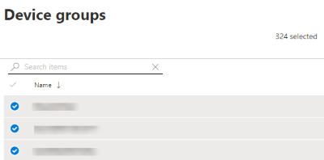

# 建立及查看安全性建議的例外狀況-威脅和弱點管理Create and view exceptions for security recommendations - threat and vulnerability management

[!INCLUDE [Microsoft 365 Defender rebranding](../../includes/microsoft-defender.md)]

**適用於：****Applies to:**

- [適用於端點的 Microsoft DefenderMicrosoft Defender for Endpoint](https://go.microsoft.com/fwlink/?linkid=2154037)
- [威脅與弱點管理Threat and vulnerability management](next-gen-threat-and-vuln-mgt.md)
- [Microsoft 365 DefenderMicrosoft 365 Defender](https://go.microsoft.com/fwlink/?linkid=2118804)

>想要體驗 Microsoft Defender for Endpoint？Want to experience Microsoft Defender for Endpoint? [註冊免費試用版。Sign up for a free trial.](https://www.microsoft.com/microsoft-365/windows/microsoft-defender-atp?ocid=docs-wdatp-portaloverview-abovefoldlink)

如果目前沒有相關建議，則為修正要求的替代，您可以為建議建立例外狀況。As an alternative to a remediation request when a recommendation is not relevant at the moment, you can create exceptions for recommendations. 如果您的組織有裝置群組，您就可以將例外狀況限定為特定裝置群組。If your organization has device groups, you will be able to scope the exception to specific device groups. 您可以為選取的裝置群組或所有已過去及呈現的裝置群組建立例外狀況。Exceptions can either be created for selected device groups, or for all device groups past and present.  

針對建議建立例外狀況時，建議在例外期限結束之前不會作用。When an exception is created for a recommendation, the recommendation will not be active until the end of the exception duration. 建議狀態會變更為設備群組)  (的 **完整例外** 狀況或 **部分例外** 狀況。The recommendation state will change to **Full exception** or **Partial exception** (by device group).

## 權限Permissions

只有「例外狀況處理」許可權的使用者才能管理例外狀況 (包括建立或取消) 。Only users with “exceptions handling” permissions can manage exceptions (including creating or canceling). [深入瞭解 RBAC 角色](user-roles.md)。[Learn more about RBAC roles](user-roles.md).

## 建立例外狀況Create an exception

選取您要為其建立例外狀況的安全性建議，然後選取 [ **例外狀況選項** ] 並填寫表單。Select a security recommendation you would like create an exception for, and then select **Exception options** and fill out the form.  

### 依設備群組的例外狀況Exception by device group

將例外狀況套用至所有目前的裝置群組，或選擇 [特定裝置群組]。Apply the exception to all current device groups or choose specific device groups. 未來的裝置群組不會包含在例外狀況中。Future device groups won't be included in the exception. 已有例外狀況的裝置群組不會顯示在清單中。Device groups that already have an exception will not be displayed in the list. 如果您只選取特定裝置群組，建議狀態會從「active」變更為「部分例外」。If you only select certain device groups, the recommendation state will change from “active” to “partial exception.” 如果您選取所有的裝置群組，則狀態會變更為「完全例外」。The state will change to “full exception” if you select all the device groups.

#### 篩選的視圖Filtered views

如果您已在任何威脅和弱點管理頁面上以裝置群組篩選，則只有篩選的裝置群組會顯示為 [選項]。If you have filtered by device group on any of the threat and vulnerability management pages, only your filtered device groups will appear as options.

在任何威脅和弱點管理頁面上，按裝置群組篩選的按鈕：This is the button to filter by device group on any of the threat and vulnerability management pages: 

具有篩選裝置群組的例外狀況視圖：Exception view with filtered device groups:

#### 大量的裝置群組Large number of device groups

如果您的組織擁有超過20個裝置群組，請選取 [篩選的裝置群組] 選項旁的 [ **編輯** ]。If your organization has more than 20 device groups, select **Edit** next to the filtered device group option.

快顯視窗會出現，您可以在其中搜尋及選擇您想要包含的裝置群組。A flyout will appear where you can search and choose device groups you want included. 選取 [搜尋] 下的核取記號圖示，即可勾選/取消全部選取。Select the check mark icon below Search to check/uncheck all.

### 全域例外狀況Global exceptions

如果您有全域系統管理員許可權，您就可以建立和取消全域例外狀況。If you have global administrator permissions, you will be able to create and cancel a global exception. 它會影響組織中的 **所有** 目前和未來裝置群組，且只有具有類似許可權的使用者才能加以變更。It affects **all** current and future device groups in your organization, and only a user with similar permission would be able to change it. 建議狀態會從「active」變更為「完整例外狀況」。The recommendation state will change from “active” to “full exception.”

請記住下列事項：Some things to keep in mind:

- 如果建議位於全域例外狀況底下，則新建立的裝置群組例外狀況會暫停，直到全域例外狀況到期或取消為止。If a recommendation is under global exception, then newly created exceptions for device groups will be suspended until the global exception has expired or been cancelled. 在該點之後，新的裝置群組例外會生效，直到它們到期為止。After that point, the new device group exceptions will go into effect until they expire.
- 如果建議已有特定裝置群組的例外狀況，且已建立全域例外狀況，則裝置群組例外會暫停，直到它到期或全域例外會在到期之前取消。If a recommendation already has exceptions for specific device groups and a global exception is created, then the device group exception will be suspended until it expires or the global exception is cancelled before it expires.

### 理由Justification

選取您需要檔案的例外狀況，而不是修正問題的安全性建議。Select your justification for the exception you need to file instead of remediating the security recommendation in question. 填寫對齊內容，然後設定例外期限。Fill out the justification context, then set the exception duration.

下列清單詳述例外狀況選項背後的合理性論證：The following list details the justifications behind the exception options:

- **協力廠商控制** -協力廠商的產品或軟體已經解決此建議-選擇此理由類型會降低您的披露分數，並增加您的安全分數，因為您的風險已降低**Third party control** - A third party product or software already addresses this recommendation       - Choosing this justification type will lower your exposure score and increase your secure score because your risk is reduced
- **替代的緩解** -內部工具已經解決此建議-選擇此調整類型會降低曝光分數，並增加您的安全分數，因為您的風險已降低**Alternate mitigation** - An internal tool already addresses this recommendation       - Choosing this justification type will lower your exposure score and increase your secure score because your risk is reduced
- 已 **接受風險**-引起低風險和/或實施建議太昂貴**Risk accepted** - Poses low risk and/or implementing the recommendation is too expensive
- 已計畫 **修正 (寬限)** -已計畫，但正等候執行或授權**Planned remediation (grace)** - Already planned but is awaiting execution or authorization

## 全部查看例外狀況View all exceptions

流覽至 [**修正**] 頁面中的 [**例外** 狀況] 索引標籤。Navigate to the **Exceptions** tab in the **Remediation** page. 您可以依論證、類型及狀態進行篩選。You can filter by justification, type, and status.

 選取 [例外狀況] 開啟具有更多詳細資料的浮出控制項。Select an exception to open a flyout with more details. 每個裝置群組的例外狀況會包含例外狀況涵蓋的每一個裝置群組的清單，您可以將其匯出。Exceptions per devices group will have a list of every device group the exception covers, which you can export. 您也可以查看相關的建議或取消例外狀況。You can also view the related recommendation or cancel the exception.

![顯示 [修正] 頁面中的「例外狀況」索引標籤。](images/tvm-exception-view.png)

## 如何取消例外狀況How to cancel an exception

若要取消例外狀況，請流覽至 [**修正**] 頁面中的 [**例外** 狀況] 索引標籤。To cancel an exception, navigate to the **Exceptions** tab in the **Remediation** page. 選取例外狀況。Select the exception.

若要取消所有裝置群組或全域例外狀況的例外狀況，請選取 [ **所有設備群組的取消例外** 狀況] 按鈕。To cancel the exception for all device groups or for a global exception, select the **Cancel exception for all device groups** button. 您將只能取消您具有許可權之裝置群組的例外狀況。You will only be able to cancel exceptions for device groups you have permissions for.

![[取消] 按鈕。](images/tvm-exception-cancel.png)

### 取消特定裝置群組的例外狀況Cancel the exception for a specific device group

選取特定裝置群組以取消例外狀況。Select the specific device group to cancel the exception for it. 裝置群組會顯示快顯視窗，您可以選取 [ **取消例外** 狀況]。A flyout will appear for the device group, and you can select **Cancel exception**.

## 在套用例外狀況之後查看影響View impact after exceptions are applied

在 [安全性建議] 頁面中，選取 [**自訂欄位**]，然後在例外狀況) 和 **影響 (例外狀況) 之後**，選取 [已 **公開的裝置 (** ] 方塊。In the Security Recommendations page, select **Customize columns** and check the boxes for **Exposed devices (after exceptions)** and **Impact (after exceptions)**.

![顯示 [自訂欄位] 選項。](images/tvm-after-exceptions.png)

在例外狀況) 欄 (的公開裝置會顯示在套用例外規則之後，仍然對漏洞公開的剩餘裝置。The exposed devices (after exceptions) column shows the remaining devices that are still exposed to vulnerabilities after exceptions are applied. 影響洩密的例外狀況調整包括「協力廠商控制項」和「替代緩解」。Exception justifications that affect the exposure include ‘third party control’ and ‘alternate mitigation’. 其他理由不會降低設備的暴露程度，而且仍然會被視為公開。Other justifications do not reduce the exposure of a device, and they are still considered exposed.

「例外狀況」) 之後所產生的影響 (會顯示對嚴重性或安全性分數套用例外狀況後的剩餘影響。The impact (after exceptions) shows remaining impact to exposure score or secure score after exceptions are applied. 影響分數的例外狀況調整包括「協力廠商控制」和「替代緩解」。Exception justifications that affect the scores include ‘third party control’ and ‘alternate mitigation.’ 其他理由不會降低設備的暴露程度，因此曝光度和安全分數不會變更。Other justifications do not reduce the exposure of a device, and so the exposure score and secure score do not change.

## 相關主題Related topics

- [威脅和弱點管理概述Threat and vulnerability management overview](next-gen-threat-and-vuln-mgt.md)
- [修正安全性漏洞Remediate vulnerabilities](tvm-remediation.md)
- [安全性建議Security recommendations](tvm-security-recommendation.md)
- [暴險分數Exposure score](tvm-exposure-score.md)
- [裝置用 Microsoft 安全分數Microsoft Secure Score for Devices](tvm-microsoft-secure-score-devices.md)
