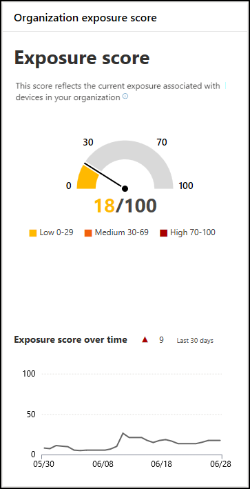

# 披露分數-威脅和弱點管理

[!INCLUDE [Microsoft 365 Defender rebranding](../../includes/microsoft-defender.md)]

**適用於：**

- [適用於端點的 Microsoft Defender](https://go.microsoft.com/fwlink/?linkid=2154037)
- [威脅與弱點管理](next-gen-threat-and-vuln-mgt.md)
- [Microsoft 365 Defender](https://go.microsoft.com/fwlink/?linkid=2118804)

>想要體驗 Microsoft Defender for Endpoint？ [註冊免費試用版。](https://www.microsoft.com/microsoft-365/windows/microsoft-defender-atp?ocid=docs-wdatp-portaloverview-abovefoldlink)

您的披露分數會顯示在 Microsoft Defender 安全中心的 [ [威脅與弱點管理] 儀表板](tvm-dashboard-insights.md) 中。 它會反映您的組織 cybersecurity 威脅的漏洞。 低暴露分數表示您的裝置不易受到攻擊。

- 快速瞭解及識別您組織中的安全性狀態的高層次優點。
- 偵測並回應需要調查的區域，或採取動作以改善目前狀態。
- 與同行和管理有關安全性工作影響的通訊。

這張卡片為您提供一段時間的公開得分趨勢的高層級。 圖表中的任何峰值可讓您直觀地指出您可以進一步調查的高 cybersecurity 威脅危險性。

## 運作方式

曝光分數分為下列層級：

- 0–29：低曝光分數
- 30–69：中度曝光分數
- 70–100：高暴露程度分數

您可以根據已設定優先順序的 [安全性建議](tvm-security-recommendation.md) ，修正問題，以降低暴露分數。 每個軟體都有缺點，會根據組織面臨的風險，加以轉換為建議並設定優先順序。

## 減少威脅和弱點洩密

修正 [安全性建議](tvm-security-recommendation.md)，以降低威脅和弱點的危險性。 透過修正安全性上的建議（可以在 [威脅和弱點管理儀表板](tvm-dashboard-insights.md)中查看），充分影響您的暴露分數。

## 相關主題

- [威脅和弱點管理概述](next-gen-threat-and-vuln-mgt.md)
- [適用于裝置的 Microsoft 安全分數](tvm-microsoft-secure-score-devices.md)
- [安全性建議](tvm-security-recommendation.md)
- [事件時程表](threat-and-vuln-mgt-event-timeline.md)
