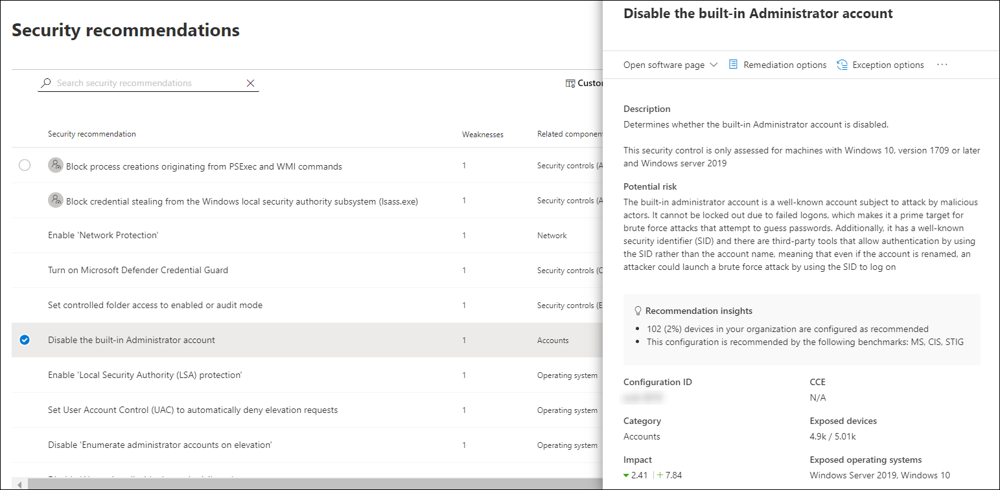
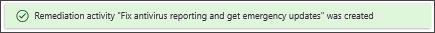
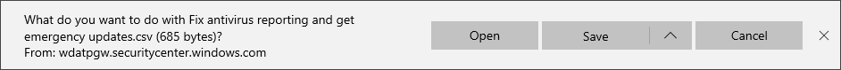

# 裝置用 Microsoft 安全分數Microsoft Secure Score for Devices

[!INCLUDE [Microsoft 365 Defender rebranding](../../includes/microsoft-defender.md)]

**適用於：****Applies to:**

- [適用於端點的 Microsoft DefenderMicrosoft Defender for Endpoint](https://go.microsoft.com/fwlink/?linkid=2154037)
- [威脅及弱點管理Threat and vulnerability management](next-gen-threat-and-vuln-mgt.md)
- [Microsoft 365 DefenderMicrosoft 365 Defender](https://go.microsoft.com/fwlink/?linkid=2118804)

> 想要體驗 Defender for Endpoint？Want to experience Defender for Endpoint? [注册免費試用版。Sign up for a free trial.](https://www.microsoft.com/microsoft-365/windows/microsoft-defender-atp?ocid=docs-wdatp-pullalerts-abovefoldlink) 

>[!NOTE]
> 設定分數現在是裝置威脅與弱點管理的一部分，成為裝置的 Microsoft 安全分數。Configuration score is now part of threat and vulnerability management as Microsoft Secure Score for Devices.

您的裝置得分會顯示在 Microsoft Defender 資訊安全中心的[威脅與弱點管理儀表板](tvm-dashboard-insights.md)中。Your score for devices is visible in the [threat and vulnerability management dashboard](tvm-dashboard-insights.md) of the Microsoft Defender Security Center. 針對裝置的 Microsoft 安全分數較高表示您的端點對 cybersecurity 威脅攻擊的彈性程度較高。A higher Microsoft Secure Score for Devices means your endpoints are more resilient from cybersecurity threat attacks. 它會反映各類裝置的集合安全性設定狀態，其方式如下：It reflects the collective security configuration state of your devices across the following categories:

- 應用程式Application
- 作業系統Operating system
- 網路Network
- 帳戶Accounts
- 安全性控制Security controls

選取類別以移至 [ [**安全性建議**](tvm-security-recommendation.md) ] 頁面，然後查看相關的建議。Select a category to go to the [**Security recommendations**](tvm-security-recommendation.md) page and view the relevant recommendations.

## 開啟 Microsoft Secure 得分連接器Turn on the Microsoft Secure Score connector

轉寄 Microsoft Defender for Endpoint 信號，讓 Microsoft 安全分數能夠看到裝置安全狀況。Forward Microsoft Defender for Endpoint signals, giving Microsoft Secure Score visibility into the device security posture. 轉寄的資料會與您的 Microsoft 安全分數資料儲存在相同的位置。Forwarded data is stored and processed in the same location as your Microsoft Secure Score data.

變更可能需要數小時的時間，才能在儀表板中反映。Changes might take up to a few hours to reflect in the dashboard.

1. 在功能窗格中，移至 **設定**  >  **高級功能**In the navigation pane, go to **Settings** > **Advanced features** 

2. 向左下往 **Microsoft 安全分數** ，將設定切換為 [ **開啟**]。Scroll down to **Microsoft Secure Score** and toggle the setting to **On**.

3. 選取 [ **儲存喜好** 設定]。Select **Save preferences**.

## 運作方式How it works

>[!NOTE]
> 目前裝置的 Microsoft 安全評分支援透過「群組原則」設定的設定。Microsoft Secure Score for Devices currently supports configurations set via Group Policy. 由於目前的部分 Intune 支援，可能已透過 Intune 設定的設定會因設定錯誤而顯示。Due to the current partial Intune support, configurations which might have been set through Intune might show up as misconfigured. 當您的組織使用 Intune 進行安全設定管理時，請與您的 IT 系統管理員聯繫，以確認實際的設定狀態。Contact your IT Administrator to verify the actual configuration status in case your organization is using Intune for secure configuration management.

[裝置的 Microsoft 安全計分] 中的資料是 meticulous 和日常弱點探索程式的產品。The data in the Microsoft Secure Score for Devices card is the product of meticulous and ongoing vulnerability discovery process. 它會以持續進行的設定探索評估進行匯總：It is aggregated with configuration discovery assessments that continuously:

- 比較收集的基準與收集的基準，以發現配置錯誤的資產Compare collected configurations to the collected benchmarks to discover misconfigured assets
- 將設定對應至可修正或部分修正的漏洞 (風險降低) Map configurations to vulnerabilities that can be remediated or partially remediated (risk reduction)
- 收集及維護最佳作法設定基準 (廠商、安全性摘要、內部研究小組) Collect and maintain best practice configuration benchmarks (vendors, security feeds, internal research teams)
- 從所有資產收集及監視安全性控制設定狀態的變更Collect and monitor changes of security control configuration state from all assets

## 提升您的安全性設定Improve your security configuration

修正安全性建議清單中的問題，以改善安全性設定。Improve your security configuration by remediating issues from the security recommendations list. 當您這麼做時，裝置的 Microsoft 安全評分會提升，而且您的組織會變得更具彈性，以防禦 cybersecurity 威脅和弱點。As you do so, your Microsoft Secure Score for Devices improves and your organization becomes more resilient against cybersecurity threats and vulnerabilities.

1. 從威脅與弱點管理儀表板中的 [裝置] 的 [Microsoft Secure 得分] 中，選取其中一個類別。From the Microsoft Secure Score for Devices card in the threat and vulnerability management dashboard, select the one of the categories. 您將會看到與該類別相關的建議清單。You'll view the list of recommendations related to that category. 將會帶您前往 [ [**安全性建議**](tvm-security-recommendation.md) ] 頁面。It will take you to the [**Security recommendations**](tvm-security-recommendation.md) page. 如果您想要查看所有安全性建議，只要您到達 [安全性建議] 頁面，就會清除 [搜尋] 欄位。If you want to see all security recommendations, once you get to the Security recommendations page, clear the search field.

2. 選取清單中的專案。Select an item on the list. 隨即會開啟彈出面板，其中會顯示與建議相關的詳細資料。The flyout panel will open with details related to the recommendation. 選取 [ **修復選項**]。Select **Remediation options**.

   

3. 閱讀描述以瞭解問題的內容及下一步的工作。Read the description to understand the context of the issue and what to do next. 選取 [到期日]、[新增附注]，然後選取 [將 **所有修復活動資料匯出至 CSV** ]，以便將其附加至電子郵件進行後續工作。Select a due date, add notes, and select **Export all remediation activity data to CSV** so you can attach it to an email for follow-up.

4. **提交要求**。**Submit request**. 您會看到一則確認訊息，表明已建立修復工作。You'll see a confirmation message that the remediation task has been created.
   

5. 儲存 CSV 檔案。Save your CSV file.
   

6. 傳送追蹤電子郵件給您的 IT 系統管理員，並允許您為修正所分派的時間傳播至系統。Send a follow-up email to your IT Administrator and allow the time that you've allotted for the remediation to propagate in the system.

7. 再次檢查儀表板上的 [ **裝置的 Microsoft 安全計分** ] 卡片。Review the **Microsoft Secure Score for Devices** card again on the dashboard. 安全性控制建議的數目會減少。The number of security controls recommendations will decrease. 當您選取 [ **安全性控制** 措施回到 **安全性建議** ] 頁面時，您所寄出的專案將不再列出。When you select **Security controls** to go back to the **Security recommendations** page, the item that you've addressed won't be listed there anymore. 您的裝置的 Microsoft 安全評分應該會增加。Your Microsoft Secure Score for Devices should increase.

>[!IMPORTANT]
>若要提升您的漏洞評估偵測率，請下載下列強制執行的安全性更新，並在您的網路中加以部署：To boost your vulnerability assessment detection rates, download the following mandatory security updates and deploy them in your network:
>- 19H1 客戶 | [KB 4512941](https://support.microsoft.com/help/4512941/windows-10-update-kb4512941)19H1 customers | [KB 4512941](https://support.microsoft.com/help/4512941/windows-10-update-kb4512941)
>- RS5 客戶 | [KB 4516077](https://support.microsoft.com/help/4516077/windows-10-update-kb4516077)RS5 customers | [KB 4516077](https://support.microsoft.com/help/4516077/windows-10-update-kb4516077)
>- RS4 客戶 | [KB 4516045](https://support.microsoft.com/help/4516045/windows-10-update-kb4516045)RS4 customers | [KB 4516045](https://support.microsoft.com/help/4516045/windows-10-update-kb4516045)
>- RS3 客戶 | [KB 4516071](https://support.microsoft.com/help/4516071/windows-10-update-kb4516071)RS3 customers | [KB 4516071](https://support.microsoft.com/help/4516071/windows-10-update-kb4516071)
>
>若要下載安全性更新：To download the security updates:
>1. 移至 [Microsoft Update Catalog](https://www.catalog.update.microsoft.com/home.aspx)。Go to [Microsoft Update Catalog](https://www.catalog.update.microsoft.com/home.aspx).
>2. 在您需要下載的安全性更新 KB 編號中，按一下 [機碼]，然後按一下 [ **搜尋**]。Key-in the security update KB number that you need to download, then click **Search**.  

## 相關主題Related topics

- [威脅與弱點管理概述Threat and vulnerability management overview](next-gen-threat-and-vuln-mgt.md)
- [儀表板Dashboard](tvm-dashboard-insights.md)
- [暴險分數Exposure score](tvm-exposure-score.md)
- [安全性建議Security recommendations](tvm-security-recommendation.md)
