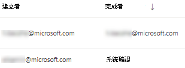

# 利用威脅和弱點管理修正弱點Remediate vulnerabilities with threat and vulnerability management

[!INCLUDE [Microsoft 365 Defender rebranding](../../includes/microsoft-defender.md)]

**適用於：****Applies to:**
- [適用於端點的 Microsoft DefenderMicrosoft Defender for Endpoint](https://go.microsoft.com/fwlink/?linkid=2154037)
- [威脅與弱點管理Threat and vulnerability management](next-gen-threat-and-vuln-mgt.md)
- [Microsoft 365 DefenderMicrosoft 365 Defender](https://go.microsoft.com/fwlink/?linkid=2118804)

>想要體驗 Microsoft Defender for Endpoint？Want to experience Microsoft Defender for Endpoint? [註冊免費試用版。Sign up for a free trial.](https://www.microsoft.com/microsoft-365/windows/microsoft-defender-atp?ocid=docs-wdatp-portaloverview-abovefoldlink)

## 要求修正Request remediation

Microsoft Defender for Endpoint 中的威脅和弱點管理功能會透過修正要求工作流程，在安全性與 IT 系統管理員之間取得橋樑。The threat and vulnerability management capability in Microsoft Defender for Endpoint bridges the gap between Security and IT administrators through the remediation request workflow. 安全性管理員贊您可要求 IT 管理員從 Intune 的 **安全性建議** 頁面修復弱點。Security admins like you can request for the IT Administrator to remediate a vulnerability from the **Security recommendation** pages to Intune.

### 啟用 Microsoft Intune 連線Enable Microsoft Intune connection

若要使用此功能，請啟用您的 Microsoft Intune 連線。To use this capability, enable your Microsoft Intune connections. 在 Microsoft Defender Security Center 中，流覽至 [**設定**]  >  **[一般**  >  **高級功能**]。In the Microsoft Defender Security Center, navigate to **Settings** > **General** > **Advanced features**. 向左下向和尋找 **Microsoft Intune** 連線。Scroll down and look for **Microsoft Intune connection**. 預設會關閉切換功能。By default, the toggle is turned off. 開啟您 **的** **Microsoft Intune** 連線切換功能。Turn your **Microsoft Intune connection** toggle **On**.

**附注**：如果您已啟用 intune 連線，您可以在建立修復要求時，取得建立 intune 安全性工作的選項。**Note**: If you have the Intune connection enabled, you get an option to create an Intune security task when creating a remediation request. 如果未設定 connection，則不會顯示此選項。This option does not appear if the connection is not set.

請參閱 [使用 Intune 修復 Microsoft Defender For Endpoint 所識別的漏洞](https://docs.microsoft.com/intune/atp-manage-vulnerabilities) 以取得詳細資訊。See [Use Intune to remediate vulnerabilities identified by Microsoft Defender for Endpoint](https://docs.microsoft.com/intune/atp-manage-vulnerabilities) for details.

### 修正要求步驟Remediation request steps

1. 移至 Microsoft Defender Security Center 中的 [威脅與弱點管理] 流覽功能表，然後選取 [ [**安全性建議**](tvm-security-recommendation.md)]。Go to the threat and vulnerability management navigation menu in the Microsoft Defender Security Center, and select [**Security recommendations**](tvm-security-recommendation.md).

2. 選取您要要求修復的安全性建議，然後選取 [ **修正選項**]。Select a security recommendation you would like to request remediation for, and then select **Remediation options**.

3. 填寫表單，包含您要求修正的專案、適用的裝置群組、優先順序、到期日及選用的附注。Fill out the form, including what you are requesting remediation for, applicable device groups, priority, due date, and optional notes.
    1. 如果您選擇「需要注意」修正選項，由於沒有特定動作，所以無法使用選取到期日。If you choose the "attention required" remediation option, selecting a due date will not be available since there is no specific action.

4. 選取 [ **提交要求**]。Select **Submit request**. 送出修正要求會在威脅和弱點管理中建立修復活動專案，以用於監視此建議的修正進度。Submitting a remediation request creates a remediation activity item within threat and vulnerability management, which can be used for monitoring the remediation progress for this recommendation. 這不會觸發修復或將任何變更套用到裝置。This will not trigger a remediation or apply any changes to devices.

5. 通知 IT 管理員有關新要求的資訊，讓他們登入 Intune，以核准或拒絕要求，然後啟動套件部署。Notify your IT Administrator about the new request and have them log into Intune to approve or reject the request and start a package deployment.

6. 移至 [ [**修復**](tvm-remediation.md) ] 頁面，以查看修正要求的狀態。Go to the [**Remediation**](tvm-remediation.md) page to view the status of your remediation request.

如果您想要檢查票證在 Intune 中的顯示方式，請參閱 [使用 Intune 修復 Microsoft Defender For Endpoint 所識別的漏洞](https://docs.microsoft.com/intune/atp-manage-vulnerabilities) 以取得詳細資訊。If you want to check how the ticket shows up in Intune, see [Use Intune to remediate vulnerabilities identified by Microsoft Defender for Endpoint](https://docs.microsoft.com/intune/atp-manage-vulnerabilities) for details.

>[!NOTE]
>如果您的要求需要修正超過10000台裝置，我們只能將10000裝置傳送至 Intune 的修正裝置。If your request involves remediating more than 10,000 devices, we can only send 10,000 devices for remediation to Intune.

識別組織的 cybersecurity 弱點並對應至可操作的 [安全性建議](tvm-security-recommendation.md)後，開始建立安全性工作。After your organization's cybersecurity weaknesses are identified and mapped to actionable [security recommendations](tvm-security-recommendation.md), start creating security tasks. 您可以透過與 Microsoft Intune 整合的方式建立工作，以建立修復票證。You can create tasks through the integration with Microsoft Intune where remediation tickets are created.

降低組織面臨的隱患，並修正安全性建議，以提升安全性設定。Lower your organization's exposure from vulnerabilities and increase your security configuration by remediating the security recommendations.

## 查看您的修復活動View your remediation activities

當您從 [安全性建議] 頁面提交修正要求時，它會停用修復活動。When you submit a remediation request from the Security recommendations page, it kicks-off a remediation activity. 建立可在威脅和弱點管理 **修正** 頁面中追蹤的安全性任務，並在 Microsoft Intune 中建立修正憑證。A security task is created that can be tracked in the threat and vulnerability management **Remediation** page, and a remediation ticket is created in Microsoft Intune.

如果您選擇「注意必要」修復選項，則不會有任何進度列、票證狀態或到期日，因為我們沒有任何實際的動作可供監視。If you chose the "attention required" remediation option, there will be no progress bar, ticket status, or due date since there is no actual action we can monitor.

在 [修復] 頁面上，選取您要查看的修復活動。Once you are in the Remediation page, select the remediation activity that you want to view. 您可以依照修復步驟、追蹤進度、查看相關的建議、匯出至 CSV 或標記為完成。You can follow the remediation steps, track progress, view the related recommendation, export to CSV, or mark as complete.

>[!NOTE]
> 完成修復活動的保留期間為180天。There is a 180 day retention period for completed remediation activities. 若要讓修正頁面的執行效果優化，修復活動會在完成後6個月內移除。To keep the Remediation page performing optimally, the remediation activity will be removed 6 months after its completion.

### 已完成（按欄）Completed by column

在 [修正] 頁面上追蹤「完成者」欄中關閉修復活動的人員。Track who closed the remediation activity with the "Completed by" column on the Remediation page.

- **電子郵件地址**：手動完成工作之人員的電子郵件**Email address**: The email of the person who manually completed the task
- **系統確認**：任務已自動完成 (所有已修正的裝置) **System confirmation**: The task was automatically completed (all devices remediated)
- **N/A**：無法使用資訊，因為我們不知道此舊工作的完成方式**N/A**: Information is not available because we don't know how this older task was completed

### 儀表板中的主要修復活動Top remediation activities in the dashboard

在「[威脅與弱點管理」儀表板](tvm-dashboard-insights.md)中查看 **主要修復活動**。View **Top remediation activities** in the [threat and vulnerability management dashboard](tvm-dashboard-insights.md). 選取任何專案，以移至 [ **修復** ] 頁面。Select any of the entries to go to the **Remediation** page. 您可以在 IT 系統管理員小組 remediates 任務之後，將修復活動標示為已完成。You can mark the remediation activity as completed after the IT admin team remediates the task.

## 相關文章Related articles

- [威脅和弱點管理概述Threat and vulnerability management overview](next-gen-threat-and-vuln-mgt.md)
- [儀表板Dashboard](tvm-dashboard-insights.md)
- [安全性建議Security recommendations](tvm-security-recommendation.md)