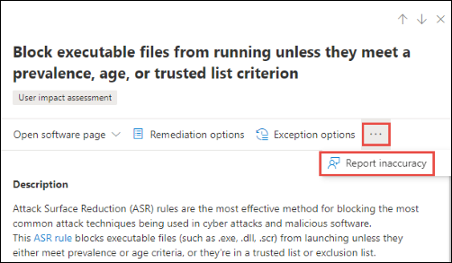

# 安全性建議-威脅和弱點管理

[!INCLUDE [Microsoft 365 Defender rebranding](../../includes/microsoft-defender.md)]

**適用於：**

- [適用於端點的 Microsoft Defender](https://go.microsoft.com/fwlink/?linkid=2154037)
- [威脅與弱點管理](next-gen-threat-and-vuln-mgt.md)
- [Microsoft 365 Defender](https://go.microsoft.com/fwlink/?linkid=2118804)

>想要體驗 Microsoft Defender for Endpoint？ [註冊免費試用版。](https://www.microsoft.com/microsoft-365/windows/microsoft-defender-atp?ocid=docs-wdatp-portaloverview-abovefoldlink)

組織中所識別的 Cybersecurity 弱點會對應至可操作的安全性建議，並依其影響來設定優先順序。 優先的建議有助於縮短緩解或修復弱點的時間，以及促進法規遵從性。

每個安全性建議都包括可操作的修復步驟。 為了協助進行任務管理，也可以使用 Microsoft Intune 和 Microsoft 端點 Configuration Manager 傳送建議。 當威脅變化時，建議也會隨著它不斷地從您的環境收集資訊而變更。

>[!TIP]
>若要取得有關新弱點事件的電子郵件，請參閱 [在 Microsoft Defender For Endpoint 中設定弱點電子郵件通知](configure-vulnerability-email-notifications.md)

## 運作方式

組織中的每個裝置都會根據三個重要因素進行計分，以協助客戶在正確的時間集中處理正確的專案。

- **威脅** -組織裝置中的漏洞和入侵行為，以及破壞歷程記錄中的特性。 根據這些因素，安全性建議會顯示與使用中警示、不斷威脅活動以及其相對應威脅分析報告相關的連結。

- **破壞性可能性** -您的組織的安全性狀況和抵禦威脅的能力

- **業務價值** -您的組織的資產、重要程式和知識屬性

## 流覽至安全性建議頁面

以幾種不同的方式存取安全性建議頁面：

- [Microsoft Defender Security Center](portal-overview.md)中的威脅和弱點管理導覽功能表
- [威脅與弱點管理儀表板](tvm-dashboard-insights.md)中的最高安全性建議

在下列位置查看相關的安全性建議：

- 軟體頁面
- 裝置頁面

### 流覽功能表

移至 [威脅與弱點管理] 導覽功能表，然後選取 [ **安全性建議**]。 此頁面包含組織中所發現之威脅及弱點的安全性建議清單。

### 威脅與弱點管理儀表板中的最高安全性建議

在一天的安全性管理員中，您可以查看[威脅和弱點管理儀表板](tvm-dashboard-insights.md)，以查看[裝置的 Microsoft 安全分數](tvm-microsoft-secure-score-devices.md)並排[公開的總分](tvm-exposure-score.md)。 其目標是 **降低** 組織面臨的漏洞，並 **增加** 組織的裝置安全性，以更具彈性的 cybersecurity 威脅攻擊。 最常見的安全性建議清單可協助您達成該目標。

最上層的安全性建議會根據上一節所述的重要因素，依可能破壞的可能性和價值，列出改進的機遇優先順序。 選取建議會帶您前往 [安全性建議] 頁面，以取得更多詳細資料。

## 安全性建議一覽表

查看建議、找到的弱點數目、相關元件、威脅洞察力、公開裝置數目、狀態、修正類型、修復活動、對您的暴露分數的影響，以及對裝置的 Microsoft 安全分數和相關的標記。

已 **公開裝置** 圖的色彩會隨著趨勢變更而變更。 如果公開的裝置數目增加，則色彩會變成紅色。 如果公開的裝置數目減少，圖形的色彩會變成綠色。

>[!NOTE]
>威脅和弱點管理顯示在最多 **30 天** 前使用的裝置。 這與其余的 Microsoft Defender for Endpoint 不同，在此情況下，裝置未使用超過7天，其狀態為「非作用中」。

### 圖示

有用的圖示也很快就能讓您注意：
-  可能的活動警示
-  關聯的公開利用漏洞
-  建議 insights

### 探索安全性建議選項

選取您要調查或處理的安全性建議。

您可以從飛出的任何選項，選擇下列其中一個選項：

- **開啟軟體頁面** -開啟軟體頁面以取得軟體的更多內容，以及其散佈方式。 此資訊可包含威脅內容、相關的建議、發現的劣勢、公開的裝置數目、發現的漏洞、已安裝軟體的裝置名稱和詳細資訊，以及版本發行。

- [**修正選項**](tvm-remediation.md) -提交修復要求以在 Microsoft Intune 中開啟票證，讓您的 IT 系統管理員挑選並解決。 在 [修正] 頁面中追蹤修復活動。

- [**例外狀況選項**](tvm-exception.md) -提交例外狀況、提供理由，並設定例外期限（如果您無法修正問題）。

>[!NOTE]
>在裝置上進行軟體變更時，通常需要2個小時，資料才會反映在安全性入口網站中。 不過，有時可能需要較長的時間。 設定變更可能需要4到24小時的任何時間。

### 調查裝置洩密或影響中的變更

如果公開的裝置數目很大，或對組織暴露分數和 Microsoft 安全分數影響的影響增加，則安全性建議值得調查。

1. 選取 [建議] 和 [ **開啟軟體] 頁面**
2. 選取 [ **事件時程表** ] 索引標籤，以查看與該軟體相關的所有 impactful 事件，例如新的漏洞或新的公開攻擊。 [深入瞭解事件時程表](threat-and-vuln-mgt-event-timeline.md)
3. 決定如何解決增加或組織面臨的風險，例如提交修復要求

## 要求修正

威脅和弱點管理修復功能會透過修正要求工作流程，來橋接安全性和 IT 管理員之間的缺口。 安全性管理員贊您可要求 IT 管理員從 [ **安全性建議** ] 頁面修正為 Intune 的漏洞。 [深入瞭解修復選項](tvm-remediation.md)

### 如何要求修正

選取您要要求修復的安全性建議，然後選取 [ **修正選項**]。 填寫表單，然後選取 [ **提交要求**]。 移至 [ [**修復**](tvm-remediation.md) ] 頁面，以查看修正要求的狀態。 [深入瞭解如何要求修正](tvm-remediation.md#request-remediation)

## 例外狀況的檔案

如果目前沒有相關建議，則為修正要求的替代，您可以為建議建立例外狀況。 [深入瞭解例外狀況](tvm-exception.md)

只有「例外狀況處理」許可權的使用者才可以新增例外狀況。 [深入瞭解 RBAC 角色](user-roles.md)。

當為建議建立例外狀況時，建議不再使用中狀態。 建議狀態會變更為設備群組)  (的 **完整例外** 狀況或 **部分例外** 狀況。

### 如何建立例外狀況

選取您要為其建立例外狀況的安全性建議，然後選取 [ **例外狀況選項**]。  

填寫表單並提交。 若要查看所有例外狀況 (目前及過去) ，請流覽至 **威脅 & 弱點管理**] 功能表底下的 [[修正](tvm-remediation.md)] 頁面，然後選取 [**例外** 狀況] 索引標籤。[深入瞭解如何建立例外](tvm-exception.md#create-an-exception)狀況

## 報表 inaccuracy

當您看到任何不清楚、不准確、不完整或已修正的安全性建議資訊時，您可以報告誤報。

1. 開啟安全性建議。

2. 選取您想要報告之安全性建議旁的三個點，然後選取 [ **報表 inaccuracy**]。

    

3. 從快顯視窗中，選取下拉式功能表中的 [inaccuracy] 類別、填入您的電子郵件地址，以及有關 inaccuracy 的詳細資料。

4. 選取 **[提交]**。 您的意見反應會立即傳送給威脅和弱點管理專家。

## 相關文章

- [威脅和弱點管理概述](next-gen-threat-and-vuln-mgt.md)
- [儀表板](tvm-dashboard-insights.md)
- [披露分數](tvm-exposure-score.md)
- [適用于裝置的 Microsoft 安全分數](tvm-microsoft-secure-score-devices.md)
- [修正弱點](tvm-remediation.md)
- [建立及查看安全性建議的例外狀況](tvm-exception.md)
- [事件時程表](threat-and-vuln-mgt-event-timeline.md)
