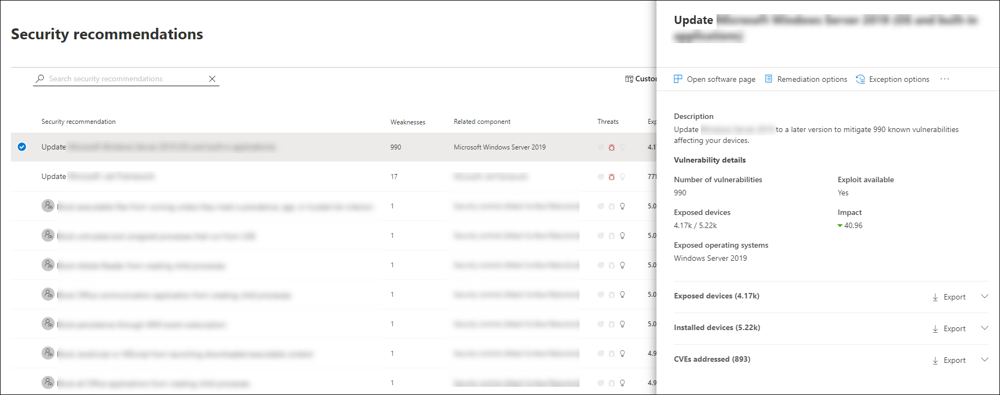

# 安全性建議-威脅和弱點管理Security recommendations - threat and vulnerability management

[!INCLUDE [Microsoft 365 Defender rebranding](../../includes/microsoft-defender.md)]

**適用於：****Applies to:**

- [適用於端點的 Microsoft DefenderMicrosoft Defender for Endpoint](https://go.microsoft.com/fwlink/?linkid=2154037)
- [威脅與弱點管理Threat and vulnerability management](next-gen-threat-and-vuln-mgt.md)
- [Microsoft 365 DefenderMicrosoft 365 Defender](https://go.microsoft.com/fwlink/?linkid=2118804)

>想要體驗適用於端點的 Microsoft Defender 嗎？Want to experience Microsoft Defender for Endpoint? [注册免費試用版。Sign up for a free trial.](https://www.microsoft.com/microsoft-365/windows/microsoft-defender-atp?ocid=docs-wdatp-portaloverview-abovefoldlink)

組織中所識別的 Cybersecurity 弱點會對應至可操作的安全性建議，並依其影響來設定優先順序。Cybersecurity weaknesses identified in your organization are mapped to actionable security recommendations and prioritized by their impact. 優先的建議有助於縮短緩解或修復弱點的時間，以及促進法規遵從性。Prioritized recommendations help shorten the time to mitigate or remediate vulnerabilities and drive compliance.

每個安全性建議都包括可操作的修復步驟。Each security recommendation includes actionable remediation steps. 為了協助進行任務管理，也可以使用 Microsoft Intune 和 Microsoft 端點 Configuration Manager 傳送建議。To help with task management, the recommendation can also be sent using Microsoft Intune and Microsoft Endpoint Configuration Manager. 當威脅變化時，建議也會隨著它不斷地從您的環境收集資訊而變更。When the threat landscape changes, the recommendation also changes as it continuously collects information from your environment.

>[!TIP]
>若要取得有關新弱點事件的電子郵件，請參閱 [在 Microsoft Defender For Endpoint 中設定弱點電子郵件通知](configure-vulnerability-email-notifications.md)To get emails about new vulnerability events, see [Configure vulnerability email notifications in Microsoft Defender for Endpoint](configure-vulnerability-email-notifications.md)

## 運作方式How it works

組織中的每個裝置都會根據三個重要因素進行計分，以協助客戶在正確的時間集中處理正確的專案。Each device in the organization is scored based on three important factors to help customers to focus on the right things at the right time.

- **威脅** -組織裝置中的漏洞和入侵行為，以及破壞歷程記錄中的特性。**Threat** - Characteristics of the vulnerabilities and exploits in your organizations' devices and breach history. 根據這些因素，安全性建議會顯示與使用中警示、不斷威脅活動以及其相對應威脅分析報告相關的連結。Based on these factors, the security recommendations show the corresponding links to active alerts, ongoing threat campaigns, and their corresponding threat analytic reports.

- **破壞性可能性** -您的組織的安全性狀況和抵禦威脅的能力**Breach likelihood** - Your organization's security posture and resilience against threats

- **業務價值** -您的組織的資產、重要程式和知識屬性**Business value** - Your organization's assets, critical processes, and intellectual properties

## 流覽至安全性建議頁面Navigate to the Security recommendations page

以幾種不同的方式存取安全性建議頁面：Access the Security recommendations page a few different ways:

- [Microsoft Defender Security Center](portal-overview.md)中的威脅和弱點管理導覽功能表Threat and vulnerability management navigation menu in the [Microsoft Defender Security Center](portal-overview.md)
- [威脅與弱點管理儀表板](tvm-dashboard-insights.md)中的最高安全性建議Top security recommendations in the [threat and vulnerability management dashboard](tvm-dashboard-insights.md)

在下列位置查看相關的安全性建議：View related security recommendations in the following places:

- 軟體頁面Software page
- 裝置頁面Device page

### 流覽功能表Navigation menu

移至 [威脅與弱點管理] 導覽功能表，然後選取 [ **安全性建議**]。Go to the threat and vulnerability management navigation menu and select **Security recommendations**. 此頁面包含組織中所發現之威脅及弱點的安全性建議清單。The page contains a list of security recommendations for the threats and vulnerabilities found in your organization.

### 威脅與弱點管理儀表板中的最高安全性建議Top security recommendations in the threat and vulnerability management dashboard

在一天的安全性管理員中，您可以查看[威脅和弱點管理儀表板](tvm-dashboard-insights.md)，以查看[裝置的 Microsoft 安全分數](tvm-microsoft-secure-score-devices.md)並排[公開的總分](tvm-exposure-score.md)。In a given day as a Security Administrator, you can take a look at the [threat and vulnerability management dashboard](tvm-dashboard-insights.md) to see your [exposure score](tvm-exposure-score.md) side by side with your [Microsoft Secure Score for Devices](tvm-microsoft-secure-score-devices.md). 其目標是 **降低** 組織面臨的漏洞，並 **增加** 組織的裝置安全性，以更具彈性的 cybersecurity 威脅攻擊。The goal is to **lower** your organization's exposure from vulnerabilities, and **increase** your organization's device security to be more resilient against cybersecurity threat attacks. 最常見的安全性建議清單可協助您達成該目標。The top security recommendations list can help you achieve that goal.

最上層的安全性建議會根據上一節所述的重要因素，依可能破壞的可能性和價值，列出改進的機遇優先順序。The top security recommendations list the improvement opportunities prioritized based on the important factors mentioned in the previous section - threat, likelihood to be breached, and value. 選取建議會帶您前往 [安全性建議] 頁面，以取得更多詳細資料。Selecting a recommendation will take you to the security recommendations page with more details.

## 安全性建議一覽表Security recommendations overview

查看建議、找到的弱點數目、相關元件、威脅洞察力、公開裝置數目、狀態、修正類型、修復活動、對您的暴露分數的影響，以及對裝置的 Microsoft 安全分數和相關的標記。View recommendations, the number of weaknesses found, related components, threat insights, number of exposed devices, status, remediation type, remediation activities, impact to your exposure score and Microsoft Secure Score for Devices, and associated tags.

已 **公開裝置** 圖的色彩會隨著趨勢變更而變更。The color of the **Exposed devices** graph changes as the trend changes. 如果公開的裝置數目增加，則色彩會變成紅色。If the number of exposed devices is on the rise, the color changes into red. 如果公開的裝置數目減少，圖形的色彩會變成綠色。If there's a decrease in the number of exposed devices, the color of the graph will change into green.

>[!NOTE]
>威脅和弱點管理顯示在最多 **30 天** 前使用的裝置。Threat and vulnerability management shows devices that were in use up to **30 days** ago. 這與其余的 Microsoft Defender for Endpoint 不同，在此情況下，裝置未使用超過7天，其狀態為「非作用中」。This is different from the rest of Microsoft Defender for Endpoint, where if a device has not been in use for more than 7 days it has in an ‘Inactive’ status.

### 圖示Icons

有用的圖示也很快就能讓您注意：Useful icons also quickly call your attention to:
-  可能的活動警示possible active alerts
-  關聯的公開利用漏洞associated public exploits
-  建議 insightsrecommendation insights

### 探索安全性建議選項Explore security recommendation options

選取您要調查或處理的安全性建議。Select the security recommendation that you want to investigate or process.

您可以從飛出的任何選項，選擇下列其中一個選項：From the flyout, you can choose any of the following options:

- **開啟軟體頁面** -開啟軟體頁面以取得軟體的更多內容，以及其散佈方式。**Open software page** - Open the software page to get more context on the software and how it's distributed. 此資訊可包含威脅內容、相關的建議、發現的劣勢、公開的裝置數目、發現的漏洞、已安裝軟體的裝置名稱和詳細資訊，以及版本發行。The information can include threat context, associated recommendations, weaknesses discovered, number of exposed devices, discovered vulnerabilities, names and detailed of devices with the software installed, and version distribution.

- [**修正選項**](tvm-remediation.md) -提交修復要求以在 Microsoft Intune 中開啟票證，讓您的 IT 系統管理員挑選並解決。[**Remediation options**](tvm-remediation.md) - Submit a remediation request to open a ticket in Microsoft Intune for your IT administrator to pick up and address. 在 [修正] 頁面中追蹤修復活動。Track the remediation activity in the Remediation page.

- [**例外狀況選項**](tvm-exception.md) -提交例外狀況、提供理由，並設定例外期限（如果您無法修正問題）。[**Exception options**](tvm-exception.md) - Submit an exception, provide justification, and set exception duration if you can't remediate the issue yet.

>[!NOTE]
>在裝置上進行軟體變更時，通常需要2個小時，資料才會反映在安全性入口網站中。When a software change is made on a device, it typically takes 2 hours for the data to be reflected in the security portal. 不過，有時可能需要較長的時間。However, it may sometimes take longer. 設定變更可能需要4到24小時的任何時間。Configuration changes can take anywhere from 4 to 24 hours.

### 調查裝置洩密或影響中的變更Investigate changes in device exposure or impact

如果公開的裝置數目很大，或對組織暴露分數和 Microsoft 安全分數影響的影響增加，則安全性建議值得調查。If there is a large jump in the number of exposed devices, or a sharp increase in the impact on your organization exposure score and Microsoft Secure Score for Devices, then that security recommendation is worth investigating.

1. 選取 [建議] 和 [ **開啟軟體] 頁面**Select the recommendation and **Open software page**
2. 選取 [ **事件時程表** ] 索引標籤，以查看與該軟體相關的所有 impactful 事件，例如新的漏洞或新的公開攻擊。Select the **Event timeline** tab to view all the impactful events related to that software, such as new vulnerabilities or new public exploits. [深入瞭解事件時程表Learn more about event timeline](threat-and-vuln-mgt-event-timeline.md)
3. 決定如何解決增加或組織面臨的風險，例如提交修復要求Decide how to address the increase or your organization's exposure, such as submitting a remediation request

## 要求修正Request remediation

威脅和弱點管理修復功能會透過修正要求工作流程，來橋接安全性和 IT 管理員之間的缺口。The threat and vulnerability management remediation capability bridges the gap between Security and IT administrators through the remediation request workflow. 安全性管理員贊您可要求 IT 管理員從 [ **安全性建議** ] 頁面修正為 Intune 的漏洞。Security admins like you can request for the IT Administrator to remediate a vulnerability from the **Security recommendation** page to Intune. [深入瞭解修復選項Learn more about remediation options](tvm-remediation.md)

### 如何要求修正How to request remediation

選取您要要求修復的安全性建議，然後選取 [ **修正選項**]。Select a security recommendation you would like to request remediation for, and then select **Remediation options**. 填寫表單，然後選取 [ **提交要求**]。Fill out the form and select **Submit request**. 移至 [ [**修復**](tvm-remediation.md) ] 頁面，以查看修正要求的狀態。Go to the [**Remediation**](tvm-remediation.md) page to view the status of your remediation request. [深入瞭解如何要求修正Learn more about how to request remediation](tvm-remediation.md#request-remediation)

## 例外狀況的檔案File for exception

如果目前沒有相關建議，則為修正要求的替代，您可以為建議建立例外狀況。As an alternative to a remediation request when a recommendation is not relevant at the moment, you can create exceptions for recommendations. [深入瞭解例外狀況Learn more about exceptions](tvm-exception.md)

只有「例外狀況處理」許可權的使用者才可以新增例外狀況。Only users with “exceptions handling” permissions can add exception. [深入瞭解 RBAC 角色](user-roles.md)。[Learn more about RBAC roles](user-roles.md).

當為建議建立例外狀況時，建議不再使用中狀態。When an exception is created for a recommendation, the recommendation is no longer active. 建議狀態會變更為設備群組)  (的 **完整例外** 狀況或 **部分例外** 狀況。The recommendation state will change to **Full exception** or **Partial exception** (by device group).

### 如何建立例外狀況How to create an exception

選取您要為其建立例外狀況的安全性建議，然後選取 [ **例外狀況選項**]。Select a security recommendation you would like create an exception for, and then select **Exception options**.  

填寫表單並提交。Fill out the form and submit. 若要查看所有例外狀況 (目前及過去) ，請流覽至 **威脅 & 弱點管理**] 功能表底下的 [[修正](tvm-remediation.md)] 頁面，然後選取 [**例外** 狀況] 索引標籤。[深入瞭解如何建立例外](tvm-exception.md#create-an-exception)狀況To view all your exceptions (current and past), navigate to the [Remediation](tvm-remediation.md) page under the **Threat & Vulnerability Management** menu and select the **Exceptions** tab. [Learn more about how to create an exception](tvm-exception.md#create-an-exception)

## 報表 inaccuracyReport inaccuracy

當您看到任何不清楚、不准確、不完整或已修正的安全性建議資訊時，您可以報告誤報。You can report a false positive when you see any vague, inaccurate, incomplete, or already remediated security recommendation information.

1. 開啟安全性建議。Open the Security recommendation.

2. 選取您想要報告之安全性建議旁的三個點，然後選取 [ **報表 inaccuracy**]。Select the three dots beside the security recommendation that you want to report,  then select **Report inaccuracy**.

    

3. 從快顯視窗中，選取下拉式功能表中的 [inaccuracy] 類別、填入您的電子郵件地址，以及有關 inaccuracy 的詳細資料。From the flyout pane, select the inaccuracy category from the drop-down menu, fill in your email address, and details regarding the inaccuracy.

4. 選取 **[提交]**。Select **Submit**. 您的意見反應會立即傳送給威脅和弱點管理專家。Your feedback is immediately sent to the threat and vulnerability management experts.

## 相關文章Related articles

- [威脅和弱點管理概述Threat and vulnerability management overview](next-gen-threat-and-vuln-mgt.md)
- [儀表板Dashboard](tvm-dashboard-insights.md)
- [暴險分數Exposure score](tvm-exposure-score.md)
- [裝置用 Microsoft 安全分數Microsoft Secure Score for Devices](tvm-microsoft-secure-score-devices.md)
- [修正安全性漏洞Remediate vulnerabilities](tvm-remediation.md)
- [建立及查看安全性建議的例外狀況Create and view exceptions for security recommendations](tvm-exception.md)
- [活動時間表Event timeline](threat-and-vuln-mgt-event-timeline.md)
