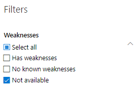

# 軟體清查-威脅和弱點管理Software inventory - threat and vulnerability management

[!INCLUDE [Microsoft 365 Defender rebranding](../../includes/microsoft-defender.md)]

**適用於：****Applies to:**
- [適用於端點的 Microsoft DefenderMicrosoft Defender for Endpoint](https://go.microsoft.com/fwlink/?linkid=2154037)
- [威脅與弱點管理Threat and vulnerability management](next-gen-threat-and-vuln-mgt.md)
- [Microsoft 365 DefenderMicrosoft 365 Defender](https://go.microsoft.com/fwlink/?linkid=2118804)

>想要體驗 Defender for Endpoint？Want to experience Defender for Endpoint? [註冊免費試用版。Sign up for a free trial.](https://www.microsoft.com/microsoft-365/windows/microsoft-defender-atp?ocid=docs-wdatp-portaloverview-abovefoldlink)

威脅和弱點管理中的軟體清查是貴組織中的已知軟體清單，其中包含官方 [通用平臺列舉 (CPE) ](https://nvd.nist.gov/products/cpe)。The software inventory in threat and vulnerability management is a list of known software in your organization with official [Common Platform Enumerations (CPE)](https://nvd.nist.gov/products/cpe). 沒有官方 CPE 的軟體產品不會發佈弱點。Software products without an official CPE don’t have vulnerabilities published. 此外，它也包含廠商名稱、弱點數目、威脅及公開裝置數目等詳細資訊。It also includes details such as the name of the vendor, number of weaknesses, threats, and number of exposed devices.

## 運作方式How it works

在探索的欄位中，我們會利用一組對 Microsoft Defender 中的偵測和漏洞評估負責偵測 [偵測和回應功能](overview-endpoint-detection-response.md)的一組信號。In the field of discovery, we're leveraging the same set of signals that is responsible for detection and vulnerability assessment in [Microsoft Defender for Endpoint detection and response capabilities](overview-endpoint-detection-response.md).

由於是即時的時間，您會在發現的情況下，看到弱點資訊。Since it's real time, in a matter of minutes, you'll see vulnerability information as they get discovered. 引擎會自動從多個安全性摘要中獲取資訊。The engine automatically grabs information from multiple security feeds. 實際上，您會看到特定軟體是否已連接至即時威脅活動。In fact, you'll see if a particular software is connected to a live threat campaign. 它也會在威脅分析報告可供使用時立即提供連結。It also provides a link to a Threat Analytics report soon as it's available.

## 流覽至軟體庫存頁面Navigate to the Software inventory page

從 [Microsoft Defender [安全性中心](portal-overview.md)] 的 [威脅和弱點管理] 流覽功能表中選取 [**軟體清查**]，即可存取軟體清查頁面。Access the Software inventory page by selecting **Software inventory** from the threat and vulnerability management navigation menu in the [Microsoft Defender Security Center](portal-overview.md).

在 [ [裝置] 清單](machines-view-overview.md)中的 [個別裝置] 頁面上，查看特定裝置上的軟體。View software on specific devices in the individual devices pages from the [devices list](machines-view-overview.md).

>[!NOTE]
>如果您使用 Microsoft Defender for Endpoint global 搜尋來搜尋軟體，請務必放入底線，而不是空格。If you search for software using the Microsoft Defender for Endpoint global search, make sure to put an underscore instead of a space. 例如，在最佳搜尋結果中，您可以寫入「windows_10」，而不是「Windows 10」。For example, for the best search results you'd write "windows_10" instead of "Windows 10".

## 軟體清查概述Software inventory overview

**軟體清查** 頁面隨即開啟，並顯示您網路中已安裝的軟體清單，包括廠商名稱、弱點、發現的劣勢、相關聯的裝置、公開的裝置、對暴露分數的影響，以及標記。The **Software inventory** page opens with a list of software installed in your network, including the vendor name, weaknesses found, threats associated with them, exposed devices, impact to exposure score, and tags.

您可以根據軟體中發現的弱點、與其相關的威脅及標記（如軟體是否已到達支援終止）來篩選清單視圖。You can filter the list view based on weaknesses found in the software, threats associated with them, and tags like whether the software has reached end-of-support.

選取您要調查的軟體。Select the software that you want to investigate. 飛入的平板視窗會開啟頁面上更緊湊的資訊視圖。A flyout panel will open with a more compact view of the information on the page. 您可以深入瞭解調查並選取 [ **開放軟體] 頁面**，或透過選取 [ **報表 inaccuracy**] 來標示任何技術矛盾。You can either dive deeper into the investigation and select **Open software page**, or flag any technical inconsistencies by selecting **Report inaccuracy**.

### 不支援的軟體Software that isn't supported

目前不受威脅 & 漏洞管理所支援的軟體可能會出現在 [軟體清單] 頁面中。Software that isn't currently supported by threat & vulnerability management may be present in the Software inventory page. 由於不支援，因此只能使用有限的資料。Because it is not supported, only limited data will be available. 在「弱點」區段中，使用不支援的軟體篩選。Filter by unsupported software with the "Not available" option in the "Weakness" section.

下清單示不支援軟體：The following indicates that a software is not supported:

- 弱點欄位顯示「無法使用」Weaknesses field shows "Not available"
- [已公開的裝置] 欄位顯示破折號Exposed devices field shows a dash
- 在「側面面板」和「軟體」頁面中新增的資訊性文字Informational text added in side panel and in software page
- 軟體頁面沒有安全性建議、發現的漏洞或事件時程表區段The software page won't have the security recommendations, discovered vulnerabilities, or event timeline sections

目前，沒有 CPE 的產品不會顯示在 [軟體清查] 頁面中，只會顯示在裝置層級軟體清查中。Currently, products without a CPE are not shown in the software inventory page, only in the device level software inventory.

## 裝置上的軟體清查Software inventory on devices

在 Microsoft Defender 安全性中心導覽面板中，移至 [ \*\*[裝置] 清單](machines-view-overview.md)\*\*。From the Microsoft Defender Security Center navigation panel, go to the **[Devices list](machines-view-overview.md)**. 選取裝置的名稱以開啟 [裝置] 頁面 (例如 Computer1) ]，然後選取 [ **軟體庫存** ] 索引標籤，以查看裝置上存在的所有已知軟體清單。Select the name of a device to open the device page (like Computer1), then select the **Software inventory** tab to see a list of all the known software present on the device. 選取特定的軟體專案，以使用詳細資訊開啟快顯視窗。Select a specific software entry to open the flyout with more information.

您可以在裝置層級看到軟體，即使威脅和弱點管理目前不支援此軟體也是一樣。Software may be visible at the device level even if it is currently not supported by threat and vulnerability management. 不過，只有有限的資料可供使用。However, only limited data will be available. 您會知道軟體是否不受支援，因為這會在「弱點」欄中說「無法使用」。You'll know if software is unsupported because it will say "Not available" in the "Weakness" column.

沒有 CPE 的軟體也會顯示在此裝置特定軟體清查底下。Software with no CPE can also show up under this device specific software inventory.

### 軟體證據Software evidence

請參閱從登錄、磁片或兩者上，在裝置上偵測到特定軟體的證據。您可以在裝置軟體清查中的任何裝置上找到它。See evidence of where we detected a specific software on a device from the registry, disk, or both.You can find it on any device in the device software inventory.

選取軟體名稱以開啟快顯視窗，並尋找名為 "軟體證據" 的區段。Select a software name to open the flyout, and look for the section called "Software Evidence."

## 軟體頁面Software pages

您可以透過幾種不同的方式來查看軟體頁面：You can view software pages a few different ways:

- 軟體清查頁面 > 在快顯視窗中選取軟體名稱 > 選取 [**開啟軟體] 頁面**Software inventory page > Select a software name > Select **Open software page** in the flyout
- [安全性建議頁面](tvm-security-recommendation.md) > 選取快顯視窗中的 [選取 **開放軟體] 頁面** 上的建議 >[Security recommendations page](tvm-security-recommendation.md) > Select a recommendation > Select **Open software page** in the flyout
- [[事件時程表] 頁面](threat-and-vuln-mgt-event-timeline.md)> 選取事件 > 選取 [超連結軟體名稱] (如 Visual Studio 2017) 中的「相關元件」一節中（稱為「相關元件」）。[Event timeline page](threat-and-vuln-mgt-event-timeline.md) > Select an event > Select the hyperlinked software name (like Visual Studio 2017) in the section called "Related component" in the flyout

 完整頁面會顯示特定軟體的所有詳細資料及下列資訊：A full page will appear with all the details of a specific software and the following information:

- 帶有廠商資訊的側面面板，組織中的軟體傳播 (包括安裝所在裝置的裝置數量，以及未進行修補) 的公開裝置，是否有可用，以及對您的披露分數影響。Side panel with vendor information, prevalence of the software in the organization (including number of devices it's installed on, and exposed devices that aren't patched), whether and exploit is available, and impact to your exposure score.
- 資料視覺效果顯示的數量及嚴重性、弱點及錯誤配置。Data visualizations showing the number of, and severity of, vulnerabilities and misconfigurations. 此外，圖表會包含公開裝置的數目。Also, graphs with the number of exposed devices.
- 顯示如下資訊的索引標籤：Tabs showing information such as:
    - 所識別之弱點和弱點的對應安全性建議。Corresponding security recommendations for the weaknesses and vulnerabilities identified.
    - 已發現之弱點的命名 Cve。Named CVEs of discovered vulnerabilities.
    - 已安裝軟體的裝置 (，以及裝置名稱、網域、OS，等等) 。Devices that have the software installed (along with device name, domain, OS, and more).
    - 軟體版本清單 (包括版本安裝所在裝置的數目、找到的漏洞數目，以及已安裝裝置的名稱) 。Software version list (including number of devices the version is installed on, the number of discovered vulnerabilities, and the names of the installed devices).

    

## 報表 inaccuracyReport inaccuracy

當您看到任何不清楚、不正確或不完整的資訊時，報告誤報。Report a false positive when you see any vague, inaccurate, or incomplete information. 您也可以報告已經修正的安全性建議。You can also report on security recommendations that have already been remediated.

1. 開啟軟體庫存頁面上的軟體彈出列表。Open the software flyout on the Software inventory page.
2. 選取 [ **報表 inaccuracy**]。Select **Report inaccuracy**.
3. 從快顯視窗中，選取下拉式功能表中的 [inaccuracy] 類別、填入您的電子郵件地址，以及 inaccuracy 的詳細資料。From the flyout pane, select the inaccuracy category from the drop-down menu, fill in your email address, and details about the inaccuracy.
4. 選取 **[提交]**。Select **Submit**. 您的意見反應會立即傳送給威脅和弱點管理專家。Your feedback is immediately sent to the threat and vulnerability management experts.

## 相關文章Related articles

- [威脅和弱點管理概述Threat and vulnerability management overview](next-gen-threat-and-vuln-mgt.md)
- [安全性建議Security recommendations](tvm-security-recommendation.md)
- [活動時間表Event timeline](threat-and-vuln-mgt-event-timeline.md)
- [查看和組織 Microsoft Defender for Endpoint Devices 清單View and organize the Microsoft Defender for Endpoint Devices list](machines-view-overview.md)
