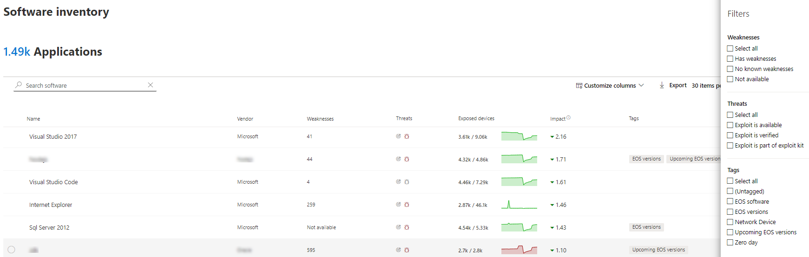

# 軟體清查-威脅和弱點管理

[!INCLUDE [Microsoft 365 Defender rebranding](../../includes/microsoft-defender.md)]

**適用於：**
- [適用於端點的 Microsoft Defender](https://go.microsoft.com/fwlink/?linkid=2154037)
- [威脅與弱點管理](next-gen-threat-and-vuln-mgt.md)
- [Microsoft 365 Defender](https://go.microsoft.com/fwlink/?linkid=2118804)

>想要體驗 Defender for Endpoint？ [註冊免費試用版。](https://www.microsoft.com/microsoft-365/windows/microsoft-defender-atp?ocid=docs-wdatp-portaloverview-abovefoldlink)

威脅和弱點管理中的軟體清查是貴組織中的已知軟體清單，其中包含官方 [通用平臺列舉 (CPE) ](https://nvd.nist.gov/products/cpe)。 沒有官方 CPE 的軟體產品不會發佈弱點。 此外，它也包含廠商名稱、弱點數目、威脅及公開裝置數目等詳細資訊。

## 運作方式

在探索的欄位中，我們會利用一組對 Microsoft Defender 中的偵測和漏洞評估負責偵測 [偵測和回應功能](overview-endpoint-detection-response.md)的一組信號。

由於是即時的時間，您會在發現的情況下，看到弱點資訊。 引擎會自動從多個安全性摘要中獲取資訊。 實際上，您會看到特定軟體是否已連接至即時威脅活動。 它也會在威脅分析報告可供使用時立即提供連結。

## 流覽至軟體庫存頁面

從 [Microsoft Defender [安全性中心](portal-overview.md)] 的 [威脅和弱點管理] 流覽功能表中選取 [**軟體清查**]，即可存取軟體清查頁面。

在 [ [裝置] 清單](machines-view-overview.md)中的 [個別裝置] 頁面上，查看特定裝置上的軟體。

>[!NOTE]
>如果您使用 Microsoft Defender for Endpoint global 搜尋來搜尋軟體，請務必放入底線，而不是空格。 例如，在最佳搜尋結果中，您可以寫入「windows_10」，而不是「Windows 10」。

## 軟體清查概述

**軟體清查** 頁面隨即開啟，並顯示您網路中已安裝的軟體清單，包括廠商名稱、弱點、發現的劣勢、相關聯的裝置、公開的裝置、對暴露分數的影響，以及標記。

您可以根據軟體中發現的弱點、與其相關的威脅及標記（如軟體是否已到達支援終止）來篩選清單視圖。

選取您要調查的軟體。 飛入的平板視窗會開啟頁面上更緊湊的資訊視圖。 您可以深入瞭解調查並選取 [ **開放軟體] 頁面**，或透過選取 [ **報表 inaccuracy**] 來標示任何技術矛盾。

### 不支援的軟體

目前不受威脅 & 漏洞管理所支援的軟體可能會出現在 [軟體清單] 頁面中。 由於不支援，因此只能使用有限的資料。 在「弱點」區段中，使用不支援的軟體篩選。

下清單示不支援軟體：

- 弱點欄位顯示「無法使用」
- [已公開的裝置] 欄位顯示破折號
- 在「側面面板」和「軟體」頁面中新增的資訊性文字
- 軟體頁面沒有安全性建議、發現的漏洞或事件時程表區段

目前，沒有 CPE 的產品不會顯示在 [軟體清查] 頁面中，只會顯示在裝置層級軟體清查中。

## 裝置上的軟體清查

在 Microsoft Defender 安全性中心導覽面板中，移至 [ **[裝置] 清單](machines-view-overview.md)**。 選取裝置的名稱以開啟 [裝置] 頁面 (例如 Computer1) ]，然後選取 [ **軟體庫存** ] 索引標籤，以查看裝置上存在的所有已知軟體清單。 選取特定的軟體專案，以使用詳細資訊開啟快顯視窗。

您可以在裝置層級看到軟體，即使威脅和弱點管理目前不支援此軟體也是一樣。 不過，只有有限的資料可供使用。 您會知道軟體是否不受支援，因為這會在「弱點」欄中說「無法使用」。

沒有 CPE 的軟體也會顯示在此裝置特定軟體清查底下。

### 軟體證據

請參閱從登錄、磁片或兩者上，在裝置上偵測到特定軟體的證據。您可以在裝置軟體清查中的任何裝置上找到它。

選取軟體名稱以開啟快顯視窗，並尋找名為 "軟體證據" 的區段。

## 軟體頁面

您可以透過幾種不同的方式來查看軟體頁面：

- 軟體清查頁面 > 在快顯視窗中選取軟體名稱 > 選取 [**開啟軟體] 頁面**
- [安全性建議頁面](tvm-security-recommendation.md) > 選取快顯視窗中的 [選取 **開放軟體] 頁面** 上的建議 >
- [[事件時程表] 頁面](threat-and-vuln-mgt-event-timeline.md)> 選取事件 > 選取 [超連結軟體名稱] (如 Visual Studio 2017) 中的「相關元件」一節中（稱為「相關元件」）。

 完整頁面會顯示特定軟體的所有詳細資料及下列資訊：

- 帶有廠商資訊的側面面板，組織中的軟體傳播 (包括安裝所在裝置的裝置數量，以及未進行修補) 的公開裝置，是否有可用，以及對您的披露分數影響。
- 資料視覺效果顯示的數量及嚴重性、弱點及錯誤配置。 此外，圖表會包含公開裝置的數目。
- 顯示如下資訊的索引標籤：
    - 所識別之弱點和弱點的對應安全性建議。
    - 已發現之弱點的命名 Cve。
    - 已安裝軟體的裝置 (，以及裝置名稱、網域、OS，等等) 。
    - 軟體版本清單 (包括版本安裝所在裝置的數目、找到的漏洞數目，以及已安裝裝置的名稱) 。

    

## 報表 inaccuracy

當您看到任何不清楚、不正確或不完整的資訊時，報告誤報。 您也可以報告已經修正的安全性建議。

1. 開啟軟體庫存頁面上的軟體彈出列表。
2. 選取 [ **報表 inaccuracy**]。
3. 從快顯視窗中，選取下拉式功能表中的 [inaccuracy] 類別、填入您的電子郵件地址，以及 inaccuracy 的詳細資料。
4. 選取 **[提交]**。 您的意見反應會立即傳送給威脅和弱點管理專家。

## 相關文章

- [威脅和弱點管理概述](next-gen-threat-and-vuln-mgt.md)
- [安全性建議](tvm-security-recommendation.md)
- [活動時間表](threat-and-vuln-mgt-event-timeline.md)
- [查看和組織 Microsoft Defender for Endpoint Devices 清單](machines-view-overview.md)
