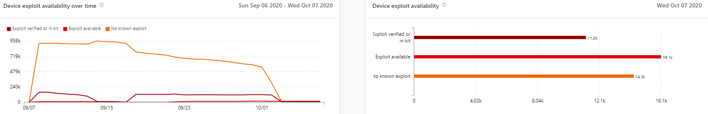
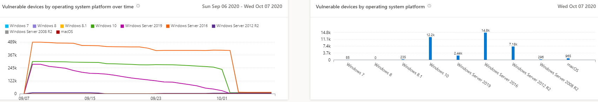

# 易受攻擊的裝置報告-威脅和弱點管理

[!INCLUDE [Microsoft 365 Defender rebranding](../../includes/microsoft-defender.md)]

**適用於：**

- [適用於端點的 Microsoft Defender](https://go.microsoft.com/fwlink/?linkid=2154037)
- [威脅與弱點管理](next-gen-threat-and-vuln-mgt.md)
- [Microsoft 365 Defender](https://go.microsoft.com/fwlink/?linkid=2118804)

>想要體驗 Microsoft Defender for Endpoint？ [註冊免費試用版。](https://www.microsoft.com/microsoft-365/windows/microsoft-defender-atp?ocid=docs-wdatp-portaloverview-abovefoldlink)

報告會顯示圖表和橫條圖，包含易受影響的裝置趨勢和目前的統計資料。 目標是讓您瞭解裝置洩密的 breath 和範圍。 

前往 **報告 > 易受攻擊的裝置**，以存取 Microsoft Defender Security Center 中的報告

有兩個欄：

- 隨時間)  (趨勢。 可顯示過去30天、3個月、6個月或自訂的日期範圍。
- 今天 (目前的資訊) 

**篩選**：您可以依弱點嚴重性層級、利用可用性、弱點年齡、作業系統平臺、Windows 10 版本或裝置群組篩選資料。

**深入** 查看：如果您想要進一步探索，請選取相關的橫條圖，以在 [設備庫存] 頁面中查看已篩選的裝置清單。 您可以從這裡匯出清單。

## 嚴重性層級圖形

每個裝置會根據該裝置上最嚴重的弱點，只計算一次。

## 利用可用性圖表

每個裝置只會根據最上層的已知利用方式，計算一次。

## 弱點時期圖表

每個裝置只會在最舊的弱點發布日期下計算一次。 較舊的漏洞可能會受到攻擊的可能性較高。

## 受作業系統平臺圖影響的裝置

每個作業系統上因軟體弱點而公開的裝置數目。

## Windows 10 版本圖表中有漏洞的裝置

每個 Windows 10 版本上的裝置數目，由於有缺陷的應用程式或作業系統而公開。

## 相關主題

- [威脅和弱點管理概述](next-gen-threat-and-vuln-mgt.md)
- [安全性建議](tvm-security-recommendation.md)
