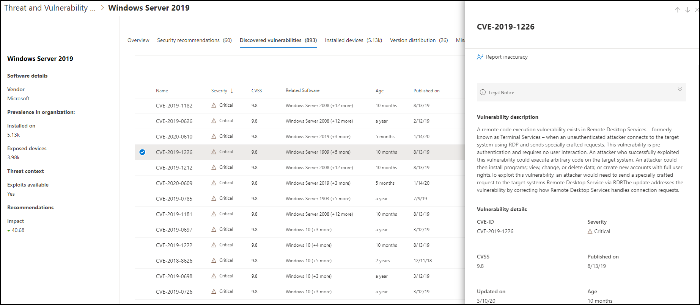

# 組織中的漏洞-威脅和弱點管理

[!INCLUDE [Microsoft 365 Defender rebranding](../../includes/microsoft-defender.md)]

**適用於：**
- [適用於端點的 Microsoft Defender](https://go.microsoft.com/fwlink/?linkid=2154037)
- [威脅與弱點管理](next-gen-threat-and-vuln-mgt.md)
- [Microsoft 365 Defender](https://go.microsoft.com/fwlink/?linkid=2118804)

>想要體驗 Microsoft Defender for Endpoint？ [註冊免費試用版。](https://www.microsoft.com/microsoft-365/windows/microsoft-defender-atp?ocid=docs-wdatp-portaloverview-abovefoldlink)

威脅和弱點管理會在 Defender 中使用相同的信號，以進行 Endpoint protection，以掃描及偵測到漏洞。

**弱點** 頁面會列出常見的漏洞和披露 (CVE) ID，列出您的裝置所公開的軟體弱點。 您也可以查看嚴重性、常見弱點計分系統 (CVSS) 分級、組織中的流行情況、相對應的破壞程度、威脅深入瞭解等等。

>[!NOTE]
>如果沒有任何官方的 CVE 識別碼指派給一個弱點，該弱點名稱是由威脅和弱點管理所指派。

>[!TIP]
>若要取得有關新弱點事件的電子郵件，請參閱 [在 Microsoft Defender For Endpoint 中設定弱點電子郵件通知](configure-vulnerability-email-notifications.md)

## 流覽至弱點頁面

以幾種不同的方式存取弱點頁面：

- 從 [Microsoft Defender Security Center](portal-overview.md)中的威脅和弱點管理導覽功能表中，選取 **弱點**
- 全域搜尋

### 流覽功能表

移至 [威脅與弱點管理] 導覽功能表並選取 [ **弱點** ]，以開啟 cve 清單。

### 全域搜尋中的漏洞

1. 移至 [通用搜尋] 下拉式功能表。
2. 選取 [ **弱點** ] 和 [重要漏洞]，並 (您要尋找的 CVE) 識別碼]，然後選取 [搜尋] 圖示。 **弱點** 頁面隨即開啟，並顯示您要尋找的 CVE 資訊。

3. 選取 CVE 以開啟彈出面板及詳細資訊，包括弱點描述、詳細資料、威脅洞察及公開的裝置。

若要查看 **弱點** 頁面中的其餘弱點，請輸入 CVE，然後選取 [搜尋]。

## 弱點概述

修正公開裝置中的漏洞，以降低資產和組織的風險。 如果 [ **公開的裝置** ] 欄顯示0，表示您沒有危險。

### 破壞和威脅洞察力

當圖示色彩紅色時，請在 [ **威脅** ] 欄中查看任何相關的侵犯和威脅洞察力。

 >[!NOTE]
 > 永遠優先考慮與現行威脅相關聯的建議。 這些建議是以威脅真知灼見圖示標示，  和違規洞察力圖示   

如果您的組織中有弱點，則破壞 insights 圖示會反白顯示。

如果您的組織中有相關弱點的漏洞，便會反白顯示威脅洞察力圖示。 懸停于圖示上方會顯示威脅是否屬於利用性套件的一部分，或連線至特定的高級持續性活動或活動群組。 當可用時，會有一個指向威脅分析報告的連結，其中包含零天的新聞、披露或相關的安全性通報。  

### 取得弱點深入瞭解

如果您選取 CVE，將會以詳細資訊（如弱點描述、詳細資料、威脅洞察及公開的裝置）開啟彈出面板。

- "OS Feature" 類別會顯示在相關案例中
- 您可以使用公開裝置的每個 CVE，移至相關的安全性建議

 

### 不支援的軟體

Cve 未受到威脅 & 漏洞管理所支援的軟體，仍然存在於劣勢頁面中。 由於不支援軟體，所以只有有限的資料可供使用。

使用不受支援的軟體的 Cve，公開的裝置資訊將無法使用。 在「公開的裝置」區段中，選取「無法使用」選項，以不受支援的軟體進行篩選。

 

## 在其他位置查看常見的漏洞和弱點 (CVE) 專案

### 儀表板中的最常見漏洞軟體

1. 移至 [ [威脅與弱點管理] 儀表板](tvm-dashboard-insights.md) ，然後向左下至 **最常見的軟體** 構件。 您將會看到每個軟體中所發現的漏洞數量，以及威脅資訊，以及一段時間內的設備危險性的高階觀點。

    

2. 選取您要調查的軟體，以移至深入分析頁面。
3. 選取 [已 **發現的漏洞** ] 索引標籤。
4. 選取您要調查的漏洞，以取得有關弱點詳細資料的詳細資訊

    

### 探索裝置頁面中的漏洞

在 [裝置] 頁面中查看相關弱點資訊。

1. 移至 Microsoft Defender 安全性中心導覽功能表列，然後選取裝置圖示。 [ **裝置] 清單** 頁面隨即開啟。
2. 在 [ **裝置] 清單** 頁面上，選取您要調查的裝置名稱。

    

3. 裝置頁面會開啟您要調查之裝置的詳細資料和回應選項。
4. 選取 **發現的漏洞**。

    

5. 選取您要調查的漏洞，以開啟具有 CVE 詳細資料的飛出面板，例如：弱點描述、威脅洞察力和偵測邏輯。

#### CVE 偵測邏輯

類似于軟體證據，我們現在會顯示我們在裝置上所套用的偵測邏輯，以表明其存在漏洞。 新的區段稱為「偵測邏輯」，在裝置頁面) 中發現的任何弱點中 (，並顯示偵測邏輯和來源。

"OS Feature" 類別也會顯示在相關案例中。 CVE 會影響只有在特定作業系統元件啟用時才會執行有漏洞作業系統的裝置。 假設 Windows Server 2019 在其 DNS 元件中有弱點。 透過這項新功能，我們只會將此 CVE 附加到 Windows Server 2019 裝置，其作業系統中已啟用 DNS 功能。

## 報表 inaccuracy

當您看到任何不清楚、不正確或不完整的資訊時，報告誤報。 您也可以報告已經修正的安全性建議。

1. 開啟 [弱點] 頁面上的 CVE。
2. 選取 [ **報表 inaccuracy** ]，隨即會開啟彈出窗格。
3. 從下拉式功能表中選取 [inaccuracy] 類別，然後填入您的電子郵件地址和 inaccuracy 詳細資料。
4. 選取 **[提交]**。 您的意見反應會立即傳送給威脅和弱點管理專家。

## 相關文章

- [威脅和弱點管理概述](next-gen-threat-and-vuln-mgt.md)
- [安全性建議](tvm-security-recommendation.md)
- [軟體庫存](tvm-software-inventory.md)
- [儀表板深入解析](tvm-dashboard-insights.md)
- [查看和組織 Microsoft Defender for Endpoint Devices 清單](machines-view-overview.md)
