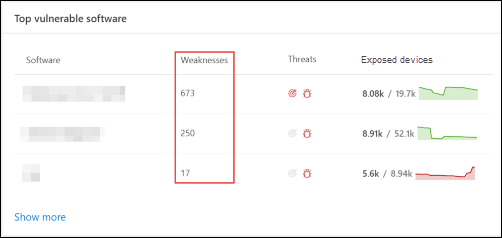

# 組織中的漏洞-威脅和弱點管理Vulnerabilities in my organization - threat and vulnerability management

[!INCLUDE [Microsoft 365 Defender rebranding](../../includes/microsoft-defender.md)]

**適用於：****Applies to:**
- [適用於端點的 Microsoft DefenderMicrosoft Defender for Endpoint](https://go.microsoft.com/fwlink/?linkid=2154037)
- [威脅與弱點管理Threat and vulnerability management](next-gen-threat-and-vuln-mgt.md)
- [Microsoft 365 DefenderMicrosoft 365 Defender](https://go.microsoft.com/fwlink/?linkid=2118804)

>想要體驗 Microsoft Defender for Endpoint？Want to experience Microsoft Defender for Endpoint? [註冊免費試用版。Sign up for a free trial.](https://www.microsoft.com/microsoft-365/windows/microsoft-defender-atp?ocid=docs-wdatp-portaloverview-abovefoldlink)

威脅和弱點管理會在 Defender 中使用相同的信號，以進行 Endpoint protection，以掃描及偵測到漏洞。Threat and vulnerability management uses the same signals in Defender for Endpoint's endpoint protection to scan and detect vulnerabilities.

**弱點** 頁面會列出常見的漏洞和披露 (CVE) ID，列出您的裝置所公開的軟體弱點。The **Weaknesses** page lists the software vulnerabilities your devices are exposed to by listing the Common Vulnerabilities and Exposures (CVE) ID. 您也可以查看嚴重性、常見弱點計分系統 (CVSS) 分級、組織中的流行情況、相對應的破壞程度、威脅深入瞭解等等。You can also view the severity, Common Vulnerability Scoring System (CVSS) rating, prevalence in your organization, corresponding breach, threat insights, and more.

>[!NOTE]
>如果沒有任何官方的 CVE 識別碼指派給一個弱點，該弱點名稱是由威脅和弱點管理所指派。If there is no official CVE-ID assigned to a vulnerability, the vulnerability name is assigned by threat and vulnerability management.

>[!TIP]
>若要取得有關新弱點事件的電子郵件，請參閱 [在 Microsoft Defender For Endpoint 中設定弱點電子郵件通知](configure-vulnerability-email-notifications.md)To get emails about new vulnerability events, see [Configure vulnerability email notifications in Microsoft Defender for Endpoint](configure-vulnerability-email-notifications.md)

## 流覽至弱點頁面Navigate to the Weaknesses page

以幾種不同的方式存取弱點頁面：Access the Weaknesses page a few different ways:

- 從 [Microsoft Defender Security Center](portal-overview.md)中的威脅和弱點管理導覽功能表中，選取 **弱點**Selecting **Weaknesses** from the threat and vulnerability management navigation menu in the [Microsoft Defender Security Center](portal-overview.md)
- 全域搜尋Global search

### 流覽功能表Navigation menu

移至 [威脅與弱點管理] 導覽功能表並選取 [ **弱點** ]，以開啟 cve 清單。Go to the threat and vulnerability management navigation menu and select **Weaknesses** to open the list of CVEs.

### 全域搜尋中的漏洞Vulnerabilities in global search

1. 移至 [通用搜尋] 下拉式功能表。Go to the global search drop-down menu.
2. 選取 [ **弱點** ] 和 [重要漏洞]，並 (您要尋找的 CVE) 識別碼]，然後選取 [搜尋] 圖示。Select **Vulnerability** and key-in the Common Vulnerabilities and Exposures (CVE) ID that you're looking for, then select the search icon. **弱點** 頁面隨即開啟，並顯示您要尋找的 CVE 資訊。The **Weaknesses** page opens with the CVE information that you're looking for.

3. 選取 CVE 以開啟彈出面板及詳細資訊，包括弱點描述、詳細資料、威脅洞察及公開的裝置。Select the CVE to open a flyout panel with more information, including the vulnerability description, details, threat insights, and exposed devices.

若要查看 **弱點** 頁面中的其餘弱點，請輸入 CVE，然後選取 [搜尋]。To see the rest of the vulnerabilities in the **Weaknesses** page, type CVE, then select search.

## 弱點概述Weaknesses overview

修正公開裝置中的漏洞，以降低資產和組織的風險。Remediate the vulnerabilities in exposed devices to reduce the risk to your assets and organization. 如果 [ **公開的裝置** ] 欄顯示0，表示您沒有危險。If the **Exposed Devices** column shows 0, that means you aren't at risk.

### 破壞和威脅洞察力Breach and threat insights

當圖示色彩紅色時，請在 [ **威脅** ] 欄中查看任何相關的侵犯和威脅洞察力。View any related breach and threat insights in the **Threat** column when the icons are colored red.

 >[!NOTE]
 > 永遠優先考慮與現行威脅相關聯的建議。Always prioritize recommendations that are associated with ongoing threats. 這些建議是以威脅真知灼見圖示標示， These recommendations are marked with the threat insight icon  和違規洞察力圖示 and breach insight icon .  

如果您的組織中有弱點，則破壞 insights 圖示會反白顯示。The breach insights icon is highlighted if there's a vulnerability found in your organization.
This one says "possible active alert is associated with this recommendation.](images/tvm-breach-insights.png)

如果您的組織中有相關弱點的漏洞，便會反白顯示威脅洞察力圖示。The threat insights icon is highlighted if there are associated exploits in the vulnerability found in your organization. 懸停于圖示上方會顯示威脅是否屬於利用性套件的一部分，或連線至特定的高級持續性活動或活動群組。Hovering over the icon shows whether the threat is a part of an exploit kit, or connected to specific advanced persistent campaigns or activity groups. 當可用時，會有一個指向威脅分析報告的連結，其中包含零天的新聞、披露或相關的安全性通報。When available, there's a link to a Threat Analytics report with zero-day exploitation news, disclosures, or related security advisories.  

### 取得弱點深入瞭解Gain vulnerability insights

如果您選取 CVE，將會以詳細資訊（如弱點描述、詳細資料、威脅洞察及公開的裝置）開啟彈出面板。If you select a CVE, a flyout panel will open with more information such as the vulnerability description, details, threat insights, and exposed devices.

- "OS Feature" 類別會顯示在相關案例中The "OS Feature" category is shown in relevant scenarios
- 您可以使用公開裝置的每個 CVE，移至相關的安全性建議You can go to the related security recommendation for every CVE with exposed device

 

### 不支援的軟體Software that isn't supported

Cve 未受到威脅 & 漏洞管理所支援的軟體，仍然存在於劣勢頁面中。CVEs for software that isn't currently supported by threat & vulnerability management is still present in the Weaknesses page. 由於不支援軟體，所以只有有限的資料可供使用。Because the software is not supported, only limited data will be available.

使用不受支援的軟體的 Cve，公開的裝置資訊將無法使用。Exposed device information will not be available for CVEs with unsupported software. 在「公開的裝置」區段中，選取「無法使用」選項，以不受支援的軟體進行篩選。Filter by unsupported software by selecting the "Not available" option in the "Exposed devices" section.

 

## 在其他位置查看常見的漏洞和弱點 (CVE) 專案View Common Vulnerabilities and Exposures (CVE) entries in other places

### 儀表板中的最常見漏洞軟體Top vulnerable software in the dashboard

1. 移至 [ [威脅與弱點管理] 儀表板](tvm-dashboard-insights.md) ，然後向左下至 **最常見的軟體** 構件。Go to the [threat and vulnerability management dashboard](tvm-dashboard-insights.md) and scroll down to the **Top vulnerable software** widget. 您將會看到每個軟體中所發現的漏洞數量，以及威脅資訊，以及一段時間內的設備危險性的高階觀點。You will see the number of vulnerabilities found in each software, along with threat information and a high-level view of device exposure over time.

    

2. 選取您要調查的軟體，以移至深入分析頁面。Select the software you want to investigate to go to a drilldown page.
3. 選取 [已 **發現的漏洞** ] 索引標籤。Select the **Discovered vulnerabilities** tab.
4. 選取您要調查的漏洞，以取得有關弱點詳細資料的詳細資訊Select the vulnerability you want to investigate for more information on vulnerability details

    

### 探索裝置頁面中的漏洞Discover vulnerabilities in the device page

在 [裝置] 頁面中查看相關弱點資訊。View related weaknesses information in the device page.

1. 移至 Microsoft Defender 安全性中心導覽功能表列，然後選取裝置圖示。Go to the Microsoft Defender Security Center navigation menu bar, then select the device icon. [ **裝置] 清單** 頁面隨即開啟。The **Devices list** page opens.
2. 在 [ **裝置] 清單** 頁面上，選取您要調查的裝置名稱。In the **Devices list** page, select the device name that you want to investigate.

    

3. 裝置頁面會開啟您要調查之裝置的詳細資料和回應選項。The device page will open with details and response options for the device you want to investigate.
4. 選取 **發現的漏洞**。Select **Discovered vulnerabilities**.

    

5. 選取您要調查的漏洞，以開啟具有 CVE 詳細資料的飛出面板，例如：弱點描述、威脅洞察力和偵測邏輯。Select the vulnerability that you want to investigate to open up a flyout panel with the CVE details, such as: vulnerability description, threat insights, and detection logic.

#### CVE 偵測邏輯CVE Detection logic

類似于軟體證據，我們現在會顯示我們在裝置上所套用的偵測邏輯，以表明其存在漏洞。Similar to the software evidence, we now show the detection logic we applied on a device in order to state that it's vulnerable. 新的區段稱為「偵測邏輯」，在裝置頁面) 中發現的任何弱點中 (，並顯示偵測邏輯和來源。The new section is called "Detection Logic" (in any discovered vulnerability in the device page) and shows the detection logic and source.

"OS Feature" 類別也會顯示在相關案例中。The "OS Feature" category is also shown in relevant scenarios. CVE 會影響只有在特定作業系統元件啟用時才會執行有漏洞作業系統的裝置。A CVE would affect devices that run a vulnerable OS only if a specific OS component is enabled. 假設 Windows Server 2019 在其 DNS 元件中有弱點。Let's say Windows Server 2019 has vulnerability in its DNS component. 透過這項新功能，我們只會將此 CVE 附加到 Windows Server 2019 裝置，其作業系統中已啟用 DNS 功能。With this new capability, we’ll only attach this CVE to the Windows Server 2019 devices with the DNS capability enabled in their OS.

## 報表 inaccuracyReport inaccuracy

當您看到任何不清楚、不正確或不完整的資訊時，報告誤報。Report a false positive when you see any vague, inaccurate, or incomplete information. 您也可以報告已經修正的安全性建議。You can also report on security recommendations that have already been remediated.

1. 開啟 [弱點] 頁面上的 CVE。Open the CVE on the Weaknesses page.
2. 選取 [ **報表 inaccuracy** ]，隨即會開啟彈出窗格。Select **Report inaccuracy** and a flyout pane will open.
3. 從下拉式功能表中選取 [inaccuracy] 類別，然後填入您的電子郵件地址和 inaccuracy 詳細資料。Select the inaccuracy category from the drop-down menu and fill in your email address and inaccuracy details.
4. 選取 **[提交]**。Select **Submit**. 您的意見反應會立即傳送給威脅和弱點管理專家。Your feedback is immediately sent to the threat and vulnerability management experts.

## 相關文章Related articles

- [威脅和弱點管理概述Threat and vulnerability management overview](next-gen-threat-and-vuln-mgt.md)
- [安全性建議Security recommendations](tvm-security-recommendation.md)
- [軟體清查Software inventory](tvm-software-inventory.md)
- [儀表板 insightsDashboard insights](tvm-dashboard-insights.md)
- [查看和組織 Microsoft Defender for Endpoint Devices 清單View and organize the Microsoft Defender for Endpoint Devices list](machines-view-overview.md)
