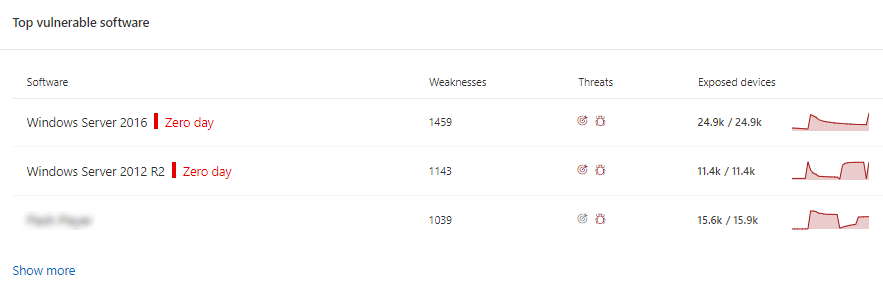

# 減少零天的漏洞-威脅和弱點管理Mitigate zero-day vulnerabilities - threat and vulnerability management

[!INCLUDE [Microsoft 365 Defender rebranding](../../includes/microsoft-defender.md)]

**適用於：****Applies to:**

- [適用於端點的 Microsoft DefenderMicrosoft Defender for Endpoint](https://go.microsoft.com/fwlink/?linkid=2154037)
- [威脅與弱點管理Threat and vulnerability management](next-gen-threat-and-vuln-mgt.md)
- [Microsoft 365 DefenderMicrosoft 365 Defender](https://go.microsoft.com/fwlink/?linkid=2118804)

>想要體驗 Microsoft Defender for Endpoint？Want to experience Microsoft Defender for Endpoint? [註冊免費試用版。Sign up for a free trial.](https://www.microsoft.com/microsoft-365/windows/microsoft-defender-atp?ocid=docs-wdatp-portaloverview-abovefoldlink)

零一天的弱點是公開披露的弱點，尚未發行任何正式的修補程式或安全性更新。A zero-day vulnerability is a publicly disclosed vulnerability for which no official patches or security updates have been released. 零天的漏洞通常會有高嚴重性層級，並主動加以利用。Zero-day vulnerabilities often have high severity levels and are actively exploited.

威脅和弱點管理只會顯示零天其相關資訊的漏洞。Threat and vulnerability management will only display zero-day vulnerabilities it has information about.

## 尋找零天弱點的相關資訊Find information about zero-day vulnerabilities

一旦找到零天弱點，就會透過 Microsoft Defender Security Center 中的下列體驗來傳達相關資訊。Once a zero-day vulnerability has been found, information about it will be conveyed through the following experiences in the Microsoft Defender Security Center.

### 威脅與弱點管理儀表板Threat and vulnerability management dashboard

在「最高安全性建議」卡片中尋找含零天標記的建議。Look for recommendations with a zero-day tag in the “Top security recommendations” card.

在「有缺陷的軟體」卡片中尋找最主要的軟體（含零天標記）。Find top software with the zero-day tag in the "Top vulnerable software" card.

### 弱點頁面Weaknesses page

尋找名為零天的弱點，以及描述和詳細資料。Look for the named zero-day vulnerability along with a description and details.

- 如果此弱點已指派 CVE 識別碼，您會在 CVE 名稱旁看到零天標籤。If this vulnerability has a CVE-ID assigned, you’ll see the zero-day label next to the CVE name.

- 如果此弱點未指派 CVE 識別碼，您可以在外觀為 "TVM-XXXX" 的內部暫時名稱下找到該漏洞。If this vulnerability has no CVE-ID assigned, you'll find it under an internal, temporary name that looks like “TVM-XXXX-XXXX”. 在指派官方 CVE 識別碼後，就會更新此名稱，但先前的內部名稱仍可供搜尋，而且會在側面面板中找到。The name will be updated once an official CVE-ID has been assigned, but the previous internal name will still be searchable and found in the side-panel.

### 軟體庫存頁面Software inventory page

尋找含零天標記的軟體。Look for software with the zero-day tag. 依 "zero day" 標記篩選，只查看含零天漏洞的軟體。Filter by the "zero day" tag to only see software with zero-day vulnerabilities.

![在 [軟體庫存] 頁面中，Windows Server 2016 的零第一天範例。](images/tvm-zero-day-software-inventory.png)

### 軟體頁面Software page

針對每個受到零天弱點影響的軟體，尋找零天標記。Look for a zero-day tag for each software that has been affected by the zero–day vulnerability.

![[Windows Server 2016 軟體] 頁面的 [零天範例] 頁面。](images/tvm-zero-day-software-page.png)

### 安全性建議頁面Security recommendations page

查看有關修復和緩解選項的明確建議，包括其存在的變通方法。View clear suggestions about remediation and mitigation options, including workarounds if they exist. 依 "zero day" 標記篩選，只請參閱解決零天弱點的安全性建議。Filter by the "zero day" tag to only see security recommendations addressing zero-day vulnerabilities.

如果有軟體有零天弱點，還有其他弱點可解決，您就會對所有的漏洞取得一個建議。If there's software with a zero-day vulnerability and additional vulnerabilities to address, you'll get one recommendation about all vulnerabilities.

![在 [安全性建議] 頁面中，Windows Server 2016 的零第一天範例。](images/tvm-zero-day-security-recommendation.png)

## 解決零天的漏洞Addressing zero-day vulnerabilities

移至 [安全性建議] 頁面，並選取一個零一天的建議。Go to the security recommendation page and select a recommendation with a zero-day. 快顯視窗將會開啟，其中會顯示零天的資訊以及該軟體的其他弱點。A flyout will open with information about the zero-day and other vulnerabilities for that software.

如果有可供使用的緩解選項和方法，將會有連結。There will be a link to mitigation options and workarounds if they are available. 您可以在部署修補程式或安全性更新之前，避免此零天數弱點帶來的風險。Workarounds may help reduce the risk posed by this zero-day vulnerability until a patch or security update can be deployed.

開啟修復選項，然後選擇 [注意] 類型。Open remediation options and choose the attention type. 因為尚未發行更新，所以建議使用「注意事項」修復選項，以取得零天的漏洞。An "attention required" remediation option is recommended for the zero-day vulnerabilities, since an update hasn't been released yet. 因為沒有要執行的特定動作，所以您無法選取到期日。You won't be able to select a due date, since there's no specific action to perform. 如果您想要修正此軟體舊版的漏洞，您可以覆寫「注意必要」修復選項，然後選擇「更新」。If there are older vulnerabilities for this software you wish to remediation, you can override the "attention required" remediation option and choose “update.”

![在 [安全性建議] 頁面中的「零天飛出 Windows Server 2016」範例。](images/tvm-zero-day-recommendation-flyout400.png)

## 追蹤零天的修復活動Track zero-day remediation activities

移至 [威脅與弱點管理 [修正](tvm-remediation.md) ] 頁面，以查看修正活動專案。Go to the threat and vulnerability management [Remediation](tvm-remediation.md) page to view the remediation activity item. 如果您選擇「注意必要」修復選項，則不會有任何進度列、票證狀態或到期日，因為我們沒有任何實際的動作可供監視。If you chose the "attention required" remediation option, there will be no progress bar, ticket status, or due date since there's no actual action we can monitor. 您可以依修正類型進行篩選，例如「軟體更新」或「注意事項」，以查看相同類別中的所有活動專案。You can filter by remediation type, such as "software update" or "attention required," to see all activity items in the same category.

## 修補零天弱點Patching zero-day vulnerabilities

當您在零天內發行修補程式時，建議會變更為「更新」，並在它旁顯示「新安全性更新天」的藍色標籤。When a patch is released for the zero-day, the recommendation will be changed to “Update” and a blue label next to it that says “New security update for zero day.” 它將不再視為零一天，將從所有頁面移除零天標記。It will no longer consider as a zero-day, the zero-day tag will be removed from all pages.

## 相關文章Related articles

- [威脅和弱點管理概述Threat and vulnerability management overview](next-gen-threat-and-vuln-mgt.md)
- [儀表板Dashboard](tvm-dashboard-insights.md)
- [安全性建議Security recommendations](tvm-security-recommendation.md)
- [軟體庫存Software inventory](tvm-software-inventory.md)
- [我組織中的弱點Vulnerabilities in my organization](tvm-weaknesses.md)
