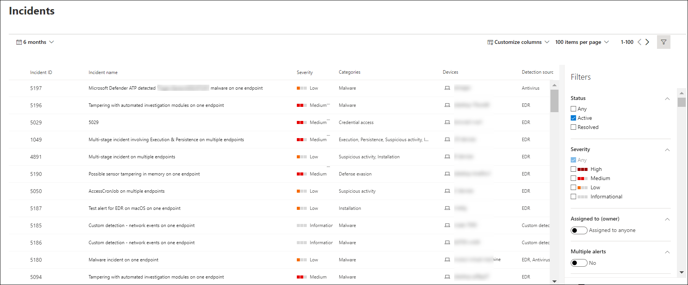

# 查看和組織 Microsoft Defender for Endpoint 事件佇列

[!INCLUDE [Microsoft 365 Defender rebranding](../../includes/microsoft-defender.md)]

**適用於：**
- [適用於端點的 Microsoft Defender](https://go.microsoft.com/fwlink/?linkid=2154037)
- [Microsoft 365 Defender](https://go.microsoft.com/fwlink/?linkid=2118804)

> 想要體驗 Defender for Endpoint？ [注册免費試用版。](https://www.microsoft.com/microsoft-365/windows/microsoft-defender-atp?ocid=docs-wdatp-pullalerts-abovefoldlink) 

[ **事件] 佇列** 顯示從您網路中的裝置標記的事件集合。 可協助您設定事件優先順序及制定明智的網路安全回應決策。

根據預設，佇列會顯示過去30天內所看到的事件，最新的事件會顯示在清單的頂端，以協助您先看到最近的事件。

您可以從數個選項中選擇自訂事件佇列視圖。 

您可以在上方導覽上進行下列作業：
- 自訂欄以新增或移除欄 
- 修改每頁查看的專案數
- 選取每頁顯示的專案
- 批次-選取要指派的事件 
- 在頁面間流覽
- 套用篩選

## 排序及篩選事件佇列
您可以套用下列篩選器來限制事件清單，並取得更具焦點的視圖。

### 嚴重性

事件嚴重性 | 描述
:---|:---
高   (Red)  | 威脅常常與高級持續威脅 (APT) 相關聯。 因為這些事件可能會對裝置造成損毀，所以會指出高風險。
中   (橙色)  | 組織中極少看到的威脅，例如反常登錄變更、可疑檔案的執行，以及常見攻擊階段的觀察行為。
低   (黃色)  | 與流行惡意程式碼和駭客攻擊相關的威脅，不一定表示組織的高級威脅。
參考   (灰色)  | 資訊性事件可能不會被視為對網路有害，但很有可能會讓追蹤。

## 指派給
您可以選取指派給任何人或指派給您來篩選清單。

### Category
根據 cybersecurity kill 鏈所在階段的描述來分類事件。 此視圖可協助威脅分析人員判斷根據內容部署的優先順序、緊急性和對應的回應策略。

### 狀態
您可以根據事件狀態來限制顯示的事件清單，以查看哪些事件為作用中或已解決。

### 資料敏感度
使用此篩選器顯示包含敏感度標籤的事件。

## 事件命名

若要深入瞭解事件的範圍，事件名稱會根據警示屬性（如受到影響的端點數目、受影響的使用者、偵測來源或類別）自動產生。

例如：多 *個來源所報告之多個端點上的多階段事件。*

> [!NOTE]
> 在自動事件命名的首次推出之前，發生的事件會保留其名稱。

## 另請參閱
- [事件佇列](/microsoft-365/security/defender-endpoint/view-incidents-queue)
- [管理事件](manage-incidents.md)
- [調查事件](investigate-incidents.md)

