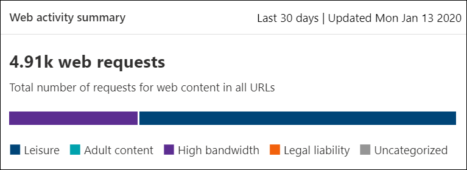

# Web 內容篩選

[!INCLUDE [Microsoft 365 Defender rebranding](../../includes/microsoft-defender.md)]

**適用於：**
- [適用於端點的 Microsoft Defender](https://go.microsoft.com/fwlink/p/?linkid=2146631)
- [Microsoft 365 Defender](https://go.microsoft.com/fwlink/?linkid=2118804)

> [!IMPORTANT]
> **Web 內容篩選目前是公開預覽** 
> 此預覽版本提供時沒有服務等級協定，不建議用於實際執行工作負載。 某些功能可能不受支援，或可能具有有限的功能。
> 如需詳細資訊，請參閱 [Microsoft Defender For Endpoint preview 功能](preview.md)。

>想要體驗 Microsoft Defender for Endpoint？ [註冊免費試用版。](https://www.microsoft.com/microsoft-365/windows/microsoft-defender-atp?ocid=docs-wdatp-main-abovefoldlink&rtc=1)

Web 內容篩選是 Microsoft Defender for Endpoint 中的 [web 保護](web-protection-overview.md) 功能的一部分。 它可讓您的組織根據其內容類別別來追蹤和控制網站的存取權。 許多這類網站雖然並非惡意，但因相容性法規、頻寬使用量或其他考慮而可能會造成問題。

設定各裝置群組中的原則，以封鎖特定類別。 封鎖類別，可防止指定裝置群組中的使用者存取與類別相關聯的 URLs。 對於任何未封鎖的類別，會自動對 URLs 進行審核。 您的使用者可以存取沒有中斷的 URLs，您會收集存取統計資料，以協助建立更多自訂的原則決定。 如果您正在查看的頁面上的元素是撥打封鎖的資源，您的使用者就會看到封鎖通知。

Web 內容篩選可在主要網頁瀏覽器上使用，且由 Windows Defender SmartScreen (Microsoft Edge) 和網路防護 (Chrome、Firefox、Brave 及 Opera) 來執行。 如需瀏覽器支援的相關資訊，請參閱必要條件一節。

摘要優點：

- 使用者無法存取封鎖類別中的網站，不論他們是在內部部署還是離開流覽
- 使用 Microsoft Defender 中定義的裝置群組，將原則輕鬆部署至使用者群組 [，以用於以端點角色為基礎的存取控制設定](https://docs.microsoft.com/microsoft-365/security/defender-endpoint/rbac)
- 在相同的中央位置存取 web 報表，並透過實際區塊和 web 使用狀況進行可視性

## 使用者體驗

支援協力廠商瀏覽器的封鎖體驗是由網路保護提供，其可提供系統層級 toast，通知使用者封鎖的連線。 

為了獲得更友好的使用者流覽體驗，請考慮使用 Microsoft Edge。

## 必要條件

在嘗試此功能之前，請確定您有下列需求：

- Windows 10 企業版 E5 授權或 Microsoft 365 E3 + Microsoft 365 E5 Security 附加元件。
- 存取 Microsoft Defender 安全中心入口網站
- 執行 Windows 10 周年的裝置更新 (版本 1607) 或更新版本，包含最新的 MoCAMP 更新。

如果 Windows Defender SmartScreen 未開啟，網路保護將接管封鎖。 它需要在裝置上 [啟用網路保護](enable-network-protection.md) 。 目前已啟用此功能的協力廠商瀏覽器是 Chrome、Firefox、Brave 及 Opera。

## 資料處理

我們會依照您選擇要使用的任何區域，做為 [端點資料處理設定](https://docs.microsoft.com/microsoft-365/security/defender-endpoint/data-storage-privacy)的一部分。 您的資料不會離開該地區的資料中心。 此外，所有協力廠商都不會共用您的資料，包括我們的資料提供者。

## 開啟 web 內容篩選

從左導覽功能表中，選取 **[設定] > [一般 > 高級功能**]。 向左下向後，直到您看到 **Web 內容篩選** 的專案。 切換到 [ **開啟** ] 和 [ **儲存] 偏好** 設定。

### 設定 web 內容篩選原則

Web 內容篩選原則會指定哪些網站類別會封鎖在哪些裝置群組上。 若要管理原則，請移至 **設定 > 規則 > 網頁內容篩選**。

使用篩選器來尋找包含某些封鎖類別或套用至特定裝置群組的原則。

### 建立原則

若要新增新的原則：

1. 在 [**設定**] 中的 [ **Web 內容篩選**] 頁面上，選取 [**新增原則**]。
2. 指定名稱。
3. 選取要封鎖的類別。 使用展開圖示可完整展開每個上層類別，並選取 [特定 web 內容類別別]。
4. 指定原則範圍。 選取 [裝置群組]，以指定要套用原則的位置。 只有選定裝置群組中的裝置會無法存取選取類別中的網站。
5. 請複查摘要並儲存原則。 原則更新最多可能需要2個小時才能套用至您選取的裝置。

秘訣：您可以部署原則，而不需要選取裝置群組上的任何類別。 此巨集指令只會建立一個審核原則，以協助您在建立封鎖原則之前瞭解使用者行為。

>[!NOTE]
>如果您要同時移除原則或變更裝置群組，這可能會導致原則部署延遲。

>[!IMPORTANT]
>封鎖 "未分類" 類別可能會導致意外的和不想要的結果。  

### 允許特定網站

您可以透過建立自訂指示器原則，覆寫 web 內容篩選中封鎖的類別以允許單一網站。 自訂指示器原則會在將 web 內容篩選原則套用至有問題的裝置群組時，取代該原則。

1. 前往 **設定**  >  **標記**  >  **URL/網域**  >  **新增專案**，以在 Microsoft Defender Security Center 中建立自訂指示器
2. 輸入網站的網域
3. 將 [原則動作] 設定為 [ **允許**]。  

### 報告不准確性

如果您遇到的網域分類不正確，您可以從 [Web 內容篩選報告] 頁面直接向我們報告錯誤。 此功能僅適用于新的 Microsoft 365 security center (security.microsoft.com) 。

若要報告 inaccuracy，請流覽至 **報告 > web 保護 > Web 內容篩選詳細資料 > 網域**。 在我們 Web 內容篩選報告的 [網域] 索引標籤上，您會在每個網域旁看到省略號。 將游標移到這個省略號上，然後選取 [ **報表 Inaccuracy**]。

隨即會開啟一個面板，您可以在其中選取優先順序，並新增其他詳細資料，例如用於重新分類的建議類別。 完成表單之後，請選取 [ **提交**]。 我們的團隊會在一部工作日內檢查要求。 若要立即解除阻隔，請建立 [自訂允許指標](indicator-ip-domain.md)。

## Web 內容篩選卡片和詳細資料

選取 [ **報告] > 網頁防護** ] 以查看卡片，其中包含有關 web 內容篩選和網頁威脅防護的資訊。 下列卡片提供有關 web 內容篩選的摘要資訊。

### 依類別的網頁活動

此卡片會列出具有最大增加或減少訪問嘗試次數的父項 web 內容類別別。 瞭解貴組織中從過去30天、3個月或6個月之網頁活動模式產生的重大變更。 選取類別名稱以查看詳細資訊。

在使用此功能的前30天內，您的組織可能沒有足夠的資料可顯示此資訊。

### Web 內容篩選摘要卡

這張牌會顯示跨不同父項 web 內容類別別的封鎖存取嘗試散佈。 選取其中一個彩色橫條圖，以查看特定上層網頁類別的詳細資訊。

### 網頁活動摘要卡

這張牌會顯示所有 URLs 中的 web 內容要求總數目。

### 查看卡片詳細資料

您可以從卡片中的圖表選取表格列或彩色的橫條圖，以存取每張卡片的 **報告詳細資料** 。 每張卡片的「報告詳細資料」頁面包含有關 web 內容類別別、網站網域和裝置群組的大量統計資料。

- **網頁類別**：列出在您的組織中有存取嘗試的 Web 內容類別別。 選取特定類別以開啟 [摘要] 飛出狀態。

- **網域**：列出組織中已存取或封鎖的網頁網域。 選取特定網域，以查看該網域的詳細資訊。

- **裝置群組**：列出組織中已產生 web 活動的所有裝置群組

使用頁面左上角的 [時間範圍] 篩選，選取時段。 您也可以篩選資訊或自訂欄位。 選取資料列，以開啟彈出窗格，以及更多有關所選取專案的詳細資訊。

## 錯誤和問題

### 此預覽中的限制與已知問題

- 只有在裝置的 OS 設定為 Server (cmd > Systeminfo > OS 設定) 時，才支援 Microsoft Edge。 網路保護只支援在伺服器裝置上的 [檢查] 模式，其負責保護支援的協力廠商瀏覽器之間的流量。

- 未指派的裝置會在報告中顯示不正確的資料。 在 [報告詳細資料] 中 > 裝置群組時，您可能會看到具有空白裝置群組欄位的列。 在進入指定群組之前，此群組包含未指派的裝置。 此列的報表可能不包含正確的裝置或存取計數。

## 相關主題

- [Web 保護一覽](web-protection-overview.md)
- [網頁威脅防護](web-threat-protection.md)
- [監視 web 安全性](web-protection-monitoring.md)
- [回應 web 威脅](web-protection-response.md)
