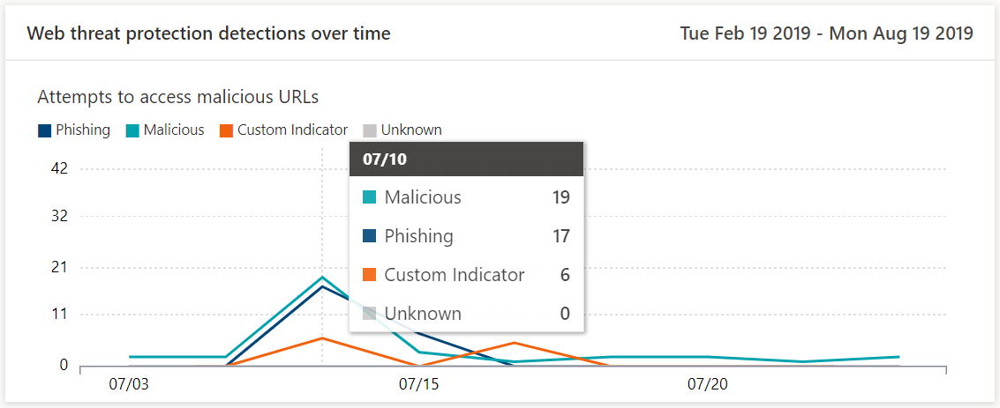

# 監視網頁流覽安全性Monitor web browsing security

[!INCLUDE [Microsoft 365 Defender rebranding](../../includes/microsoft-defender.md)]

**適用於：****Applies to:**
- [適用於端點的 Microsoft DefenderMicrosoft Defender for Endpoint](https://go.microsoft.com/fwlink/p/?linkid=2154037)
- [Microsoft 365 DefenderMicrosoft 365 Defender](https://go.microsoft.com/fwlink/?linkid=2118804)

>想要體驗適用於端點的 Microsoft Defender 嗎？Want to experience Microsoft Defender for Endpoint? [注册免費試用版。Sign up for a free trial.](https://www.microsoft.com/microsoft-365/windows/microsoft-defender-atp?ocid=docs-wdatp-main-abovefoldlink&rtc=1)

web 保護可讓您透過 Microsoft Defender 資訊安全中心中 **報告 > web 保護**，來監視組織的 web 流覽安全性。Web protection lets you monitor your organization’s web browsing security through reports under **Reports > Web protection** in the Microsoft Defender Security Center. 報告包含的卡片可提供 web 威脅偵測統計資料。The report contains cards that provide web threat detection statistics.

- **隨時間變化的 web 威脅防護** 偵測-此趨勢卡會在過去30天、過去3個月、過去6個月的 (，顯示在選取的時段內，由類型偵測到的 web 威脅數目) **Web threat protection detections over time** - this trending card displays the number of web threats detected by type during the selected time period (Last 30 days, Last 3 months, Last 6 months)
 
    

- **Web 威脅防護摘要** -此卡片會顯示過去30天內的 web 威脅偵測總數，顯示不同網路威脅類型的散佈。**Web threat protection summary** - this card displays the total web threat detections in the past 30 days, showing distribution across the different types of web threats. 選取切片時，會開啟包含惡意網站或有害網站的網域清單。Selecting a slice opens the list of the domains that were found with malicious or unwanted websites.

    

>[!Note]
>在 [卡片] 或 [網域] 清單中的區塊反映之前，可能需要長達12小時。It can take up to 12 hours before a block is reflected in the cards or the domain list.

## Web 威脅類型Types of web threats

Web 保護會將惡意及有害的網站分類，如下所示：Web protection categorizes malicious and unwanted websites as:

- **網路釣魚** -包含冒牌網頁表單和其他網路釣魚詐騙機制的網站，其設計目的是欺騙使用者 divulging 認證及其他敏感資訊。**Phishing** - websites that contain spoofed web forms and other phishing mechanisms designed to trick users into divulging credentials and other sensitive information
- **惡意** 網站，主控惡意程式碼和利用程式碼**Malicious** - websites that host malware and exploit code
- **自訂指示器** -已新增至您 [自訂指示器清單](manage-indicators.md) 進行封鎖的 URLs 或網域的網站**Custom indicator** - websites whose URLs or domains you've added to your [custom indicator list](manage-indicators.md) for blocking

## 查看網域清單View the domain list

在 [ **網頁威脅防護] 摘要** 卡中，選取特定的 web 威脅類別，以開啟 [ **網域** ] 頁面。Select a specific web threat category in the **Web threat protection summary** card to open the **Domains** page. 此頁面會顯示 [威脅] 類別底下的網域清單。This page displays the list of the domains under that threat category. 此頁面提供每個網域的下列資訊：The page provides the following information for each domain:

- **存取計數** -網域中 URLs 的要求數目**Access count** - number of requests for URLs in the domain
- **區塊** -封鎖要求的次數**Blocks** - number of times requests were blocked
- **存取趨勢** -在存取嘗試數目上的變更**Access trend** - change in number of access attempts
- **威脅類別** -web 威脅類型**Threat category** - type of web threat
- **裝置** -具有存取嘗試的裝置數目**Devices** - number of devices with access attempts

選取一個網域，以查看已嘗試存取該網域中 URLs 的裝置清單及 URLs 清單。Select a domain to view the list of devices that have attempted to access URLs in that domain and the list of URLs.

## 相關主題Related topics

- [Web 保護概觀Web protection overview](web-protection-overview.md)
- [Web 內容篩選Web content filtering](web-content-filtering.md)
- [網頁威脅防護Web threat protection](web-threat-protection.md)
- [回應 Web 威脅Respond to web threats](web-protection-response.md)
