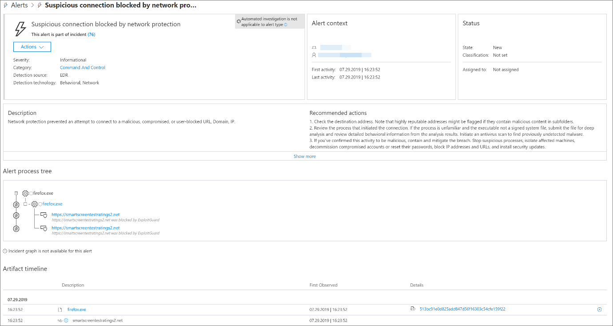

# 回應 Web 威脅Respond to web threats

[!INCLUDE [Microsoft 365 Defender rebranding](../../includes/microsoft-defender.md)]

**適用於：****Applies to:**
- [適用於端點的 Microsoft DefenderMicrosoft Defender for Endpoint](https://go.microsoft.com/fwlink/p/?linkid=2154037)
- [Microsoft 365 DefenderMicrosoft 365 Defender](https://go.microsoft.com/fwlink/?linkid=2118804)

>想要體驗 Microsoft Defender for Endpoint？Want to experience Microsoft Defender for Endpoint? [註冊免費試用版。Sign up for a free trial.](https://www.microsoft.com/microsoft-365/windows/microsoft-defender-atp?ocid=docs-wdatp-main-abovefoldlink&rtc=1)

Microsoft Defender for Endpoint 中的 Web 保護功能可讓您有效地調查與您自訂指示器清單中的惡意網站和網站相關的提醒。Web protection in Microsoft Defender for Endpoint lets you efficiently investigate and respond to alerts related to malicious websites and websites in your custom indicator list.

## 查看網頁威脅警示View web threat alerts
Microsoft Defender for Endpoint 會針對惡意或可疑的 web 活動產生下列 [警示](manage-alerts.md) ：Microsoft Defender for Endpoint generates the following [alerts](manage-alerts.md) for malicious or suspicious web activity:
- **網路保護封鎖的可疑** 連線-當使用者嘗試存取您自訂指示器清單中的惡意網站或網站 *時，會* 產生此警示，以 *封鎖* 模式中的網路保護**Suspicious connection blocked by network protection** — this alert is generated when an attempt to access a malicious website or a website in your custom indicator list is *stopped* by network protection in *block* mode
- **網路保護偵測到可疑** 的連線-當以「 *僅供審核* 」模式中的網路保護方式偵測到自訂指示器清單中的訪問惡意網站或網站時，就會產生此警示。**Suspicious connection detected by network protection** — this alert is generated when an attempt to access a malicious website or a website in your custom indicator list is detected by network protection in *audit only* mode

每個警示都提供下列資訊：Each alert provides the following information: 
- 嘗試存取封鎖的網站的裝置Device that attempted to access the blocked website
- 用來傳送 web 要求的應用程式或程式Application or program used to send the web request
- 自訂指示器清單中的惡意 URL 或 URLMalicious URL or URL in the custom indicator list
- 回應回應程式的建議動作Recommended actions for responders

>[!Note]
>為了降低警示數量，Microsoft Defender for Endpoint 會將相同裝置上相同網域的 web 威脅偵測，合併到單一警示。To reduce the volume of alerts, Microsoft Defender for Endpoint consolidates web threat detections for the same domain on the same device each day to a single alert. 只產生一個提醒並計算在 [web 保護報告](web-protection-monitoring.md)中。Only one alert is generated and counted into the [web protection report](web-protection-monitoring.md).

## 檢查網站詳細資料Inspect website details
您可以在警示中，選取網站的 URL 或網域，以深入瞭解。You can dive deeper by selecting the URL or domain of the website in the alert. 這會開啟有關該特定 URL 或網域的頁面，其中包含各種資訊，包括：This opens a page about that particular URL or domain with various information, including:
- 嘗試存取網站的裝置Devices that attempted to access website
- 與網站相關的事件及警示Incidents and alerts related to the website
- 在組織中的事件看到網站的頻率How frequent the website was seen in events in your organization

    ![[網域] 或 [URL 實體詳細資料] 頁面的圖像](images/wtp-website-details.png)

[深入瞭解 URL 或網域實體頁面Learn more about URL or domain entity pages](investigate-domain.md)

## 檢查裝置Inspect the device
您也可以檢查嘗試存取封鎖 URL 的裝置。You can also check the device that attempted to access a blocked URL. 在 [警示] 頁面上選取裝置的名稱，會開啟一個頁面，其中包含裝置的完整資訊。Selecting the name of the device on the alert page opens a page with comprehensive information about the device.

[深入瞭解裝置實體頁面Learn more about device entity pages](investigate-machines.md)

## 使用者的網頁瀏覽器和 Windows 通知Web browser and Windows notifications for end users

使用 Microsoft Defender for Endpoint 中的 web 保護，您的使用者將無法使用 Microsoft Edge 或其他瀏覽器來訪問惡意或有害的網站。With web protection in Microsoft Defender for Endpoint, your end users will be prevented from visiting malicious or unwanted websites using Microsoft Edge or other browsers. 因為封鎖是透過 [網路保護](network-protection.md)來執行，所以他們會看到來自網頁瀏覽器的一般錯誤。Because blocking is performed by [network protection](network-protection.md), they will see a generic error from the web browser. 他們也會看到來自 Windows 的通知。They will also see a notification from Windows.

 *microsoft edge 封鎖* 的 Windows 通知網頁威脅
*Web threat blocked on Microsoft Edge*

 *在 Chrome 上封鎖* 的 Windows 通知網頁威脅
*Web threat blocked on Chrome*

## 相關主題Related topics
- [Web 保護概觀Web protection overview](web-protection-overview.md)
- [Web 內容篩選Web content filtering](web-content-filtering.md)
- [網頁威脅防護Web threat protection](web-threat-protection.md)
- [監視 Web 安全性Monitor web security](web-protection-monitoring.md)
