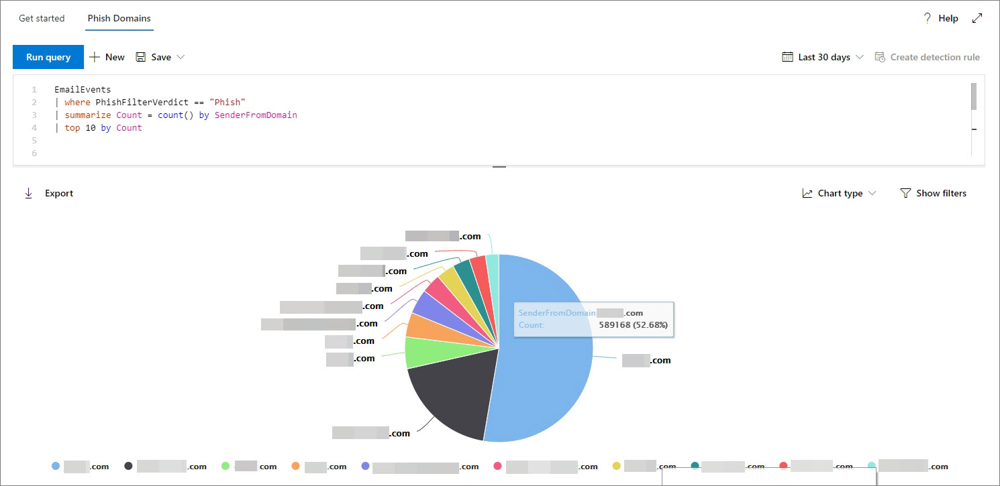
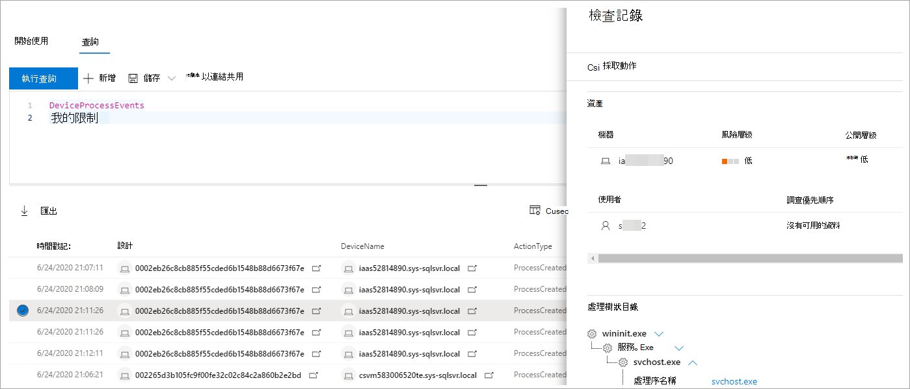

# <a name="work-with-advanced-hunting-query-results"></a><span data-ttu-id="aa285-104">使用高級搜尋查詢結果</span><span class="sxs-lookup"><span data-stu-id="aa285-104">Work with advanced hunting query results</span></span>

[!INCLUDE [Microsoft 365 Defender rebranding](../includes/microsoft-defender.md)]


<span data-ttu-id="aa285-105">**適用於：**</span><span class="sxs-lookup"><span data-stu-id="aa285-105">**Applies to:**</span></span>
- <span data-ttu-id="aa285-106">Microsoft 365 Defender</span><span class="sxs-lookup"><span data-stu-id="aa285-106">Microsoft 365 Defender</span></span>
- <span data-ttu-id="aa285-107">適用於端點的 Microsoft Defender</span><span class="sxs-lookup"><span data-stu-id="aa285-107">Microsoft Defender for Endpoint</span></span>

[!INCLUDE [Prerelease information](../includes/prerelease.md)]

<span data-ttu-id="aa285-108">雖然您可以建立您的 [高級搜尋](advanced-hunting-overview.md) 查詢以傳回非常精確的資訊，但您也可以使用查詢結果，以深入瞭解並調查特定活動和指示器。</span><span class="sxs-lookup"><span data-stu-id="aa285-108">While you can construct your [advanced hunting](advanced-hunting-overview.md) queries to return very precise information, you can also work with the query results to gain further insight and investigate specific activities and indicators.</span></span> <span data-ttu-id="aa285-109">您可以對查詢結果採取下列動作：</span><span class="sxs-lookup"><span data-stu-id="aa285-109">You can take the following actions on your query results:</span></span>

- <span data-ttu-id="aa285-110">以表格或圖表形式查看結果</span><span class="sxs-lookup"><span data-stu-id="aa285-110">View results as a table or chart</span></span>
- <span data-ttu-id="aa285-111">匯出資料表和圖表</span><span class="sxs-lookup"><span data-stu-id="aa285-111">Export tables and charts</span></span>
- <span data-ttu-id="aa285-112">深入查看詳細實體資訊</span><span class="sxs-lookup"><span data-stu-id="aa285-112">Drill down to detailed entity information</span></span>
- <span data-ttu-id="aa285-113">直接從結果中調整您的查詢或套用篩選</span><span class="sxs-lookup"><span data-stu-id="aa285-113">Tweak your queries directly from the results or apply filters</span></span>

## <a name="view-query-results-as-a-table-or-chart"></a><span data-ttu-id="aa285-114">以資料表或圖表形式查看查詢結果</span><span class="sxs-lookup"><span data-stu-id="aa285-114">View query results as a table or chart</span></span>
<span data-ttu-id="aa285-115">根據預設，高級搜尋會將查詢結果顯示為表格式資料。</span><span class="sxs-lookup"><span data-stu-id="aa285-115">By default, advanced hunting displays query results as tabular data.</span></span> <span data-ttu-id="aa285-116">您也可以將相同的資料顯示為圖表。</span><span class="sxs-lookup"><span data-stu-id="aa285-116">You can also display the same data as a chart.</span></span> <span data-ttu-id="aa285-117">「高級搜尋支援下列各項：</span><span class="sxs-lookup"><span data-stu-id="aa285-117">Advanced hunting supports the following views:</span></span>

| <span data-ttu-id="aa285-118">檢視類型</span><span class="sxs-lookup"><span data-stu-id="aa285-118">View type</span></span> | <span data-ttu-id="aa285-119">描述</span><span class="sxs-lookup"><span data-stu-id="aa285-119">Description</span></span> |
| -- | -- |
| <span data-ttu-id="aa285-120">**Table**</span><span class="sxs-lookup"><span data-stu-id="aa285-120">**Table**</span></span> | <span data-ttu-id="aa285-121">以表格格式顯示查詢結果</span><span class="sxs-lookup"><span data-stu-id="aa285-121">Displays the query results in tabular format</span></span> |
| <span data-ttu-id="aa285-122">**直條圖**</span><span class="sxs-lookup"><span data-stu-id="aa285-122">**Column chart**</span></span> | <span data-ttu-id="aa285-123">在 X 軸上轉譯一系列的唯一專案，成為其高度代表其他欄位數值的分隔號</span><span class="sxs-lookup"><span data-stu-id="aa285-123">Renders a series of unique items on the x-axis as vertical bars whose heights represent numeric values from another field</span></span> |
| <span data-ttu-id="aa285-124">**堆疊直條圖**</span><span class="sxs-lookup"><span data-stu-id="aa285-124">**Stacked column chart**</span></span> | <span data-ttu-id="aa285-125">會在 X 軸上轉譯一系列的唯一專案，成為堆疊分隔號，其高度代表一個或多個其他欄位的數值</span><span class="sxs-lookup"><span data-stu-id="aa285-125">Renders a series of unique items on the x-axis as stacked vertical bars whose heights represent numeric values from one or more other fields</span></span> |
| <span data-ttu-id="aa285-126">**圓形圖**</span><span class="sxs-lookup"><span data-stu-id="aa285-126">**Pie chart**</span></span> | <span data-ttu-id="aa285-127">會呈現代表唯一專案的剖圓形圖。</span><span class="sxs-lookup"><span data-stu-id="aa285-127">Renders sectional pies representing unique items.</span></span> <span data-ttu-id="aa285-128">每個圓形圖的大小代表來自其他欄位的數值。</span><span class="sxs-lookup"><span data-stu-id="aa285-128">The size of each pie represents numeric values from another field.</span></span> |
| <span data-ttu-id="aa285-129">**環形圖表**</span><span class="sxs-lookup"><span data-stu-id="aa285-129">**Donut chart**</span></span> | <span data-ttu-id="aa285-130">會呈現代表唯一專案的剖弧形。</span><span class="sxs-lookup"><span data-stu-id="aa285-130">Renders sectional arcs representing unique items.</span></span> <span data-ttu-id="aa285-131">每個弧線的長度代表來自其他欄位的數值。</span><span class="sxs-lookup"><span data-stu-id="aa285-131">The length of each arc represents numeric values from another field.</span></span> |
| <span data-ttu-id="aa285-132">**折線圖**</span><span class="sxs-lookup"><span data-stu-id="aa285-132">**Line chart**</span></span> | <span data-ttu-id="aa285-133">會為一系列的唯一專案繪製數值，並連接繪製值</span><span class="sxs-lookup"><span data-stu-id="aa285-133">Plots numeric values for a series of unique items and connects the plotted values</span></span> |
| <span data-ttu-id="aa285-134">**散佈圖**</span><span class="sxs-lookup"><span data-stu-id="aa285-134">**Scatter chart**</span></span> | <span data-ttu-id="aa285-135">繪製一系列唯一專案的數值</span><span class="sxs-lookup"><span data-stu-id="aa285-135">Plots numeric values for a series of unique items</span></span> |
| <span data-ttu-id="aa285-136">**面積圖**</span><span class="sxs-lookup"><span data-stu-id="aa285-136">**Area chart**</span></span> | <span data-ttu-id="aa285-137">繪製一系列獨特專案的數值，並填滿所繪製的值底下的區段</span><span class="sxs-lookup"><span data-stu-id="aa285-137">Plots numeric values for a series of unique items and fills the sections below the plotted values</span></span> |

### <a name="construct-queries-for-effective-charts"></a><span data-ttu-id="aa285-138">構造有效圖表的查詢</span><span class="sxs-lookup"><span data-stu-id="aa285-138">Construct queries for effective charts</span></span>
<span data-ttu-id="aa285-139">在呈現圖表時，高級搜尋會自動識別感興趣的資料行以及要匯總的數值。</span><span class="sxs-lookup"><span data-stu-id="aa285-139">When rendering charts, advanced hunting automatically identifies columns of interest and the numeric values to aggregate.</span></span> <span data-ttu-id="aa285-140">若要取得有意義的圖表，請建立您的查詢以傳回您想要查看的特定值。</span><span class="sxs-lookup"><span data-stu-id="aa285-140">To get meaningful charts, construct your queries to return the specific values you want to see visualized.</span></span> <span data-ttu-id="aa285-141">以下是一些範例查詢和結果圖表。</span><span class="sxs-lookup"><span data-stu-id="aa285-141">Here are some sample queries and the resulting charts.</span></span>

#### <a name="alerts-by-severity"></a><span data-ttu-id="aa285-142">警示（按嚴重性）</span><span class="sxs-lookup"><span data-stu-id="aa285-142">Alerts by severity</span></span>
<span data-ttu-id="aa285-143">使用 `summarize` 運算子可取得您要繪製圖表之值的數值計數。</span><span class="sxs-lookup"><span data-stu-id="aa285-143">Use the `summarize` operator to obtain a numeric count of the values you want to chart.</span></span> <span data-ttu-id="aa285-144">下列查詢會使用 `summarize` 接線員依嚴重性取得警示數目。</span><span class="sxs-lookup"><span data-stu-id="aa285-144">The query below uses the `summarize` operator to get the number of alerts by severity.</span></span>

```kusto
AlertInfo
| summarize Total = count() by Severity
```
<span data-ttu-id="aa285-145">當您轉譯結果時，直條圖會將每個嚴重性值顯示為個別的資料行：</span><span class="sxs-lookup"><span data-stu-id="aa285-145">When rendering the results, a column chart displays each severity value as a separate column:</span></span>

<span data-ttu-id="aa285-146">
 *嚴重性顯示為欄圖表的警示欄查詢結果。*</span><span class="sxs-lookup"><span data-stu-id="aa285-146">
*Query results for alerts by severity displayed as a column chart*</span></span>

#### <a name="alert-severity-by-operating-system"></a><span data-ttu-id="aa285-147">依作業系統的警示嚴重性</span><span class="sxs-lookup"><span data-stu-id="aa285-147">Alert severity by operating system</span></span>
<span data-ttu-id="aa285-148">您也可以使用 `summarize` 運算子來準備從多個欄位繪製圖表值的結果。</span><span class="sxs-lookup"><span data-stu-id="aa285-148">You could also use the `summarize` operator to prepare results for charting values from multiple fields.</span></span> <span data-ttu-id="aa285-149">例如，您可能想要瞭解如何在作業系統之間散佈警示嚴重性 (OS) 。</span><span class="sxs-lookup"><span data-stu-id="aa285-149">For example, you might want to understand how alert severities are distributed across operating systems (OS).</span></span> 

<span data-ttu-id="aa285-150">下列查詢會使用一個 `join` 運算子從資料表中拉入 OS 資訊 `DeviceInfo` ，然後使用 `summarize` 來計數和欄中的值 `OSPlatform` `Severity` ：</span><span class="sxs-lookup"><span data-stu-id="aa285-150">The query below uses a `join` operator to pull in OS information from the `DeviceInfo` table, and then uses `summarize` to count values in both the `OSPlatform` and `Severity` columns:</span></span>

```kusto
AlertInfo
| join AlertEvidence on AlertId
| join DeviceInfo on DeviceId
| summarize Count = count() by OSPlatform, Severity 
```
<span data-ttu-id="aa285-151">這些結果是使用堆疊欄圖表的最佳顯示方式：</span><span class="sxs-lookup"><span data-stu-id="aa285-151">These results are best visualized using a stacked column chart:</span></span>

<span data-ttu-id="aa285-152">
 *依作業系統及嚴重性顯示為堆疊* 圖表的通知圖表查詢結果。</span><span class="sxs-lookup"><span data-stu-id="aa285-152">
*Query results for alerts by OS and severity displayed as a stacked chart*</span></span>

#### <a name="phishing-emails-across-top-ten-sender-domains"></a><span data-ttu-id="aa285-153">跨前十個寄件者網域的網路釣魚電子郵件</span><span class="sxs-lookup"><span data-stu-id="aa285-153">Phishing emails across top ten sender domains</span></span>
<span data-ttu-id="aa285-154">如果您正在處理的值清單並不有限，您可以使用 `Top` 運算子，只繪製大多數實例的值。</span><span class="sxs-lookup"><span data-stu-id="aa285-154">If you're dealing with a list of values that isn’t finite, you can use the `Top` operator to chart only the values with the most instances.</span></span> <span data-ttu-id="aa285-155">例如，若要使用最多的網路釣魚電子郵件取得前10個寄件者的網域，請使用下列查詢：</span><span class="sxs-lookup"><span data-stu-id="aa285-155">For example, to get the top ten sender domains with the most phishing emails, use the query below:</span></span>

```kusto
EmailEvents
| where ThreatTypes has "Phish" 
| summarize Count = count() by SenderFromDomain 
| top 10 by Count
```
<span data-ttu-id="aa285-156">使用圓形圖模式，以有效顯示跨頂級網域的散佈方式：</span><span class="sxs-lookup"><span data-stu-id="aa285-156">Use the pie chart view to effectively show distribution across the top domains:</span></span>

<span data-ttu-id="aa285-157">
 *跨越排名多個寄件者的網域之網路釣魚電子郵件的散佈*</span><span class="sxs-lookup"><span data-stu-id="aa285-157">
*Pie chart showing distribution of phishing emails across top sender domains*</span></span>

#### <a name="file-activities-over-time"></a><span data-ttu-id="aa285-158">一段時間的檔活動</span><span class="sxs-lookup"><span data-stu-id="aa285-158">File activities over time</span></span>
<span data-ttu-id="aa285-159">使用 `summarize` 運算子搭配 `bin()` 函數，您可以檢查是否有一段時間的特定指示器相關的事件。</span><span class="sxs-lookup"><span data-stu-id="aa285-159">Using the `summarize` operator with the `bin()` function, you can check for events involving a particular indicator over time.</span></span> <span data-ttu-id="aa285-160">下列查詢 `invoice.doc` 會計算大約30分鐘內的檔案相關事件，以顯示與該檔案相關的波峰。</span><span class="sxs-lookup"><span data-stu-id="aa285-160">The query below counts events involving the file `invoice.doc` at 30 minute intervals to show spikes in activity related to that file:</span></span>

```kusto
AppFileEvents
| union DeviceFileEvents
| where FileName == "invoice.doc"
| summarize FileCount = count() by bin(Timestamp, 30m)
```
<span data-ttu-id="aa285-161">下方的折線圖會明確強調包含更多活動的時間週期 `invoice.doc` ：</span><span class="sxs-lookup"><span data-stu-id="aa285-161">The line chart below clearly highlights time periods with more activity involving `invoice.doc`:</span></span> 

<span data-ttu-id="aa285-162">
 *顯示隨時間的檔相關的事件數目*</span><span class="sxs-lookup"><span data-stu-id="aa285-162">
*Line chart showing the number of events involving a file over time*</span></span>


## <a name="export-tables-and-charts"></a><span data-ttu-id="aa285-163">匯出資料表和圖表</span><span class="sxs-lookup"><span data-stu-id="aa285-163">Export tables and charts</span></span>
<span data-ttu-id="aa285-164">執行查詢後，請選取 [ **匯出** ]，將結果儲存至本機檔案。</span><span class="sxs-lookup"><span data-stu-id="aa285-164">After running a query, select **Export** to save the results to local file.</span></span> <span data-ttu-id="aa285-165">您所選擇的查看會決定結果的匯出方式：</span><span class="sxs-lookup"><span data-stu-id="aa285-165">Your chosen view determines how the results are exported:</span></span>

- <span data-ttu-id="aa285-166">**表格視圖**--查詢結果會以表格形式匯出為 Microsoft Excel 活頁簿</span><span class="sxs-lookup"><span data-stu-id="aa285-166">**Table view** — the query results are exported in tabular form as a Microsoft Excel workbook</span></span>
- <span data-ttu-id="aa285-167">**任何圖表** --查詢結果會匯出為所呈現圖表的 JPEG 圖像</span><span class="sxs-lookup"><span data-stu-id="aa285-167">**Any chart** — the query results are exported as a JPEG image of the rendered chart</span></span>

## <a name="drill-down-from-query-results"></a><span data-ttu-id="aa285-168">從查詢結果向下切入</span><span class="sxs-lookup"><span data-stu-id="aa285-168">Drill down from query results</span></span>
<span data-ttu-id="aa285-169">若要快速檢查查詢結果中的記錄，請選取對應的資料列，以開啟 [ **檢查記錄** ] 面板。</span><span class="sxs-lookup"><span data-stu-id="aa285-169">To quickly inspect a record in your query results, select the corresponding row to open the **Inspect record** panel.</span></span> <span data-ttu-id="aa285-170">面板會根據選取的記錄提供下列資訊：</span><span class="sxs-lookup"><span data-stu-id="aa285-170">The panel provides the following information based on the selected record:</span></span>

- <span data-ttu-id="aa285-171">**資產** -記錄中所) 的主要資產 (信箱、裝置和使用者的摘要視圖，並提供可用的資訊，例如風險和暴露程度。</span><span class="sxs-lookup"><span data-stu-id="aa285-171">**Assets** — summarized view of the main assets (mailboxes, devices, and users) found in the record, enriched with available information, such as risk and exposure levels</span></span>
- <span data-ttu-id="aa285-172">**進程樹狀目錄** ：針對含處理常式資訊並豐富使用可用內容資訊的記錄所產生;一般說來，傳回多個資料列的查詢可能會產生更豐富的程式樹。</span><span class="sxs-lookup"><span data-stu-id="aa285-172">**Process tree** — generated for records with process information and enriched using available contextual information; in general, queries that return more columns can result in richer process trees.</span></span>
- <span data-ttu-id="aa285-173">**所有詳細資料** ：記錄中的欄的所有值</span><span class="sxs-lookup"><span data-stu-id="aa285-173">**All details** — all the values from the columns in the record</span></span>  



<span data-ttu-id="aa285-175">若要在查詢結果中查看特定實體的詳細資訊，例如機器、檔案、使用者、IP 位址或 URL，請選取實體識別碼，以開啟該實體的詳細設定檔頁面面。</span><span class="sxs-lookup"><span data-stu-id="aa285-175">To view more information about a specific entity in your query results, such as a machine, file, user, IP address, or URL, select the entity identifier to open a detailed profile page for that entity.</span></span>

## <a name="tweak-your-queries-from-the-results"></a><span data-ttu-id="aa285-176">從結果調整您的查詢</span><span class="sxs-lookup"><span data-stu-id="aa285-176">Tweak your queries from the results</span></span>
<span data-ttu-id="aa285-177">以滑鼠右鍵按一下結果集中的值，以快速強化您的查詢。</span><span class="sxs-lookup"><span data-stu-id="aa285-177">Right-click a value in the result set to quickly enhance your query.</span></span> <span data-ttu-id="aa285-178">您可以使用下列選項來執行這些動作：</span><span class="sxs-lookup"><span data-stu-id="aa285-178">You can use the options to:</span></span>

- <span data-ttu-id="aa285-179">明確尋找選取的值 (`==`)</span><span class="sxs-lookup"><span data-stu-id="aa285-179">Explicitly look for the selected value (`==`)</span></span>
- <span data-ttu-id="aa285-180">從查詢排除選取的值 (`!=`)</span><span class="sxs-lookup"><span data-stu-id="aa285-180">Exclude the selected value from the query (`!=`)</span></span>
- <span data-ttu-id="aa285-181">取得更多可將值新增至查詢的進階運算子，例如 `contains`、`starts with` 和 `ends with`</span><span class="sxs-lookup"><span data-stu-id="aa285-181">Get more advanced operators for adding the value to your query, such as `contains`, `starts with` and `ends with`</span></span> 


## <a name="filter-the-query-results"></a><span data-ttu-id="aa285-183">篩選查詢結果</span><span class="sxs-lookup"><span data-stu-id="aa285-183">Filter the query results</span></span>
<span data-ttu-id="aa285-184">顯示在右側的篩選器可提供結果集的摘要。</span><span class="sxs-lookup"><span data-stu-id="aa285-184">The filters displayed to the right provide a summary of the result set.</span></span> <span data-ttu-id="aa285-185">每個資料行都有各自的區段，列出針對該資料行找到的獨特值和執行個體數量。</span><span class="sxs-lookup"><span data-stu-id="aa285-185">Each column has its own section that lists the distinct values found for that column and the number of instances.</span></span>

<span data-ttu-id="aa285-186">`+` `-` 在您想要包含或排除的值上選取 [或] 按鈕，然後選取 [**執行查詢**]，以精煉您的查詢。</span><span class="sxs-lookup"><span data-stu-id="aa285-186">Refine your query by selecting the `+` or `-` buttons on the values that you want to include or exclude and then selecting **Run query**.</span></span>


<span data-ttu-id="aa285-188">一旦套用篩選來修改查詢，然後執行查詢，結果就會相應更新。</span><span class="sxs-lookup"><span data-stu-id="aa285-188">Once you apply the filter to modify the query and then run the query, the results are updated accordingly.</span></span>

>[!NOTE]
><span data-ttu-id="aa285-189">本文中的部分表格可能無法在 Microsoft Defender for Endpoint 中使用。</span><span class="sxs-lookup"><span data-stu-id="aa285-189">Some tables in this article might not be available in Microsoft Defender for Endpoint.</span></span> <span data-ttu-id="aa285-190">使用更多資料來源[開啟 Microsoft 365 Defender](m365d-enable.md)以搜尋威脅。</span><span class="sxs-lookup"><span data-stu-id="aa285-190">[Turn on Microsoft 365 Defender](m365d-enable.md) to hunt for threats using more data sources.</span></span> <span data-ttu-id="aa285-191">您可以遵循[從 microsoft defender for endpoint 遷移高級搜尋查詢](advanced-hunting-migrate-from-mde.md)中的步驟，將您的高級搜尋工作流程從 microsoft defender for endpoint 移至 Microsoft 365 Defender。</span><span class="sxs-lookup"><span data-stu-id="aa285-191">You can move your advanced hunting workflows from Microsoft Defender for Endpoint to Microsoft 365 Defender by following the steps in [Migrate advanced hunting queries from Microsoft Defender for Endpoint](advanced-hunting-migrate-from-mde.md).</span></span>

## <a name="related-topics"></a><span data-ttu-id="aa285-192">相關主題</span><span class="sxs-lookup"><span data-stu-id="aa285-192">Related topics</span></span>
- [<span data-ttu-id="aa285-193">進階搜捕概觀</span><span class="sxs-lookup"><span data-stu-id="aa285-193">Advanced hunting overview</span></span>](advanced-hunting-overview.md)
- [<span data-ttu-id="aa285-194">了解查詢語言</span><span class="sxs-lookup"><span data-stu-id="aa285-194">Learn the query language</span></span>](advanced-hunting-query-language.md)
- [<span data-ttu-id="aa285-195">使用共用查詢</span><span class="sxs-lookup"><span data-stu-id="aa285-195">Use shared queries</span></span>](advanced-hunting-shared-queries.md)
- [<span data-ttu-id="aa285-196">跨裝置、電子郵件、應用程式和身分識別搜捕</span><span class="sxs-lookup"><span data-stu-id="aa285-196">Hunt across devices, emails, apps, and identities</span></span>](advanced-hunting-query-emails-devices.md)
- [<span data-ttu-id="aa285-197">了解結構描述</span><span class="sxs-lookup"><span data-stu-id="aa285-197">Understand the schema</span></span>](advanced-hunting-schema-tables.md)
- [<span data-ttu-id="aa285-198">套用查詢最佳做法</span><span class="sxs-lookup"><span data-stu-id="aa285-198">Apply query best practices</span></span>](advanced-hunting-best-practices.md)
- [<span data-ttu-id="aa285-199">自訂偵測概觀</span><span class="sxs-lookup"><span data-stu-id="aa285-199">Custom detections overview</span></span>](custom-detections-overview.md)
