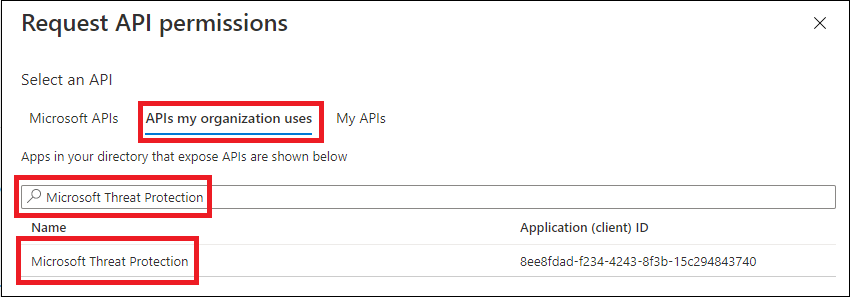
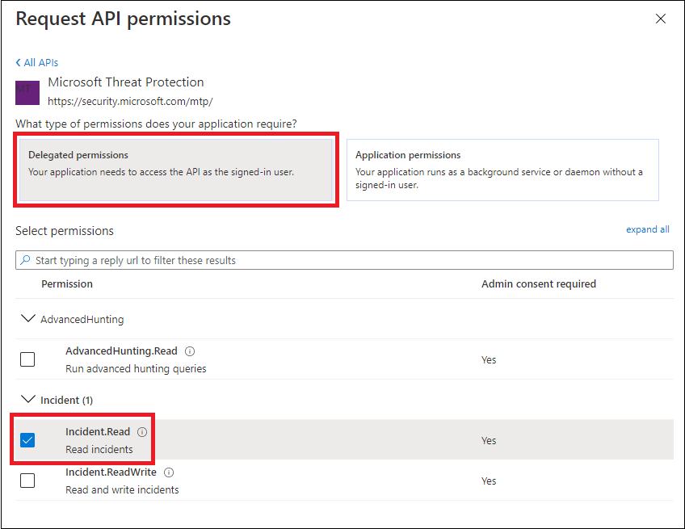
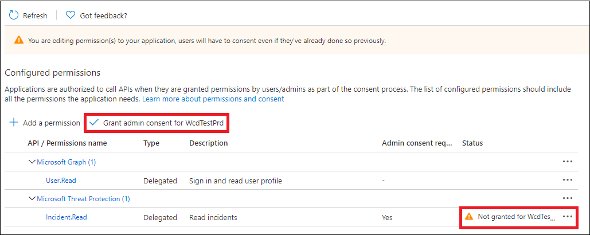

# <a name="create-an-app-to-access-microsoft-365-defender-apis-on-behalf-of-a-user"></a>建立應用程式以代表使用者存取 Microsoft 365 Defender APIs

[!INCLUDE [Microsoft 365 Defender rebranding](../includes/microsoft-defender.md)]

**適用於：**

- Microsoft 365 Defender

> [!IMPORTANT]
> 部分資訊與發行前版本產品有關，在正式發行之前可能會實質上進行修改。 Microsoft 對此處提供的資訊，不提供任何明確或隱含的瑕疵擔保。

此頁面會說明如何建立應用程式，以讓單一使用者以程式設計方式存取 Microsoft 365 Defender。

如果您需要以程式設計方式存取沒有定義之使用者的 Microsoft 365 Defender (例如，如果您正在撰寫後臺應用程式或幕後程式) ，請參閱 [Create a app to Access Microsoft 365 Defender （沒有使用者](api-create-app-web.md)）。 如果您需要為多個承租人提供存取權，例如，如果您正在服務大型組織或客戶群組，請參閱 Create a [app with a app to access to To Microsoft 365 Defender APIs](api-partner-access.md)。如果您不確定需要哪種類型的存取，請參閱 [入門](api-access.md)。

Microsoft 365 Defender 會透過一組程式設計 APIs 來公開其大部分資料和動作。 這些 APIs 可協助您自動化工作流程，並使用 Microsoft 365 Defender 的功能。 此 API access 需要 OAuth 2.0 驗證。 如需詳細資訊，請參閱 [OAuth 2.0 授權碼流程](/azure/active-directory/develop/active-directory-v2-protocols-oauth-code)。

一般來講，您必須採取下列步驟，才能使用這些 APIs：

- 建立 Azure Active Directory (Azure AD) 應用程式。
- 使用此應用程式取得存取權杖。
- 使用權杖來存取 Microsoft 365 Defender API。

本文將說明如何：

- 建立 Azure AD 應用程式
- 取得 Microsoft 365 Defender 的存取權杖
- 驗證 token

> [!NOTE]
> 當您代表使用者存取 Microsoft 365 Defender API 時，您將需要正確的應用程式許可權和使用者許可權。

> [!TIP]
> 如果您有許可權執行入口網站中的動作，您就具有在 API 中執行該動作的許可權。

## <a name="create-an-app"></a>建立應用程式

1. 以 **全域系統管理員** 角色的使用者身分登入 [Azure](https://portal.azure.com) 。

2. 流覽至 [ **Azure Active Directory**  >  **應用程式註冊**]  >  **新註冊**。

   

3. 在表單中，為您的應用程式選擇一個名稱，並輸入下列重新導向 URI 的資訊，然後選取 [ **註冊**]。

   

   - **應用程式類型：** 公用用戶端
   - 重新 **導向 URI：**https://portal.azure.com

4. 在 [應用程式] 頁面上，選取 [ **API 許可權**  >  **新增許可權**  >  **APIs 我的組織使用**>]，輸入 **microsoft 威脅防護**，然後選取 [ **microsoft 威脅防護**]。 您的應用程式現在可以存取 Microsoft 365 Defender。

   > [!TIP]
   > *Microsoft 威脅防護* 是 Microsoft 365 Defender 的先前名稱，因此不會出現在原始清單中。 您必須先在文字方塊中寫入其名稱，才能看到顯示的名稱。

   

   - 選擇 [ **委派許可權**]。 為案例選擇相關許可權 (例如 **事件。 Read**) ，然後選取 [ **新增許可權**]。

   

    > [!NOTE]
    > 您必須選取案例的相關許可權。 *讀取所有的事件* 只是一個範例。 若要決定您需要的許可權，請參閱您想要呼叫之 API 中的 [ **許可權** ] 區段。
    >
    > 例如，若要 [執行高級查詢](api-advanced-hunting.md)，請選取「執行高級查詢」許可權;若要 [隔離裝置](/windows/security/threat-protection/microsoft-defender-atp/isolate-machine)，請選取「隔離電腦」許可權。

5. 選取 **[授與系統管理員同意**]。 每次您新增許可權時，都必須選取 **[授與系統管理員同意** ]，才會生效。

   

6. 將您的應用程式識別碼和租使用者識別碼記錄在安全的位置。 在 [應用程式] 頁面的 **[一覽** ] 底下會列出它們。

   

## <a name="get-an-access-token"></a>取得存取權杖

如需 Azure Active Directory 標記的詳細資訊，請參閱 [AZURE AD 教學](/azure/active-directory/develop/active-directory-v2-protocols-oauth-client-creds)課程。

### <a name="get-an-access-token-using-powershell"></a>使用 PowerShell 取得存取權杖

```PowerShell
if(!(Get-Package adal.ps)) { Install-Package -Name adal.ps } # Install the ADAL.PS package in case it's not already present

$tenantId = '' # Paste your directory (tenant) ID here.
$clientId = '' # Paste your application (client) ID here.
$redirectUri = '' # Paste your app's redirection URI

$authority = "https://login.windows.net/$tenantId"
$resourceUrl = 'https://api.security.microsoft.com'

$response = Get-ADALToken -Resource $resourceUrl -ClientId $cleintId -RedirectUri $redirectUri -Authority $authority -PromptBehavior:Always
$response.AccessToken | clip

$response.AccessToken
```

## <a name="validate-the-token"></a>驗證 token

1. 將權杖複製並貼到 [JWT](https://jwt.ms) ，以進行解碼。
1. 請確定已解碼權杖中的 *角色* 宣告包含所需的許可權。

在下列影像中，您可以看到從應用程式取得的解碼標記，具有 ```Incidents.Read.All``` 、 ```Incidents.ReadWrite.All``` 和 ```AdvancedHunting.Read.All``` 許可權：


## <a name="use-the-token-to-access-the-microsoft-365-defender-api"></a>使用權杖來存取 Microsoft 365 Defender API

1. 選擇您想要使用 (事件或「高級搜尋) 的 API。 如需詳細資訊，請參閱 [支援的 Microsoft 365 Defender APIs](api-supported.md)。
2. 在您要傳送的 HTTP 要求中，將授權標頭設定為 `"Bearer" <token>` ， *持有* 者為授權配置，而 *token* 為您驗證的權杖。
3. 權杖會在一小時內到期。 在此期間，您可以使用相同的權杖傳送一個以上的要求。

下列範例顯示如何 **使用 c #** 傳送要求以取得事件清單。

```C#
    var httpClient = new HttpClient();
    var request = new HttpRequestMessage(HttpMethod.Get, "https://api.security.microsoft.com/api/incidents");

    request.Headers.Authorization = new AuthenticationHeaderValue("Bearer", token);

    var response = httpClient.SendAsync(request).GetAwaiter().GetResult();
```

## <a name="related-articles"></a>相關文章

- [Microsoft 365 Defender APIs 概述](api-overview.md)
- [存取 Microsoft 365 Defender APIs](api-access.md)
- [建立 "Hello world" 應用程式](api-hello-world.md)
- [建立應用程式以存取沒有使用者的 Microsoft 365 Defender](api-create-app-web.md)
- [建立具有對 Microsoft 365 Defender APIs 的多承租人合作夥伴存取權的應用程式](api-partner-access.md)
- [深入瞭解 API 限制和授權](api-terms.md)
- [瞭解錯誤碼](api-error-codes.md)
- [OAuth 2.0 使用者登入和 API 存取的授權](/azure/active-directory/develop/active-directory-v2-protocols-oauth-code)