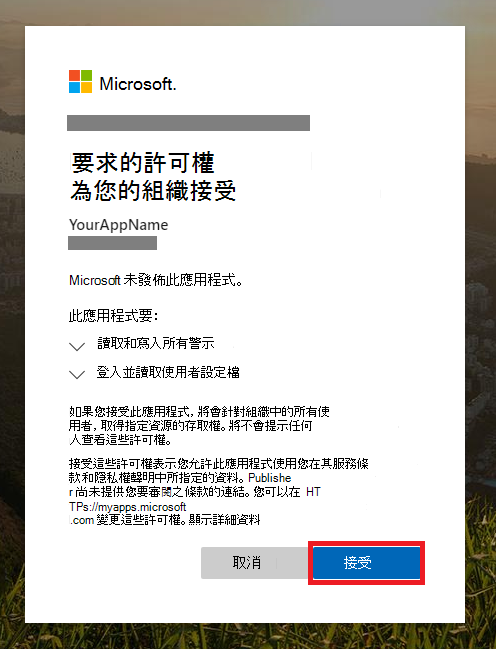

# <a name="create-an-app-with-partner-access-to-microsoft-365-defender-apis"></a><span data-ttu-id="64ffe-104">建立具有對 Microsoft 365 Defender APIs 的合作夥伴存取權的應用程式</span><span class="sxs-lookup"><span data-stu-id="64ffe-104">Create an app with partner access to Microsoft 365 Defender APIs</span></span>

[!INCLUDE [Microsoft 365 Defender rebranding](../includes/microsoft-defender.md)]

<span data-ttu-id="64ffe-105">**適用於：**</span><span class="sxs-lookup"><span data-stu-id="64ffe-105">**Applies to:**</span></span>

- <span data-ttu-id="64ffe-106">Microsoft 365 Defender</span><span class="sxs-lookup"><span data-stu-id="64ffe-106">Microsoft 365 Defender</span></span>

> [!IMPORTANT]
> <span data-ttu-id="64ffe-107">部分資訊與發行前版本產品有關，在正式發行之前可能會實質上進行修改。</span><span class="sxs-lookup"><span data-stu-id="64ffe-107">Some information relates to prereleased product which may be substantially modified before it's commercially released.</span></span> <span data-ttu-id="64ffe-108">Microsoft 對此處提供的資訊，不提供任何明確或隱含的瑕疵擔保。</span><span class="sxs-lookup"><span data-stu-id="64ffe-108">Microsoft makes no warranties, express or implied, with respect to the information provided here.</span></span>

<span data-ttu-id="64ffe-109">此頁面說明如何建立可以以程式設計方式存取 Microsoft 365 Defender 的 Azure Active Directory 應用程式，代表使用者跨多個承租人。</span><span class="sxs-lookup"><span data-stu-id="64ffe-109">This page describes how to create an Azure Active Directory app that has programmatic access to Microsoft 365 Defender, on behalf of users across multiple tenants.</span></span> <span data-ttu-id="64ffe-110">多租使用者應用程式對於提供大量使用者十分有用。</span><span class="sxs-lookup"><span data-stu-id="64ffe-110">Multi-tenant apps are useful for serving large groups of users.</span></span>

<span data-ttu-id="64ffe-111">如果您需要以程式設計方式代表單一使用者存取 Microsoft 365 Defender，請參閱 [建立應用程式以代表使用者存取 microsoft 365 defender APIs](api-create-app-user-context.md)。</span><span class="sxs-lookup"><span data-stu-id="64ffe-111">If you need programmatic access to Microsoft 365 Defender on behalf of a single user, see [Create an app to access Microsoft 365 Defender APIs on behalf of a user](api-create-app-user-context.md).</span></span> <span data-ttu-id="64ffe-112">如果您需要在未明確定義的使用者的情況下存取 (例如，如果您正在撰寫後臺應用程式或幕後程式) ，請參閱 [Create a app to Access Microsoft 365 Defender （沒有使用者](api-create-app-web.md)）。</span><span class="sxs-lookup"><span data-stu-id="64ffe-112">If you need access without a user explicitly defined (for example, if you're writing a background app or daemon), see [Create an app to access Microsoft 365 Defender without a user](api-create-app-web.md).</span></span> <span data-ttu-id="64ffe-113">如果您不確定需要哪種類型的存取，請參閱 [入門](api-access.md)。</span><span class="sxs-lookup"><span data-stu-id="64ffe-113">If you're not sure which kind of access you need, see [Get started](api-access.md).</span></span>

<span data-ttu-id="64ffe-114">Microsoft 365 Defender 會透過一組程式設計 APIs 來公開其大部分資料和動作。</span><span class="sxs-lookup"><span data-stu-id="64ffe-114">Microsoft 365 Defender exposes much of its data and actions through a set of programmatic APIs.</span></span> <span data-ttu-id="64ffe-115">這些 APIs 可協助您自動化工作流程，並使用 Microsoft 365 Defender 的功能。</span><span class="sxs-lookup"><span data-stu-id="64ffe-115">Those APIs help you automate workflows and make use of Microsoft 365 Defender's capabilities.</span></span> <span data-ttu-id="64ffe-116">此 API access 需要 OAuth 2.0 驗證。</span><span class="sxs-lookup"><span data-stu-id="64ffe-116">This API access requires OAuth2.0 authentication.</span></span> <span data-ttu-id="64ffe-117">如需詳細資訊，請參閱 [OAuth 2.0 授權碼流程](/azure/active-directory/develop/active-directory-v2-protocols-oauth-code)。</span><span class="sxs-lookup"><span data-stu-id="64ffe-117">For more information, see [OAuth 2.0 Authorization Code Flow](/azure/active-directory/develop/active-directory-v2-protocols-oauth-code).</span></span>

<span data-ttu-id="64ffe-118">一般來講，您必須採取下列步驟，才能使用這些 APIs：</span><span class="sxs-lookup"><span data-stu-id="64ffe-118">In general, you'll need to take the following steps to use these APIs:</span></span>

- <span data-ttu-id="64ffe-119">建立 Azure Active Directory (Azure AD) 應用程式。</span><span class="sxs-lookup"><span data-stu-id="64ffe-119">Create an Azure Active Directory (Azure AD) application.</span></span>
- <span data-ttu-id="64ffe-120">使用此應用程式取得存取權杖。</span><span class="sxs-lookup"><span data-stu-id="64ffe-120">Get an access token using this application.</span></span>
- <span data-ttu-id="64ffe-121">使用權杖來存取 Microsoft 365 Defender API。</span><span class="sxs-lookup"><span data-stu-id="64ffe-121">Use the token to access Microsoft 365 Defender API.</span></span>

<span data-ttu-id="64ffe-122">因為此應用程式是多租使用者，所以您也需要每個租使用者代表其使用者的系統 [管理員同意](/azure/active-directory/develop/v2-permissions-and-consent#requesting-consent-for-an-entire-tenant) 。</span><span class="sxs-lookup"><span data-stu-id="64ffe-122">Since this app is multi-tenant, you'll also need [admin consent](/azure/active-directory/develop/v2-permissions-and-consent#requesting-consent-for-an-entire-tenant) from each tenant on behalf of its users.</span></span>

<span data-ttu-id="64ffe-123">本文將說明如何：</span><span class="sxs-lookup"><span data-stu-id="64ffe-123">This article explains how to:</span></span>

- <span data-ttu-id="64ffe-124">建立 **多承租人** Azure AD 應用程式</span><span class="sxs-lookup"><span data-stu-id="64ffe-124">Create a **multi-tenant** Azure AD application</span></span>
- <span data-ttu-id="64ffe-125">取得您的應用程式的使用者管理員授權，以存取其所需資源的 Microsoft 365 Defender。</span><span class="sxs-lookup"><span data-stu-id="64ffe-125">Get authorized consent from your user administrator for your application to access the Microsoft 365 Defender that resources it needs.</span></span>
- <span data-ttu-id="64ffe-126">取得 Microsoft 365 Defender 的存取權杖</span><span class="sxs-lookup"><span data-stu-id="64ffe-126">Get an access token to Microsoft 365 Defender</span></span>
- <span data-ttu-id="64ffe-127">驗證 token</span><span class="sxs-lookup"><span data-stu-id="64ffe-127">Validate the token</span></span>

<span data-ttu-id="64ffe-128">Microsoft 365 Defender 會透過一組程式設計 APIs 來公開其大部分資料和動作。</span><span class="sxs-lookup"><span data-stu-id="64ffe-128">Microsoft 365 Defender exposes much of its data and actions through a set of programmatic APIs.</span></span> <span data-ttu-id="64ffe-129">這些 APIs 會協助您根據 Microsoft 365 Defender 功能自動化工作流程與創新。</span><span class="sxs-lookup"><span data-stu-id="64ffe-129">Those APIs will help you automate work flows and innovate based on Microsoft 365 Defender capabilities.</span></span> <span data-ttu-id="64ffe-130">API 存取需要 OAuth 2.0 驗證。</span><span class="sxs-lookup"><span data-stu-id="64ffe-130">The API access requires OAuth2.0 authentication.</span></span> <span data-ttu-id="64ffe-131">如需詳細資訊，請參閱 [OAuth 2.0 授權碼流程](/azure/active-directory/develop/active-directory-v2-protocols-oauth-code)。</span><span class="sxs-lookup"><span data-stu-id="64ffe-131">For more information, see [OAuth 2.0 Authorization Code Flow](/azure/active-directory/develop/active-directory-v2-protocols-oauth-code).</span></span>

<span data-ttu-id="64ffe-132">一般來講，您必須採取下列步驟，才能使用 APIs：</span><span class="sxs-lookup"><span data-stu-id="64ffe-132">In general, you’ll need to take the following steps to use the APIs:</span></span>

- <span data-ttu-id="64ffe-133">建立 **多承租人** Azure AD 應用程式。</span><span class="sxs-lookup"><span data-stu-id="64ffe-133">Create a **multi-tenant** Azure AD application.</span></span>
- <span data-ttu-id="64ffe-134">取得授權的 (同意) 您的應用程式的使用者管理員存取其所需的 Microsoft 365 Defender 資源。</span><span class="sxs-lookup"><span data-stu-id="64ffe-134">Get authorized (consent) by your user administrator for your application to access Microsoft 365 Defender resources it needs.</span></span>
- <span data-ttu-id="64ffe-135">使用此應用程式取得存取權杖。</span><span class="sxs-lookup"><span data-stu-id="64ffe-135">Get an access token using this application.</span></span>
- <span data-ttu-id="64ffe-136">使用權杖來存取 Microsoft 365 Defender API。</span><span class="sxs-lookup"><span data-stu-id="64ffe-136">Use the token to access Microsoft 365 Defender API.</span></span>

<span data-ttu-id="64ffe-137">下列步驟可協助您建立多承租人 Azure AD 應用程式、取得 Microsoft 365 Defender 的存取權杖，以及驗證權杖。</span><span class="sxs-lookup"><span data-stu-id="64ffe-137">The following steps with guide you how to create a multi-tenant Azure AD application, get an access token to Microsoft 365 Defender and validate the token.</span></span>

## <a name="create-the-multi-tenant-app"></a><span data-ttu-id="64ffe-138">建立多租使用者應用程式</span><span class="sxs-lookup"><span data-stu-id="64ffe-138">Create the multi-tenant app</span></span>

1. <span data-ttu-id="64ffe-139">以 **全域系統管理員** 角色的使用者身分登入 [Azure](https://portal.azure.com) 。</span><span class="sxs-lookup"><span data-stu-id="64ffe-139">Sign in to [Azure](https://portal.azure.com) as a user with the **Global Administrator** role.</span></span>

2. <span data-ttu-id="64ffe-140">流覽至 [ **Azure Active Directory**  >  **應用程式註冊**]  >  **新註冊**。</span><span class="sxs-lookup"><span data-stu-id="64ffe-140">Navigate to **Azure Active Directory** > **App registrations** > **New registration**.</span></span>

   

3. <span data-ttu-id="64ffe-142">在 [註冊] 表單中：</span><span class="sxs-lookup"><span data-stu-id="64ffe-142">In the registration form:</span></span>

   - <span data-ttu-id="64ffe-143">選擇應用程式的名稱。</span><span class="sxs-lookup"><span data-stu-id="64ffe-143">Choose a name for your application.</span></span>
   - <span data-ttu-id="64ffe-144">在 [ **支援的帳戶類型**] 中，選取 **任何組織目錄中的 [帳戶] (任何 Azure AD 目錄) -多租戶**。</span><span class="sxs-lookup"><span data-stu-id="64ffe-144">From **Supported account types**, select **Accounts in any organizational directory (Any Azure AD directory) - Multitenant**.</span></span>
   - <span data-ttu-id="64ffe-145">填寫 [重新 **導向 URI** ] 區段。</span><span class="sxs-lookup"><span data-stu-id="64ffe-145">Fill out the **Redirect URI** section.</span></span> <span data-ttu-id="64ffe-146">選取 [輸入 **Web** ]，並提供重新導向 URI 為 **https://portal.azure.com** 。</span><span class="sxs-lookup"><span data-stu-id="64ffe-146">Select type **Web** and give the redirect URI as **https://portal.azure.com**.</span></span>

   <span data-ttu-id="64ffe-147">完成表單填寫後，請選取 [ **註冊**]。</span><span class="sxs-lookup"><span data-stu-id="64ffe-147">After you're done filling out the form, select **Register**.</span></span>

   ![[註冊應用程式] 表單的影像](../..//media/atp-api-new-app-partner.png)

4. <span data-ttu-id="64ffe-149">在 [應用程式] 頁面上，選取 [ **API 許可權**  >  **新增許可權**  >  **APIs 我的組織使用**>]，輸入 **microsoft 威脅防護**，然後選取 [ **microsoft 威脅防護**]。</span><span class="sxs-lookup"><span data-stu-id="64ffe-149">On your application page, select **API Permissions** > **Add permission** > **APIs my organization uses** >, type **Microsoft Threat Protection**, and select **Microsoft Threat Protection**.</span></span> <span data-ttu-id="64ffe-150">您的應用程式現在可以存取 Microsoft 365 Defender。</span><span class="sxs-lookup"><span data-stu-id="64ffe-150">Your app can now access Microsoft 365 Defender.</span></span>

   > [!TIP]
   > <span data-ttu-id="64ffe-151">*Microsoft 威脅防護* 是 Microsoft 365 Defender 的先前名稱，因此不會出現在原始清單中。</span><span class="sxs-lookup"><span data-stu-id="64ffe-151">*Microsoft Threat Protection* is a former name for Microsoft 365 Defender, and will not appear in the original list.</span></span> <span data-ttu-id="64ffe-152">您必須先在文字方塊中寫入其名稱，才能看到顯示的名稱。</span><span class="sxs-lookup"><span data-stu-id="64ffe-152">You need to start writing its name in the text box to see it appear.</span></span>

   

5. <span data-ttu-id="64ffe-154">選取 [ **應用程式許可權**]。</span><span class="sxs-lookup"><span data-stu-id="64ffe-154">Select **Application permissions**.</span></span> <span data-ttu-id="64ffe-155">為您的案例選擇相關許可權 (例如， **Incident。 Read。 All**) ，然後選取 [ **新增許可權**]。</span><span class="sxs-lookup"><span data-stu-id="64ffe-155">Choose the relevant permissions for your scenario (for example, **Incident.Read.All**), and then select **Add permissions**.</span></span>

   

    > [!NOTE]
    > <span data-ttu-id="64ffe-157">您必須選取案例的相關許可權。</span><span class="sxs-lookup"><span data-stu-id="64ffe-157">You need to select the relevant permissions for your scenario.</span></span> <span data-ttu-id="64ffe-158">*讀取所有的事件* 只是一個範例。</span><span class="sxs-lookup"><span data-stu-id="64ffe-158">*Read all incidents* is just an example.</span></span> <span data-ttu-id="64ffe-159">若要決定您需要的許可權，請參閱您想要呼叫之 API 中的 [ **許可權** ] 區段。</span><span class="sxs-lookup"><span data-stu-id="64ffe-159">To determine which permission you need, please look at the **Permissions** section in the API you want to call.</span></span>
    >
    > <span data-ttu-id="64ffe-160">例如，若要 [執行高級查詢](api-advanced-hunting.md)，請選取「執行高級查詢」許可權;若要 [隔離裝置](/windows/security/threat-protection/microsoft-defender-atp/isolate-machine)，請選取「隔離電腦」許可權。</span><span class="sxs-lookup"><span data-stu-id="64ffe-160">For instance, to [run advanced queries](api-advanced-hunting.md), select the 'Run advanced queries' permission; to [isolate a device](/windows/security/threat-protection/microsoft-defender-atp/isolate-machine), select the 'Isolate machine' permission.</span></span>

6. <span data-ttu-id="64ffe-161">選取 **[授與系統管理員同意**]。</span><span class="sxs-lookup"><span data-stu-id="64ffe-161">Select **Grant admin consent**.</span></span> <span data-ttu-id="64ffe-162">每次您新增許可權時，都必須選取 **[授與系統管理員同意** ]，才會生效。</span><span class="sxs-lookup"><span data-stu-id="64ffe-162">Every time you add a permission, you must select **Grant admin consent** for it to take effect.</span></span>

    

7. <span data-ttu-id="64ffe-164">若要將機密新增至應用程式，請選取 [ **憑證 & 密碼**]，新增描述至密碼，然後選取 [ **新增**]。</span><span class="sxs-lookup"><span data-stu-id="64ffe-164">To add a secret to the application, select **Certificates & secrets**, add a description to the secret, then select **Add**.</span></span>

    > [!TIP]
    > <span data-ttu-id="64ffe-165">選取 [ **新增**] 之後，選取 **[複製產生的機密值**]。</span><span class="sxs-lookup"><span data-stu-id="64ffe-165">After you select **Add**, select **copy the generated secret value**.</span></span> <span data-ttu-id="64ffe-166">離開後，您將無法取得密碼值。</span><span class="sxs-lookup"><span data-stu-id="64ffe-166">You won't be able to retrieve the secret value after you leave.</span></span>

    

8. <span data-ttu-id="64ffe-168">將您的應用程式識別碼和租使用者識別碼記錄在安全的位置。</span><span class="sxs-lookup"><span data-stu-id="64ffe-168">Record your application ID and your tenant ID somewhere safe.</span></span> <span data-ttu-id="64ffe-169">在 [應用程式] 頁面的 **[一覽** ] 底下會列出它們。</span><span class="sxs-lookup"><span data-stu-id="64ffe-169">They're listed under **Overview** on your application page.</span></span>

   

9. <span data-ttu-id="64ffe-171">將應用程式新增至使用者的租使用者。</span><span class="sxs-lookup"><span data-stu-id="64ffe-171">Add the application to your user's tenant.</span></span>

   <span data-ttu-id="64ffe-172">因為您的應用程式代表您的使用者與 Microsoft 365 Defender 互動，所以需要針對您想要使用它的每一個承租人進行核准。</span><span class="sxs-lookup"><span data-stu-id="64ffe-172">Since your application interacts with Microsoft 365 Defender on behalf of your users, it needs be approved for every tenant on which you intend to use it.</span></span>

   <span data-ttu-id="64ffe-173">使用者租使用者的 **全域系統管理員** 必須查看同意連結並核准您的應用程式。</span><span class="sxs-lookup"><span data-stu-id="64ffe-173">A **Global Administrator** from your user's tenant needs to view the consent link and approve your application.</span></span>

   <span data-ttu-id="64ffe-174">「同意」連結的格式如下：</span><span class="sxs-lookup"><span data-stu-id="64ffe-174">Consent link is of the form:</span></span>

   ```HTTP
   https://login.microsoftonline.com/common/oauth2/authorize?prompt=consent&client_id=00000000-0000-0000-0000-000000000000&response_type=code&sso_reload=true
   ```

   <span data-ttu-id="64ffe-175">`00000000-0000-0000-0000-000000000000`應以您的應用程式識別碼取代位數。</span><span class="sxs-lookup"><span data-stu-id="64ffe-175">The digits `00000000-0000-0000-0000-000000000000` should be replaced with your Application ID.</span></span>

   <span data-ttu-id="64ffe-176">按一下 [同意] 連結後，請使用使用者租使用者的全域管理員登入，並同意該應用程式。</span><span class="sxs-lookup"><span data-stu-id="64ffe-176">After clicking on the consent link, sign in with the Global Administrator of the user's tenant and consent the application.</span></span>

   

   <span data-ttu-id="64ffe-178">您也需要向您的使用者索要其租使用者識別碼。</span><span class="sxs-lookup"><span data-stu-id="64ffe-178">You'll also need to ask your user for their tenant ID.</span></span> <span data-ttu-id="64ffe-179">租使用者識別碼是用來取得存取權杖的其中一個識別碼。</span><span class="sxs-lookup"><span data-stu-id="64ffe-179">The tenant ID is one of the identifiers used to acquire access tokens.</span></span>

- <span data-ttu-id="64ffe-180">**做！**</span><span class="sxs-lookup"><span data-stu-id="64ffe-180">**Done!**</span></span> <span data-ttu-id="64ffe-181">您已成功註冊應用程式！</span><span class="sxs-lookup"><span data-stu-id="64ffe-181">You've successfully registered an application!</span></span>
- <span data-ttu-id="64ffe-182">請參閱下列範例以取得及驗證權杖。</span><span class="sxs-lookup"><span data-stu-id="64ffe-182">See examples below for token acquisition and validation.</span></span>

## <a name="get-an-access-token"></a><span data-ttu-id="64ffe-183">取得存取權杖</span><span class="sxs-lookup"><span data-stu-id="64ffe-183">Get an access token</span></span>

<span data-ttu-id="64ffe-184">如需 Azure AD 標記的詳細資訊，請參閱 [AZURE ad 教學](/azure/active-directory/develop/active-directory-v2-protocols-oauth-client-creds)課程。</span><span class="sxs-lookup"><span data-stu-id="64ffe-184">For more information on Azure AD tokens, see the [Azure AD tutorial](/azure/active-directory/develop/active-directory-v2-protocols-oauth-client-creds).</span></span>

> [!IMPORTANT]
> <span data-ttu-id="64ffe-185">雖然本節中的範例會鼓勵您貼上用於測試目的的機密值，否則您 **不應該將機密硬編碼** 成實際執行中執行的應用程式。</span><span class="sxs-lookup"><span data-stu-id="64ffe-185">Although the examples in this section encourage you to paste in secret values for testing purposes, you should **never hardcode secrets** into an application running in production.</span></span> <span data-ttu-id="64ffe-186">協力廠商可以使用您的機密存取資源。</span><span class="sxs-lookup"><span data-stu-id="64ffe-186">A third party could use your secret to access resources.</span></span> <span data-ttu-id="64ffe-187">您可以使用 [Azure Key Vault](/azure/key-vault/general/about-keys-secrets-certificates)，協助保護應用程式的機密。</span><span class="sxs-lookup"><span data-stu-id="64ffe-187">You can help keep your app's secrets secure by using [Azure Key Vault](/azure/key-vault/general/about-keys-secrets-certificates).</span></span> <span data-ttu-id="64ffe-188">如需如何保護應用程式的實際範例，請參閱 [使用 Azure Key Vault 管理伺服器應用程式中的機密](/learn/modules/manage-secrets-with-azure-key-vault/)。</span><span class="sxs-lookup"><span data-stu-id="64ffe-188">For a practical example of how you can protect your app, see [Manage secrets in your server apps with Azure Key Vault](/learn/modules/manage-secrets-with-azure-key-vault/).</span></span>

> [!TIP]
> <span data-ttu-id="64ffe-189">在下列範例中，請使用使用者的租使用者識別碼來測試腳本是否正常運作。</span><span class="sxs-lookup"><span data-stu-id="64ffe-189">In the following examples, use a user's tenant ID to test that the script is working.</span></span>

### <a name="get-an-access-token-using-powershell"></a><span data-ttu-id="64ffe-190">使用 PowerShell 取得存取權杖</span><span class="sxs-lookup"><span data-stu-id="64ffe-190">Get an access token using PowerShell</span></span>

```PowerShell
# This code gets the application context token and saves it to a file named "Latest-token.txt" under the current directory.

$tenantId = '' # Paste your directory (tenant) ID here
$clientId = '' # Paste your application (client) ID here
$appSecret = '' # Paste your own app secret here to test, then store it in a safe place!

$resourceAppIdUri = 'https://api.security.microsoft.com'
$oAuthUri = "https://login.windows.net/$tenantId/oauth2/token"

$authBody = [Ordered] @{
    resource = $resourceAppIdUri
    client_id = $clientId
    client_secret = $appSecret
    grant_type = 'client_credentials'
}

$authResponse = Invoke-RestMethod -Method Post -Uri $oAuthUri -Body $authBody -ErrorAction Stop
$token = $authResponse.access_token

Out-File -FilePath "./Latest-token.txt" -InputObject $token

return $token
```

### <a name="get-an-access-token-using-c"></a><span data-ttu-id="64ffe-191">使用 C 取得存取 token\#</span><span class="sxs-lookup"><span data-stu-id="64ffe-191">Get an access token using C\#</span></span>

> [!NOTE]
> <span data-ttu-id="64ffe-192">下列程式碼已使用 Nuget Windows.identitymodel.extensions.dll 進行測試。 ActiveDirectory 3.19.8。</span><span class="sxs-lookup"><span data-stu-id="64ffe-192">The following code was tested with Nuget Microsoft.IdentityModel.Clients.ActiveDirectory 3.19.8.</span></span>

1. <span data-ttu-id="64ffe-193">建立新的主控台應用程式。</span><span class="sxs-lookup"><span data-stu-id="64ffe-193">Create a new console application.</span></span>
1. <span data-ttu-id="64ffe-194">安裝 NuGet [windows.identitymodel.extensions.dll。 ActiveDirectory](https://www.nuget.org/packages/Microsoft.IdentityModel.Clients.ActiveDirectory/)。</span><span class="sxs-lookup"><span data-stu-id="64ffe-194">Install NuGet [Microsoft.IdentityModel.Clients.ActiveDirectory](https://www.nuget.org/packages/Microsoft.IdentityModel.Clients.ActiveDirectory/).</span></span>
1. <span data-ttu-id="64ffe-195">新增下列行：</span><span class="sxs-lookup"><span data-stu-id="64ffe-195">Add the following line:</span></span>

    ```C#
    using Microsoft.IdentityModel.Clients.ActiveDirectory;
    ```

1. <span data-ttu-id="64ffe-196">將下列程式碼複製並貼到您的應用程式中 (不要忘記更新這三個變數： `tenantId` ， `clientId` ， `appSecret`) ：</span><span class="sxs-lookup"><span data-stu-id="64ffe-196">Copy and paste the following code into your app (don't forget to update the three variables: `tenantId`, `clientId`, `appSecret`):</span></span>

    ```C#
    string tenantId = ""; // Paste your directory (tenant) ID here
    string clientId = ""; // Paste your application (client) ID here
    string appSecret = ""; // Paste your own app secret here to test, then store it in a safe place, such as the Azure Key Vault!

    const string authority = "https://login.windows.net";
    const string wdatpResourceId = "https://api.security.microsoft.com";

    AuthenticationContext auth = new AuthenticationContext($"{authority}/{tenantId}/");
    ClientCredential clientCredential = new ClientCredential(clientId, appSecret);
    AuthenticationResult authenticationResult = auth.AcquireTokenAsync(wdatpResourceId, clientCredential).GetAwaiter().GetResult();
    string token = authenticationResult.AccessToken;
    ```

### <a name="get-an-access-token-using-python"></a><span data-ttu-id="64ffe-197">使用 Python 取得存取權杖</span><span class="sxs-lookup"><span data-stu-id="64ffe-197">Get an access token using Python</span></span>

```Python
import json
import urllib.request
import urllib.parse

tenantId = '' # Paste your directory (tenant) ID here
clientId = '' # Paste your application (client) ID here
appSecret = '' # Paste your own app secret here to test, then store it in a safe place, such as the Azure Key Vault!

url = "https://login.windows.net/%s/oauth2/token" % (tenantId)

resourceAppIdUri = 'https://api.securitycenter.windows.com'

body = {
    'resource' : resourceAppIdUri,
    'client_id' : clientId,
    'client_secret' : appSecret,
    'grant_type' : 'client_credentials'
}

data = urllib.parse.urlencode(body).encode("utf-8")

req = urllib.request.Request(url, data)
response = urllib.request.urlopen(req)
jsonResponse = json.loads(response.read())
aadToken = jsonResponse["access_token"]
```

### <a name="get-an-access-token-using-curl"></a><span data-ttu-id="64ffe-198">使用曲線取得存取權杖</span><span class="sxs-lookup"><span data-stu-id="64ffe-198">Get an access token using curl</span></span>

> [!NOTE]
> <span data-ttu-id="64ffe-199">在 Windows 10 版本1803和更新版本上都預先安裝了卷。</span><span class="sxs-lookup"><span data-stu-id="64ffe-199">Curl is pre-installed on Windows 10, versions 1803 and later.</span></span> <span data-ttu-id="64ffe-200">若為其他版本的 Windows，請直接從 [官方卷網站](https://curl.haxx.se/windows/)下載並安裝工具。</span><span class="sxs-lookup"><span data-stu-id="64ffe-200">For other versions of Windows, download and install the tool directly from the [official curl website](https://curl.haxx.se/windows/).</span></span>

1. <span data-ttu-id="64ffe-201">開啟命令提示字元，並將 CLIENT_ID 設定為您的 Azure 應用程式識別碼。</span><span class="sxs-lookup"><span data-stu-id="64ffe-201">Open a command prompt, and set CLIENT_ID to your Azure application ID.</span></span>
1. <span data-ttu-id="64ffe-202">將 CLIENT_SECRET 設定為您的 Azure 應用程式密碼。</span><span class="sxs-lookup"><span data-stu-id="64ffe-202">Set CLIENT_SECRET to your Azure application secret.</span></span>
1. <span data-ttu-id="64ffe-203">將 TENANT_ID 設定為要使用您的應用程式存取 Microsoft 365 Defender 之使用者的 Azure 租使用者識別碼。</span><span class="sxs-lookup"><span data-stu-id="64ffe-203">Set TENANT_ID to the Azure tenant ID of the user that wants to use your app to access Microsoft 365 Defender.</span></span>
1. <span data-ttu-id="64ffe-204">執行下列命令：</span><span class="sxs-lookup"><span data-stu-id="64ffe-204">Run the following command:</span></span>

```bash
curl -i -X POST -H "Content-Type:application/x-www-form-urlencoded" -d "grant_type=client_credentials" -d "client_id=%CLIENT_ID%" -d "scope=https://securitycenter.onmicrosoft.com/windowsatpservice/.default" -d "client_secret=%CLIENT_SECRET%" "https://login.microsoftonline.com/%TENANT_ID%/oauth2/v2.0/token" -k
```

<span data-ttu-id="64ffe-205">成功的回應如下所示：</span><span class="sxs-lookup"><span data-stu-id="64ffe-205">A successful response will look like this:</span></span>

```bash
{"token_type":"Bearer","expires_in":3599,"ext_expires_in":0,"access_token":"eyJ0eXAiOiJKV1QiLCJhbGciOiJSUzI1NiIsIn <truncated> aWReH7P0s0tjTBX8wGWqJUdDA"}
```

## <a name="validate-the-token"></a><span data-ttu-id="64ffe-206">驗證 token</span><span class="sxs-lookup"><span data-stu-id="64ffe-206">Validate the token</span></span>

1. <span data-ttu-id="64ffe-207">將權杖複製並貼到 [JSON web token 驗證者網站（JWT）](https://jwt.ms) 以進行解碼。</span><span class="sxs-lookup"><span data-stu-id="64ffe-207">Copy and paste the token into the [JSON web token validator website, JWT,](https://jwt.ms) to decode it.</span></span>
1. <span data-ttu-id="64ffe-208">請確定已解碼權杖中的 *角色* 宣告包含所需的許可權。</span><span class="sxs-lookup"><span data-stu-id="64ffe-208">Make sure that the *roles* claim within the decoded token contains the desired permissions.</span></span>

<span data-ttu-id="64ffe-209">在下列影像中，您可以看到從應用程式取得的解碼標記，具有 ```Incidents.Read.All``` 、 ```Incidents.ReadWrite.All``` 和 ```AdvancedHunting.Read.All``` 許可權：</span><span class="sxs-lookup"><span data-stu-id="64ffe-209">In the following image, you can see a decoded token acquired from an app, with ```Incidents.Read.All```, ```Incidents.ReadWrite.All```, and ```AdvancedHunting.Read.All``` permissions:</span></span>


## <a name="use-the-token-to-access-the-microsoft-365-defender-api"></a><span data-ttu-id="64ffe-211">使用權杖來存取 Microsoft 365 Defender API</span><span class="sxs-lookup"><span data-stu-id="64ffe-211">Use the token to access the Microsoft 365 Defender API</span></span>

1. <span data-ttu-id="64ffe-212">選擇您想要使用 (事件或「高級搜尋) 的 API。</span><span class="sxs-lookup"><span data-stu-id="64ffe-212">Choose the API you want to use (incidents, or advanced hunting).</span></span> <span data-ttu-id="64ffe-213">如需詳細資訊，請參閱 [支援的 Microsoft 365 Defender APIs](api-supported.md)。</span><span class="sxs-lookup"><span data-stu-id="64ffe-213">For more information, see [Supported Microsoft 365 Defender APIs](api-supported.md).</span></span>
2. <span data-ttu-id="64ffe-214">在您要傳送的 HTTP 要求中，將授權標頭設定為 `"Bearer" <token>` ， *持有* 者為授權配置，而 *token* 為您驗證的權杖。</span><span class="sxs-lookup"><span data-stu-id="64ffe-214">In the http request you're about to send, set the authorization header to `"Bearer" <token>`, *Bearer* being the authorization scheme, and *token* being your validated token.</span></span>
3. <span data-ttu-id="64ffe-215">權杖會在一小時內到期。</span><span class="sxs-lookup"><span data-stu-id="64ffe-215">The token will expire within one hour.</span></span> <span data-ttu-id="64ffe-216">在此期間，您可以使用相同的權杖傳送一個以上的要求。</span><span class="sxs-lookup"><span data-stu-id="64ffe-216">You can send more than one request during this time  with the same token.</span></span>

<span data-ttu-id="64ffe-217">下列範例顯示如何 **使用 c #** 傳送要求以取得事件清單。</span><span class="sxs-lookup"><span data-stu-id="64ffe-217">The following example shows how to send a request to get a list of incidents **using C#**.</span></span>

```C#
   var httpClient = new HttpClient();
   var request = new HttpRequestMessage(HttpMethod.Get, "https://api.security.microsoft.com/api/incidents");

   request.Headers.Authorization = new AuthenticationHeaderValue("Bearer", token);

   var response = httpClient.SendAsync(request).GetAwaiter().GetResult();
```

## <a name="related-articles"></a><span data-ttu-id="64ffe-218">相關文章</span><span class="sxs-lookup"><span data-stu-id="64ffe-218">Related articles</span></span>

- [<span data-ttu-id="64ffe-219">Microsoft 365 Defender APIs 概述</span><span class="sxs-lookup"><span data-stu-id="64ffe-219">Microsoft 365 Defender APIs overview</span></span>](api-overview.md)
- [<span data-ttu-id="64ffe-220">存取 Microsoft 365 Defender APIs</span><span class="sxs-lookup"><span data-stu-id="64ffe-220">Access the Microsoft 365 Defender APIs</span></span>](api-access.md)
- [<span data-ttu-id="64ffe-221">建立 "Hello world" 應用程式</span><span class="sxs-lookup"><span data-stu-id="64ffe-221">Create a 'Hello world' application</span></span>](api-hello-world.md)
- [<span data-ttu-id="64ffe-222">建立應用程式以存取沒有使用者的 Microsoft 365 Defender</span><span class="sxs-lookup"><span data-stu-id="64ffe-222">Create an app to access Microsoft 365 Defender without a user</span></span>](api-create-app-web.md)
- [<span data-ttu-id="64ffe-223">建立應用程式以代表使用者存取 Microsoft 365 Defender APIs</span><span class="sxs-lookup"><span data-stu-id="64ffe-223">Create an app to access Microsoft 365 Defender APIs on behalf of a user</span></span>](api-create-app-user-context.md)
- [<span data-ttu-id="64ffe-224">深入瞭解 API 限制和授權</span><span class="sxs-lookup"><span data-stu-id="64ffe-224">Learn about API limits and licensing</span></span>](api-terms.md)
- [<span data-ttu-id="64ffe-225">瞭解錯誤碼</span><span class="sxs-lookup"><span data-stu-id="64ffe-225">Understand error codes</span></span>](api-error-codes.md)
- [<span data-ttu-id="64ffe-226">使用 Azure Key Vault 管理伺服器應用程式中的機密</span><span class="sxs-lookup"><span data-stu-id="64ffe-226">Manage secrets in your server apps with Azure Key Vault</span></span>](/learn/modules/manage-secrets-with-azure-key-vault/)
- [<span data-ttu-id="64ffe-227">OAuth 2.0 使用者登入和 API 存取的授權</span><span class="sxs-lookup"><span data-stu-id="64ffe-227">OAuth 2.0 authorization for user sign in and API access</span></span>](/azure/active-directory/develop/active-directory-v2-protocols-oauth-code)