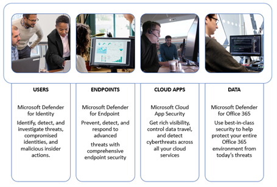
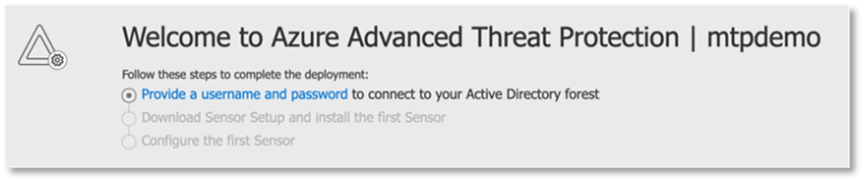
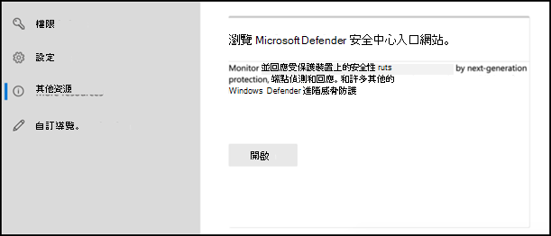

# 為您的試用實驗室或試驗環境設定 Microsoft 365 Defender 支柱

[!INCLUDE [Microsoft 365 Defender rebranding](../includes/microsoft-defender.md)]

**適用於：**
- Microsoft 365 Defender

建立 Microsoft 365 Defender 試驗實驗室或試驗環境並加以部署時，會有三個階段的處理常式：

| [階段1：準備](prepare-m365d-eval.md) | [階段2：設定](setup-m365deval.md) | 階段3：板載 |  [回到試驗行動手冊](m365d-pilot.md) |
|--|--|--|--|
|| |*您在這裡！* | |

您目前正在設定階段。

準備工作是任何成功部署的關鍵。 在本文中，您將指導您準備部署 Microsoft Defender 做為端點時所需考慮的點數。

## Microsoft 365 Defender 支柱
Microsoft 365 Defender 包含四個支柱。 雖然一個 pillar 可以為您的網路組織的安全性提供價值，但是啟用四個 Microsoft 365 Defender 支柱會為組織提供最大的價值。

本節會引導您設定下列專案：
-   適用於 Office 365 的 Microsoft Defender
-   適用於身分識別的 Microsoft Defender 
-   Microsoft Cloud App Security
-   適用於端點的 Microsoft Defender

## 設定 Microsoft Defender for Office 365

>[!NOTE]
>如果您已啟用 Office 365 的 Defender，請略過此步驟。 

有一個稱為「 *Office 365 高級威脅防護* 」的 PowerShell 模組 (ORCA) 可協助判斷部分設定。 當您在租使用者中以系統管理員身分執行時，ORCAReport 將協助產生反垃圾郵件、反網路釣魚和其他郵件衛生設定的評估。 您可以從下載此模組 https://www.powershellgallery.com/packages/ORCA/ 。 

1. 流覽至 [Office 365 Security & 合規性中心](https://protection.office.com/homepage)  >  **威脅管理**  >  **原則**。

   
 
2. 按一下 [ **反網路釣魚**]，選取 [ **建立** 並填入原則名稱和描述]。 按 [下一步]。

   

   > [!NOTE]
   > 在 Microsoft Defender for Office 365 中編輯您的高級防網路釣魚原則。 將 **高級網路釣魚閥值** 變更為 **2-嚴格**。

3. 按一下 [ **新增條件** ] 下拉式功能表，然後選取您的網域 (s) 做為收件者網域。 按 [下一步]。

   
 
4. 請複查您的設定。 按一下 [ **建立這個原則** ] 以確認。 

   ![Image of_Office 365 Security & 相容性中心反網路釣魚原則頁面，您可以在其中檢查您的設定，然後按一下 [建立這個原則] 按鈕](../../media/mtp-eval-35.png)
 
5. 選取 [ **安全附件** ]，然後選取 [ **開啟 SharePoint]、[OneDrive] 和 [Microsoft 小組** ] 選項的 ATP。

   ![Image of_Office 365 Security & 合規性中心] 頁面，您可以在其中開啟 SharePoint、OneDrive 及 Microsoft 小組的 ATP](../../media/mtp-eval-36.png)

6. 按一下 [+] 圖示，以建立新的安全附件原則，並將其套用為網域的收件者網域。 按一下 **[儲存]**。

   ![Image of_Office 365 Security & 合規性中心] 頁面，您可以在此頁面上建立新的安全附件原則](../../media/mtp-eval-37.png)
 
7. 接下來，選取 [ **安全連結** 原則]，然後按一下鉛筆圖示以編輯預設原則。

8. 請確定未選取 [ **不要在使用者按一下安全連結時進行追蹤** ] 選項，而會選取其餘的選項。 如需詳細資訊，請參閱 [安全連結設定](/microsoft-365/security/office-365-security/recommended-settings-for-eop-and-office365) 。 按一下 **[儲存]**。 

   ![Image of_Office 365 Security & 相容性中心] 頁面，顯示未選取 [使用者按一下安全時不會追蹤] 選項](../../media/mtp-eval-38.png)

9. 接下來選取 **反惡意** 代碼原則，選取預設值，然後選擇 [鉛筆] 圖示。

10. 按一下 [ **設定** ]，然後選取 **[是] 並使用預設通知文字** ，以啟用 **惡意程式碼偵測回應**。 開啟 **通用附件類型 Filter** 。 按一下 **[儲存]**。

    ![Image of_Office 365 Security & 合規性中心] 頁面，顯示惡意程式碼偵測回應開啟時會啟用預設通知，而一般附件類型篩選已開啟](../../media/mtp-eval-39.png)
  
11. 流覽至 [Office 365 Security & 合規性中心](https://protection.office.com/homepage)  >  **搜尋**  >  **審核記錄檔搜尋**，然後開啟審計。

    ![Image of_Office 365 Security & 合規性中心] 頁面，您可以在此開啟審核記錄搜尋](../../media/mtp-eval-40.png)

12. 整合 Microsoft Defender for Office 365 搭配 Microsoft Defender for Endpoint。 流覽至 [Office 365 Security & 合規性中心](https://protection.office.com/homepage)  >  **威脅管理**  >  **瀏覽器**，然後選取螢幕右上角的 [ **Microsoft Defender for Endpoint] 設定**。 在 [Defender for Endpoint connection] 對話方塊中，開啟 **[連線至 Microsoft Defender For endpoint**]。

    ![Image of_Office 365 Security & 合規性中心] 頁面，您可以在此頁面上開啟 Microsoft Defender for Endpoint connection。](../../media/mtp-eval-41.png)

## 設定 Microsoft Defender 身分識別

>[!NOTE]
>如果您已啟用 Microsoft Defender 身分識別，請略過此步驟。

1. 流覽至 [microsoft 365 Security Center](https://security.microsoft.com/info) > 選取 [microsoft Defender 身分識別] 的 [**更多資源**]  >  ****。

   

2. 按一下 [ **建立** ]，以啟動 Microsoft Defender 身分識別嚮導。 

   ![Image of_Microsoft 身分識別嚮導的 Defender] 頁面，您應該按一下 [建立] 按鈕](../../media/mtp-eval-43.png)

3. 選擇 [ **提供使用者名稱和密碼] 以連線至您的 Active Directory 樹** 系。  

   

4. 輸入您的 Active Directory 內部部署認證。 這可以是具有 Active Directory 讀取權限的任何使用者帳戶。

   ![Image of_Microsoft 用於身分識別目錄服務的 Defender 目錄服務] 頁面，您應該在這裡放置您的認證](../../media/mtp-eval-45.png)

5. 接下來，選擇 [將 **感應器安裝** 和傳輸檔案下載到您的網域控制站]。

   ![影像 of_Microsoft 身分識別] 頁面，您可以在其中選取 [下載感應器設定]](../../media/mtp-eval-46.png)

6. 針對身分識別感應器安裝執行 Microsoft Defender，並開始遵循此嚮導。

   ![Image of_Microsoft 用於身分識別的 Defender] 頁面，您應該按 [下一步] 遵循 Microsoft Defender for Identity 感應器嚮導](../../media/mtp-eval-47.png)
 
7. 在感應器部署類型中按 **[下一步]** 。

   ![影像 of_Microsoft 身分識別] 頁面，您應該在此按 [下一步] 移至下一頁面](../../media/mtp-eval-48.png)
 
8. 複製存取機碼，因為您需要在嚮導的下一步輸入它。

   ![影像 of_the 感應器頁面，您應該在下一個 Microsoft Defender for Identity 感應器安裝精靈] 頁面中複製您需要輸入的訪問機碼。](../../media/mtp-eval-49.png)
 
9. 將存取機碼複製到嚮導，然後按一下 [ **安裝**]。 

   ![Image of_Microsoft 用於身分識別感應器的 Defender 嚮導] 頁面，您應該在此頁面上提供存取機碼，然後按一下 [安裝] 按鈕](../../media/mtp-eval-50.png)

10. 恭喜，您已在您的網域控制站上成功設定 Microsoft Defender 身分識別。

    ![Image of_Microsoft 用於身分識別感應器的 Defender 安裝程式安裝完成，您應該按一下 [完成] 按鈕](../../media/mtp-eval-51.png)
 
11. 在 [ [Microsoft defender 身分識別](https://go.microsoft.com/fwlink/?linkid=2040449) 設定] 區段中，選取 [* * microsoft Defender for Endpoint * *]，然後開啟切換。 按一下 **[儲存]**。 

    ![Image of_the Microsoft Defender 身分識別設定] 頁面，您應該在此頁面上開啟 Microsoft Defender 的端點切換功能](../../media/mtp-eval-52.png)

> [!NOTE]
> Windows Defender ATP 已 rebranded 為 Microsoft Defender for Endpoint。 所有的入口網站上的 ..org 變更都會針對一致性加以匯總。

## 設定 Microsoft Cloud App Security

> [!NOTE]
> 如果您已啟用 Microsoft Cloud App 安全性，請略過此步驟。 

1. 流覽至 [microsoft](https://security.microsoft.com/info)  >    >  **Cloud App security** 的 microsoft 365 Security Center More Resources。

   ![Image of_Microsoft 365 Security Center 頁面，您可以在其中看到 Microsoft Cloud App 卡片，應該按一下 [開啟] 按鈕](../../media/mtp-eval-53.png)

2. 在資訊提示中，針對身分識別整合 Microsoft Defender，請選取 [ **啟用 Microsoft defender 以進行識別資料整合**]。
  
   ![Image of_the 資訊提示，針對識別整合 Microsoft Defender 以供您選取 [啟用 Microsoft Defender 身分識別資料整合] 連結](../../media/mtp-eval-54.png)

   > [!NOTE]
   > 如果您未看到此提示，這可能表示您的 Microsoft Defender 的身分識別資料整合已經啟用。 不過，如果您不確定，請與您的 IT 系統管理員聯繫以確認。 

3. 移至 [ **設定**]，開啟 **Microsoft Defender 的身分識別整合** 切換，然後按一下 [ **儲存**]。 

   ![影像 of_the 設定] 頁面，您應該在此頁面上開啟「Microsoft Defender 身分識別整合」切換，然後按一下 [儲存]](../../media/mtp-eval-55.png)
   
   > [!NOTE]
   > 針對新的 Microsoft Defender for Identity 實例，此整合切換功能會自動開啟。 在繼續進行下一個步驟之前，請確認已啟用 Microsoft Defender 的身分識別整合。
 
4. 在 [雲端探索設定] 底下，選取 [ **Microsoft Defender For Endpoint integration**]，然後啟用整合。 按一下 **[儲存]**。

   ![Image of_the Microsoft Defender for Endpoint] 頁面，選取 [Microsoft defender for Endpoint integration] 下的 [封鎖 unsanctioned 應用程式] 核取方塊。 按一下 [儲存]。](../../media/mtp-eval-56.png)

5. 在 [雲端探索設定] 底下，選取 [ **使用者豐富**]，然後啟用與 Azure Active Directory 的整合。

   ![[使用者豐富] 區段中的 [濃縮已發現使用者識別碼與 Azure Active Directory 使用者識別碼] 核取方塊的影像](../../media/mtp-eval-57.png)

## 設定 Microsoft Defender for Endpoint

>[!NOTE]
>如果您已啟用 Microsoft Defender for Endpoint，請略過此步驟。

1. 流覽至 microsoft Defender security center 的 [microsoft 365 Security center](https://security.microsoft.com/info)  >  **More Resources**  >  ****。 按一下 [開啟]。

   
 
2. 遵循 Microsoft Defender for Endpoint 嚮導。 按 [下一步]。 

   

3. 選擇 [根據您慣用的資料儲存位置]、[資料保留原則]、[組織大小] 和 [加入宣告預覽] 功能。

   ![Image of_the] 頁面上，選取您的資料儲存國家、保留原則及組織規模。 完成選取之後，請按 [下一步]。](../../media/mtp-eval-60.png)
   
   > [!NOTE]
   > 您無法變更某些設定，例如，以後的資料儲存位置。 

   按 [下一步]。 

4. 按一下 [ **繼續** ]，它會布建您的 Microsoft Defender for Endpoint 租使用者。

   ![影像 of_the 頁面提示您按一下 [繼續] 按鈕以建立您的雲端實例](../../media/mtp-eval-61.png)

5. 透過「群組原則」、「Microsoft 端點管理員」或執行本機腳本至 Microsoft Defender for Endpoint，將端點架上。 為了簡便起見，本指南使用本機腳本。

6. 按一下 [ **下載套件** ]，然後將上架腳本複製到端點 (s) 。

   ![影像 of_page 提示您按一下 [下載套件] 按鈕，將上架腳本複製到您的端點或端點](../../media/mtp-eval-62.png)

7. 在您的端點上，以系統管理員身分執行上架腳本，然後選擇 [Y]。 

   ![Image of_the 命令列，您可以在其中執行上架腳本，然後選擇 [Y] 繼續](../../media/mtp-eval-63.png)

8. 恭喜，您已架您的第一個端點。

   

9. 從 Microsoft Defender for Endpoint 嚮導複製並貼上偵測測試。

   ![影像 of_the 執行偵測測試步驟，您應該按一下 [複製] 以複製您應該在命令提示字元中貼上的偵測測試腳本。](../../media/mtp-eval-65.png)

10. 將 PowerShell 腳本複製到提升許可權的命令提示字元，然後執行它。 

    

11. 選取 [ **開始使用 Microsoft Defender For Endpoint** ] 從嚮導。

    ![從嚮導中 of_the 的確認提示，您應該按一下 [開始使用 Microsoft Defender for Endpoint]](../../media/mtp-eval-67.png)
 
12. 流覽 [Microsoft Defender 安全中心](https://securitycenter.windows.com/)。 移至 [ **設定** ]，然後選取 [ **高級功能**]。 

    ![您應選取 [高級功能] 的 [of_Microsoft Defender 安全性中心設定] 功能表中的影像](../../media/mtp-eval-68.png)

13. 開啟與 **Microsoft Defender 身分識別** 的整合。  

    

14. 開啟與 **Office 365 威脅情報** 的整合。

    

15. 開啟與 **Microsoft Cloud App Security** 的整合。

    

16. 向中按向下方，然後按一下 [ **儲存偏好** 設定] 以確認新的整合。

    

## 開始使用 Microsoft 365 Defender 服務

>[!NOTE]
>從2020年6月1日開始，Microsoft 會自動為所有合格的承租人啟用 Microsoft 365 Defender 功能。 如需詳細資訊，請參閱此 [Microsoft 技術小組文章](https://techcommunity.microsoft.com/t5/security-privacy-and-compliance/microsoft-threat-protection-will-automatically-turn-on-for/ba-p/1345426) 。 

移至 [Microsoft 365 Security Center](https://security.microsoft.com/homepage)。 流覽至 [ **設定** ]，然後選取 [ **Microsoft 365 Defender**]。

  

如需更完整的指導，請參閱 [開啟 Microsoft 365 Defender](m365d-enable.md)。 

恭喜！ 您剛剛建立 Microsoft 365 Defender 試用實驗室或試驗環境！ 現在，您可以熟悉 Microsoft 365 Defender 使用者介面！ 查看您可以從下列 Microsoft 365 Defender 互動版指南中學到的內容，並瞭解如何使用每個儀表板做為日常安全性作業工作。

>[!VIDEO https://aka.ms/MTP-Interactive-Guide]

接下來，您可以模擬攻擊，並查看「向量積」功能如何偵測、建立提醒，以及自動回應端點上的 fileless 攻擊。

## 下一步

- [產生測試警示](generate-test-alert.md) -在您的 Microsoft 365 Defender 試用版實驗室中執行攻擊模擬。