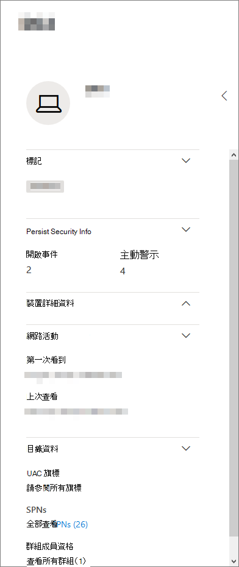
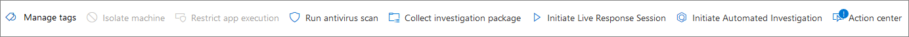

# 裝置設定檔頁面面Device profile page

[!INCLUDE [Microsoft 365 Defender rebranding](../includes/microsoft-defender.md)]

Microsoft 365 安全性入口網站為您提供裝置設定檔頁面面，所以您可以快速評估網路上裝置的健康情況和狀態。The Microsoft 365 security portal provides you with device profile pages, so you can quickly assess the health and status of devices on your network.

> [!IMPORTANT]
> 裝置設定檔頁面面的顯示可能稍有不同，這取決於裝置是否已在 Microsoft Defender for Endpoint，Microsoft Defender 身分識別，或兩者皆已註冊。The device profile page may appear slightly different, depending on whether the device is enrolled in Microsoft Defender for Endpoint, Microsoft Defender for Identity, or both.

如果裝置已在 Microsoft Defender for Endpoint 中註冊，您也可以使用 [裝置設定檔] 頁面執行某些常見的安全性工作。If the device is enrolled in Microsoft Defender for Endpoint, you can also use the device profile page to perform some common security tasks.

## 流覽裝置設定檔頁面面Navigating the device profile page

設定檔頁面面會分成數個較寬的區段。The profile page is broken up into several broad sections.

邊欄 (1) 會列出裝置的基本詳細資料。The sidebar (1) lists basic details about the device.

主要內容區域 (2) 包含的索引標籤可供您切換以查看裝置的不同資訊類型。The main content area (2) contains tabs that you can toggle through to view different kinds of information about the device.

如果裝置已在 Microsoft Defender for Endpoint 中註冊，您也會看到 (3) 回應動作清單。If the device is enrolled in Microsoft Defender for Endpoint, you will also see a list of response actions (3). 回應動作可讓您執行常見的安全性相關工作。Response actions allow you to perform common security-related tasks.

## 側 欄Sidebar

在裝置設定檔頁面面的主要內容區域旁是側邊。Beside the main content area of the device profile page is the sidebar.

提要欄會列出裝置的完整名稱和暴露層級。The sidebar lists the device's full name and exposure level. 它也會在小型子小節中提供一些重要的基本資訊，這些資訊可切換為開啟或關閉，例如：It also provides some important basic information in small subsections which can be toggled open or closed, such as:

* **標記** -任何 microsoft Defender for Endpoint、microsoft Defender 身分識別，或與裝置相關聯的自訂標記。**Tags** - Any Microsoft Defender for Endpoint, Microsoft Defender for Identity, or custom tags associated with the device. Microsoft Defender for Identity 中的標記無法進行編輯。Tags from Microsoft Defender for Identity are not editable.
* **安全性資訊** -開啟的事件和主動警示。**Security info** - Open incidents and active alerts. 在 Microsoft Defender for Endpoint 中註冊的裝置也會顯示公開層級和風險層級。Devices enrolled in Microsoft Defender for Endpoint will also display exposure level and risk level.

> [!TIP]
> 暴露層級與裝置遵循安全性建議的程度有關，而風險等級是根據因素的數目計算，包括作用中警示的類型和嚴重性。Exposure level relates to how much the device is complying with security recommendations, while risk level is calculated based on a number of factors, including the types and severity of active alerts.

* **裝置詳細資料** -網域、OS、在第一次看到裝置時的時間戳記、IP 位址、資源。**Device details** - Domain, OS, timestamp for when the device was first seen, IP addresses, resources. 在 Microsoft Defender for Endpoint 中註冊的裝置也會顯示健康狀態。Devices enrolled in Microsoft Defender for Endpoint also display health state. 在 Microsoft Defender 身分識別中註冊的裝置會顯示 SAM 名稱，以及在第一次建立裝置時的時間戳記。Devices enrolled in Microsoft Defender for Identity will display SAM name and a timestamp for when the device was first created.
* **網路活動** -在網路上第一次或最近一次看到裝置的時間戳記。**Network activity** - Timestamps for the first time and last time the device was seen on the network.
* **目錄資料** (*僅針對身分識別*) - [UAC](/windows/security/identity-protection/user-account-control/user-account-control-overview) 旗標、 [spn](/windows/win32/ad/service-principal-names)和群組成員資格的裝置註冊。**Directory data** (*only for devices enrolled in Microsoft Defender for Identity*) - [UAC](/windows/security/identity-protection/user-account-control/user-account-control-overview) flags, [SPNs](/windows/win32/ad/service-principal-names), and group memberships.

## 回應動作Response actions

回應動作提供一種快速防護和分析威脅的方式。Response actions offer a quick way to defend against and analyze threats.

> [!IMPORTANT]
> * 只有在裝置註冊至 Microsoft Defender for Endpoint 時，才可使用[回應動作](/windows/security/threat-protection/microsoft-defender-atp/respond-machine-alerts)。[Response actions](/windows/security/threat-protection/microsoft-defender-atp/respond-machine-alerts) are only available if the device is enrolled in Microsoft Defender for Endpoint.
> * 在 Microsoft Defender for Endpoint 中註冊的裝置可能會根據裝置的作業系統和版本號碼，顯示不同的回應動作數目。Devices that are enrolled in Microsoft Defender for Endpoint may display different numbers of response actions, based on the device's OS and version number.

在裝置設定檔頁面面上可用的動作包括：Actions available on the device profile page include:

* **Manage tags** -更新您已套用至此裝置的自訂標記。**Manage tags** - Updates custom tags you have applied to this device.
* **隔離裝置** -從組織網路隔離裝置，並使其連線至 Microsoft Defender for 端點。**Isolate device** - Isolates the device from your organization's network while keeping it connected to Microsoft Defender for Endpoint. 您可以選擇在隔離裝置時，允許 Outlook、Teams 及商務用 Skype 執行，以進行通訊的目的。You can choose to allow Outlook, Teams, and Skype for Business to run while the device is isolated, for communication purposes.
* **行動中心** -查看已提交動作的狀態。**Action center** - View the status of submitted actions. 只有在已選取另一個動作時才可用。Only available if another action has already been selected.
* **限制應用程式執行** -防止未由 Microsoft 簽署的應用程式執行。**Restrict app execution** - Prevents applications that are not signed by Microsoft from running.
* **執行防病毒掃描**-更新 Windows Defender 防毒軟體定義，並立即執行防病毒掃描。**Run antivirus scan** - Updates Windows Defender Antivirus definitions and immediately runs an antivirus scan. 選擇 [快速掃描] 或 [完全掃描]。Choose between Quick scan or Full scan.
* 收集有關裝置的 **調查套件** 收集資訊。**Collect investigation package** - Gathers information about the device. 完成調查後，您可以下載。When the investigation is completed, you can download it.
* **Initiate Live Response Session** -在裝置上載入遠端命令介面，以進行 [深入的安全性調查](/microsoft-365/security/defender-endpoint/live-response)。**Initiate Live Response Session** - Loads a remote shell on the device for [in-depth security investigations](/microsoft-365/security/defender-endpoint/live-response).
* **啟動自動化調查** -自動 [調查和 remediates 威脅](../office-365-security/office-365-air.md)。**Initiate automated investigation** - Automatically [investigates and remediates threats](../office-365-security/office-365-air.md). 雖然您可以手動觸發從這個頁面執行的自動調查，但 [某些警示原則](../../compliance/alert-policies.md#default-alert-policies) 會自行觸發自動調查。Although you can manually trigger automated investigations to run from this page, [certain alert policies](../../compliance/alert-policies.md#default-alert-policies) trigger automatic investigations on their own.
* **動作中心** -顯示目前正在執行之回應動作的相關資訊。**Action center** - Displays information about any response actions that are currently running.

## Tabs 區段Tabs section

[裝置設定檔] 索引標籤可讓您切換有關裝置安全性詳細資訊，以及包含警示清單的表格。The device profile tabs allow you to toggle through an overview of security details about the device, and tables containing a list of alerts.

在 Microsoft Defender for Endpoint 中註冊的裝置也會顯示功能標籤的功能標籤、安全性建議的清單、軟體清查、發現之弱點的清單，以及遺漏的 Kb (安全性更新) 。Devices enrolled in Microsoft Defender for Endpoint will also display tabs that feature a timeline, a list of security recommendations, a software inventory, a list of discovered vulnerabilities, and missing KBs (security updates).

### 概覽] 索引標籤Overview tab

預設索引標籤為 **[一覽表**]。The default tab is **Overview**. 它可快速查看有關裝置的最重要安全性事實。It provides a quick look at the most important security fact about the device.

![裝置設定檔之 [簡介] 索引標籤的影像](../../media/mtp-device-profile/hybrid-device-tab-overview.png)

在這裡，您可以快速查看裝置的使用中警示及任何目前登入的使用者。Here, you can get a quick look at the device's active alerts, and any currently logged on users.

如果裝置已在 Microsoft Defender for Endpoint 中註冊，您也會看到裝置的風險等級及安全性評估上任何可用的資料。If the device is enrolled in Microsoft Defender for Endpoint, you will also see the device's risk level and any available data on security assessments. 安全性評估會說明裝置的暴露層級、提供安全性建議，並列出受影響的軟體及發現的弱點。The security assessments describe the device's exposure level, provide security recommendations, and list affected software and discovered vulnerabilities.

### [通知] 索引標籤Alerts tab

[ **警示** ] 索引標籤包含從 Microsoft Defender for Identity 和 microsoft Defender for Endpoint，在裝置上引發的警示清單。The **Alerts** tab contains a list of alerts that have been raised on the device, from both Microsoft Defender for Identity and Microsoft Defender for Endpoint.

![裝置設定檔的 [警示] 索引標籤](../../media/mtp-device-profile/hybrid-device-tab-alerts.png)

您可以自訂所顯示的專案數，以及顯示每個專案的欄數。You can customize the number of items displayed, as well as which columns are displayed for each item. 預設行為是每頁列出30個專案。The default behavior is to list thirty items per page.

此索引標籤中的欄包含觸發警示之威脅之嚴重性的資訊，以及已指派警示的狀態、調查狀態。The columns in this tab include information on the severity of the threat that triggered the alert, as well as status, investigation state, and who the alert has been assigned to.

「 *受影響的實體* 」欄位是指裝置 (實體) 目前正在查看其設定檔，以及受影響的網路中的任何其他裝置。The *impacted entities* column refers to the device (entity) whose profile you are currently viewing, plus any other devices in your network that are affected.

選取此清單中的專案，就會開啟一個快顯視窗，其中包含關於選取之警示的詳細資訊。Selecting an item from this list will open a flyout containing even more information about the selected alert.

您可以根據嚴重性、狀態或指派警示的人員來篩選此清單。This list can be filtered by severity, status, or who the alert has been assigned to.

### 時程表] 索引標籤Timeline tab

[ **時程表** ] 索引標籤包括裝置上所引發之所有事件的互動式、依序圖表。The **Timeline** tab includes an interactive, chronological chart of all events raised on the device. 將圖表的醒目區域向左或向右移動，您可以在不同的時段上查看事件。By moving the highlighted area of the chart left or right, you can view events over different periods of time. 您也可以在互動式圖表和事件清單之間的下拉式功能表中，選擇自訂的日期範圍。You can also choose a custom range of dates from the dropdown menu in between the interactive chart and the list of events.

圖表下方是所選取日期範圍的事件清單。Below the chart is a list of events for the selected range of dates.

![裝置設定檔的 [時程表] 索引標籤的影像](../../media/mtp-device-profile/hybrid-device-tab-timeline.png)

可自訂顯示的專案數和清單中的欄數。The number of items displayed and the columns on the list can both be customized. 預設欄會列出事件時間、作用中使用者、動作類型、實體 (處理常式) ，以及事件的其他相關資訊。The default columns list the event time, active user, action type, entities (processes), and additional information about the event.

選取此清單中的專案時，會開啟一個顯示事件實體圖表的飛出視窗，顯示事件中所涉及的父項和子處理常式。Selecting an item from this list will open a flyout displaying an Event entities graph, showing the parent and child processes involved in the event.

可依特定類型的事件篩選清單;例如，登錄事件或 Smart Screen 事件。The list can be filtered by the specific kind of event; for example, Registry events or Smart Screen Events.

您也可以將清單匯出至 CSV 檔案，以供下載。The list can also be exported to a CSV file, for download. 雖然此檔案不受限於事件數目的限制，但您可以選擇匯出的最長時間範圍為7天。Although the file is not limited by number of events, the maximum time range you can choose to export is seven days.

### 安全性建議] 索引標籤Security recommendations tab

[ **安全性建議** ] 索引標籤會列出您可以採取以保護裝置的動作。The **Security recommendations** tab lists actions you can take to protect the device. 選取此清單上的專案會開啟快顯視窗，您可以在其中取得如何套用建議的指示。Selecting an item on this list will open a flyout where you can get instructions on how to apply the recommendation.

![裝置設定檔的安全性建議的映射] 索引標籤](../../media/mtp-device-profile/hybrid-device-tab-security-recs.png)

就像先前的索引標籤一樣，可以自訂每頁顯示的專案數，以及哪些欄是可見的。As with the previous tabs, the number of items displayed per page, as well as which columns are visible, can be customized.

預設的視圖包含詳細說明解決安全弱點、相關威脅、相關元件或受威脅影響的軟體等等的各欄。The default view includes columns that detail the security weaknesses addressed, the associated threat, the related component or software affected by the threat, and more. 專案可以以建議的狀態加以篩選。Items can be filtered by the recommendation's status.

### 軟體庫存Software inventory

[ **軟體清查** ] 索引標籤會列出裝置上已安裝的軟體。The **Software inventory** tab lists software installed on the device.

預設的查看會顯示軟體廠商、已安裝的版本號碼、已知軟體弱點的數目、威脅深入資訊、產品碼及標記。The default view displays the software vendor, installed version number, number of known software weaknesses, threat insights, product code, and tags. 可自訂顯示的專案數和顯示的欄數。The number of items displayed and which columns are displayed can both be customized.

選取此清單中的專案會開啟快顯視窗，其中包含選取之軟體的詳細資料，以及上次找到該軟體的路徑和時間戳記。Selecting an item from this list opens a flyout containing more details about the selected software, as well as the path and timestamp for the last time the software was found.

可依照產品程式碼篩選此清單。This list can be filtered by product code.

### 發現的漏洞] 索引標籤Discovered vulnerabilities tab

[已 **發現的漏洞** ] 索引標籤會列出可能會影響裝置的任何常見漏洞及 (cve) 。The **Discovered vulnerabilities** tab lists any Common Vulnerabilities and Exploits (CVEs) that may affect the device.

![裝置設定檔的 [已發現之弱點] 索引標籤影像](../../media/mtp-device-profile/hybrid-device-tab-discovered-vulnerabilities.png)

預設的視圖會列出 CVE 的嚴重性、常見弱點分數 (CVS) 、發行 cve 時的軟體、發行 cve 的時間、最後更新 CVE 的時間，以及與 CVE 相關的威脅。The default view lists the severity of the CVE, the Common Vulnerability Score (CVS), the software related to the CVE, when the CVE was published, when the CVE was last updated, and threats associated with the CVE.

就像先前的索引標籤一樣，您可以自訂顯示的專案數和可見的欄。As with the previous tabs, the number of items displayed and which columns are visible can be customized.

選取此清單中的專案將會開啟描述 CVE 的浮出控制項。Selecting an item from this list will open a flyout that describes the CVE.

### 遺失 KbMissing KBs

[ **遺失的 kb** ] 索引標籤會列出所有尚未套用到裝置的 Microsoft 更新。The **Missing KBs** tab lists any Microsoft Updates that have yet to be applied to the device. Kb 中的「」是描述這些更新的 [知識文庫文章](https://support.microsoft.com/help/242450/how-to-query-the-microsoft-knowledge-base-by-using-keywords-and-query) 。例如， [KB4551762](https://support.microsoft.com/help/4551762/windows-10-update-kb4551762)。The "KBs" in question are [Knowledge Base articles](https://support.microsoft.com/help/242450/how-to-query-the-microsoft-knowledge-base-by-using-keywords-and-query) which describe these updates; for example, [KB4551762](https://support.microsoft.com/help/4551762/windows-10-update-kb4551762).

![裝置設定檔遺失 kb] 索引標籤的影像](../../media/mtp-device-profile/hybrid-device-tab-missing-kbs.PNG)

預設的視圖會列出公告欄，其中包含更新、作業系統版本、受影響的產品、Cve 定址、KB 編號及標記。The default view lists the bulletin containing the updates, OS version, products affected, CVEs addressed, the KB number, and tags.

每頁顯示的專案數，可以自訂顯示哪些欄。The number of items displayed per page and which columns are displayed can be customized.

選取專案會開啟連結至更新的浮出控制項。Selecting an item will open a flyout that links to the update.

## 相關主題Related topics

* [Microsoft 365 Defender 概述Microsoft 365 Defender overview](microsoft-365-defender.md)
* [開啟 Microsoft 365 DefenderTurn on Microsoft 365 Defender](m365d-enable.md)
* [使用即時回應調查裝置上的實體Investigate entities on devices, using live response](../defender-endpoint/live-response.md)
* [ (空中) Office 365 中的自動化調查和回應Automated investigation and response (AIR) in Office 365](../office-365-security/office-365-air.md)
