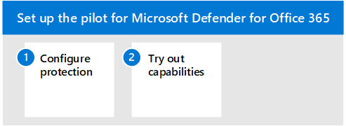

# 試驗 Microsoft Defender 身分識別

**適用於：**
- Microsoft 365 Defender

本文是設定 Microsoft Defender 身分識別的評估環境過程中的 [步驟 3](eval-defender-identity-overview.md) 之3。 如需此程式的詳細資訊，請參閱 [概述文章](eval-defender-identity-overview.md)。

使用下列步驟來設定和設定 Microsoft Defender 身分識別的試驗。 請注意，建議不要包含設定試驗群組。 最佳作法是先繼續，然後在所有執行 Active Directory 網域服務的伺服器上安裝感應器 (AD DS) 和 Active Directory 同盟服務 (AD FS) 。

下表說明圖例中的步驟。

- [步驟1：設定身分識別環境的基準建議](#step-1-configure-benchmark-recommendations-for-your-identity-environment)
- [步驟2：試用功能-逐步指導教程，以找出並修正不同的攻擊類型 ](#step-2-try-out-capabilities--walk-through-tutorials-for-identifying-and-remediating-different-attack-types)

## 步驟 1. 設定身分識別環境的基準建議

Microsoft 會提供使用 Microsoft 雲端服務之客戶的安全性基準建議。 [Azure 安全性基準](/security/benchmark/azure/overview) (ASB) 提供規範性的最佳作法和建議，以協助改善 Azure 上工作負載、資料和服務的安全性。

這些基準建議包括 [Microsoft Defender 身分識別的 Azure 安全性基準](/security/benchmark/azure/baselines/defender-for-identity-security-baseline)。 實施這些建議可能需要一些時間來規劃及實施。 雖然這些會極大提高身分識別環境的安全性，但不應阻止您繼續評估和執行 Microsoft Defender 身分識別。 您可以在這裡為您的認知提供這些內容。

## 步驟 2. 嘗試功能-逐步指導教程，以找出並修正不同的攻擊類型

Microsoft Defender 身分識別檔包括一系列的教程，可引導您完成識別和修正各種攻擊類型的程式。

嘗試身分識別教程的 Defender：
- [偵測警示](/defender-for-identity/reconnaissance-alerts)
- [已受損的認證警示](/defender-for-identity/compromised-credentials-alerts)
- [橫向移動警示](/defender-for-identity/lateral-movement-alerts)
- [網域對警示](/defender-for-identity/domain-dominance-alerts)
- [Exfiltration 警示](/defender-for-identity/exfiltration-alerts)
- [調查使用者](/defender-for-identity/investigate-a-user)
- [調查電腦](/defender-for-identity/investigate-a-computer)
- [調查橫向移動路徑](/defender-for-identity/investigate-lateral-movement-path)
- [調查實體](/defender-for-identity/investigate-entity)

## 後續步驟

[評估 Microsoft Defender 的 Office 365](eval-defender-office-365-overview.md)

回到概述，以[評估 Microsoft Defender 的 Office 365](eval-defender-office-365-overview.md)

回到[評估與試驗 Microsoft 365 Defender](eval-overview.md)概述