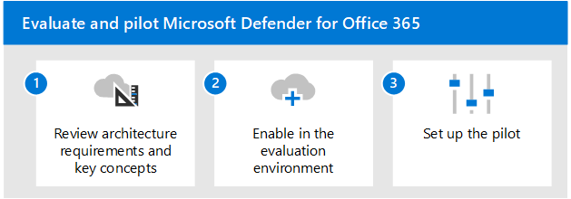

# 評估 Microsoft Cloud App SecurityEvaluate Microsoft Cloud App Security

**適用於：****Applies to:**
- Microsoft 365 DefenderMicrosoft 365 Defender

本文概述啟用和試驗 Microsoft Cloud App Security 及 Microsoft 365 Defender 的處理常式。This article outlines the process to enable and pilot Microsoft Cloud App Security alongside Microsoft 365 Defender. 開始此程式之前，請確定您已複習[評估 Microsoft 365 Defender](eval-overview.md)的整體程式，且已[建立 Microsoft 365 Defender 評估環境](eval-create-eval-environment.md)。Before starting this process, be sure you've reviewed the overall process for [evaluating Microsoft 365 Defender](eval-overview.md) and you have [created the Microsoft 365 Defender evaluation environment](eval-create-eval-environment.md). 
 

使用下列步驟來啟用和試驗 Microsoft cloud app security。Use the following steps to enable and pilot Microsoft cloud app security.

|步驟Step  |描述Description  |
|---------|---------|
|[回顧架構需求和重要概念Review architecture requirements and key concepts](eval-defender-mcas-architecture.md)    | 瞭解雲端 App 安全性架構，以及它如何與 Microsoft 365 Defender、Microsoft Defender 端點和 Azure Active Directory 整合。Understand the Cloud App Security architecture and how it integrates with Microsoft 365 Defender, Microsoft Defender for Endpoint, and Azure Active Directory.        |
|[啟用評估環境Enable the evaluation environment](eval-defender-mcas-enable-eval.md)     | 連線至入口網站、設定與使用 Defender 身分識別和/或組織網路裝置的整合，以及開始查看和管理雲端應用程式。Connect to the portal, configure integration with Defender for Identity and/or your organization's network devices, and begin to view and manage cloud apps.         |
|[設定試驗 Set up the pilot ](eval-defender-mcas-pilot.md)    | 將您的部署範圍設定為特定使用者群組、設定條件式存取應用程式控制，並嘗試保護您的環境的教學課程。Scope your deployment to certain user groups, configure Conditional Access App Control, and try out tutorials for protecting your environment.       |

