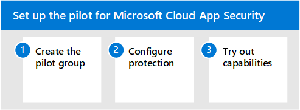

# 使用 Microsoft 365 Defender 的試驗 Microsoft Cloud App SecurityPilot Microsoft Cloud App Security with Microsoft 365 Defender

**適用於：****Applies to:**
- Microsoft 365 DefenderMicrosoft 365 Defender

本文是設定 Microsoft Cloud App Security 評估環境之程式中的[步驟 3](eval-defender-mcas-overview.md)之3。This article is [Step 3 of 3](eval-defender-mcas-overview.md) in the process of setting up the evaluation environment for Microsoft Cloud App Security. 如需此程式的詳細資訊，請參閱 [概述文章](eval-defender-mcas-overview.md)。For more information about this process, see the [overview article](eval-defender-mcas-overview.md).

使用下列步驟來設定和設定 Microsoft Cloud App Security 的試驗。Use the following steps to setup and configure the pilot for Microsoft Cloud App Security.

- 步驟 1.Step 1. [建立試驗群組—將試驗部署的範圍設為特定使用者群組Create the pilot group — Scope your pilot deployment to certain user groups](#step-1-create-the-pilot-group--scope-your-pilot-deployment-to-certain-user-groups)
- [步驟2。設定保護-條件式存取應用程式控制Step 2. Configure protection — Conditional Access App Control](#step-2-configure-protection--conditional-access-app-control)
- [步驟3。嘗試功能-逐步指導您的環境以進行保護Step 3. Try out capabilities — Walk through tutorials for protecting your environment](#step-3-try-out-capabilities--walk-through-tutorials-for-protecting-your-environment) 

## 步驟 1.Step 1. 建立試驗群組—將試驗部署的範圍設為特定使用者群組Create the pilot group — Scope your pilot deployment to certain user groups

Microsoft Cloud App Security 可讓您進行部署的範圍。Microsoft Cloud App Security enables you to scope your deployment. 範圍可讓您選取要監視之應用程式的特定使用者群組，或從監控中排除。Scoping allows you to select certain user groups to be monitored for apps or excluded from monitoring. 您可以包含或排除使用者群組。You can include or exclude user groups. 若要設定試驗部署的範圍，請參閱設定 [範圍的部署](/cloud-app-security/scoped-deployment)。To scope your pilot deployment, see [Scoped Deployment](/cloud-app-security/scoped-deployment).

## 步驟 2.Step 2. 設定保護-條件式存取應用程式控制Configure protection — Conditional Access App Control

您可以設定的最強大防護之一是條件式存取應用程式控制。One of the most powerful protections you can configure is Conditional Access App Control. 這需要與 Azure Active Directory (Azure AD) 進行整合。This requires integration with Azure Active Directory (Azure AD). 它可讓您將條件式存取原則（包括 (類似) 裝置）等相關原則套用至您已 sanctioned 的雲端應用程式。It allows you to apply Conditional Access policies, including related policies (like requiring healthy devices), to cloud apps you've sanctioned. 

使用 Microsoft Cloud App Security 來管理 SaaS 應用程式的第一步是探索這些應用程式，然後將它們新增至您的 Azure AD 租使用者。The first step in using Microsoft Cloud App Security to manage SaaS apps is to discover these and then add them to your Azure AD tenant. 如果您需要探索協助，請參閱 [探索和管理您網路中的 SaaS 應用程式](/cloud-app-security/tutorial-shadow-it)。If you need help with discovery, see [Discover and manage SaaS apps in your network](/cloud-app-security/tutorial-shadow-it). 在您探索應用程式之後， [將它們新增至您的 AZURE AD 租](/azure/active-directory/manage-apps/add-application-portal)使用者。After you've discovered apps, [add these to your Azure AD tenant](/azure/active-directory/manage-apps/add-application-portal).

您可以執行下列動作來開始管理：You can begin to manage these by doing the following:

- 首先，在 Azure AD 中建立新的條件式存取原則，並將其設定為「使用條件式存取應用程式控制」。First, in Azure AD, create a new conditional access policy and configure it to "Use Conditional Access App Control." 這會將要求重新導向至雲端 App 安全性。This redirects the request to Cloud App Security. 您可以建立一個原則，並將所有 SaaS 應用程式新增至此原則。You can create one policy and add all SaaS apps to this policy.
- 接下來，在雲端 App 安全性中建立會話原則。Next, in Cloud App Security, create session policies. 針對每個您想要套用的控制項建立一個原則。Create one policy for each control you want to apply.

如需詳細資訊，包括支援的應用程式和用戶端，請參閱[使用 Microsoft Cloud App Security 條件式存取應用程式控制保護應用程式](/cloud-app-security/proxy-intro-aad)。For more information, including supported apps and clients, see [Protect apps with Microsoft Cloud App Security Conditional Access App Control](/cloud-app-security/proxy-intro-aad). 

如需原則，請參閱[建議的 SaaS 應用程式 Microsoft Cloud App Security 原則](../office-365-security/mcas-saas-access-policies.md)。For example policies, see [Recommended Microsoft Cloud App Security policies for SaaS apps](../office-365-security/mcas-saas-access-policies.md). 這些原則建立于一組共同的身分 [識別和裝置存取原則](../office-365-security/microsoft-365-policies-configurations.md) 上，建議作為所有客戶的起點。These policies build on a set of [common identity and device access policies](../office-365-security/microsoft-365-policies-configurations.md) that are recommended as a starting point for all customers. 

## 步驟 3.Step 3. 嘗試功能-逐步指導您的環境以進行保護Try out capabilities — Walk through tutorials for protecting your environment 

Microsoft Cloud App Security 檔包括一系列的教程，可協助您探索風險及保護您的環境。The Microsoft Cloud App Security documentation includes a series of tutorials to help you discover risk and protect your environment. 

嘗試雲端 App 安全性教程：Try out Cloud App Security tutorials:

- [偵測到可疑的使用者活動Detect suspicious user activity](/cloud-app-security/tutorial-suspicious-activity)
- [調查有風險的使用者Investigate risky users](/cloud-app-security/tutorial-ueba)
- [調查危險的 OAuth 應用程式Investigate risky OAuth apps](/cloud-app-security/investigate-risky-oauth)
- [探索和保護機密資訊Discover and protect sensitive information](/cloud-app-security/tutorial-dlp)
- [保護組織中的任何應用程式即時Protect any app in your organization in real time](/cloud-app-security/tutorial-proxy)
- [封鎖敏感資訊的下載Block downloads of sensitive information](/cloud-app-security/use-case-proxy-block-session-aad)
- [使用系統管理員隔離來保護您的檔案Protect your files with admin quarantine](/cloud-app-security/use-case-admin-quarantine)
- [在危險動作上需要進行逐步驗證Require step-up authentication upon risky action](/cloud-app-security/tutorial-step-up-authentication)

## 後續步驟Next steps

[在試驗環境中使用 Microsoft 365 Defender 調查和回應Investigate and respond using Microsoft 365 Defender in a pilot environment](eval-defender-investigate-respond.md)

回到 [[評估 Microsoft Cloud App Security](eval-defender-mcas-overview.md)的總覽Return to the overview for [Evaluate Microsoft Cloud App Security](eval-defender-mcas-overview.md)

回到[評估與試驗 Microsoft 365 Defender](eval-overview.md)概述Return to the overview for [Evaluate and pilot Microsoft 365 Defender](eval-overview.md)