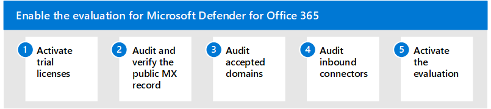

# 啟用評估環境Enable the evaluation environment

**適用於：****Applies to:**
- Microsoft 365 DefenderMicrosoft 365 Defender

本文是在為 Office 365 的 Microsoft Defender 設定評估環境過程中，[步驟2之 3](eval-defender-office-365-overview.md) 。This article is [Step 2 of 3](eval-defender-office-365-overview.md) in the process of setting up the evaluation environment for Microsoft Defender for Office 365. 如需此程式的詳細資訊，請參閱 [概述文章](eval-defender-office-365-overview.md)。For more information about this process, see the [overview article](eval-defender-office-365-overview.md).

使用下列步驟可為 Microsoft Defender Office 365 啟用評估。Use the following steps to enable the evaluation for Microsoft Defender for Office 365.

- [步驟1：啟動試用授權Step 1: Activate trial licenses](#step-1-activate-trial-licenses)
- [步驟2：審核和驗證公用 MX 記錄Step 2: Audit and verify the public MX record](#step-2-audit-and-verify-the-public-mx-record)
- [步驟3：審核公認的網域Step 3: Audit accepted domains](#step-3-audit-accepted-domains)
- [步驟4：審核輸入連接器Step 4: Audit inbound connectors](#step-4-audit-inbound-connectors)
- [步驟5：啟用評估Step 5: Activate the evaluation](#step-5-activate-the-evaluation)

## 步驟1：啟動試用授權Step 1: Activate trial licenses

登入您現有的 Microsoft Defender Office 365 環境或租使用者管理入口網站。Log on to your existing Microsoft Defender for Office 365 environment or tenant administration portal.

1. 流覽至管理入口網站。Navigate to the administration portal.
2. 從 [快速啟動] 中選取 [購買服務]。Select Purchase Services from the quick launch.

:::image type="content" source="../../media/mdo-eval/1_m365-purchase-services.png" alt-text="在 Office 365 的功能窗格上，按一下 [購買服務]。":::

3.  向右下向 Add-On 區段 (或搜尋 "Defender" ) 以找出 Microsoft Defender for Office 365 計畫。Scroll down to the Add-On section (or search for "Defender") to locate the Microsoft Defender for Office 365 plans.
4.  按一下 [詳細資料] 下一個您要評估的計畫。Click Details next the plan you want to evaluate.

:::image type="content" source="../../media/mdo-eval/2_mdo-eval-license-details.png" alt-text="按一下 [詳細資料] 按鈕、[下一步]。":::

5. 按一下 [ *開始免費試用* ] 連結。Click the *Start free trial* link.

:::image type="content" source="../../media/mdo-eval/3-m365-purchase-button.png" alt-text="在此面板上，按一下 [開始免費試用版 * hyperlink] *。":::

6. 確認您的要求，然後按一下 [ *立即嘗試* ] 按鈕。Confirm your request and click the *Try now* button.

:::image type="content" source="../../media/mdo-eval/4_mdo-trial-order.png" alt-text="現在，按一下 [立即試用] * 按鈕 *。":::

## 步驟2：審核和驗證公用 MX 記錄Step 2: Audit and verify the public MX record

若要有效評估 Microsoft Defender 的 Office 365，請務必透過與租使用者相關聯的 Exchange Online Protection (EOP) 實例轉送輸入外部電子郵件。To effectively evaluate Microsoft Defender for Office 365, it's important that inbound external email be relayed through the Exchange Online Protection (EOP) instance associated with your tenant.

1. 登入 M365 系統管理入口網站，展開設定，然後選取 [網域]。Log on to the M365 Admin Portal, expand Settings, and select Domains.
2. 選取您驗證的電子郵件網域，然後按一下 [管理 DNS]。Select your verified email domain and click Manage DNS.
3. 記下產生的 MX 記錄，並將其指派給您的 EOP 租使用者。Make note of the MX record generated and assigned to your EOP tenant.
4. 存取您的外部 (public) DNS 區域，並檢查與您電子郵件網域相關聯的主要 MX 記錄。Access your external (public) DNS zone and check the primary MX record associated with your email domain.
    - *如果您的公用 MX 記錄目前符合所指派的 EOP 位址 (例如，tenant-com.mail.protection.outlook.com) 則不需要進一步的路由變更*。*If your public MX record currently matches the assigned EOP address (e.g. tenant-com.mail.protection.outlook.com) then no further routing changes should be required*.
    - 如果您的公用 MX 記錄目前解析為協力廠商或內部部署 SMTP 閘道，則可能需要其他路由設定。If your public MX record currently resolves to a third-party or on-premises SMTP gateway then additional routing configurations may be required.
    - 如果您的公用 MX 記錄目前解析為內部部署 Exchange，您可能仍然在混合模式中，有些收件者信箱尚未遷移至 EXO。If your public MX record currently resolves to on-premises Exchange then you may still be in a hybrid model where some recipient mailbox have not yet been migrated to EXO.

## 步驟3：審核公認的網域Step 3: Audit accepted domains

1. 登入 Exchange Online 管理入口網站，選取 [郵件 Flow]，然後按一下 [公認的網域]。Log on the Exchange Online Admin Portal, select Mail Flow, and then click Accepted Domains.
2. 從您租使用者中已新增及驗證之公認的網域清單中，記下主要電子郵件網域的 **網欄位型別** 。From the list of accepted domains that have been added and verified in your tenant, make note of the **domain type** for your primary email domain.
    - 如果網欄位型別設定為 [***授權***]，則會假設您目前組織中的所有收件者信箱目前都位於 Exchange Online 中。If the domain type is set to ***Authoritative*** then it is assumed all recipient mailboxes for your organization currently reside in Exchange Online.
    - 如果網欄位型別設定為 [ ***內部轉送*** ]，則您可能仍然位於混合模式中，但某些收件者信箱仍在內部部署中。If the domain type is set to ***Internal Relay*** then you may still be in a hybrid model where some recipient mailboxes still reside on-premises.

## 步驟4：審核輸入連接器Step 4: Audit inbound connectors

1. 登入 Exchange Online 管理入口網站，選取 [郵件] Flow，然後按一下 [連接器]。Log on the Exchange Online Admin Portal, select Mail Flow, and then click Connectors.
2. 從設定的連接器清單中，記下 **夥伴組織** 中的任何專案，而且可能會與協力廠商 SMTP 閘道產生關聯。From the list of configured connectors, make note of any entries which are from **Partner Organization** and may correlate to a third-party SMTP gateway.
3. 從設定的連接器清單中，記下 **從組織的電子郵件伺服器** 標示的任何專案，這可能表示您仍在混合案例中。From the list of configured connectors, make note of any entries labeled **From your organization's email server** which may indicate that you are still in hybrid scenario.

## 步驟5：啟用評估Step 5: Activate the evaluation

使用這裡的指示為您的 Microsoft 365 Defender 入口網站啟用 Office 365 評估的 Microsoft Defender。Use the instructions here to activate your Microsoft Defender for Office 365 evaluation from the Microsoft 365 Defender portal.

1. 使用具備 Microsoft 365 Defender 入口網站存取權的帳戶登入您的租使用者。Log on to your tenant with an account that has access to the Microsoft 365 Defender portal.
2. 選擇是否要將 **Microsoft 365 Defender 入口網站** 設為 Microsoft Defender 的預設介面，以供 Office 365 管理 (建議) 。Choose whether you want to make the **Microsoft 365 Defender portal** your default interface for Microsoft Defender for Office 365 administration (recommended).

:::image type="content" source="../../media/mdo-eval/1_mdo-eval-activate-eval.png" alt-text="按一下 [開啟設定] 按鈕，以使用集中式及改良的 Microsoft 365 Defender 入口網站進行管理。":::

3. 在 [流覽] 功能表中，選取 [*電子郵件 &* 共同作業] 底下的原則 **& 規則**。From the navigation menu, select **Policies & Rules** under *Email & Collaboration*.

:::image type="content" source="../../media/mdo-eval/2_mdo-eval-activate-eval.png" alt-text="以下是電子郵件 & 共同作業功能表圖片指向原則 & 規則。請按一下該！":::

4. 在 [ *原則 & 規則* ] 儀表板上，按一下 [ **威脅原則**]。On the *Policy & Rules* dashboard, click **Threat Policies**.

:::image type="content" source="../../media/mdo-eval/3_mdo-eval-activate-eval.png" alt-text="原則 & 規則儀表板的圖片，以及指向威脅原則的箭號。按一下下一個！":::

5. 向中向左下到 *其他原則*，然後選取 [**評估 Defender for Office 365** 磚]。Scroll down to *Additional Policies* and select the **Evaluate Defender for Office 365** tile.

:::image type="content" source="../../media/mdo-eval/4_mdo-eval-activate-eval.png" alt-text="Office 365 磚的 Eval Defender 是透過電子郵件 & 共同作業媒介的30天試用版。按一下 [到]。":::

6. 現在選擇是要直接 Exchange Online 外部電子郵件路由，還是協力廠商閘道或服務，然後按 [下一步]。Now choose whether external email routes to Exchange Online directly, or to a third-party gateway or service, and click Next.

:::image type="content" source="../../media/mdo-eval/5_mdo-eval-activate-eval.png" alt-text="Office 365 的 Defender 會評估郵件傳送至您的 Exchange Online 信箱。提供郵件的路由的詳細資訊，包括 routs 您郵件的輸出連接器的名稱。如果您只使用 Exchange Online Protection (EOP) 您將沒有連接器。選擇其中一個是使用協力廠商或內部部署提供者，或是只使用 EOP。":::

7. 如果您使用協力廠商閘道，請從下拉式清單中選取廠商名稱，以及與該解決方案相關聯的輸入連接器。If you use a third-party gateway, select the vendor name from the drop-down along with the inbound connector associated with that solution. 當您已列出答案後，請按 [下一步]。When you've listed your answers, click Next.

:::image type="content" source="../../media/mdo-eval/6-mdo-eval-activate-eval-settings.png" alt-text="在此對話方塊中，請選擇您組織所使用的協力廠商廠商服務，或選取 [其他 *]。在下一個對話方塊中，選取輸入連接器。然後按 [下一步]。":::

8. 檢查您的設定，然後按一下 [ **建立評估** ] 按鈕。Review your settings and click the **Create Evaluation** button.

|  |  |
|---------|---------|
|  :::image type="content" source="../../media/mdo-eval/7-mdo-eval-activate-review.png" alt-text="此窗格具有可查看您設定的下拉式清單。如果您需要，也可以使用可按一下的連結來編輯您的路由類型。當您準備好時，請按一下 [大藍色建立評估] 按鈕。":::   |   :::image type="content" source="../../media/mdo-eval/8-mdo-eval-activate-complete.png" alt-text="現在已完成設定。此頁面上的藍色按鈕會顯示「移至評估」。":::      |

## 後續步驟Next steps

步驟3之3：設定 Microsoft Defender 的試用版 Office 365Step 3 of 3: Set up the pilot for Microsoft Defender for Office 365

回到概述，以[評估 Microsoft Defender 的 Office 365](eval-defender-office-365-overview.md)Return to the overview for [Evaluate Microsoft Defender for Office 365](eval-defender-office-365-overview.md)

回到[評估與試驗 Microsoft 365 Defender](eval-overview.md)概述Return to the overview for [Evaluate and pilot Microsoft 365 Defender](eval-overview.md)