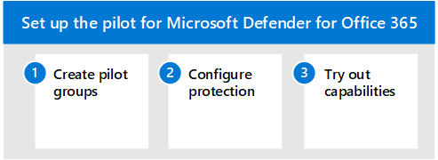

# 試用 Microsoft Defender Office 365Pilot Microsoft Defender for Office 365
**適用於：****Applies to:**
- Microsoft 365 DefenderMicrosoft 365 Defender

本文是為 Office 365 的 Microsoft Defender 設定評估環境過程中的[步驟 3](eval-defender-office-365-overview.md)之3。This article is [Step 3 of 3](eval-defender-office-365-overview.md) in the process of setting up the evaluation environment for Microsoft Defender for Office 365. 如需此程式的詳細資訊，請參閱 [概述文章](eval-defender-office-365-overview.md)。For more information about this process, see the [overview article](eval-defender-office-365-overview.md).

使用下列步驟來設定和設定適用于 Microsoft Defender 的 Office 365 試驗。Use the following steps to setup and configure the pilot for Microsoft Defender for Office 365.

- [步驟1：建立試驗群組Step 1: Create pilot groups](#step-1-create-pilot-groups)
- [步驟2：設定保護Step 2: Configure protection](#step-2-configure-protection)
- [步驟3：試用功能--熟悉模擬、監控和計量Step 3: Try out capabilities — Get familiar with simulation, monitoring, and metrics](#step-3-try-out-capabilities--get-familiar-with-simulation-monitoring-and-metrics)

評估 Microsoft Defender 以供 Office 365 時，您可以選擇在為整個組織啟用並強制執行原則之前，先執行特定使用者的試驗。When you evaluate Microsoft Defender for Office 365, you may choose to pilot specific users before enabling and enforcing policies for your entire organization. 建立通訊群組可協助管理部署程式。Creating distribution groups can help manage the deployment processes. 例如，針對 *Office 365 使用者* 的 *Office 365 使用者-標準防護*、擁有 *Office 365 使用者嚴格防護* 的 defender、 *Office 365 使用者自訂保護* 或 defender 的使用者，建立諸如 defender 等群組。For example, create groups such as *Defender for Office 365 Users - Standard Protection*, *Defender for Office 365 Users - Strict Protection*, *Defender for Office 365 Users - Custom Protection*, or *Defender for Office 365 Users - Exceptions*.

您可能不會明白為何「Standard」和 ' Strict ' 是用於此用途的字詞，但是當您探索 Office 365 安全性預設的 Defender 時，就會變成明確的。It may not be evident why 'Standard' and 'Strict' are the terms used for this, but that will become clear when you explore more about Defender for Office 365 security presets. 命名群組 ' 自訂」和「例外狀況」會自行朗讀，但大部分的使用者都應該是在 *標準* 且 *嚴格* 的情況下，自訂和例外狀況群組會為您收集有關管理風險的重要資料。Naming groups 'custom' and 'exceptions' speak for themselves, and though most of your users should fall under *standard* and *strict*, custom and exception groups will collect valuable data for you regarding managing risk.

## 步驟1：建立試驗群組Step 1: Create pilot groups

通訊群組可以直接在 Exchange Online 中建立及定義，或從內部部署 Active Directory 進行同步處理。Distribution groups can be created and defined directly in Exchange Online or synchronized from on-premises Active Directory.

1. 使用已被授與收件者系統管理員角色或已委派群組管理許可權的帳戶，登入 Exchange 系統管理中心 (EAC) 。Logon to Exchange Admin Center (EAC) using an account that has been granted Recipient Administrator role or been delegated group management permissions.
2. 從流覽功能表中，展開 [收件者 *]，然後* 選取 [ *群組*]。From the navigation menu, expand *Recipients* and select *Groups*.

:::image type="content" source="../../media/mdo-eval/1_mdo-eval-pilot.png" alt-text="流覽功能表上的 Exchange 系統管理中心 (「快速啟動」) ，其箭號都指向群組。按一下 [群組]。":::

3. 從群組儀表板中，選取 [新增群組]。From the Groups dashboard, select "Add a group".

:::image type="content" source="../../media/mdo-eval/2_mdo-eval-pilot-add-group.png" alt-text="在 [群組] 面板上新增群組。":::

4. 在 [群組類型] 中選取 [ *發佈* ]，然後按 [下一步For group type, select *Distribution* and click Next.

:::image type="content" source="../../media/mdo-eval/3-mdo-eval-pilot-group-type.png" alt-text="在這裡選擇通訊群組類型。":::

5. 為群組提供名稱和描述，然後按 [下一步]。Give the group a name and description and then click Next.

:::image type="content" source="../../media/mdo-eval/4_mdo-eval-pilot-set-up-basics.png" alt-text="名稱及描述群組。":::

## 步驟2：設定保護Step 2: Configure protection

預設會設定 Office 365 的 Defender for 中的某些功能，但安全性作業可能想要從預設值提升層級的保護。Some capabilities in Defender for Office 365 are configured and turned on by default, but security operations may want to raise the level of protection from the default.

*尚未* 設定某些功能。Some capabilities are *not yet* configured. 您有三個選項可用於設定保護：You have three options for configuring protection:

- **自動指派預先設定的安全性原則** —預設會以方法提供預設的 [安全性原則](../office-365-security/preset-security-policies.md) ，以快速指派統一的保護層級的所有功能。**Assign preset security policies automatically** — [Preset security policies](../office-365-security/preset-security-policies.md) are provided as a method to quickly assign a uniform level of protection across all of the capabilities. 您可以選擇 [ \**_標準_]*或\*\*\*[中嚴格]。You can choose from **_standard_*_ or _*_strict_**. 好的做法是從預先設定的安全性原則開始，然後在深入瞭解功能和您自己獨特威脅環境時，微調原則。A good approach is to start with preset security policies and then fine-tune the policies as you learn more about the capabilities and your own unique threat environment. 其優點是您可以儘快保護使用者群組，並能夠在以後調整保護。The advantage here is that you protect groups of users as quickly as possible, with the ability to tweak protection afterward.  (建議使用此方法。 ) (This method is recommended.)
- **手動設定基準保護**-如果您想要自行設定環境，您可以遵循 [防範威脅](../office-365-security/protect-against-threats.md)的指導方針，快速取得保護的 *基準*。**Configure baseline protection manually** — If you prefer to configure the environment yourself, you can quickly achieve a *baseline* of protection by following the guidance in [Protect against threats](../office-365-security/protect-against-threats.md). 使用此方法，您可以深入瞭解可設定的設定。With this approach you get to learn more about the settings that are configurable. 當然，您也可以在以後微調原則。And, of course, you can fine-tune the policies later.
- **設定 *自訂* 保護原則** -您也可以建立和指派自訂保護原則做為評估的一部分。**Configure *custom* protection policies** — You can also build and assign custom protection policies as part of your evaluation. 開始自訂原則之前，請務必瞭解保護原則的套用及強制執行優先順序。Before you start customizing policies, it's important to understand the precedence in which these protection policies are applied and enforced. 安全性原則會需要建立某些原則，即使是套用預置時，還是為了定義保管庫連結和保管庫附件的安全性原則而異。Security ops will need to create some policies even if when the preset is applied, in specific in order to define security policies for Safe Links and Safe Attachments.

> [!IMPORTANT]
> **如果您需要設定自訂保護原則**，您應該在這裡檢查組成 **Standard** 和 **Strict** 安全性定義的值： *[EOP 和 Microsoft Defender for Office 365 security 的建議設定](../office-365-security/recommended-settings-for-eop-and-office365.md)*。**If you need to configure custom protection policies**, you should examine the values that make up the **Standard** and **Strict** security definitions here: *[Recommended settings for EOP and Microsoft Defender for Office 365 security](../office-365-security/recommended-settings-for-eop-and-office365.md)*. 在進行設定之前所看到的預設值也會列出。Default values, as seen before  any configuration takes place are also listed. 保留試算表的自訂群組建偏離的位置。Keep a spreadsheet of where your custom build deviates.

### 指派預先設定的安全性原則Assign preset security policies

建議您在評估 MDO 時，以 *建議的基準原則* 開始，然後在評估期間內根據需要加以調整。It's encouraged to begin with the *recommended baseline policies* when evaluating MDO and then refine them as needed over the course of your evaluation period.

您可以快速啟用建議的 EOP 和 Defender Office 365 保護原則，並將其指派給評估中的特定試驗使用者或定義的群組。You can enable recommended EOP and Defender for Office 365 protection policies fast, and assign them to specific pilot users or defined groups as part of your evaluation. 預設原則提供基準 **標準** 保護範本或更嚴格的 **嚴格** 保護範本，可以個別指派或結合。Preset policies offer a baseline **Standard** protection template or a more aggressive **Strict** protection template which can be assigned independently, or combined.

以下是[EOP 和 Microsoft Defender for the 的預設安全性原則 Office 365](../office-365-security/preset-security-policies.md)篇文章概括說明步驟。Here is the [Preset security policies in EOP and Microsoft Defender for Office 365](../office-365-security/preset-security-policies.md) article outlining the steps.

1. 登入您的 Microsoft 365 租使用者。Log on to your Microsoft 365 tenant. 使用具有 Microsoft 365 Defender 入口網站存取權的帳戶，新增至 Office 365 中的組織管理角色，或 Microsoft 365 中的安全性系統管理員角色。Use an account with access to the Microsoft 365 Defender portal, added to Organization Management role in Office 365, or Security Administrator role in Microsoft 365.
2. 從流覽功能表中，選取 [& 電子郵件 & 共同作業] 底下的 [ *原則* ]。From the navigation menu, select *Polices & Rules* under Email & Collaboration.

:::image type="content" source="../../media/mdo-eval/5_mdo-eval-pilot-policies.png" alt-text="在導覽面板的 [電子郵件 & 共同作業] 底下，按一下 [原則 & 規則]。":::

3. 在 [原則 & 規則] 儀表板上，按一下 [ *威脅原則*]。On the Policy & Rules dashboard, click *Threat Policies*.

:::image type="content" source="../../media/mdo-eval/6-mdo-eval-pilot-threat-policies.png" alt-text="單個":::

4. 從 Microsoft 365 Defender 入口網站，展開流覽功能表中的 [威脅管理]，然後從子功能表中選取 [原則]。From the Microsoft 365 Defender portal, expand Threat Management from the navigation menu and then select Policy from the submenu.
5. 在原則儀表板上，按一下 [預設的 *安全性原則*]。On the Policy dashboard, click *Preset security policies*.

:::image type="content" source="../../media/mdo-eval/7-mdo-eval-pilot-template-policies.png" alt-text="按一下 [預設的安全性原則] 磚。":::

6. 按一下 [ *編輯* ]，以設定並指派標準原則及（或）嚴格原則。Click *Edit* to configure and assign the Standard policy and/or Strict policy. :::image type="content" source="../../media/mdo-eval/8-mdo-eval-pilot-preset.png" alt-text="在 [預設的安全性策略] 面板上，按一下 [編輯]。":::
7. 新增條件，將基準 \***EOP** _ 防護套用至特定試用使用者或使用者群組（如有需要），然後選取 [_Next \* 以繼續。Add conditions to apply baseline ***EOP** _ protections to specific pilot users, or groups of users, as needed, and select _Next* to continue.
    - 範例中，如果收件者是已定義的 *defender Office 365 標準保護* 群組的 *成員*，然後只是將帳戶新增至群組，或從群組中移除帳戶，則可以套用試驗評估的 Office 365 條件的 Defender。Example, a Defender for Office 365 condition for pilot evaluations could be applied if the recipients are *members* of a defined *Defender for Office 365 Standard Protection* group, and then managed by simply adding accounts to, or removing account from, the group.
 :::image type="content" source="../../media/mdo-eval/9-mdo-eval-pilot-eop-protections.png" alt-text="新增將 EOP 安全性層級套用至試驗群組所需的條件。":::

8. 如有需要，新增條件，將基準 \***MDO** _ 防護套用至特定試用使用者或使用者群組。Add conditions to apply baseline \***MDO** _ protections to specific pilot users, or groups of users, as needed. 按一下 [_Next] 以繼續。Click _Next\* to continue.
    - 例如，如果收件者是定義的 *defender Office 365 標準保護* 群組的 *成員*，然後透過群組新增/移除帳戶加以管理，便可套用試驗評估的 Office 365 條件的 defender。For example, a Defender for Office 365 condition for pilot evaluations could be applied if the recipients are *members* of a defined *Defender for Office 365 Standard Protection* group and then managed by simply adding / removing accounts via the group.
  :::image type="content" source="../../media/mdo-eval/10-mdo-eval-pilot-mdo-protections.png" alt-text="新增將 Office 365 安全性層級套用至試驗群組所需的條件。":::

9. 檢查並確認您所做的變更，以指派預設的安全性原則。Review and confirm your changes for assigning preset security policies.
10. 您可以將預設的保護原則管理 (重新設定、重新設定、停用、停用、重新套用、停用等 ) 方法是傳回 Microsoft 365 Defender 入口網站 > 原則 & 規則 > 威脅原則，然後按一下 [預設的 *安全性原則*] 磚。Preset protection policies can be managed (re-configured, re-applied, disabled, etc.) by returning to the Microsoft 365 Defender portal > Policies & rules > Threat Policies > and clicking the *Preset security policies* tile.

### 設定自訂保護原則Configure custom protection policies

為 Office 365 原則範本預先定義的 *標準* 或 *嚴格* 的 Defender 為您的試驗使用者提供建議的基準保護。The pre-defined *Standard* or *Strict* Defender for Office 365 policy templates give your pilot users the recommended baseline protection. 不過，您也可以建立並指派自訂保護原則做為評估的一部分。However, you can also build and assign custom protection policies as part of your evaluation.

請 *務必* 注意這些保護原則在套用及強制執行時所採取的優先順序，如 [電子郵件保護 Office 365 所述的順序及優先順序](../office-365-security/how-policies-and-protections-are-combined.md)。It's *important* to be aware of the precedence these protection policies take when applied and enforced, as [Order and precedence of email protection - Office 365](../office-365-security/how-policies-and-protections-are-combined.md) explains.

下表提供設定及指派自訂保護原則的參考和其他指引：The table below provides references and additional guidance for configuring and assigning custom protection policies:

|原則Policy   |描述Description  |參考Reference  |
|:---------:|---------|---------|
|連線篩選Connection Filtering     |    根據 IP 位址識別好或壞的來源電子郵件伺服器。Identify good or bad source email servers by their IP addresses.     |     [在 EOP 中設定預設連線篩選原則Configure the default connection filter policy in EOP](../office-365-security/configure-the-connection-filter-policy.md)    |
|Anti-MalwareAnti-Malware    |    保護使用者免受電子郵件惡意程式碼，包括要採取的動作，以及偵測到惡意軟體時要通知的寄件者。Protect users from email malware including what actions to take and who to notify if malware is detected.     |    [在 EOP 中設定反惡意程式碼原則Configure anti-malware policies in EOP](../office-365-security/configure-anti-malware-policies.md)     |
|反欺騙Anti-Spoofing     |  使用哄騙情報和欺騙性智慧深入資訊保護使用者免受欺騙企圖。Protect users from spoofing attempts using spoof intelligence and spoof intelligence insights.   |     [在 Office 365 中設定用 Defender 的欺騙情報Configure spoof intelligence in Defender for Office 365](../office-365-security/learn-about-spoof-intelligence.md)    |
|Anti-SpamAnti-Spam     |    保護使用者免受電子郵件，包括偵測到垃圾郵件時採取的動作。Protect users from email spam including what actions to take if spam is detected.     |    [在 Office 365 中設定 Defender 中的反垃圾郵件原則Configure anti-spam policies in Defender for Office 365](../office-365-security/configure-your-spam-filter-policies.md)     |
|反網路釣魚Anti-Phishing     |   保護使用者免受網路釣魚攻擊，並設定可疑郵件的安全性秘訣Protect users from phishing attacks and configure safety tips on suspicious messages      |     [在適用於 Office 365 的 Microsoft Defender 中設定防網路釣魚原則Configure anti-phishing policies in Defender for Office 365](../office-365-security/configure-mdo-anti-phishing-policies.md)    |
|安全附件Safe Attachments     |    保護使用者免受電子郵件附件中的惡意內容和檔案中 SharePoint、OneDrive 及 Teams。Protect users from malicious content in email attachments and files in SharePoint, OneDrive, and Teams.     |    [在 Office 365 中設定 Defender 中的安全附件原則Set up safe attachment policies in Defender for Office 365](../office-365-security/set-up-safe-attachments-policies.md)     |
|安全連結Safe Links     |     保護使用者在電子郵件訊息中開啟及共用惡意連結，或 Office 桌面應用程式。Protect users from opening and sharing malicious links in email messages or Office desktop apps.    |    [在 Office 365 中設定 Defender 中的安全連結原則Set up safe links policies in Defender for Office 365](../office-365-security/set-up-safe-links-policies.md)     |

## 步驟3：試用功能--熟悉模擬、監控和計量Step 3: Try out capabilities — Get familiar with simulation, monitoring, and metrics

您的試驗已設定好並設定好之後，熟悉 Microsoft Defender for Microsoft 365 所特有的報告、監控和攻擊類比工具會很有説明。Now that your pilot is set up and configured, it's helpful to become familiar with the reporting, monitoring, and attack simulation tools that are unique to Microsoft Defender for Microsoft 365.

|功能Capability  |描述Description  |其他資訊More information  |
|---------|---------|---------|
|威脅總管Threat Explorer     | 威脅瀏覽器是強大的近即時工具，可協助安全性運作小組調查和回應威脅，並顯示 Office 365 中的電子郵件和檔案中的可疑惡意程式碼和網路釣魚詐騙資訊，以及組織的其他安全性威脅和風險。Threat Explorer is a powerful near real-time tool to help Security Operations teams investigate and respond to threats and displays information about suspected malware and phish in email and files in Office 365, as well as other security threats and risks to your organization.        | [威脅瀏覽器和即時偵測中的視圖 Views in Threat Explorer and real-time detections ](../office-365-security/threat-explorer-views.md)       | 
|攻擊模擬器Attack Simulator     | 您可以使用 Microsoft Defender 365 入口網站中的攻擊模擬訓練，在組織中執行現實的攻擊案例，協助您找出並尋找有漏洞的使用者，而真實的攻擊會影響您的環境。You can use Attack Simulation Training in the Microsoft Defender 365 portal to run realistic attack scenarios in your organization which help you identify and find vulnerable users before a real attack impacts your environment.        |  [Microsoft Defender for Office 365 中的攻擊模擬器Attack Simulator in Microsoft Defender for Office 365](../office-365-security/attack-simulator.md)       |
|報表儀表板Reports dashboard     | 在 [左導覽] 功能表上，按一下 [報告]，然後展開 [電子郵件 & 共同作業] 標題。On the left navigation menu, click Reports and expand the Email & collaboration heading. 電子郵件 & 共同作業報表是關於 spotting 安全性趨勢的部分，可讓您透過像是「移至報送」 ) 的按鈕來採取動作 (，其他會顯示趨勢的方式，例如郵件流程狀態摘要、熱門惡意程式碼、欺騙偵測、已遭破壞的使用者、郵件延遲、保管庫連結及保管庫附件報告。The Email & collaboration reports are about spotting security trends some of which will allow you to take action (through buttons like 'Go to submissions'), and others that will show trends, like Mailflow status summary, Top Malware, Spoof detections, Compromised users, Mail latency, Safe Links and Safe attachments reports. 這些計量是自動產生的。These metrics are generated automatically.  |    [查看報告View Reports](../office-365-security/view-email-security-reports.md)     |

## 後續步驟Next steps

[評估適用於端點的 Microsoft DefenderEvaluate Microsoft Defender for Endpoint](eval-defender-endpoint-overview.md)

回到概述，以[評估 Microsoft Defender 的 Office 365](eval-defender-office-365-overview.md)Return to the overview for [Evaluate Microsoft Defender for Office 365](eval-defender-office-365-overview.md)

回到[評估與試驗 Microsoft 365 Defender](eval-overview.md)概述Return to the overview for [Evaluate and pilot Microsoft 365 Defender](eval-overview.md)