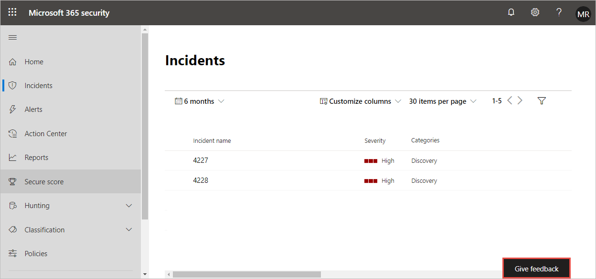

# 在 Microsoft 365 Defender 上提供意見反應

[!INCLUDE [Microsoft 365 Defender rebranding](../includes/microsoft-defender.md)]

**適用於：**
- Microsoft 365 Defender

您的意見反應可協助我們從高級攻擊中保護您的環境。 提供意見反應，分享您的體驗、印象和要求。

請查看這段影片，以瞭解提供意見反應的難易程度。

> [!VIDEO https://www.microsoft.com/en-us/videoplayer/embed/RE4LWeP]

1. 從入口網站的任何部分中，選取 [ **提供意見** 反應]。 

    

2. 評價您的經驗，並提供您贊或改進位置之專案的詳細資料。 您也可以選擇要與意見反應取得聯繫。 

3. 選取 **[提交]**。
