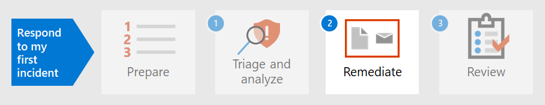

# 步驟 1. 會審及分析您的第一個事件

[!INCLUDE [Microsoft 365 Defender rebranding](../includes/microsoft-defender.md)]

**適用於：**
- Microsoft 365 Defender

當您花些時間根據組織的標準來建立、實施及維護安全性措施時，您可以設定安全性解決方案，協助您快速識別安全性風險和威脅。 Microsoft 365Defender 可讓您透過單一窗格的玻璃體驗偵測、會審和調查事件，您可以在其中找到您及時決定所需的資訊。 

偵測到安全性事件後，Microsoft 365 Defender 會顯示詳細資料，讓您需要對其他事件或事件進行會審或優先順序設定。 決定優先順序之後，分析員可以著重于調查指派案例的精力。

## Microsoft 365 Defender 偵測

Microsoft 365Defender 會從多個 Microsoft 安全性平臺接收警示和事件，作為偵測來源，以建立整體的圖片和惡意活動的內容。 可能的偵測來源如下：

- [Microsoft defender for endpoint](../defender-endpoint/microsoft-defender-endpoint.md)是一個端點偵測和回應方案 (EDR) 使用 microsoft Defender 防毒軟體，以及使用 microsoft Security Graph 的啟用雲端功能的高級威脅防護。 Defender for Endpoint 是一種整合的平臺，可提供預防性保護、破壞性偵測、自動調查和回應。 它會保護 cyberthreats 中的端點、偵測高級攻擊和資料違例、自動化安全性事件，以及改善安全性狀況。 
- [Microsoft Defender For Identity](https://docs.microsoft.com/defender-for-identity/what-is) 是雲端式的安全性解決方案，可使用內部部署的 Active Directory 網域服務 (AD DS) 信號來識別、偵測和調查組織中的高級威脅、已遭破壞的身分識別，以及惡意的內幕程式列動。 
- [Microsoft Cloud App Security](https://docs.microsoft.com/cloud-app-security/)充當您的企業使用者和其使用的雲端資源之間即時經紀人存取的閘道，不論使用者位於何處，不論其使用的裝置為何。 
- [Microsoft Defender for Office 365](../office-365-security/overview.md)會防範電子郵件訊息、連結 (URLs) 及共同作業工具的惡意威脅，以保護您的組織。 
- [Azure 安全性中心](https://docs.microsoft.com/azure/security-center/security-center-introduction) 是一種整合的基礎結構安全性管理系統，可增強資料中心的安全性狀況，並在雲端和內部部署中，為您的混合工作負載提供高級威脅防護。 

在 Microsoft 365 Defender 中，[事件](incidents-overview.md)是透過關聯來自這些不同偵測來源的警示來識別。 您可以立即從 Microsoft 365 Defender 中的事件佇列開始，而不是將資源 stringing 在一起，也不會將多個警示放在各自的事件中。 這可讓您以有效的方式透過端點、身分識別、電子郵件和應用程式來會審事件，並減少攻擊的損毀。

## 會審您的事件

Microsoft 365 Defender 中的事件回應會在您使用組織之優先順序的建議方法來會審事件清單後開始。 「會審」表示將重要性或緊急程度指派給事件，進而決定調查的順序。 

在 Microsoft 365 Defender 中決定排定哪個事件優先順序的有用範例，可依下列公式摘要：*嚴重性 + 影響 = 優先順序*。 

- 「**嚴重性**」是 Microsoft 365 Defender 及其整合安全性元件所指定的層級。 
- **影響** 是由組織所決定，但不限於受到影響的使用者、裝置、受影響的使用者、裝置、服務 (的閾值數目，甚至是) 的組合，甚至是警示類型。 

分析員接著會根據組織設定的 **優先順序** 準則來發起調查。

事件優先順序可能會因組織而異。 NIST 建議同時考慮事件的功能和資訊影響，以及可復原性。  

以下只是一種會審方式： 

1. 移至 [ [事件](incidents-overview.md) ] 頁面以啟動會審。 您可以在這裡看到影響組織的事件清單。 依預設，會從最新的事件排列到最舊的事件。 您也可以在這裡看到每個事件的不同欄，顯示其嚴重性、類別、作用中的警示數目，以及受影響的實體等其他。 您可以自訂一組欄，並依據某些欄來排序事件佇列，方法是選取欄名稱。 您也可以根據需要來篩選事件佇列。 如需可用篩選的完整清單，請參閱設定 [事件優先順序](incident-queue.md#available-filters)。
  
   :::image type="content" source="../../media/first-incident-analyze/first-incident-analyze-queue.png" alt-text="事件佇列的範例"::: 

    如何對此項事件集執行會審的一個範例是針對受影響更多使用者和裝置的事件設定優先順序。 在此範例中，您可能會設定事件識別碼6769的優先順序，因為它會影響最大數目的實體：7裝置、6個使用者和2個信箱。 此外，此事件似乎包含 Microsoft Defender 的警示，表示身分識別的警示及可能的認證盜竊。

   :::image type="content" source="../../media/first-incident-analyze/first-incident-analyze-high-impact.png" alt-text="高影響事件的範例":::
 
2. 選取 [事件名稱] 旁邊的圓形，以查看詳細資料。 側邊窗格會出現在右側，其中包含可協助您深入瞭解的其他資訊。 
 
   :::image type="content" source="../../media/first-incident-analyze/first-incident-analyze-incident-flyout.png" alt-text="事件側邊窗格的範例"::: 

   例如，透過查看哪個 [MITRE ATT&CK](https://attack.mitre.org/) 策略，攻擊者根據事件的類別所使用的策略，您可能會將此事件的優先順序，因為攻擊者使用的是盜竊的認證、已建立的命令和控制、已執行橫向移動，以及挾帶部分資料。 這表示攻擊者已深入瞭解網路，可能會竊取機密資訊。

   此外，如果您的組織已執行零信任架構，您可以將認證存取視為重要的安全性違規（必要優先）。
 
   向下滾動側邊窗格，您會看到特定的受影響實體，例如使用者、裝置和信箱。 您可以檢查每個裝置的公開層級，以及受影響信箱的擁有者。

   :::image type="content" source="../../media/first-incident-analyze/first-incident-analyze-incident-flyout-details.png" alt-text="事件側窗格詳細資料的範例"::: 
 
3. 在側邊窗格的右下方，您可以找到相關聯的警示。 Microsoft 365Defender 已將所述警示的關聯性加入單一事件，可節約您的時間和資源，以更好地修正攻擊。 提醒是可疑的，因此可能會導致惡意的系統事件，以建議網路上的攻擊者是否存在。 

   在此範例中，87個別警示已確定為一個安全性事件的一部分。 您可以查看所有提醒，快速瞭解攻擊的播放方式。

   :::image type="content" source="../../media/first-incident-analyze/first-incident-analyze-incident-flyout-alerts.png" alt-text="事件側邊窗格中的警示範例"::: 
 
## 分析第一個事件

瞭解警報周圍的內容同樣重要。 預警通常並非單一獨立事件。 已建立的進程鏈、命令和動作可能不會同時發生。 因此，分析員必須尋找裝置時程表中的可疑實體的第一及最後一個活動，以瞭解警示的內容。

使用 Microsoft 365 Defender 可讀取及分析資料，但分析者的最終目標是儘快回應事件。 雖然 Microsoft 365 Defender 可大幅減少[平均時間以修正 (MTTR) ](https://www.microsoft.com/security/blog/2020/05/04/lessons-learned-microsoft-soc-part-3c/)透過業界領先的[自動化調查和回應](m365d-autoir.md)功能，但總會需要手動分析的情況。 

以下為範例:

1. 決定會審優先順序之後，分析員會透過選取事件名稱來開始深入分析。 此頁面會顯示 **事件摘要** ，其中的資料會顯示在索引標籤中，以協助進行分析。 在 [ **警示** ] 索引標籤下會顯示警示類型。 分析員可依序按一下每個警示，以深入查看個別的偵測來源。 

    :::image type="content" source="../../media/first-incident-analyze/first-incident-analyze-summary-tab.png" alt-text="事件 [摘要] 索引標籤的範例"::: 
 
    如需每個偵測來源涵蓋哪個網域的快速指南，請參閱本文的 [偵測一節](#detection-by-microsoft-365-defender) 。

2.  在 [ **警示** ] 索引標籤上，分析員可以從偵測至偵測來源，以進行更深入的調查和分析。 例如，使用 Microsoft Cloud App Security 作為偵測來源來選取惡意程式碼偵測時，會將分析員視為對應的警示頁面。
  
    :::image type="content" source="../../media/first-incident-analyze/first-incident-analyze-select-alert.png" alt-text="選取事件警示的範例"::: 
  
    :::image type="content" source="../../media/first-incident-analyze/first-incident-analyze-link-to-mcas.png" alt-text="Microsoft Cloud App Security 中對應頁面的範例"::: 
  
3.  若要進一步調查我們的範例，請滾動至頁面底部，以查看 **受影響的使用者**。 若要查看惡意程式碼偵測的活動和內容，請選取 [Annette 峰的使用者] 頁面。 
  
    :::image type="content" source="../../media/first-incident-analyze/first-incident-analyze-user-page.png" alt-text="使用者頁面的範例":::
  
4.  在 [使用者] 頁面上，是以時間為基礎的事件清單，以 *來自 TOR 網路 IP 位址* 警示的危險登入。 當活動的 suspiciousness 取決於組織執行其業務的方式性質時，在大多數情況下，使用洋蔥路由器 (TOR) ，在企業環境中，允許使用者以匿名方式流覽網頁的網路，可能會被視為一般線上作業的極不可能且不必要的。
  
    :::image type="content" source="../../media/first-incident-analyze/first-incident-analyze-user-event-list.png" alt-text="使用者事件清單的時間順序範例":::
  
5.  您可以選取每個警示，以取得有關活動的詳細資訊。 例如， **從 TOR IP 位址警示中** 選取 [活動]，會將您帶到該警示本身的頁面。 Annette 是 Office 365 的管理員，這表示她具有較高的許可權，來源事件可能會導致存取機密資訊。 
  
    :::image type="content" source="../../media/first-incident-analyze/first-incident-analyze-mcas-alert.png" alt-text="Microsoft Cloud App Security 的警示詳細資料範例"::: 
 
6.  透過選取其他警示，分析員便可取得攻擊的完整畫面。

## 下一步

瞭解如何 [修正事件](first-incident-remediate.md)。

## 請參閱

- [事件概觀](incidents-overview.md)
- [調查事件](investigate-incidents.md)
- [管理事件](manage-incidents.md)
