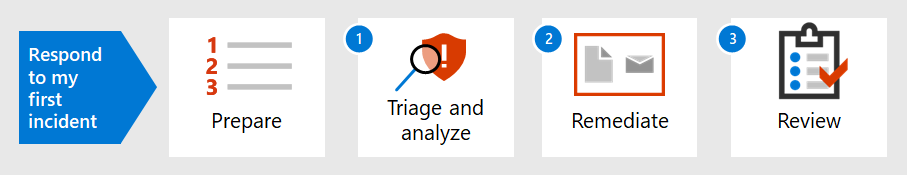

# 回應第一個事件的簡介

[!INCLUDE [Microsoft 365 Defender rebranding](../includes/microsoft-defender.md)]

**適用於：**
- Microsoft 365 Defender

組織的事件回應策略決定其處理日益中斷的安全性事件和網路犯罪的能力。 採取預防措施很重要時，快速從偵測到的事件中包含、消除及復原的能力，可使損毀和業務損毀減至最少。

這個事件回應演練會顯示您做為安全性運作小組的一部分，如何在 Microsoft 365 Defender 內執行大部分的主要事件回應步驟。 步驟如下：

- 安全狀況的準備
- 針對每個事件：
  - 步驟1：會審和分析
  - 步驟2：修復 (包含、eradication 及復原) 
  - 步驟3：事件後檢查

安全事件是由跨國的標準和技術研究院 (NIST) （即實際或可能 jeopardizes 資訊系統之機密性、完整性或可用性的事件）所定義;或是系統處理、儲存或傳輸的資訊;或違反安全性原則、安全性程式或可接受的使用原則的違反或即將發生威脅。

Microsoft 365 Defender 中的事件是分析和事件回應的邏輯起始點。 分析和修正事件通常可組成安全性作業小組的工作。

## 下一步

請確定您的組織和 Microsoft 365 租使用者已[準備好進行事件處理](first-incident-prepare.md)。

## 另請參閱

- [事件概觀](incidents-overview.md)
- [分析事件](investigate-incidents.md)
- [管理事件](manage-incidents.md)
