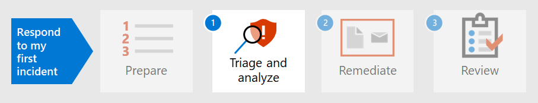

# 為第一個事件準備安全性狀況Prepare your security posture for your first incident

[!INCLUDE [Microsoft 365 Defender rebranding](../includes/microsoft-defender.md)]

**適用於：****Applies to:**
- Microsoft 365 DefenderMicrosoft 365 Defender

為事件處理做好準備時，應從不同類型的安全性事件中，設定組織網路的足夠保護。Preparing for incident handling involves setting up sufficient protection of an organization's network from different kinds of security incidents. 若要降低安全性事件的風險，國家標準和技術協會 (NIST) 建議多種安全性作法，包括風險評估、強化主機安全性、安全地設定網路，以及防止惡意程式碼。To reduce the risk of security incidents, National Institute of Standards and Technology (NIST) recommends several security practices including risk assessments, hardening host security, configuring networks securely, and preventing malware. 

Microsoft 365Defender 可協助您解決事件防護的幾個層面：Microsoft 365 Defender can help address several aspects of incident prevention: 

- 實施 [零信任](/security/zero-trust/) 架構Implementing a [Zero Trust](/security/zero-trust/) framework
- 使用[Microsoft 安全分數](microsoft-secure-score.md)指派分數來判斷您的安全性狀況Determining your security posture by assigning a score with [Microsoft Secure Score](microsoft-secure-score.md)
- 透過[威脅和弱點管理](../defender-endpoint/next-gen-threat-and-vuln-mgt.md)中的漏洞評估來防止威脅Preventing threats through vulnerability assessments in [Threat and Vulnerability Management](../defender-endpoint/next-gen-threat-and-vuln-mgt.md)
- 瞭解最新的安全性威脅，以做好準備Understanding the latest security threats so you can prepare for them

## 步驟 1.Step 1. 實現零信任Implement Zero Trust

「[零信任](/security/zero-trust/)」是整合的安全性理念和端對端策略，可考慮任何現代環境的複雜性質，包括行動工作力和使用者、裝置、應用程式及資料（可能位於何處）。[Zero Trust](/security/zero-trust/) is an integrated security philosophy and end-to-end strategy that considers the complex nature of any modern environment, including the mobile workforce and the users, devices, applications and data, wherever they may be located. 透過提供單一的玻璃窗格，以一致的方式管理所有的偵測，Microsoft 365 Defender 可讓安全性作業小組輕鬆地執行零信任的[指導原則](/security/zero-trust/#guiding-principles-of-zero-trust)。By providing a single pane of glass to manage all detections in a consistent way, Microsoft 365 Defender can make it easier for your security operations team to implement the [guiding principles](/security/zero-trust/#guiding-principles-of-zero-trust) of Zero Trust. 

Microsoft 365 的元件會顯示已執行之規則的破壞，該規則會將 Microsoft Defender for Endpoint (MDE) 或其他行動安全性廠商整合為資訊來源，以針對裝置合規性原則和裝置型條件式存取原則的資訊來源，以建立零信任的條件存取原則。Components of Microsoft 365 Defender can display violations of rules that have been implemented to establish Conditional Access policies for Zero Trust by integrating data from Microsoft Defender for Endpoint (MDE) or other mobile security vendors as an information source for device compliance policies and implementation of device-based Conditional Access policies. 

裝置風險會直接影響該裝置的使用者可存取的資源。Device risk directly influences what resources will be accessible by the user of that device. 根據特定準則，「拒絕存取資源」是零信任和 Microsoft 365 Defender 的主要主題，提供判斷信任層級準則所需的資訊。The denial of access to resources based on certain criteria is the main theme of Zero Trust and Microsoft 365 Defender provides information needed to determine the trust level criteria. 例如，Microsoft 365 Defender 可透過威脅和弱點管理頁面提供裝置的軟體版本層級，而條件式存取原則會限制具有過時或易受攻擊版本的裝置。For example, Microsoft 365 Defender can provide the software version level of a device through the Threat and Vulnerability Management page while Conditional Access policies restrict devices that have outdated or vulnerable versions.

「自動化」是實施及維護零信任環境的重要部分，同時也減少了可能會造成事件回應 (紅外) 事件的警示數目。Automation is a crucial part of implementing and maintaining a Zero Trust environment while also reducing the number of alerts that would potentially lead to incident response (IR) events. Microsoft 365 Defender 的元件可以是自動化的，例如，[修正動作](m365d-autoir.md) (稱為 Microsoft 365 安全性中心) 的事件調查、通知動作，甚至是在[ServiceNow](https://microsoft.service-now.com/sp/)中建立支援票證。Components of Microsoft 365 Defender can be automated such as [remediation actions](m365d-autoir.md) (known as investigations for an incident in the Microsoft 365 security center), notification actions, and even the creation of support tickets such as in [ServiceNow](https://microsoft.service-now.com/sp/).

## 步驟 2.Step 2. 決定組織的安全性狀況Determine your organization’s security posture

接下來，組織可以在 Microsoft 365 Defender 中使用[Microsoft 安全評分](microsoft-secure-score.md)，以判斷您目前的安全性狀況，並考慮改進的建議。Next, organizations can use the [Microsoft Secure Score](microsoft-secure-score.md) in Microsoft 365 Defender to determine your current security posture and consider recommendations on how to improve it. 分數越高，組織採取的安全性建議和改善動作就越好。The higher the score is, the more security recommendations and improvement actions have been taken by the organization. 安全分數建議可跨不同的產品進行，並可讓組織提升其分數甚至更高。Secure Score recommendations can be taken across different products and allow organizations to raise their scores even higher. 

:::image type="content" source="../../media/first-incident-prepare/first-incident-secure-score.png" alt-text="Microsoft security center 中 Microsoft Secure 得分的範例":::
 
## 步驟 3.Step 3. 評估貴組織的弱點洩密Assess your organization’s vulnerability exposure

防止事件可以協助簡化安全性作業，以著重于不斷進行重要及重要的安全性事件。Preventing incidents can help streamline security operations efforts to focus on on-going critical and important security incidents. 軟體弱點通常是攻擊的 preventable 進入點，可導致資料竊取、資料遺失或商務運作中斷。Software vulnerabilities are often a preventable entry point for attacks that can lead to data theft, data loss, or disruption of business operations. 如果不進行任何攻擊，安全性作業必須盡力達成並維護組織中可接受的 [漏洞公開](../defender-endpoint/tvm-exposure-score.md) 等級。If no attacks are on-going, security operations must strive to achieve and maintain an acceptable level of [vulnerability exposure](../defender-endpoint/tvm-exposure-score.md) in their organization.

若要檢查您的軟體修補進度，請造訪您可以從 Microsoft 365 defender 透過 [**其他資源**] 索引標籤存取的 Endpoint for Endpoint 中的 [威脅和弱點管理](../defender-endpoint/next-gen-threat-and-vuln-mgt.md)頁面。To check your software patching progress, visit the [Threat and Vulnerability Management](../defender-endpoint/next-gen-threat-and-vuln-mgt.md) page in Defender for Endpoint, which you can access from Microsoft 365 Defender through the **More resources** tab.

:::image type="content" source="../../media/first-incident-prepare/first-incident-vulnerability.png" alt-text="Microsoft security center 中威脅和弱點頁面的範例"::: 
 
## 4. 瞭解新興威脅4. Understand emerging threats

在 Microsoft 365 的安全性中心使用[威脅分析](threat-analytics.md)，以維持目前安全性威脅環境的最新狀態。Use [threat analytics](threat-analytics.md) in the Microsoft 365 security center to keep up-to-date with the current security threat landscape. 專家 Microsoft 安全性調查程式會建立報告，以詳細描述最新的網路威脅，讓您瞭解它們對 Microsoft 365 訂閱、裝置和使用者有何影響。Expert Microsoft security researchers create reports that describe the latest cyber-threats in detail so you can understand how they might affect your Microsoft 365 subscription, devices, and users. 這些報告可以包含：These reports can include:

- 作用中的威脅演員及其活動Active threat actors and their campaigns
- 常見和新的攻擊技術Popular and new attack techniques
- 嚴重弱點Critical vulnerabilities
- 常見的攻擊面Common attack surfaces
- 流行惡意程式碼Prevalent malware

「威脅分析」也會查看您的設定和警示，以判斷您所在的風險以及是否有適用于報告的活動警示。Threat analytics also looks at your configuration and alerts to determine how at-risk you are and if there are active alerts applicable to a report.

您可以執行新興威脅的建議，以加強安全性狀況，並將攻擊面降至最低。You can implement the recommendations of an emerging threat to strengthen your security posture and minimize your attack surface area.

在排程中的時間，定期檢查 Microsoft 365 安全性中心的 [[威脅分析](threat-analytics.md)] 區段。Make time in your schedule to regularly check the [Threat Analytics](threat-analytics.md) section of the Microsoft 365 security center.

## 下一步Next step

瞭解如何 [會審和分析事件](first-incident-analyze.md)。Learn how to [triage and analyze incidents](first-incident-analyze.md).

## 另請參閱See also

- [事件概觀Incidents overview](incidents-overview.md)
- [調查事件Investigate incidents](investigate-incidents.md)
- [管理事件Manage incidents](manage-incidents.md)
